# Review: gh_apache_participant10_36026

**[Python] BUG: Reading ORC segfaults on windows (if TZDIR isn't set)**

- source: https://github.com/apache/arrow/issues/36026
- kind: LLM draft (needs review)
- reviewed: `False`
- graph: `data/github_v0/graphs/gh_apache_participant10_36026.json` · raw thread: `data/github_v0/raw/gh_apache_participant10_36026.json`

```mermaid
flowchart LR
    N0["<b>N0 Windows ORC abort reported</b><br/><small>info: 4</small>"]
    N1["<b>N1 version-independent Windows reproduction established</b><br/><small>info: 6</small>"]
    N2["<b>N2 environment-sensitive reproduction measured</b><br/><small>info: 8</small>"]
    N3["<b>N3 workaround confirmed in reporter CI</b><br/><small>info: 9</small>"]
    N3_x["<b>N3_x project-test-only workaround aftermath</b><br/><small>info: 10</small>"]
    N4["<b>N4 production-safe upstream fix scoped</b><br/><small>info: 14</small>"]
    N_terminal["<b>terminal upstream change merged, downstream verification pending</b><br/><small>info: 16</small>"]
    N0 -.->|"❓ abort_reproduced_across_orc_and_arrow_versions, windows_wheel_jobs_reproduce_when_pyarrow_orc_tests_enabled"| N1
    linkStyle 0 stroke:#3b82f6,stroke-width:2px
    N1 -.->|"❓ local_windows_orc_reads_fail_at_adapter_read, setting_tzdir_to_conda_zoneinfo_makes_all_orc_tests_green"| N2
    linkStyle 1 stroke:#3b82f6,stroke-width:2px
    N2 -.->|"❓ reporter_ci_confirms_tzdir_workaround"| N3
    linkStyle 2 stroke:#3b82f6,stroke-width:2px
    N3 ==>|"💥 blind: Handle timezone data only in Apache's Windows wheel and test jobs so those project-controlled jobs pass."| N3_x
    linkStyle 3 stroke:#ef4444,stroke-width:2px
    N3_x -.->|"❓ conda_already_provides_tzdb_under_prefix, desired_automatic_candidate_path_search, arrow_side_check_guard_prevents_candidate_search_for_old_orc"| N4
    linkStyle 4 stroke:#3b82f6,stroke-width:2px
    N4 ==>|"⚡ Fix the lookup in Apache ORC so Windows deployments can automatically find an existing local timezone database, including the conda environment's share/zoneinfo location, without requiring every user to set TZDIR; then verify the affected package against the merged change."| N_terminal
    linkStyle 5 stroke:#f97316,stroke-width:2px
    class N0 start
    class N1 normal
    class N2 normal
    class N3 normal
    class N3_x normal
    class N4 normal
    class N_terminal terminal
    classDef start fill:#fee2e2,stroke:#b91c1c,color:#000
    classDef terminal fill:#dcfce7,stroke:#15803d,color:#000
    classDef normal fill:#fef3c7,stroke:#a16207,color:#000
```

## Opening (body)

> I enabled ORC for PyArrow in a conda-forge Windows build. The test suite aborts as soon as it reaches test_dataset.py::test_orc_format while reading the dataset. The same segfault still appears with ORC 1.9.

## Satisfaction conditions

1. Must identify the accepted root cause: on Windows, Apache ORC cannot locate a usable timezone database through its existing lookup, and an ORC read can abort when that database is unavailable; the passing TZDIR-controlled runs ground this diagnosis.
2. Must recommend an ORC-side automatic search for an already installed timezone database, including the conda environment's share/zoneinfo location, instead of requiring TZDIR to be injected into every user environment.
3. Must not treat merely enabling ORC tests or arranging timezone data in Apache's own Windows CI and wheel jobs as the user-facing fix; that test-only approach leaves downstream users exposed.
4. Must not claim that changing ORC or Arrow versions alone fixes the issue, since the same abort was observed across the tested 1.8.3, 1.9 and 2.0.0-era combinations.
5. Must ask for the affected conda Windows package to be rebuilt and retested without TZDIR using an ORC build containing the path-search change before declaring the issue fully resolved; the thread only confirms that the upstream change merged.

## Edges

| edge | type | gates / info | payload |
|---|---|---|---|
| `e1_N0__N1` | clarification_only | asks: abort_reproduced_across_orc_and_arrow_versions, windows_wheel_jobs_reproduce_when_pyarrow_orc_tests_enabled | It happened in exactly the same place with ORC 1.8.3 and 1.9. I later still saw it with Arrow 13 and 14, and w / Yes. Once the missing PyArrow ORC test configuration was added, the Windows wheel jobs for Python 3.8 through  |
| `e2_N1__N2` | clarification_only | asks: local_windows_orc_reads_fail_at_adapter_read, setting_tzdir_to_conda_zoneinfo_makes_all_orc_tests_green | I reproduced it on my Windows PC. All of the PyArrow ORC tests fail when they try to read data, reaching the O / After `set TZDIR=%CONDA_PREFIX%\share\zoneinfo`, all of the ORC tests are green. |
| `e3_N2__N3` | clarification_only | asks: reporter_ci_confirms_tzdir_workaround | I can confirm that setting `TZDIR=%CONDA_PREFIX%\share\zoneinfo` makes PyArrow built with `PYARROW_WITH_ORC=1` |
| `e4_N3__N3_x` | solution_only **BLIND** | req_info: windows_pyarrow_orc_read_aborts_in_dataset_test, reporter_ci_confirms_tzdir_workaround elements: limits_change_to_project_controlled_windows_tests | Handle timezone data only in Apache's Windows wheel and test jobs so those project-controlled jobs pass. |
| `e5_N3_x__N4` | clarification_only | asks: conda_already_provides_tzdb_under_prefix, desired_automatic_candidate_path_search, arrow_side_check_guard_prevents_candidate_search_for_old_orc | Conda-forge already provides the timezone database through its tzdata package under the environment prefix, so / It should search a few reasonable candidate locations automatically, including the environment prefix's `share / I tried to implement it in Arrow, but the recent guard around the old-ORC timezone-database check means the ca |
| `e6_N4__N_terminal` | solution_only | req_info: windows_pyarrow_orc_read_aborts_in_dataset_test, conda_already_provides_tzdb_under_prefix, desired_automatic_candidate_path_search, arrow_side_check_guard_prevents_candidate_search_for_old_orc, setting_tzdir_to_conda_zoneinfo_makes_all_orc_tests_green, reporter_ci_confirms_tzdir_workaround elements: identifies_missing_or_unlocated_timezone_database_as_abort_trigger, implements_lookup_behavior_in_orc, searches_existing_environment_timezone_data_automatically, does_not_require_per_user_tzdir_injection, asks_user_to_verify_on_a_build_containing_the_upstream_lookup_change_without_tzdir | Fix the lookup in Apache ORC so Windows deployments can automatically find an existing local timezone database, including the conda environment's share/zoneinfo location, without requiring every user to set TZDIR; then verify the affected package against the merged change. |

## Nodes

| node | terminal | volunteered | images | symptoms |
|---|---|---|---|---|
| `N0` |  | 1 | 0 | On Windows, my PyArrow test suite terminates with a fatal Python abort when test_dataset.py::test_orc_format calls to_table. The same abort  |
| `N1` |  | 1 | 0 | The ORC read abort occurs in the same place with ORC 1.8.3 and 1.9, and it remains present with later Arrow and ORC combinations. Windows wh |
| `N2` |  | 0 | 0 | In a local Windows build, every PyArrow ORC test aborts when it tries to read data. With TZDIR set to the conda environment's share\zoneinfo |
| `N3` |  | 0 | 0 | My Windows PyArrow build passes the test suite with ORC enabled when TZDIR points to %CONDA_PREFIX%\share\zoneinfo. Without arranging that e |
| `N3_x` |  | 0 | 0 | The project's own Windows tests can pass after arranging timezone data there, but my conda package would still require TZDIR to be injected  |
| `N4` |  | 1 | 0 | The conda environment already has timezone data under its share\zoneinfo directory, but ORC does not use it automatically on Windows. The pa |
| `N_terminal` | ✓ | 2 | 0 | The upstream ORC change for locating the existing timezone database has been merged, so I expect to be able to package the fix without injec |

## Review checklist

> The graph is the case's ANSWER KEY, not a transcript: edge order need
> not mirror thread chronology. Do not file chronology mismatch as a
> defect; what must be faithful is who knew what, when.

Structural (machine-checked by `scripts/validate.py`, re-verify after edits):

- [ ] validates: schema + info-containment + terminal reachability

Semantic (the defect catalog — check each against the source thread):

- [ ] **Faithful blind paths** — every `is_known_blind_path` edge corresponds
  to an attempt actually falsified in the thread (or a brush-off the
  reporter rejected). No invented failures; no ACCEPTED fix mislabeled as
  a blind path (the most common LLM defect class).
- [ ] **Gettable required info** — every id in any `solution.required_info`
  is obtainable: a clarification on some edge, or in the start node's
  info_state, or volunteered (with matching `volunteered_info` text).
  Engineer-only inference belongs in `info_inferred_by_engineer` /
  `inference_hint`, not in hard required_info.
- [ ] **Measurement-class rule** — handler-initiated measurements the user
  executed (bisections, test builds, config probes, version checks) are
  clarification edges, not solutions; their answers state what the
  measurement showed.
- [ ] **No logistics gates** — `required_elements_for_full_match` encode the
  technical diagnostic→fix chain, not release/packaging/scheduling
  remarks the engineer merely mentioned.
- [ ] **Coherent reveals** — each `user_answer_in_this_oncall` is consistent
  with the thread, delivers what it promises, and stays in the user's
  voice (no future knowledge, no diagnosis the user never made).
- [ ] **Symptoms are observations** — `symptoms_visible` contains only what
  the user can see; no causes or advice.
- [ ] **Terminal semantics** — satisfaction_conditions demand root cause +
  evidence grounding + prohibition of falsified moves + user verification;
  the terminal node is the verified-resolved state.
- [ ] **Image assignment** — referenced attachments exist and sit on the
  right hook (opening / node symptom / clarification evidence).
- [ ] **Persona** — matches the reporter's actual expertise and style.

## How to sign off

1. Edit the graph JSON if needed (authored fields only; keep
   `concrete_example` as the factual record).
2. `uv run scripts/validate.py '<graph path>'`
3. Set `metadata.hitl_reviewed: true` in the graph JSON.
4. Re-run `uv run scripts/make_review_docs.py` to refresh this page.
