# Review: gh_apache_superset_22774

**time_grain always returns None in Jinja SQL templates for line and bar charts**

- source: https://github.com/apache/superset/issues/22774
- kind: LLM draft (needs review)
- reviewed: `False`
- graph: `data/github_v0/graphs/gh_apache_superset_22774.json` · raw thread: `data/github_v0/raw/gh_apache_superset_22774.json`

```mermaid
flowchart LR
    N0["<b>N0 chart-specific time_grain failure reported</b><br/><small>info: 8</small>"]
    N1_x["<b>N1_x generic update aftermath</b><br/><small>info: 9</small>"]
    N2["<b>N2 chart-type pattern corroborated</b><br/><small>info: 12</small>"]
    N3["<b>N3 feature-flag-only explanation ruled out</b><br/><small>info: 13</small>"]
    N_terminal["<b>terminal fixed build verified</b><br/><small>info: 15</small>"]
    N0 ==>|"💥 blind: Assume the issue is already resolved and tell the user only to update to the latest available Superset version."| N1_x
    linkStyle 0 stroke:#ef4444,stroke-width:2px
    N1_x -.->|"❓ affected_versions_and_chart_types_corrobated, modern_pivot_none_legacy_pivot_works, generic_chart_axes_configuration_varies_across_affected_setups"| N2
    linkStyle 1 stroke:#3b82f6,stroke-width:2px
    N2 -.->|"❓ latest_dev_flag_true_or_false_line_bar_none"| N3
    linkStyle 2 stroke:#3b82f6,stroke-width:2px
    N3 ==>|"⚡ Treat this as a chart-specific Superset time_grain templating defect and update to a build containing the linked fix, then verify the original templated query in an affected non-Table chart before declaring resolution."| N_terminal
    linkStyle 3 stroke:#f97316,stroke-width:2px
    N0 ==>|"🚀 Recognize the chart-specific time_grain templating defect immediately, recommend a build containing its fix, and ask the reporter to verify the original query in the affected chart. (skip 5)"| N_terminal
    linkStyle 4 stroke:#0ea5e9,stroke-width:2px
    class N0 start
    class N1_x normal
    class N2 normal
    class N3 normal
    class N_terminal terminal
    classDef start fill:#fee2e2,stroke:#b91c1c,color:#000
    classDef terminal fill:#dcfce7,stroke:#15803d,color:#000
    classDef normal fill:#fef3c7,stroke:#a16207,color:#000
```

## Opening (body)

> In Superset 2.0.1, the time_grain variable used in SQL templating always returns None, although variables such as from_dttm work. I expect changing the chart Granularity selection to change time_grain so my Jinja template can choose the corresponding date_trunc unit. This appears related to GENERIC_CHART_AXES: with the flag disabled it works, while with the flag enabled the Table chart assigns time_grain correctly but line and bar charts do not, even though I select a date column for the x-axis. I attached screenshots showing the Table and Line chart behavior.

## Satisfaction conditions

1. Must identify the accepted diagnosis at the level established by the thread: affected line, bar, and modern Pivot chart paths return None instead of exposing the selected time grain to the Jinja template, while Table and legacy Pivot paths can supply it.
2. Must ground the diagnosis in the chart-type comparisons and the latest-development test rather than blaming the reporter's date_trunc Jinja syntax.
3. Must not present disabling GENERIC_CHART_AXES as the general fix: a later affected setup reproduced the line and bar failure with the flag both enabled and disabled.
4. Must not assume that any generic upgrade resolves the issue, since the reporter reopened it after an earlier update; recommend a build containing the specific time_grain fix.
5. Must ask the affected user to rerun the original templated query in an affected chart on a build containing the fix and must not declare resolution until that verification succeeds.

## Edges

| edge | type | gates / info | payload |
|---|---|---|---|
| `e1_N0__N1_x` | solution_only **BLIND** | req_info: time_grain_none_in_sql_template, superset_2_0_1 elements: recommends_only_a_generic_update | Assume the issue is already resolved and tell the user only to update to the latest available Superset version. |
| `e2_N1_x__N2` | clarification_only | asks: affected_versions_and_chart_types_corrobated, modern_pivot_none_legacy_pivot_works, generic_chart_axes_configuration_varies_across_affected_setups | I can reproduce it across the affected 2.1 and 3.0-era setups. Line and bar charts return None, and the modern / Yes. In Pivot Table, {{ time_grain }} is always None, but Pivot Table (legacy) returns it correctly. / I have an affected setup with GENERIC_CHART_AXES enabled. I can also reproduce the modern Pivot Table problem  |
| `e3_N2__N3` | clarification_only | asks: latest_dev_flag_true_or_false_line_bar_none | I tested the latest development version with GENERIC_CHART_AXES set to both True and False. In both cases, tim |
| `e4_N3__N_terminal` | solution_only | req_info: time_grain_none_in_sql_template, table_supplies_time_grain_but_line_bar_do_not, affected_versions_and_chart_types_corrobated, modern_pivot_none_legacy_pivot_works, generic_chart_axes_configuration_varies_across_affected_setups, latest_dev_flag_true_or_false_line_bar_none elements: identifies_chart_specific_time_grain_templating_defect, recommends_a_build_containing_the_time_grain_fix, asks_user_to_verify_on_a_build_containing_the_fix, does_not_treat_feature_flag_disable_as_the_general_fix | Treat this as a chart-specific Superset time_grain templating defect and update to a build containing the linked fix, then verify the original templated query in an affected non-Table chart before declaring resolution. |
| `e5_N0__N_terminal` | solution_only | req_info: time_grain_none_in_sql_template, from_dttm_works_in_same_template, table_supplies_time_grain_but_line_bar_do_not, date_column_selected_as_x_axis elements: identifies_chart_specific_time_grain_templating_defect, recommends_a_build_containing_the_time_grain_fix, asks_user_to_verify_on_a_build_containing_the_fix | Recognize the chart-specific time_grain templating defect immediately, recommend a build containing its fix, and ask the reporter to verify the original query in the affected chart. |

## Nodes

| node | terminal | volunteered | images | symptoms |
|---|---|---|---|---|
| `N0` |  | 4 | 0 | In Superset 2.0.1, {{ time_grain }} evaluates to None in my templated query even when I change Granularity, while {{ from_dttm }} works. Wit |
| `N1_x` |  | 1 | 0 | After updating to the latest version available to me, line and bar charts still render time_grain as None while the Table chart supplies it. |
| `N2` |  | 0 | 0 | The selected grain is still None in line, bar, and modern Pivot Table charts across the affected deployments; simple Table and Pivot Table ( |
| `N3` |  | 0 | 0 | On the latest development build, line and bar charts return None with GENERIC_CHART_AXES set either true or false, while the Table chart ret |
| `N_terminal` | ✓ | 1 | 0 | After installing a build containing the fix, my affected charts receive the selected time grain instead of None. |

## Review checklist

> The graph is the case's ANSWER KEY, not a transcript: edge order need
> not mirror thread chronology. Do not file chronology mismatch as a
> defect; what must be faithful is who knew what, when.

Structural (machine-checked by `scripts/validate.py`, re-verify after edits):

- [ ] validates: schema + info-containment + terminal reachability

Semantic (the defect catalog — check each against the source thread):

- [ ] **Faithful blind paths** — every `is_known_blind_path` edge corresponds
  to an attempt actually falsified in the thread (or a brush-off the
  reporter rejected). No invented failures; no ACCEPTED fix mislabeled as
  a blind path (the most common LLM defect class).
- [ ] **Gettable required info** — every id in any `solution.required_info`
  is obtainable: a clarification on some edge, or in the start node's
  info_state, or volunteered (with matching `volunteered_info` text).
  Engineer-only inference belongs in `info_inferred_by_engineer` /
  `inference_hint`, not in hard required_info.
- [ ] **Measurement-class rule** — handler-initiated measurements the user
  executed (bisections, test builds, config probes, version checks) are
  clarification edges, not solutions; their answers state what the
  measurement showed.
- [ ] **No logistics gates** — `required_elements_for_full_match` encode the
  technical diagnostic→fix chain, not release/packaging/scheduling
  remarks the engineer merely mentioned.
- [ ] **Coherent reveals** — each `user_answer_in_this_oncall` is consistent
  with the thread, delivers what it promises, and stays in the user's
  voice (no future knowledge, no diagnosis the user never made).
- [ ] **Symptoms are observations** — `symptoms_visible` contains only what
  the user can see; no causes or advice.
- [ ] **Terminal semantics** — satisfaction_conditions demand root cause +
  evidence grounding + prohibition of falsified moves + user verification;
  the terminal node is the verified-resolved state.
- [ ] **Image assignment** — referenced attachments exist and sit on the
  right hook (opening / node symptom / clarification evidence).
- [ ] **Persona** — matches the reporter's actual expertise and style.

## How to sign off

1. Edit the graph JSON if needed (authored fields only; keep
   `concrete_example` as the factual record).
2. `uv run scripts/validate.py '<graph path>'`
3. Set `metadata.hitl_reviewed: true` in the graph JSON.
4. Re-run `uv run scripts/make_review_docs.py` to refresh this page.
