# Review: gh_apache_superset_25749

**Pinot epoch_ms area chart fails after Superset 3.0.0.rc4 with timestamp conversion error**

- source: https://github.com/apache/superset/issues/25749
- kind: LLM draft (needs review)
- reviewed: `False`
- graph: `data/github_v0/graphs/gh_apache_superset_25749.json` · raw thread: `data/github_v0/raw/gh_apache_superset_25749.json`

```mermaid
flowchart LR
    N0["<b>N0 epoch_ms area-chart regression reported</b><br/><small>info: 5</small>"]
    N1["<b>N1 temporal schema and metadata behavior established</b><br/><small>info: 7</small>"]
    N2_x["<b>N2_x calculated-column aftermath</b><br/><small>info: 8</small>"]
    N3["<b>N3 driver version and execution path collected</b><br/><small>info: 12</small>"]
    N3_x["<b>N3_x driver-upgrade workaround fails at production scale</b><br/><small>info: 14</small>"]
    N_terminal["<b>terminal problem bypassed by Pinot schema migration</b><br/><small>info: 15</small>"]
    N0 -.->|"❓ temporal_column_dateheuredebut_is_long_with_epoch_ms_configuration"| N1
    linkStyle 0 stroke:#3b82f6,stroke-width:2px
    N1 ==>|"💥 blind: Work around the generated epoch conversion by creating a calculated Superset column that casts the LONG temporal field to TIMESTAMP, then use that calculated column as the chart's temporal axis."| N2_x
    linkStyle 1 stroke:#ef4444,stroke-width:2px
    N2_x -.->|"❓ same_calculated_column_query_works_in_pinot_and_sql_lab, contribution_mode_already_disabled, no_local_superset_code_changes, installed_pinotdb_version_is_0_3_8"| N3
    linkStyle 2 stroke:#3b82f6,stroke-width:2px
    N3 ==>|"💥 blind: Update the obsolete pinotdb SQLAlchemy driver and keep using the calculated TIMESTAMP column as a compatibility workaround."| N3_x
    linkStyle 3 stroke:#ef4444,stroke-width:2px
    N3_x ==>|"⚡ Avoid the faulty Superset epoch-millisecond query path by changing the temporal fields in the Pinot tables and updating the Superset datasets and charts to use the migrated fields, rather than casting the original LONG values at query time."| N_terminal
    linkStyle 4 stroke:#f97316,stroke-width:2px
    class N0 start
    class N1 normal
    class N2_x normal
    class N3 normal
    class N3_x normal
    class N_terminal terminal
    classDef start fill:#fee2e2,stroke:#b91c1c,color:#000
    classDef terminal fill:#dcfce7,stroke:#15803d,color:#000
    classDef normal fill:#fef3c7,stroke:#a16207,color:#000
```

## Opening (body)

> We use a Pinot table as a dataset, with the temporal column startDate stored as epoch_ms. Before Superset 3.0.0.rc4, our area chart worked and the generated query used DATETIMECONVERT directly with MILLISECONDS:EPOCH. Since 3.0.0.rc4, the chart does not load and reports “DB engine Error: could not convert string to Timestamp.” The new query divides startDate by 1000, calls DATETIMECONVERT with SECONDS:EPOCH, and then casts through DATE_TRUNC and TIMESTAMP. The seconds-to-seconds conversion looks odd to us, and we suspect the Pinot refactor changed the generated query.

## Satisfaction conditions

1. Must identify the accepted diagnosis as a Superset-generated Pinot query regression for the original LONG epoch-millisecond temporal field: the new query divides by 1000, performs the seconds DATETIMECONVERT, and casts through TIMESTAMP, whereas the earlier millisecond query worked.
2. Diagnosis must be grounded in the before-and-after SQL, the LONG epoch_ms column configuration, and the direct Pinot or SQL Lab results; it must not be reduced to an unsupported Apache Calcite fault.
3. Must not present the calculated TIMESTAMP column plus driver upgrade as the final production solution: it restored chart rendering but made production processing about 40 times slower and unusable.
4. The thread's final resolution is a bypass, not a confirmed upstream Superset fix: all affected temporal fields were changed in Pinot so the charts no longer exercised the faulty epoch-millisecond query path.
5. Must ask the reporter to verify affected charts and production-scale performance after the temporal-field migration before declaring resolution.

## Edges

| edge | type | gates / info | payload |
|---|---|---|---|
| `e1_N0__N1` | clarification_only | asks: temporal_column_dateheuredebut_is_long_with_epoch_ms_configuration | startDate is our dateHeureDebut column. It is a LONG field configured as temporal with epoch milliseconds; her |
| `e2_N1__N2_x` | solution_only **BLIND** | req_info: area_chart_now_reports_could_not_convert_string_to_timestamp, temporal_column_dateheuredebut_is_long_with_epoch_ms_configuration elements: creates_calculated_timestamp_column, uses_calculated_column_as_temporal_axis | Work around the generated epoch conversion by creating a calculated Superset column that casts the LONG temporal field to TIMESTAMP, then use that calculated column as the chart's temporal axis. |
| `e3_N2_x__N3` | clarification_only | asks: same_calculated_column_query_works_in_pinot_and_sql_lab, contribution_mode_already_disabled, no_local_superset_code_changes, installed_pinotdb_version_is_0_3_8 | The query selects DATE_TRUNC over cast(dateHeureDebut as timestamp). It works fine in Pinot and SQL Lab and re / It is already disabled. The interface says “Aucun,” which is French for no contribution mode. / We changed nothing in the Superset codebase. / pinotdb: 0.3.8 |
| `e4_N3__N3_x` | solution_only **BLIND** | req_info: installed_pinotdb_version_is_0_3_8, same_calculated_column_query_works_in_pinot_and_sql_lab elements: updates_obsolete_pinotdb_driver, retests_calculated_timestamp_column | Update the obsolete pinotdb SQLAlchemy driver and keep using the calculated TIMESTAMP column as a compatibility workaround. |
| `e5_N3_x__N_terminal` | solution_only | req_info: pinot_area_chart_epoch_ms_worked_before_superset_3_0_0_rc4, area_chart_now_reports_could_not_convert_string_to_timestamp, old_query_used_milliseconds_datetimeconvert, new_query_divides_epoch_ms_by_1000_and_uses_seconds_datetimeconvert, production_cast_workaround_is_40_times_slower_and_unusable, temporal_column_dateheuredebut_is_long_with_epoch_ms_configuration, same_calculated_column_query_works_in_pinot_and_sql_lab, installed_pinotdb_version_is_0_3_8 elements: identifies_faulty_generated_epoch_ms_query_path, changes_pinot_temporal_fields_to_bypass_affected_path, avoids_runtime_cast_workaround_at_production_scale, asks_user_to_verify_affected_charts_and_production_performance, does_not_claim_superset_query_generation_was_fixed_upstream | Avoid the faulty Superset epoch-millisecond query path by changing the temporal fields in the Pinot tables and updating the Superset datasets and charts to use the migrated fields, rather than casting the original LONG values at query time. |

## Nodes

| node | terminal | volunteered | images | symptoms |
|---|---|---|---|---|
| `N0` |  | 0 | 0 | Our Pinot area chart no longer loads after upgrading to Superset 3.0.0.rc4 and shows “DB engine Error: could not convert string to Timestamp |
| `N1` |  | 1 | 0 | The original LONG epoch-millisecond temporal column still produces the timestamp-conversion error. When we add a Pinot TIMESTAMP field, refr |
| `N2_x` |  | 1 | 2 | With a calculated column using cast(dateHeureDebut as timestamp), Pinot returns dated rows and the query works in SQL Lab, but the area char |
| `N3` |  | 0 | 0 | The calculated-column query returns timestamp-looking rows in Pinot and SQL Lab, while Explore continues loading without rendering the area  |
| `N3_x` |  | 2 | 0 | After updating the Pinot SQLAlchemy driver and retaining the calculated timestamp column, our charts initially display again. On production  |
| `N_terminal` | ✓ | 1 | 0 | After changing all of our temporal fields in the Pinot tables, our charts no longer use the affected epoch-millisecond path and the problem  |

## Review checklist

> The graph is the case's ANSWER KEY, not a transcript: edge order need
> not mirror thread chronology. Do not file chronology mismatch as a
> defect; what must be faithful is who knew what, when.

Structural (machine-checked by `scripts/validate.py`, re-verify after edits):

- [ ] validates: schema + info-containment + terminal reachability

Semantic (the defect catalog — check each against the source thread):

- [ ] **Faithful blind paths** — every `is_known_blind_path` edge corresponds
  to an attempt actually falsified in the thread (or a brush-off the
  reporter rejected). No invented failures; no ACCEPTED fix mislabeled as
  a blind path (the most common LLM defect class).
- [ ] **Gettable required info** — every id in any `solution.required_info`
  is obtainable: a clarification on some edge, or in the start node's
  info_state, or volunteered (with matching `volunteered_info` text).
  Engineer-only inference belongs in `info_inferred_by_engineer` /
  `inference_hint`, not in hard required_info.
- [ ] **Measurement-class rule** — handler-initiated measurements the user
  executed (bisections, test builds, config probes, version checks) are
  clarification edges, not solutions; their answers state what the
  measurement showed.
- [ ] **No logistics gates** — `required_elements_for_full_match` encode the
  technical diagnostic→fix chain, not release/packaging/scheduling
  remarks the engineer merely mentioned.
- [ ] **Coherent reveals** — each `user_answer_in_this_oncall` is consistent
  with the thread, delivers what it promises, and stays in the user's
  voice (no future knowledge, no diagnosis the user never made).
- [ ] **Symptoms are observations** — `symptoms_visible` contains only what
  the user can see; no causes or advice.
- [ ] **Terminal semantics** — satisfaction_conditions demand root cause +
  evidence grounding + prohibition of falsified moves + user verification;
  the terminal node is the verified-resolved state.
- [ ] **Image assignment** — referenced attachments exist and sit on the
  right hook (opening / node symptom / clarification evidence).
- [ ] **Persona** — matches the reporter's actual expertise and style.

## How to sign off

1. Edit the graph JSON if needed (authored fields only; keep
   `concrete_example` as the factual record).
2. `uv run scripts/validate.py '<graph path>'`
3. Set `metadata.hitl_reviewed: true` in the graph JSON.
4. Re-run `uv run scripts/make_review_docs.py` to refresh this page.
