# Review: gh_cilium_cilium_27900

**Coredns fails connecting to kube-api via kubernetes service**

- source: https://github.com/cilium/cilium/issues/27900
- kind: LLM draft (needs review)
- reviewed: `True`
- graph: `data/github_v0/graphs/gh_cilium_cilium_27900.json` · raw thread: `data/github_v0/raw/gh_cilium_cilium_27900.json`

```mermaid
flowchart LR
    N0["<b>N0 Kubernetes service connectivity failure reported</b><br/><small>info: 5</small>"]
    N1["<b>N1 compatibility downgrade restores CoreDNS</b><br/><small>info: 7</small>"]
    N2["<b>N2 controlled 1.28.1 reproduction before reboot</b><br/><small>info: 10</small>"]
    N3["<b>N3 failure reproduced by node reboot</b><br/><small>info: 11</small>"]
    N4["<b>N4 cgroup attachment evidence collected</b><br/><small>info: 14</small>"]
    N5_x["<b>N5_x patched Kubernetes installed without reboot</b><br/><small>info: 16</small>"]
    N6_x["<b>N6_x CoreDNS pod recreation aftermath</b><br/><small>info: 17</small>"]
    N_terminal["<b>terminal reporter-verified resolution</b><br/><small>info: 18</small>"]
    N0 ==>|"🔀 ❓prior_cilium_version_and_preupgrade_dns_state_unknown + ⚡Test the supported compatibility baseline by returning the cluster to Kubernetes 1.27.5 while retaining Cilium 1.14.1."| N1
    linkStyle 0 stroke:#a855f7,stroke-width:2px
    N1 ==>|"⚡ Reproduce the transition under controlled conditions by upgrading the working cluster from Kubernetes 1.27.5 to 1.28.1 and observing it before reboot."| N2
    linkStyle 1 stroke:#f97316,stroke-width:2px
    N2 ==>|"⚡ Restart the upgraded nodes to test whether the failure depends on cluster boot ordering rather than package installation alone."| N3
    linkStyle 2 stroke:#f97316,stroke-width:2px
    N3 -.->|"❓ coredns_cgroup_tree_output_has_only_device_program, cluster_uses_cgroup_v2, cilium_config_cgroup_root_run_cilium_cgroupv2"| N4
    linkStyle 3 stroke:#3b82f6,stroke-width:2px
    N4 ==>|"💥 blind: Upgrade Kubernetes to 1.28.2 because the 1.28.1 startup regression can let the Cilium agent start before mount-cgroup and attach socket-LB programs to the wrong cgroup hierarchy."| N5_x
    linkStyle 4 stroke:#ef4444,stroke-width:2px
    N5_x ==>|"💥 blind: Recreate only the CoreDNS pods after the Kubernetes patch upgrade to see whether fresh application pods recover service connectivity."| N6_x
    linkStyle 5 stroke:#ef4444,stroke-width:2px
    N6_x ==>|"⚡ Reboot every node after installing Kubernetes 1.28.2 so Cilium initializes under the corrected container ordering, then verify CoreDNS and Kubernetes service connectivity."| N_terminal
    linkStyle 6 stroke:#f97316,stroke-width:2px
    class N0 start
    class N1 normal
    class N2 normal
    class N3 normal
    class N4 normal
    class N5_x normal
    class N6_x normal
    class N_terminal terminal
    classDef start fill:#fee2e2,stroke:#b91c1c,color:#000
    classDef terminal fill:#dcfce7,stroke:#15803d,color:#000
    classDef normal fill:#fef3c7,stroke:#a16207,color:#000
```

## Opening (body)

> I upgraded my bare-metal kubeadm cluster to Kubernetes v1.28.1 on Ubuntu 22.04.3 LTS with Cilium 1.14.1 and containerd 1.6.22. CoreDNS remains 0/1 because connections to the Kubernetes service at https://10.96.0.1:443 time out. The Cilium connectivity test also times out looking up kubernetes.default, although kubectl can reach the API server from outside the cluster and cilium status reports the components as OK. I suspect a regression after the upgrade.

## Satisfaction conditions

1. Must identify the accepted root cause for the reporter's chain: Kubernetes 1.28.1 could start the Cilium agent before the mount-cgroup init container, so with cgroup v2 and kube-proxy replacement the socket-LB BPF programs were attached at the wrong cgroup hierarchy and pod connections to the Kubernetes service IP were not translated.
2. The diagnosis must be grounded in the reboot-dependent reproduction and the collected cgroup evidence, including that the failing CoreDNS cgroup path did not show the Cilium socket programs.
3. The remediation must include upgrading every node to Kubernetes 1.28.2 or another patch containing the ordering correction and then rebooting the cluster so the corrected startup sequence actually runs.
4. Must not claim that installing the patched Kubernetes packages alone or merely deleting the CoreDNS pods resolves the existing broken node state; both were tried and CoreDNS remained 0/1.
5. Must ask the reporter to verify CoreDNS readiness and Kubernetes-service connectivity, such as by rerunning the Cilium connectivity test, before declaring resolution.

## Edges

| edge | type | gates / info | payload |
|---|---|---|---|
| `e1_N0__N1` | mixed | req_info: bare_metal_kubeadm_kubernetes_1_28_1_cilium_1_14_1, coredns_not_ready_kubernetes_service_timeout elements: tests_cilium_1_14_with_supported_kubernetes_1_27_baseline | Test the supported compatibility baseline by returning the cluster to Kubernetes 1.27.5 while retaining Cilium 1.14.1. |
| `e2_N1__N2` | solution_only | req_info: downgrade_to_kubernetes_1_27_5_restores_coredns elements: reproduces_upgrade_from_working_baseline, checks_services_before_node_reboot | Reproduce the transition under controlled conditions by upgrading the working cluster from Kubernetes 1.27.5 to 1.28.1 and observing it before reboot. |
| `e3_N2__N3` | solution_only | req_info: coredns_working_before_post_upgrade_reboot elements: tests_node_reboot_as_failure_trigger | Restart the upgraded nodes to test whether the failure depends on cluster boot ordering rather than package installation alone. |
| `e4_N3__N4` | clarification_only | asks: coredns_cgroup_tree_output_has_only_device_program, cluster_uses_cgroup_v2, cilium_config_cgroup_root_run_cilium_cgroupv2 | For the failing CoreDNS process, `/proc/<pid>/cgroup` reports `0::/kubepods.slice/kubepods-burstable.slice/... / All four nodes return `cgroup2fs` for `/sys/fs/cgroup`, and `mount` shows a cgroup2 filesystem mounted there. / The Cilium ConfigMap says `cgroup-root: /run/cilium/cgroupv2`. That path looks populated on one control-plane  |
| `e5_N4__N5_x` | solution_only **BLIND** | req_info: kube_proxy_replacement_true, node_reboot_reproduces_coredns_timeout, cluster_uses_cgroup_v2, cilium_config_cgroup_root_run_cilium_cgroupv2, coredns_cgroup_tree_output_has_only_device_program elements: identifies_kubernetes_startup_order_regression, connects_mount_cgroup_order_to_socket_lb_attachment, recommends_kubernetes_1_28_2_or_later_corrected_patch | Upgrade Kubernetes to 1.28.2 because the 1.28.1 startup regression can let the Cilium agent start before mount-cgroup and attach socket-LB programs to the wrong cgroup hierarchy. |
| `e6_N5_x__N6_x` | solution_only **BLIND** | req_info: upgrade_to_kubernetes_1_28_2_alone_leaves_dns_broken elements: recreates_coredns_pods_without_rebooting_nodes | Recreate only the CoreDNS pods after the Kubernetes patch upgrade to see whether fresh application pods recover service connectivity. |
| `e7_N6_x__N_terminal` | solution_only | req_info: node_reboot_reproduces_coredns_timeout, upgrade_to_kubernetes_1_28_2_alone_leaves_dns_broken, deleting_coredns_pods_after_upgrade_leaves_dns_broken, kube_proxy_replacement_true, cluster_uses_cgroup_v2, coredns_cgroup_tree_output_has_only_device_program elements: reboots_all_nodes_after_installing_kubernetes_1_28_2, explains_that_reboot_recreates_the_node_startup_sequence, asks_user_to_verify_coredns_readiness_and_kubernetes_service_connectivity | Reboot every node after installing Kubernetes 1.28.2 so Cilium initializes under the corrected container ordering, then verify CoreDNS and Kubernetes service connectivity. |

## Nodes

| node | terminal | volunteered | images | symptoms |
|---|---|---|---|---|
| `N0` |  | 2 | 0 | Both CoreDNS pods remain 0/1 and log an i/o timeout connecting to https://10.96.0.1:443/version. The Cilium connectivity test times out wait |
| `N1` |  | 1 | 0 | After forcing all nodes back to Kubernetes 1.27.5 and rebooting them, both CoreDNS pods are 1/1 Running. |
| `N2` |  | 3 | 0 | After upgrading all four nodes back to Kubernetes 1.28.1, the Cilium and CoreDNS pods are initially Running and ready. |
| `N3` |  | 1 | 0 | CoreDNS is healthy immediately after the upgrade, but after rebooting the cluster nodes it returns to 0/1 and times out connecting to the Ku |
| `N4` |  | 0 | 0 | CoreDNS remains 0/1 after the reboot and still cannot connect to the Kubernetes service IP. |
| `N5_x` |  | 1 | 0 | After upgrading every node to Kubernetes 1.28.2, the CoreDNS pods are still 0/1 and cannot reach the Kubernetes service. |
| `N6_x` |  | 1 | 0 | New CoreDNS pods created after deleting the old ones are also 0/1 and still cannot reach the Kubernetes service. |
| `N_terminal` | ✓ | 1 | 0 | After rebooting the cluster on Kubernetes 1.28.2, both CoreDNS pods are 1/1 Running and all 42 Cilium connectivity tests complete successful |

## Machine review (audit pass, adversarially verified)

Auditor verdict: **n/a** · 0 of 0 findings survived independent refutation.

__

## Review checklist

> The graph is the case's ANSWER KEY, not a transcript: edge order need
> not mirror thread chronology. Do not file chronology mismatch as a
> defect; what must be faithful is who knew what, when.

Structural (machine-checked by `scripts/validate.py`, re-verify after edits):

- [ ] validates: schema + info-containment + terminal reachability

Semantic (the defect catalog — check each against the source thread):

- [ ] **Faithful blind paths** — every `is_known_blind_path` edge corresponds
  to an attempt actually falsified in the thread (or a brush-off the
  reporter rejected). No invented failures; no ACCEPTED fix mislabeled as
  a blind path (the most common LLM defect class).
- [ ] **Gettable required info** — every id in any `solution.required_info`
  is obtainable: a clarification on some edge, or in the start node's
  info_state, or volunteered (with matching `volunteered_info` text).
  Engineer-only inference belongs in `info_inferred_by_engineer` /
  `inference_hint`, not in hard required_info.
- [ ] **Measurement-class rule** — handler-initiated measurements the user
  executed (bisections, test builds, config probes, version checks) are
  clarification edges, not solutions; their answers state what the
  measurement showed.
- [ ] **No logistics gates** — `required_elements_for_full_match` encode the
  technical diagnostic→fix chain, not release/packaging/scheduling
  remarks the engineer merely mentioned.
- [ ] **Coherent reveals** — each `user_answer_in_this_oncall` is consistent
  with the thread, delivers what it promises, and stays in the user's
  voice (no future knowledge, no diagnosis the user never made).
- [ ] **Symptoms are observations** — `symptoms_visible` contains only what
  the user can see; no causes or advice.
- [ ] **Terminal semantics** — satisfaction_conditions demand root cause +
  evidence grounding + prohibition of falsified moves + user verification;
  the terminal node is the verified-resolved state.
- [ ] **Image assignment** — referenced attachments exist and sit on the
  right hook (opening / node symptom / clarification evidence).
- [ ] **Persona** — matches the reporter's actual expertise and style.

## How to sign off

1. Edit the graph JSON if needed (authored fields only; keep
   `concrete_example` as the factual record).
2. `uv run scripts/validate.py '<graph path>'`
3. Set `metadata.hitl_reviewed: true` in the graph JSON.
4. Re-run `uv run scripts/make_review_docs.py` to refresh this page.
