# Review: gh_cilium_cilium_29302

**How do I get Cilium to run on WSL2?**

- source: https://github.com/cilium/cilium/issues/29302
- kind: LLM draft (needs review)
- reviewed: `True`
- graph: `data/github_v0/graphs/gh_cilium_cilium_29302.json` · raw thread: `data/github_v0/raw/gh_cilium_cilium_29302.json`

```mermaid
flowchart LR
    N0["<b>N0 Cilium 1.15 startup failure reported</b><br/><small>info: 6</small>"]
    N1["<b>N1 custom kernel configuration inspected</b><br/><small>info: 8</small>"]
    N1_x["<b>N1_x disabling Cilium IPv6 aftermath</b><br/><small>info: 9</small>"]
    N2_x["<b>N2_x single IPv6 kernel option aftermath</b><br/><small>info: 10</small>"]
    N_terminal["<b>terminal Cilium running on rebuilt WSL2 kernel</b><br/><small>info: 16</small>"]
    N0 -.->|"❓ config_ipv6_multiple_tables_unset, config_ipv6_enabled_with_some_related_options"| N1
    linkStyle 0 stroke:#3b82f6,stroke-width:2px
    N1 ==>|"💥 blind: Treat the kernel as lacking usable IPv6 and disable Cilium IPv6 during installation."| N1_x
    linkStyle 1 stroke:#ef4444,stroke-width:2px
    N1_x ==>|"💥 blind: Enable only the IPv6 segment-routing lightweight-tunnel kernel option, rebuild the WSL2 kernel, and retry Cilium."| N2_x
    linkStyle 2 stroke:#ef4444,stroke-width:2px
    N2_x ==>|"⚡ Use a WSL2 kernel with the complete Cilium-required networking configuration, including the missing IPv6 routing capabilities; build and install its modules, select that kernel through .wslconfig, restart WSL2, load the modules, and verify Cilium starts."| N_terminal
    linkStyle 3 stroke:#f97316,stroke-width:2px
    class N0 start
    class N1 normal
    class N1_x normal
    class N2_x normal
    class N_terminal terminal
    classDef start fill:#fee2e2,stroke:#b91c1c,color:#000
    classDef terminal fill:#dcfce7,stroke:#15803d,color:#000
    classDef normal fill:#fef3c7,stroke:#a16207,color:#000
```

## Opening (body)

> My Cilium pods crash on 1.15.0-pre.2 with: `failed while reinitializing datapath: removing ipv6 proxy routing rule: address family not supported by protocol`. Version 1.14.4 works fine. This is a kind cluster on WSL2 with Kubernetes 1.28.3 and a custom-compiled linux-msft-wsl-5.15.133.1 kernel configured by following Cilium's system requirements. I suspect this may be related to IPv6, but I do not know what changed between 1.14.4 and 1.15.0-pre.2.

## Satisfaction conditions

1. Must identify the accepted root cause: the custom WSL2 kernel had an incomplete IPv6/networking configuration, notably missing IPv6 multiple-routing-table support and related capabilities, even though `CONFIG_IPV6=y` was enabled.
2. Must explain the version difference using the thread's evidence: newer Cilium code exposed netlink or routing-rule errors that older shell commands had suppressed, revealing the deficient kernel configuration.
3. The recommendation must use or rebuild a WSL2 kernel with the complete Cilium-documented networking options, install and load its modules, and ensure WSL2 actually boots that kernel.
4. Must not present `ipv6.enabled=false` as the fix; the reporter tried it and received the same startup error.
5. Must not present enabling only the segment-routing lightweight-tunnel option as sufficient; it removed the first error but Cilium then failed with another `protocol not supported` error.
6. Must ask the user to confirm the intended kernel with `uname -r` and verify that Cilium starts and remains running before declaring the issue resolved.

## Edges

| edge | type | gates / info | payload |
|---|---|---|---|
| `e1_N0__N1` | clarification_only | asks: config_ipv6_multiple_tables_unset, config_ipv6_enabled_with_some_related_options | I checked the config-wsl file, and `CONFIG_IPV6_MULTIPLE_TABLES` is not set. / It is not disabled entirely: `CONFIG_IPV6=y`, and some IPv6 modules are enabled in the config. I am far from a |
| `e2_N1__N1_x` | solution_only **BLIND** | req_info: cilium_115_pre2_crashes_removing_ipv6_proxy_rule, config_ipv6_enabled_with_some_related_options elements: sets_cilium_ipv6_enabled_false | Treat the kernel as lacking usable IPv6 and disable Cilium IPv6 during installation. |
| `e3_N1_x__N2_x` | solution_only **BLIND** | req_info: cilium_ipv6_disabled_explicitly_same_error, config_ipv6_multiple_tables_unset elements: enables_only_config_ipv6_seg6_lwtunnel, rebuilds_custom_wsl_kernel | Enable only the IPv6 segment-routing lightweight-tunnel kernel option, rebuild the WSL2 kernel, and retry Cilium. |
| `e4_N2_x__N_terminal` | solution_only | req_info: cilium_115_pre2_crashes_removing_ipv6_proxy_rule, cilium_1144_works_on_same_environment, custom_kernel_built_following_cilium_requirements, cilium_ipv6_disabled_explicitly_same_error, seg6_lwtunnel_enabled_original_error_replaced_by_protocol_error, config_ipv6_multiple_tables_unset, config_ipv6_enabled_with_some_related_options elements: identifies_incomplete_ipv6_kernel_features_despite_base_ipv6_being_enabled, explains_that_newer_cilium_surfaces_rule_errors_previously_ignored, uses_a_wsl2_kernel_with_all_cilium_required_networking_options, builds_installs_and_loads_required_kernel_modules, ensures_wsl2_is_booting_the_new_kernel, asks_user_to_verify_uname_and_cilium_pods_start | Use a WSL2 kernel with the complete Cilium-required networking configuration, including the missing IPv6 routing capabilities; build and install its modules, select that kernel through .wslconfig, restart WSL2, load the modules, and verify Cilium starts. |

## Nodes

| node | terminal | volunteered | images | symptoms |
|---|---|---|---|---|
| `N0` |  | 3 | 0 | My Cilium 1.15.0-pre.2 pods crash with `removing ipv6 proxy routing rule: address family not supported by protocol`, while 1.14.4 works on t |
| `N1` |  | 0 | 0 | Cilium 1.15.0-pre.2 still exits while removing the IPv6 proxy routing rule. |
| `N1_x` |  | 1 | 0 | I installed Cilium with `ipv6.enabled=false`, but it still exits with the same `address family not supported by protocol` error. |
| `N2_x` |  | 1 | 0 | After rebuilding with `CONFIG_IPV6_SEG6_LWTUNNEL=y`, the original proxy-rule error is gone, but Cilium still stops with `NewHandleAt failed: |
| `N_terminal` | ✓ | 3 | 0 | After rebuilding and selecting a WSL2 kernel with the required networking options and modules, Cilium starts and runs without either protoco |

## Machine review (audit pass, adversarially verified)

Auditor verdict: **n/a** · 0 of 0 findings survived independent refutation.

__

## Review checklist

> The graph is the case's ANSWER KEY, not a transcript: edge order need
> not mirror thread chronology. Do not file chronology mismatch as a
> defect; what must be faithful is who knew what, when.

Structural (machine-checked by `scripts/validate.py`, re-verify after edits):

- [ ] validates: schema + info-containment + terminal reachability

Semantic (the defect catalog — check each against the source thread):

- [ ] **Faithful blind paths** — every `is_known_blind_path` edge corresponds
  to an attempt actually falsified in the thread (or a brush-off the
  reporter rejected). No invented failures; no ACCEPTED fix mislabeled as
  a blind path (the most common LLM defect class).
- [ ] **Gettable required info** — every id in any `solution.required_info`
  is obtainable: a clarification on some edge, or in the start node's
  info_state, or volunteered (with matching `volunteered_info` text).
  Engineer-only inference belongs in `info_inferred_by_engineer` /
  `inference_hint`, not in hard required_info.
- [ ] **Measurement-class rule** — handler-initiated measurements the user
  executed (bisections, test builds, config probes, version checks) are
  clarification edges, not solutions; their answers state what the
  measurement showed.
- [ ] **No logistics gates** — `required_elements_for_full_match` encode the
  technical diagnostic→fix chain, not release/packaging/scheduling
  remarks the engineer merely mentioned.
- [ ] **Coherent reveals** — each `user_answer_in_this_oncall` is consistent
  with the thread, delivers what it promises, and stays in the user's
  voice (no future knowledge, no diagnosis the user never made).
- [ ] **Symptoms are observations** — `symptoms_visible` contains only what
  the user can see; no causes or advice.
- [ ] **Terminal semantics** — satisfaction_conditions demand root cause +
  evidence grounding + prohibition of falsified moves + user verification;
  the terminal node is the verified-resolved state.
- [ ] **Image assignment** — referenced attachments exist and sit on the
  right hook (opening / node symptom / clarification evidence).
- [ ] **Persona** — matches the reporter's actual expertise and style.

## How to sign off

1. Edit the graph JSON if needed (authored fields only; keep
   `concrete_example` as the factual record).
2. `uv run scripts/validate.py '<graph path>'`
3. Set `metadata.hitl_reviewed: true` in the graph JSON.
4. Re-run `uv run scripts/make_review_docs.py` to refresh this page.
