# Review: gh_cilium_cilium_33076

**LoadBalancer IPs don't seem to be being advertised (pod cidr works)**

- source: https://github.com/cilium/cilium/issues/33076
- kind: LLM draft (needs review)
- reviewed: `True`
- graph: `data/github_v0/graphs/gh_cilium_cilium_33076.json` · raw thread: `data/github_v0/raw/gh_cilium_cilium_33076.json`

```mermaid
flowchart LR
    N0["<b>N0 LoadBalancer route absent</b><br/><small>info: 4</small>"]
    N1_x["<b>N1_x selector-only attempt leaves route flapping</b><br/><small>info: 6</small>"]
    N2["<b>N2 flapping configuration and logs collected</b><br/><small>info: 7</small>"]
    N3["<b>N3 Helm BGP mode identified</b><br/><small>info: 8</small>"]
    N_terminal["<b>terminal LoadBalancer route advertised</b><br/><small>info: 9</small>"]
    N0 ==>|"💥 blind: Add a serviceSelector to the CiliumBGPPeeringPolicy that matches the LoadBalancer service so its virtual IP is eligible for advertisement."| N1_x
    linkStyle 0 stroke:#ef4444,stroke-width:2px
    N1_x -.->|"❓ flapping_outputs_show_withdrawals_and_bgp_speaker_error"| N2
    linkStyle 1 stroke:#3b82f6,stroke-width:2px
    N2 -.->|"❓ helm_install_enabled_legacy_bgp_without_control_plane"| N3
    linkStyle 2 stroke:#3b82f6,stroke-width:2px
    N3 ==>|"⚡ Use the CRD-based BGP control plane consistently: keep the matching serviceSelector, enable the BGP control plane, disable the legacy BGP mode, restart through the Helm upgrade, and verify the LoadBalancer route upstream."| N_terminal
    linkStyle 3 stroke:#f97316,stroke-width:2px
    N0 ==>|"🚀 Correct the complete BGP setup immediately by selecting the CRD-based BGP control plane instead of the legacy mode and by adding a serviceSelector matching the LoadBalancer service. (skip 4)"| N_terminal
    linkStyle 4 stroke:#0ea5e9,stroke-width:2px
    class N0 start
    class N1_x normal
    class N2 normal
    class N3 normal
    class N_terminal terminal
    classDef start fill:#fee2e2,stroke:#b91c1c,color:#000
    classDef terminal fill:#dcfce7,stroke:#15803d,color:#000
    classDef normal fill:#fef3c7,stroke:#a16207,color:#000
```

## Opening (body)

> I have a Plex LoadBalancer service with external IP 10.100.198.10 from a CiliumLoadBalancerIPPool, but FRR and OPNsense only receive the pod CIDR routes. The LoadBalancer pool routes do not appear in received routes and are not being filtered. I have tried different IP-pool selectors, while kubectl still shows the external IP assigned to the service. My CiliumBGPPeeringPolicy and LoadBalancer IP-pool configuration are included.

## Satisfaction conditions

1. Must identify both parts of the original reporter's configuration problem: the LoadBalancer service needs to match a serviceSelector for BGP advertisement, and the CRD-based BGP policy must be used with the BGP control plane enabled rather than the legacy BGP mode.
2. The diagnosis must be grounded in the collected evidence: adding the selector made the route appear but flap, logs showed route withdrawals and a bgp-speaker allocation error, and the Helm command enabled legacy BGP without enabling the BGP control plane.
3. Must not present adding serviceSelector alone as the complete fix, because that attempt left the external IP alternating with <pending> and repeatedly added and removed the route.
4. Must not treat changing the LoadBalancer pool from blocks to cidrs as the accepted resolution; the reporter continued using blocks and obtained an advertised route after correcting the BGP mode.
5. Must have the reporter verify that the LoadBalancer /32 appears in the upstream BGP table after reconfiguration before declaring the original no-advertisement issue resolved.

## Edges

| edge | type | gates / info | payload |
|---|---|---|---|
| `e1_N0__N1_x` | solution_only **BLIND** | req_info: plex_service_has_loadbalancer_ip_10_100_198_10, initial_bgp_policy_has_no_service_selector elements: adds_a_service_selector_matching_the_loadbalancer_service | Add a serviceSelector to the CiliumBGPPeeringPolicy that matches the LoadBalancer service so its virtual IP is eligible for advertisement. |
| `e2_N1_x__N2` | clarification_only | asks: flapping_outputs_show_withdrawals_and_bgp_speaker_error | My current policy has serviceSelector.matchLabels.color: red, and my pools are active and non-conflicting. Whi |
| `e3_N2__N3` | clarification_only | asks: helm_install_enabled_legacy_bgp_without_control_plane | I installed Cilium 1.15.4 with `--set bgp.enabled=true --set bgp.announce.loadbalancerIP=true`; I did not set  |
| `e4_N3__N_terminal` | solution_only | req_info: service_selector_attempt_causes_lb_ip_and_route_flapping, legacy_bgp_configmap_deletion_stops_cilium, initial_bgp_policy_has_no_service_selector, flapping_outputs_show_withdrawals_and_bgp_speaker_error, helm_install_enabled_legacy_bgp_without_control_plane elements: enables_the_crd_based_bgp_control_plane, disables_the_legacy_bgp_mode, retains_a_service_selector_matching_the_loadbalancer_service, asks_user_to_verify_the_loadbalancer_route_in_the_upstream_bgp_table | Use the CRD-based BGP control plane consistently: keep the matching serviceSelector, enable the BGP control plane, disable the legacy BGP mode, restart through the Helm upgrade, and verify the LoadBalancer route upstream. |
| `e5_N0__N_terminal` | solution_only | req_info: plex_service_has_loadbalancer_ip_10_100_198_10, upstream_receives_podcidr_but_no_loadbalancer_routes, initial_bgp_policy_has_no_service_selector elements: adds_a_service_selector_matching_the_loadbalancer_service, enables_the_crd_based_bgp_control_plane, disables_the_legacy_bgp_mode, asks_user_to_verify_the_loadbalancer_route_in_the_upstream_bgp_table | Correct the complete BGP setup immediately by selecting the CRD-based BGP control plane instead of the legacy mode and by adding a serviceSelector matching the LoadBalancer service. |

## Nodes

| node | terminal | volunteered | images | symptoms |
|---|---|---|---|---|
| `N0` |  | 0 | 0 | FRR and OPNsense receive the pod CIDR routes, but I cannot see any route for the LoadBalancer IP even though kubectl shows 10.100.198.10 ass |
| `N1_x` |  | 2 | 0 | After adding the service selector, I see the LoadBalancer IP appear and get advertised upstream, but it repeatedly changes back to <pending> |
| `N2` |  | 0 | 0 | The external IP continues alternating between an assigned address and <pending>. My Cilium logs include a withdrawal for 10.100.198.10/32 an |
| `N3` |  | 0 | 0 | The LoadBalancer route is still being added and withdrawn with my current Cilium installation. |
| `N_terminal` | ✓ | 1 | 0 | After the Helm upgrade, the upstream BGP table shows the LoadBalancer route 10.12.248.1/32 advertised from my Cilium nodes. |

## Machine review (audit pass, adversarially verified)

Auditor verdict: **n/a** · 0 of 0 findings survived independent refutation.

__

## Review checklist

> The graph is the case's ANSWER KEY, not a transcript: edge order need
> not mirror thread chronology. Do not file chronology mismatch as a
> defect; what must be faithful is who knew what, when.

Structural (machine-checked by `scripts/validate.py`, re-verify after edits):

- [ ] validates: schema + info-containment + terminal reachability

Semantic (the defect catalog — check each against the source thread):

- [ ] **Faithful blind paths** — every `is_known_blind_path` edge corresponds
  to an attempt actually falsified in the thread (or a brush-off the
  reporter rejected). No invented failures; no ACCEPTED fix mislabeled as
  a blind path (the most common LLM defect class).
- [ ] **Gettable required info** — every id in any `solution.required_info`
  is obtainable: a clarification on some edge, or in the start node's
  info_state, or volunteered (with matching `volunteered_info` text).
  Engineer-only inference belongs in `info_inferred_by_engineer` /
  `inference_hint`, not in hard required_info.
- [ ] **Measurement-class rule** — handler-initiated measurements the user
  executed (bisections, test builds, config probes, version checks) are
  clarification edges, not solutions; their answers state what the
  measurement showed.
- [ ] **No logistics gates** — `required_elements_for_full_match` encode the
  technical diagnostic→fix chain, not release/packaging/scheduling
  remarks the engineer merely mentioned.
- [ ] **Coherent reveals** — each `user_answer_in_this_oncall` is consistent
  with the thread, delivers what it promises, and stays in the user's
  voice (no future knowledge, no diagnosis the user never made).
- [ ] **Symptoms are observations** — `symptoms_visible` contains only what
  the user can see; no causes or advice.
- [ ] **Terminal semantics** — satisfaction_conditions demand root cause +
  evidence grounding + prohibition of falsified moves + user verification;
  the terminal node is the verified-resolved state.
- [ ] **Image assignment** — referenced attachments exist and sit on the
  right hook (opening / node symptom / clarification evidence).
- [ ] **Persona** — matches the reporter's actual expertise and style.

## How to sign off

1. Edit the graph JSON if needed (authored fields only; keep
   `concrete_example` as the factual record).
2. `uv run scripts/validate.py '<graph path>'`
3. Set `metadata.hitl_reviewed: true` in the graph JSON.
4. Re-run `uv run scripts/make_review_docs.py` to refresh this page.
