# Review: gh_cilium_cilium_43774

**IPv6 L2 announcement does not answer NDP requests on a Mellanox PCIe-passthrough interface**

- source: https://github.com/cilium/cilium/issues/43774
- kind: LLM draft (needs review)
- reviewed: `True`
- graph: `data/github_v0/graphs/gh_cilium_cilium_43774.json` · raw thread: `data/github_v0/raw/gh_cilium_cilium_43774.json`

```mermaid
flowchart LR
    N0["<b>N0 IPv6 External IP unreachable externally</b><br/><small>info: 7</small>"]
    N1["<b>N1 same-segment NDP failure confirmed</b><br/><small>info: 12</small>"]
    N2["<b>N2 responder entry and packets inspected</b><br/><small>info: 17</small>"]
    N3["<b>N3 routing and attachment cross-checks completed</b><br/><small>info: 22</small>"]
    N4["<b>N4 passthrough versus bridge behavior isolated</b><br/><small>info: 25</small>"]
    N5["<b>N5 candidate build verified on affected setup</b><br/><small>info: 26</small>"]
    N_terminal["<b>terminal IPv6 NDP response restored</b><br/><small>info: 28</small>"]
    N0 -.->|"❓ traffic_between_sites_uses_public_internet, same_l2_client_also_cannot_reach_service_ip, same_l2_client_sends_ndp_ns_but_gets_no_na, same_l2_client_neighbor_entry_becomes_failed, node_a_receives_the_ndp_ns_on_ens16"| N1
    linkStyle 0 stroke:#3b82f6,stroke-width:2px
    N1 -.->|"❓ l2_responder_v6_map_contains_vip_on_ifindex_two, l2_responder_v6_counter_remains_zero, full_ndp_ns_hexdumps_captured_on_ens16, ens16_is_single_port_mellanox_connectx5_passthrough, ens16_mac_address_detected_correctly"| N2
    linkStyle 1 stroke:#3b82f6,stroke-width:2px
    N2 -.->|"❓ metallb_answers_ndp_for_same_pool_and_interface, cilium_still_fails_with_new_ipv6_pool, cilium_tc_programs_attached_to_ens16, cilium_emits_unsolicited_na_but_not_solicited_na"| N3
    linkStyle 2 stroke:#3b82f6,stroke-width:2px
    N3 -.->|"❓ temporary_linux_bridge_configuration_answers_ndp, captures_taken_at_worker_vm_nic, original_passthrough_configuration_reproduces_failure"| N4
    linkStyle 3 stroke:#3b82f6,stroke-width:2px
    N4 -.->|"❓ candidate_image_answers_ndp_on_passthrough_interface"| N5
    linkStyle 4 stroke:#3b82f6,stroke-width:2px
    N5 ==>|"⚡ Fix the Cilium host-ingress IPv6 L2 responder so it pulls the complete skb data and revalidates packet pointers before parsing and answering an NDP neighbor solicitation."| N_terminal
    linkStyle 5 stroke:#f97316,stroke-width:2px
    class N0 start
    class N1 normal
    class N2 normal
    class N3 normal
    class N4 normal
    class N5 normal
    class N_terminal terminal
    classDef start fill:#fee2e2,stroke:#b91c1c,color:#000
    classDef terminal fill:#dcfce7,stroke:#15803d,color:#000
    classDef normal fill:#fef3c7,stroke:#a16207,color:#000
```

## Opening (body)

> We are testing a full IPv6-only cluster on Cilium v1.19.0-pre.4, with on-prem and AWS nodes routed over VXLAN. A service External IP allocated from a Cilium IPAM pool is reachable from another worker node, but external clients get “No route to host.” On the on-prem node, the L2 announcement lease lists the correct service IP on ens16, and ens16 is selected by the device policy.

## Satisfaction conditions

1. Must identify the accepted root cause: on the affected Mellanox PCIe-passthrough path, the IPv6 neighbor solicitation can arrive in a nonlinear skb, while the Cilium host-ingress L2 responder attempts to inspect packet data that is not fully available in the linear section.
2. Must ground the diagnosis in the collected evidence: valid NDP solicitations reach ens16, the correct responder-map entry exists with a zero response counter, Cilium TC programs are attached, MetalLB works on the same address path, and a Linux bridge changes the outcome.
3. Must fix the packet handling by pulling the complete skb data and revalidating packet pointers before IPv6 L2 announcement parsing and response generation.
4. Must not settle on missing external routing, a wrong service address, the wrong leader node, a missing BPF attachment, NIC MAC misdetection, or generic NIC offloading as the final cause; the in-case comparisons contradict those explanations.
5. Must have the affected reporter verify a build containing the fix on the original Mellanox PCIe-passthrough configuration before declaring the issue resolved.

## Edges

| edge | type | gates / info | payload |
|---|---|---|---|
| `e1_N0__N1` | clarification_only | asks: traffic_between_sites_uses_public_internet, same_l2_client_also_cannot_reach_service_ip, same_l2_client_sends_ndp_ns_but_gets_no_na, same_l2_client_neighbor_entry_becomes_failed, node_a_receives_the_ndp_ns_on_ens16 | Everything in this scenario goes over the public internet; there are no VPCs or private networks between the A / I confirmed it from External Client 2 in the same L2 segment. A plain curl to the service address fails with “ / I see three neighbor solicitations for the service address, one per second, and no neighbor advertisement. / After the attempt, the service address is listed on ens16 with state FAILED. / Yes. The same three solicitations are visible on Node A's ens16 at the corresponding timestamps. |
| `e2_N1__N2` | clarification_only | asks: l2_responder_v6_map_contains_vip_on_ifindex_two, l2_responder_v6_counter_remains_zero, full_ndp_ns_hexdumps_captured_on_ens16, ens16_is_single_port_mellanox_connectx5_passthrough, ens16_mac_address_detected_correctly | The cilium map summary says zero entries, but bpftool dump shows one element. Its first 16 bytes match the ser / The value is eight zero bytes after the solicitations. / I ran tcpdump -i ens16 icmp6 -eXXvv -n. Both packets are 86-byte Ethernet/IPv6 neighbor solicitations with hop / ens16 is a single-port, non-bonded Mellanox ConnectX-5 interface passed through to the worker VM. / It runs successfully and prints: “MAC address of ens16: 52:50:a3:9a:5f:ef”. |
| `e3_N2__N3` | clarification_only | asks: metallb_answers_ndp_for_same_pool_and_interface, cilium_still_fails_with_new_ipv6_pool, cilium_tc_programs_attached_to_ens16, cilium_emits_unsolicited_na_but_not_solicited_na | I deployed MetalLB with the same /112 pool and ens16. It immediately sends a solicited neighbor advertisement  / I changed the pool from the original f000:e000::/112 suffix to a new e000:e000::/112 block and created a new C / bpftool net lists cil_from_netdev-ens16 on clsact/ingress and cil_to_netdev-ens16 on clsact/egress. / Right after attaching the policy I see Cilium broadcast one unsolicited neighbor advertisement for the service |
| `e4_N3__N4` | clarification_only | asks: temporary_linux_bridge_configuration_answers_ndp, captures_taken_at_worker_vm_nic, original_passthrough_configuration_reproduces_failure | I shut down Worker Node A and temporarily changed its main network interface from PCIe passthrough to the Prox / Every tcpdump and pwru capture I shared was taken directly at Worker Node A's VM NIC. The bridge-case capture  / Yes. We hard-shut down the worker and reselected the hardware from Proxmox. With Mellanox PCIe passthrough res |
| `e5_N4__N5` | clarification_only | asks: candidate_image_answers_ndp_on_passthrough_interface | The provided image fixes the problem. I restored loadBalancer.acceleration to disabled, confirmed the service  |
| `e6_N5__N_terminal` | solution_only | req_info: external_service_ip_unreachable_from_external_networks, l2_announcement_lease_lists_service_ip_on_ens16, full_ndp_ns_hexdumps_captured_on_ens16, l2_responder_v6_map_contains_vip_on_ifindex_two, l2_responder_v6_counter_remains_zero, cilium_tc_programs_attached_to_ens16, metallb_answers_ndp_for_same_pool_and_interface, temporary_linux_bridge_configuration_answers_ndp, original_passthrough_configuration_reproduces_failure, candidate_image_answers_ndp_on_passthrough_interface elements: identifies_non_linear_skb_packet_visibility_as_the_root_cause, pulls_complete_skb_data_before_ndp_l2_responder_parsing, revalidates_packet_pointers_after_pulling_data, asks_user_to_verify_on_a_build_containing_the_fix_with_the_original_passthrough_setup | Fix the Cilium host-ingress IPv6 L2 responder so it pulls the complete skb data and revalidates packet pointers before parsing and answering an NDP neighbor solicitation. |

## Nodes

| node | terminal | volunteered | images | symptoms |
|---|---|---|---|---|
| `N0` |  | 2 | 0 | The IPv6 service External IP returns an HTTP response when accessed from another worker node, but external clients time out with “No route t |
| `N1` |  | 0 | 0 | A client in the same L2 segment as Node A also gets “No route to host” for the service IP. The client sends repeated neighbor solicitations  |
| `N2` |  | 0 | 0 | The NDP solicitations arrive on ens16 with hop limit 255 and the expected service address, but no solicited advertisement is emitted. The IP |
| `N3` |  | 1 | 0 | MetalLB answers neighbor solicitations and makes the same service address reachable on ens16, while Cilium still does not answer after switc |
| `N4` |  | 0 | 0 | With the original Mellanox PCIe-passthrough interface, the worker sees neighbor solicitations but sends no solicited reply. When I temporari |
| `N5` |  | 0 | 0 | With PCIe passthrough restored and acceleration disabled, the provided candidate image receives the neighbor solicitation on ens16 and immed |
| `N_terminal` | ✓ | 0 | 0 | On a Cilium build containing the packet-data handling fix, the IPv6 service address answers neighbor solicitations on the Mellanox PCIe-pass |

## Machine review (audit pass, adversarially verified)

Auditor verdict: **n/a** · 0 of 0 findings survived independent refutation.

__

## Review checklist

> The graph is the case's ANSWER KEY, not a transcript: edge order need
> not mirror thread chronology. Do not file chronology mismatch as a
> defect; what must be faithful is who knew what, when.

Structural (machine-checked by `scripts/validate.py`, re-verify after edits):

- [ ] validates: schema + info-containment + terminal reachability

Semantic (the defect catalog — check each against the source thread):

- [ ] **Faithful blind paths** — every `is_known_blind_path` edge corresponds
  to an attempt actually falsified in the thread (or a brush-off the
  reporter rejected). No invented failures; no ACCEPTED fix mislabeled as
  a blind path (the most common LLM defect class).
- [ ] **Gettable required info** — every id in any `solution.required_info`
  is obtainable: a clarification on some edge, or in the start node's
  info_state, or volunteered (with matching `volunteered_info` text).
  Engineer-only inference belongs in `info_inferred_by_engineer` /
  `inference_hint`, not in hard required_info.
- [ ] **Measurement-class rule** — handler-initiated measurements the user
  executed (bisections, test builds, config probes, version checks) are
  clarification edges, not solutions; their answers state what the
  measurement showed.
- [ ] **No logistics gates** — `required_elements_for_full_match` encode the
  technical diagnostic→fix chain, not release/packaging/scheduling
  remarks the engineer merely mentioned.
- [ ] **Coherent reveals** — each `user_answer_in_this_oncall` is consistent
  with the thread, delivers what it promises, and stays in the user's
  voice (no future knowledge, no diagnosis the user never made).
- [ ] **Symptoms are observations** — `symptoms_visible` contains only what
  the user can see; no causes or advice.
- [ ] **Terminal semantics** — satisfaction_conditions demand root cause +
  evidence grounding + prohibition of falsified moves + user verification;
  the terminal node is the verified-resolved state.
- [ ] **Image assignment** — referenced attachments exist and sit on the
  right hook (opening / node symptom / clarification evidence).
- [ ] **Persona** — matches the reporter's actual expertise and style.

## How to sign off

1. Edit the graph JSON if needed (authored fields only; keep
   `concrete_example` as the factual record).
2. `uv run scripts/validate.py '<graph path>'`
3. Set `metadata.hitl_reviewed: true` in the graph JSON.
4. Re-run `uv run scripts/make_review_docs.py` to refresh this page.
