# Review: gh_containerd_containerd_11817

**Containerd process loads one CPU core up to 100%**

- source: https://github.com/containerd/containerd/issues/11817
- kind: LLM draft (needs review)
- reviewed: `True`
- graph: `data/github_v0/graphs/gh_containerd_containerd_11817.json` · raw thread: `data/github_v0/raw/gh_containerd_containerd_11817.json`

```mermaid
flowchart LR
    N0["<b>N0 intermittent idle CPU spike reported</b><br/><small>info: 7</small>"]
    N1["<b>N1 pprof collection changes behavior</b><br/><small>info: 10</small>"]
    N2["<b>N2 repeated syscall evidence and dockerd recurrence</b><br/><small>info: 14</small>"]
    N3["<b>N3 cross-process system-level pattern established</b><br/><small>info: 16</small>"]
    N_terminal["<b>terminal resolved after kernel update</b><br/><small>info: 20</small>"]
    N0 -.->|"❓ pprof_capture_raw_when_spike_occurs, debug_socket_profile_connection_immediately_stops_spike"| N1
    linkStyle 0 stroke:#3b82f6,stroke-width:2px
    N1 -.->|"❓ repeat_strace_shows_epoll_futex_nanosleep_eventfd_calls"| N2
    linkStyle 1 stroke:#3b82f6,stroke-width:2px
    N2 -.->|"❓ similar_spins_reported_across_processes_on_6_14_kernels"| N3
    linkStyle 2 stroke:#3b82f6,stroke-width:2px
    N3 ==>|"⚡ Treat the original incident as an operating-system kernel regression rather than a containerd defect: update to a kernel containing the upstream Linux fix, then monitor under normal and heavy activity for several days before declaring the issue resolved."| N_terminal
    linkStyle 3 stroke:#f97316,stroke-width:2px
    class N0 start
    class N1 normal
    class N2 normal
    class N3 normal
    class N_terminal terminal
    classDef start fill:#fee2e2,stroke:#b91c1c,color:#000
    classDef terminal fill:#dcfce7,stroke:#15803d,color:#000
    classDef normal fill:#fef3c7,stroke:#a16207,color:#000
```

## Opening (body)

> Recently I have twice seen containerd load one CPU core to 100% for a long time, like a busy loop. It can begin hours after containerd boots even though I have no containers running and no Docker images registered. I am using containerd v2.0.5 on Arch Linux x86_64 with kernel 6.14.5-arch1-1. The load stopped as soon as I attached gdb and exited; one thread was in epoll_wait and the others were in futexsleep. I shared the service log with a Go stack dump. When it happened again, I captured all thread backtraces and identified thread 8, LWP 37081, as the thread consuming the core, with its corresponding goroutine stack.

## Satisfaction conditions

1. Must identify the accepted root cause at the level established by the thread: an upstream Linux kernel regression, not a containerd-specific defect.
2. The diagnosis must be grounded in the collected evidence: the spike occurred without container workload, profiling or debugger attachment changed the behavior, raw traces showed the repeating syscall activity, and similar spins appeared in dockerd and other processes on affected systems.
3. Must recommend moving to a kernel containing the upstream fix rather than proposing a containerd code or configuration change as the durable resolution.
4. Must not present gdb, strace, the debug socket, pprof collection, or a service restart as the permanent fix; those actions only stopped or disturbed an individual occurrence.
5. Must ask the reporter to monitor the updated system under normal or heavy activity for several days and must not declare resolution until the spike fails to recur.

## Edges

| edge | type | gates / info | payload |
|---|---|---|---|
| `e1_N0__N1` | clarification_only | asks: pprof_capture_raw_when_spike_occurs, debug_socket_profile_connection_immediately_stops_spike | I enabled the debug socket and ran `ctr --address=/run/containerd/debug.sock pprof profile > profile.log` as s / It stops spinning as soon as ctr connects to the debug socket, just like it does when I attach gdb or strace. |
| `e2_N1__N2` | clarification_only | asks: repeat_strace_shows_epoll_futex_nanosleep_eventfd_calls | During another recurrence I attached strace to the busy thread. It printed repeated calls including `futex(... |
| `e3_N2__N3` | clarification_only | asks: similar_spins_reported_across_processes_on_6_14_kernels | I have now seen dockerd spin the same way on my machine with no containers running. Other affected users here  |
| `e4_N3__N_terminal` | solution_only | req_info: intermittent_containerd_one_core_100_percent, spike_occurs_without_containers_or_images, gdb_attachment_immediately_stops_spike, dockerd_later_shows_same_one_core_spike_without_containers, similar_spins_reported_across_processes_on_6_14_kernels, reporter_linked_relevant_upstream_linux_change, pprof_capture_raw_when_spike_occurs, debug_socket_profile_connection_immediately_stops_spike, repeat_strace_shows_epoll_futex_nanosleep_eventfd_calls elements: identifies_linux_kernel_bug_instead_of_containerd_root_cause, recommends_a_kernel_containing_the_upstream_fix, does_not_treat_debugger_or_pprof_attachment_as_a_durable_fix, asks_user_to_monitor_on_the_updated_kernel_before_declaring_resolution | Treat the original incident as an operating-system kernel regression rather than a containerd defect: update to a kernel containing the upstream Linux fix, then monitor under normal and heavy activity for several days before declaring the issue resolved. |

## Nodes

| node | terminal | volunteered | images | symptoms |
|---|---|---|---|---|
| `N0` |  | 2 | 0 | Containerd intermittently consumes one full CPU core for a long time even though I have no containers or images. The spike can start hours a |
| `N1` |  | 1 | 0 | When I run the ctr pprof command during a spike, containerd immediately becomes quiet before the profile can capture the sustained high-CPU  |
| `N2` |  | 3 | 0 | The spike has recurred after several profile attempts, and connecting through the debug socket or attaching strace still makes it stop immed |
| `N3` |  | 1 | 0 | The same one-core spinning pattern is no longer limited to containerd on my machine: I have also observed it in dockerd. Other affected syst |
| `N_terminal` | ✓ | 2 | 0 | After installing kernel 6.14.9-arch1-1, I did not see containerd or dockerd peg a CPU core again during three days of monitoring. |

## Machine review (audit pass, adversarially verified)

Auditor verdict: **n/a** · 0 of 0 findings survived independent refutation.

__

## Review checklist

> The graph is the case's ANSWER KEY, not a transcript: edge order need
> not mirror thread chronology. Do not file chronology mismatch as a
> defect; what must be faithful is who knew what, when.

Structural (machine-checked by `scripts/validate.py`, re-verify after edits):

- [ ] validates: schema + info-containment + terminal reachability

Semantic (the defect catalog — check each against the source thread):

- [ ] **Faithful blind paths** — every `is_known_blind_path` edge corresponds
  to an attempt actually falsified in the thread (or a brush-off the
  reporter rejected). No invented failures; no ACCEPTED fix mislabeled as
  a blind path (the most common LLM defect class).
- [ ] **Gettable required info** — every id in any `solution.required_info`
  is obtainable: a clarification on some edge, or in the start node's
  info_state, or volunteered (with matching `volunteered_info` text).
  Engineer-only inference belongs in `info_inferred_by_engineer` /
  `inference_hint`, not in hard required_info.
- [ ] **Measurement-class rule** — handler-initiated measurements the user
  executed (bisections, test builds, config probes, version checks) are
  clarification edges, not solutions; their answers state what the
  measurement showed.
- [ ] **No logistics gates** — `required_elements_for_full_match` encode the
  technical diagnostic→fix chain, not release/packaging/scheduling
  remarks the engineer merely mentioned.
- [ ] **Coherent reveals** — each `user_answer_in_this_oncall` is consistent
  with the thread, delivers what it promises, and stays in the user's
  voice (no future knowledge, no diagnosis the user never made).
- [ ] **Symptoms are observations** — `symptoms_visible` contains only what
  the user can see; no causes or advice.
- [ ] **Terminal semantics** — satisfaction_conditions demand root cause +
  evidence grounding + prohibition of falsified moves + user verification;
  the terminal node is the verified-resolved state.
- [ ] **Image assignment** — referenced attachments exist and sit on the
  right hook (opening / node symptom / clarification evidence).
- [ ] **Persona** — matches the reporter's actual expertise and style.

## How to sign off

1. Edit the graph JSON if needed (authored fields only; keep
   `concrete_example` as the factual record).
2. `uv run scripts/validate.py '<graph path>'`
3. Set `metadata.hitl_reviewed: true` in the graph JSON.
4. Re-run `uv run scripts/make_review_docs.py` to refresh this page.
