# Review: gh_containerd_containerd_11817

**Containerd process loads one CPU core up to 100% while idle**

- source: https://github.com/containerd/containerd/issues/11817
- kind: LLM draft (needs review)
- reviewed: `True`
- graph: `data/github_v0/graphs/gh_containerd_containerd_11817.json` · raw thread: `data/github_v0/raw/gh_containerd_containerd_11817.json`

```mermaid
flowchart LR
    N0["<b>N0 intermittent containerd CPU spin reported</b><br/><small>info: 8</small>"]
    N1_x["<b>N1_x transient debugger workaround aftermath</b><br/><small>info: 9</small>"]
    N1["<b>N1 pprof capture perturbs the episode</b><br/><small>info: 12</small>"]
    N2["<b>N2 syscall pattern and cross-process reproduction collected</b><br/><small>info: 16</small>"]
    N3["<b>N3 Linux kernel regression correlation established</b><br/><small>info: 21</small>"]
    N_terminal["<b>terminal resolved after fixed kernel update</b><br/><small>info: 24</small>"]
    N0 -.->|"❓ pprof_profile_captured_via_debug_socket"| N1
    linkStyle 0 stroke:#3b82f6,stroke-width:2px
    N0 ==>|"💥 blind: Treat attaching gdb or strace as the resolution because it immediately makes the current CPU spike stop."| N1_x
    linkStyle 1 stroke:#ef4444,stroke-width:2px
    N1_x -.->|"❓ pprof_profile_captured_via_debug_socket"| N1
    linkStyle 2 stroke:#3b82f6,stroke-width:2px
    N1 -.->|"❓ multiple_pprof_profiles_show_no_stable_hot_loop, strace_shows_zero_timeout_epoll_futex_and_short_nanosleep"| N2
    linkStyle 3 stroke:#3b82f6,stroke-width:2px
    N2 -.->|"❓ same_spin_seen_across_unrelated_processes, affected_systems_cluster_on_linux_6_14_4_to_6_14_6, older_6_14_kernels_were_reported_unaffected, upstream_kernel_eventpoll_commits_identified, kernel_fix_commit_d9ec733_identified"| N3
    linkStyle 4 stroke:#3b82f6,stroke-width:2px
    N3 ==>|"⚡ Update from the affected Linux 6.14 kernel to a kernel containing upstream fix d9ec733, such as Arch Linux 6.14.9, then monitor under normal and heavy workloads before declaring the issue resolved."| N_terminal
    linkStyle 5 stroke:#f97316,stroke-width:2px
    class N0 start
    class N1_x normal
    class N1 normal
    class N2 normal
    class N3 normal
    class N_terminal terminal
    classDef start fill:#fee2e2,stroke:#b91c1c,color:#000
    classDef terminal fill:#dcfce7,stroke:#15803d,color:#000
    classDef normal fill:#fef3c7,stroke:#a16207,color:#000
```

## Opening (body)

> Recently I have twice seen containerd load one CPU core up to 100% like a busy loop, including while no containers or Docker images were present. It can begin hours after containerd boots, and I notice it from the fan noise and temperature increase. Attaching gdb and then exiting makes the load calm down. The system is Arch Linux x86_64 with kernel 6.14.5-arch1-1 and containerd v2.0.5. I captured a service log with a Go stack dump, a gdb backtrace of all threads, and the corresponding goroutine stack; thread 8 was the thread consuming the CPU. Containerd should not consume an entire CPU core for a long time while idle.

## Satisfaction conditions

1. Must identify the resolved 2025 root cause as a Linux kernel eventpoll/epoll regression affecting 6.14-era kernels, fixed by upstream commit d9ec73301099ec5975505e1c3effbe768bab9490, rather than a containerd application busy loop.
2. Diagnosis must be grounded in the collected evidence: zero-timeout epoll/futex syscall activity, observation perturbing the spin, similar behavior across unrelated processes, and concentration on Linux 6.14.4 through 6.14.6.
3. Must recommend updating to a kernel release containing the eventpoll fix, rather than requiring a containerd code or configuration change.
4. Must not present attaching gdb, strace or pprof as a durable fix; those actions only stopped the current episode and the symptom later recurred.
5. Must ask the user to monitor and verify behavior on the updated kernel before treating the issue as resolved.

## Edges

| edge | type | gates / info | payload |
|---|---|---|---|
| `e1_N0__N1` | clarification_only | asks: pprof_profile_captured_via_debug_socket | I caught it spinning and ran `ctr --address=/run/containerd/debug.sock pprof profile > profile.log`. I attache |
| `e2_N0__N1_x` | solution_only **BLIND** | req_info: gdb_attach_immediately_calms_cpu elements: recommends_debugger_or_tracer_as_resolution | Treat attaching gdb or strace as the resolution because it immediately makes the current CPU spike stop. |
| `e3_N1_x__N1` | clarification_only | asks: pprof_profile_captured_via_debug_socket | It happened again, so I ran `ctr --address=/run/containerd/debug.sock pprof profile > profile.log`. The CPU lo |
| `e4_N1__N2` | clarification_only | asks: multiple_pprof_profiles_show_no_stable_hot_loop, strace_shows_zero_timeout_epoll_futex_and_short_nanosleep | I captured profile2.log, profile3.log and profile4.log from later occurrences. Each time, connecting to collec / The trace includes `epoll_pwait(..., [], 128, 0, NULL, 0) = 0`, futex wake and wait calls, eventfd writes, and |
| `e5_N2__N3` | clarification_only | asks: same_spin_seen_across_unrelated_processes, affected_systems_cluster_on_linux_6_14_4_to_6_14_6, older_6_14_kernels_were_reported_unaffected, upstream_kernel_eventpoll_commits_identified, kernel_fix_commit_d9ec733_identified | Yes. I saw dockerd spin with the same symptoms and no containers running. Across our affected systems, similar / The affected Arch systems are on 6.14.4, 6.14.5 or 6.14.6. / I only started noticing it recently. Another affected system's package log shows upgrades from 6.14.1 to 6.14. / I found this upstream Linux commit that looks relevant: `7631dca012593c95d36199082546a24a0058fc50`. / The correcting commit appears to be `d9ec73301099ec5975505e1c3effbe768bab9490`. |
| `e6_N3__N_terminal` | solution_only | req_info: containerd_pegs_one_core_while_idle, arch_x86_64_kernel_6_14_5, dockerd_later_exhibits_same_cpu_spin, same_spin_seen_across_unrelated_processes, affected_systems_cluster_on_linux_6_14_4_to_6_14_6, older_6_14_kernels_were_reported_unaffected, upstream_kernel_eventpoll_commits_identified, kernel_fix_commit_d9ec733_identified, strace_shows_zero_timeout_epoll_futex_and_short_nanosleep, multiple_pprof_profiles_show_no_stable_hot_loop elements: identifies_linux_kernel_eventpoll_regression, recommends_kernel_release_containing_d9ec733, does_not_require_a_containerd_code_change, asks_user_to_verify_over_time_on_the_updated_kernel | Update from the affected Linux 6.14 kernel to a kernel containing upstream fix d9ec733, such as Arch Linux 6.14.9, then monitor under normal and heavy workloads before declaring the issue resolved. |

## Nodes

| node | terminal | volunteered | images | symptoms |
|---|---|---|---|---|
| `N0` |  | 2 | 0 | Containerd sometimes consumes 100% of one CPU core for a long time even though I have no containers or Docker images. The episode can begin  |
| `N1_x` |  | 1 | 0 | Attaching gdb or strace makes the current CPU spike stop immediately, but containerd later starts spinning again. |
| `N1` |  | 3 | 0 | The CPU spike stops as soon as I connect to containerd's debug socket to capture a profile. The episodes often start while another unrelated |
| `N2` |  | 2 | 0 | Repeated containerd episodes still peg one core, but profiling or tracing the process immediately changes the behavior. I later found docker |
| `N3` |  | 0 | 0 | On affected Linux 6.14.4 through 6.14.6 systems, unrelated processes including containerd, dockerd, rclone, gopls and lxd have been seen con |
| `N_terminal` | ✓ | 3 | 0 | After updating to kernel 6.14.9, I did not see containerd peg a CPU core again during three days of observation; another affected system rem |

## Machine review (audit pass, adversarially verified)

Auditor verdict: **n/a** · 0 of 0 findings survived independent refutation.

__

## Review checklist

> The graph is the case's ANSWER KEY, not a transcript: edge order need
> not mirror thread chronology. Do not file chronology mismatch as a
> defect; what must be faithful is who knew what, when.

Structural (machine-checked by `scripts/validate.py`, re-verify after edits):

- [ ] validates: schema + info-containment + terminal reachability

Semantic (the defect catalog — check each against the source thread):

- [ ] **Faithful blind paths** — every `is_known_blind_path` edge corresponds
  to an attempt actually falsified in the thread (or a brush-off the
  reporter rejected). No invented failures; no ACCEPTED fix mislabeled as
  a blind path (the most common LLM defect class).
- [ ] **Gettable required info** — every id in any `solution.required_info`
  is obtainable: a clarification on some edge, or in the start node's
  info_state, or volunteered (with matching `volunteered_info` text).
  Engineer-only inference belongs in `info_inferred_by_engineer` /
  `inference_hint`, not in hard required_info.
- [ ] **Measurement-class rule** — handler-initiated measurements the user
  executed (bisections, test builds, config probes, version checks) are
  clarification edges, not solutions; their answers state what the
  measurement showed.
- [ ] **No logistics gates** — `required_elements_for_full_match` encode the
  technical diagnostic→fix chain, not release/packaging/scheduling
  remarks the engineer merely mentioned.
- [ ] **Coherent reveals** — each `user_answer_in_this_oncall` is consistent
  with the thread, delivers what it promises, and stays in the user's
  voice (no future knowledge, no diagnosis the user never made).
- [ ] **Symptoms are observations** — `symptoms_visible` contains only what
  the user can see; no causes or advice.
- [ ] **Terminal semantics** — satisfaction_conditions demand root cause +
  evidence grounding + prohibition of falsified moves + user verification;
  the terminal node is the verified-resolved state.
- [ ] **Image assignment** — referenced attachments exist and sit on the
  right hook (opening / node symptom / clarification evidence).
- [ ] **Persona** — matches the reporter's actual expertise and style.

## How to sign off

1. Edit the graph JSON if needed (authored fields only; keep
   `concrete_example` as the factual record).
2. `uv run scripts/validate.py '<graph path>'`
3. Set `metadata.hitl_reviewed: true` in the graph JSON.
4. Re-run `uv run scripts/make_review_docs.py` to refresh this page.
