# Review: gh_coredns_coredns_6076

**CoreDNS service IP times out while direct pod IPs and NodeLocal DNS work**

- source: https://github.com/coredns/coredns/issues/6076
- kind: LLM draft (needs review)
- reviewed: `True`
- graph: `data/github_v0/graphs/gh_coredns_coredns_6076.json` · raw thread: `data/github_v0/raw/gh_coredns_coredns_6076.json`

```mermaid
flowchart LR
    N0["<b>N0 DNS service-path timeouts reported</b><br/><small>info: 9</small>"]
    N1["<b>N1 broader service networking evidence collected</b><br/><small>info: 12</small>"]
    N2_x["<b>N2_x forwarding-loop cleanup aftermath</b><br/><small>info: 15</small>"]
    N3_x["<b>N3_x iptables adjustment aftermath</b><br/><small>info: 19</small>"]
    N_terminal["<b>terminal resolved</b><br/><small>info: 21</small>"]
    N0 -.->|"❓ kubelet_reports_cni_plugin_not_initialized, calico_controllers_timeout_to_kubernetes_service"| N1
    linkStyle 0 stroke:#3b82f6,stroke-width:2px
    N1 ==>|"💥 blind: Remove the NodeLocal DNS address from the host resolver inputs used as upstream servers, eliminating the forwarding loop, then restart systemd-resolved, kubelet, CoreDNS, and NodeLocal DNS so they reread the resolver configuration."| N2_x
    linkStyle 1 stroke:#ef4444,stroke-width:2px
    N2_x ==>|"💥 blind: Prevent Calico from displacing the NodeLocal DNS iptables rules by changing the Felix chain insertion mode to Append."| N3_x
    linkStyle 2 stroke:#ef4444,stroke-width:2px
    N3_x ==>|"⚡ Treat the remaining delays as a Calico VXLAN interface offload problem, disable RX and TX offload on vxlan.calico, and retest DNS and netchecker before declaring the incident resolved."| N_terminal
    linkStyle 3 stroke:#f97316,stroke-width:2px
    class N0 start
    class N1 normal
    class N2_x normal
    class N3_x normal
    class N_terminal terminal
    classDef start fill:#fee2e2,stroke:#b91c1c,color:#000
    classDef terminal fill:#dcfce7,stroke:#15803d,color:#000
    classDef normal fill:#fef3c7,stroke:#a16207,color:#000
```

## Opening (body)

> I deployed Kubernetes 1.25.6 with Kubespray v2.21.0, Calico, CoreDNS, and NodeLocal DNS. CoreDNS 1.9.3 forwards external queries to /etc/resolv.conf, which initially lists both 169.254.25.10 for NodeLocal DNS and 10.30.1.1 for my network DNS. Queries sent directly to CoreDNS pod IPs work from every node, but queries to the CoreDNS service IP 10.133.0.3 succeed from only one node and time out from the others. Queries through 169.254.25.10 work. NodeLocal DNS continuously logs timeouts connecting to 10.133.0.3:53. From a NodeLocal DNS debug pod, a UDP query to 10.133.0.3 times out, while the same query over TCP succeeds. Across the nodes, UDP queries to the service IP fail everywhere, and TCP works everywhere except one node. Netchecker also reports one host-network agent as failing, and a request on its node takes about one minute.

## Satisfaction conditions

1. Must identify the final accepted root cause as RX/TX offload on the Calico vxlan.calico interface, not a CoreDNS configuration defect.
2. The diagnosis must be grounded in the service-path evidence: direct CoreDNS pod-IP queries work, service-IP and Calico API-service traffic time out, and uncached requests exhibit multi-second or approximately one-minute delays.
3. Must recommend disabling RX and TX offload on vxlan.calico with ethtool.
4. Must not treat removing the NodeLocal DNS forwarding loop or setting Felix chainInsertMode to Append as the complete fix; both changes addressed real secondary problems, but the timeout symptoms remained.
5. Must ask the user to retest service-IP DNS queries and the delayed request after changing the offload settings, and only treat the issue as resolved after the user confirms the timeouts are gone.

## Edges

| edge | type | gates / info | payload |
|---|---|---|---|
| `e1_N0__N1` | clarification_only | asks: kubelet_reports_cni_plugin_not_initialized, calico_controllers_timeout_to_kubernetes_service | I checked the kubelet logs and found: "Container runtime network notready" with "NetworkPluginNotReady" and "c / Yes. The Calico controller repeatedly logs context deadline exceeded while requesting https://10.133.0.1:443,  |
| `e2_N1__N2_x` | solution_only **BLIND** | req_info: host_resolv_contains_nodelocal_and_network_dns, coredns_193_forwards_to_host_resolv_conf elements: removes_nodelocaldns_address_from_its_own_upstream_resolver_list, reloads_resolver_configuration_and_restarts_dns_pods | Remove the NodeLocal DNS address from the host resolver inputs used as upstream servers, eliminating the forwarding loop, then restart systemd-resolved, kubelet, CoreDNS, and NodeLocal DNS so they reread the resolver configuration. |
| `e3_N2_x__N3_x` | solution_only **BLIND** | req_info: kubespray_221_kubernetes_1256_calico_nodelocaldns, coredns_service_ip_queries_timeout_most_nodes, kubelet_reports_cni_plugin_not_initialized, calico_controllers_timeout_to_kubernetes_service elements: sets_felix_chain_insert_mode_to_append, checks_that_nodelocaldns_iptables_rules_remain_present | Prevent Calico from displacing the NodeLocal DNS iptables rules by changing the Felix chain insertion mode to Append. |
| `e4_N3_x__N_terminal` | solution_only | req_info: kubespray_221_kubernetes_1256_calico_nodelocaldns, netchecker_one_host_takes_about_one_minute, uncached_queries_timeout_at_2s_succeed_at_5s, direct_coredns_pod_ip_queries_work_all_nodes, coredns_service_ip_queries_timeout_most_nodes, dns_timeout_errors_remain, kubelet_reports_cni_plugin_not_initialized, calico_controllers_timeout_to_kubernetes_service elements: identifies_vxlan_calico_rx_tx_offload_as_the_remaining_timeout_cause, disables_rx_and_tx_offload_on_vxlan_calico, asks_user_to_retest_dns_and_the_one_minute_request_before_declaring_resolution, does_not_treat_the_resolver_loop_or_chain_insert_change_as_the_complete_fix | Treat the remaining delays as a Calico VXLAN interface offload problem, disable RX and TX offload on vxlan.calico, and retest DNS and netchecker before declaring the incident resolved. |

## Nodes

| node | terminal | volunteered | images | symptoms |
|---|---|---|---|---|
| `N0` |  | 2 | 0 | I can resolve cluster records through each CoreDNS pod IP and through 169.254.25.10, but queries through the CoreDNS service IP 10.133.0.3 t |
| `N1` |  | 1 | 0 | The service-IP timeouts also occur in a separate cluster I deployed with Cilium. My kubelet logs say the network plugin is not initialized,  |
| `N2_x` |  | 3 | 0 | After removing 169.254.25.10 from systemd-resolved and restarting the relevant services and pods, the NodeLocal DNS pods receive the correct |
| `N3_x` |  | 4 | 0 | After setting Felix chainInsertMode to Append, I can access the CoreDNS service from every node and the NodeLocal DNS iptables rules remain  |
| `N_terminal` | ✓ | 1 | 0 | After disabling RX and TX offload on vxlan.calico, the DNS and one-minute timeout problem disappears immediately. |

## Machine review (audit pass, adversarially verified)

Auditor verdict: **n/a** · 0 of 0 findings survived independent refutation.

__

## Review checklist

> The graph is the case's ANSWER KEY, not a transcript: edge order need
> not mirror thread chronology. Do not file chronology mismatch as a
> defect; what must be faithful is who knew what, when.

Structural (machine-checked by `scripts/validate.py`, re-verify after edits):

- [ ] validates: schema + info-containment + terminal reachability

Semantic (the defect catalog — check each against the source thread):

- [ ] **Faithful blind paths** — every `is_known_blind_path` edge corresponds
  to an attempt actually falsified in the thread (or a brush-off the
  reporter rejected). No invented failures; no ACCEPTED fix mislabeled as
  a blind path (the most common LLM defect class).
- [ ] **Gettable required info** — every id in any `solution.required_info`
  is obtainable: a clarification on some edge, or in the start node's
  info_state, or volunteered (with matching `volunteered_info` text).
  Engineer-only inference belongs in `info_inferred_by_engineer` /
  `inference_hint`, not in hard required_info.
- [ ] **Measurement-class rule** — handler-initiated measurements the user
  executed (bisections, test builds, config probes, version checks) are
  clarification edges, not solutions; their answers state what the
  measurement showed.
- [ ] **No logistics gates** — `required_elements_for_full_match` encode the
  technical diagnostic→fix chain, not release/packaging/scheduling
  remarks the engineer merely mentioned.
- [ ] **Coherent reveals** — each `user_answer_in_this_oncall` is consistent
  with the thread, delivers what it promises, and stays in the user's
  voice (no future knowledge, no diagnosis the user never made).
- [ ] **Symptoms are observations** — `symptoms_visible` contains only what
  the user can see; no causes or advice.
- [ ] **Terminal semantics** — satisfaction_conditions demand root cause +
  evidence grounding + prohibition of falsified moves + user verification;
  the terminal node is the verified-resolved state.
- [ ] **Image assignment** — referenced attachments exist and sit on the
  right hook (opening / node symptom / clarification evidence).
- [ ] **Persona** — matches the reporter's actual expertise and style.

## How to sign off

1. Edit the graph JSON if needed (authored fields only; keep
   `concrete_example` as the factual record).
2. `uv run scripts/validate.py '<graph path>'`
3. Set `metadata.hitl_reviewed: true` in the graph JSON.
4. Re-run `uv run scripts/make_review_docs.py` to refresh this page.
