# Review: gh_curl_curl_10936

**SIGSEGV in on_stream_close() from multi in combination with nghttp2**

- source: https://github.com/curl/curl/issues/10936
- kind: LLM draft (needs review)
- reviewed: `False`
- graph: `data/github_v0/graphs/gh_curl_curl_10936.json` · raw thread: `data/github_v0/raw/gh_curl_curl_10936.json`

```mermaid
flowchart LR
    N0["<b>N0 sporadic HTTP/2 crash reported</b><br/><small>info: 4</small>"]
    N1_x["<b>N1_x current-version assumption falsified</b><br/><small>info: 6</small>"]
    N2["<b>N2 application and stale-address evidence collected</b><br/><small>info: 10</small>"]
    N3_x["<b>N3_x unrelated 8.5.0 fix ruled out</b><br/><small>info: 11</small>"]
    N4["<b>N4 delayed stream-close lifecycle isolated</b><br/><small>info: 15</small>"]
    N5["<b>N5 candidate fix verified under affected workloads</b><br/><small>info: 18</small>"]
    N_terminal["<b>terminal resolved</b><br/><small>info: 19</small>"]
    N0 ==>|"💥 blind: Assume the numerous HTTP/2 changes since 8.0.1 have already fixed the crash and ask the affected deployment to move to curl 8.2.1 or current git."| N1_x
    linkStyle 0 stroke:#ef4444,stroke-width:2px
    N1_x -.->|"❓ custom_application_uses_libcurl_multi, internal_test_can_trigger_crash_and_capture_logging, crash_dump_data_s_address_was_discarded, close_errors_mostly_nghttp2_stream_closed"| N2
    linkStyle 1 stroke:#3b82f6,stroke-width:2px
    N2 ==>|"💥 blind: Treat the crash as the issue fixed by #12356 and direct affected users to curl 8.5.0."| N3_x
    linkStyle 2 stroke:#ef4444,stroke-width:2px
    N3_x -.->|"❓ weak_connection_timeout_then_easy_handle_cleanup, nghttp2_closes_same_stream_later, data_done_observed_before_data_detach, rst_submission_leaves_stream_user_data_reachable"| N4
    linkStyle 3 stroke:#3b82f6,stroke-width:2px
    N4 -.->|"❓ clear_stream_user_data_before_rst_stops_crashes_16h, pr12562_stops_reporter_crashes_for_two_days"| N5
    linkStyle 4 stroke:#3b82f6,stroke-width:2px
    N5 ==>|"⚡ Fix the use-after-free by clearing nghttp2 stream user data when curl finishes or resets the HTTP/2 request, add defensive validation in on_stream_close, merge commit 35380273, and release it in curl 8.6.0."| N_terminal
    linkStyle 5 stroke:#f97316,stroke-width:2px
    class N0 start
    class N1_x normal
    class N2 normal
    class N3_x normal
    class N4 normal
    class N5 normal
    class N_terminal terminal
    classDef start fill:#fee2e2,stroke:#b91c1c,color:#000
    classDef terminal fill:#dcfce7,stroke:#15803d,color:#000
    classDef normal fill:#fef3c7,stroke:#a16207,color:#000
```

## Opening (body)

> Trying to upgrade beyond curl 7.86.0 causes very sporadic crashes on embedded systems in the field. I have not found a consistent local reproduction. The crash occurs during curl_multi_perform() with SIGSEGV in on_stream_close(), called by nghttp2 while closing a stream. I am currently staying on 7.86.0 because later releases appear to trigger it. I can apply debug patches or test potential changes.

## Satisfaction conditions

1. Must identify the true root cause: after a request is completed or reset, curl left the Curl_easy-associated pointer registered as nghttp2 stream user data; nghttp2 could close the stream later and on_stream_close() would dereference that stale pointer after the easy handle had been freed.
2. Must ground the diagnosis in the collected evidence: discarded data_s in crash dumps, timeout followed by easy-handle cleanup, CF_CTRL_DATA_DONE before DATA_DETACH, and the delayed close of the same stream.
3. Must prescribe clearing nghttp2 stream user data before nghttp2_submit_rst_stream(), together with the defensive callback handling from PR #12562 / commit 35380273b9311cf0741e386284310fa7ca4d005e.
4. Must not claim that merely upgrading to curl 8.2.1 or unpatched curl 8.5.0 resolves the issue; both were explicitly tested and still crashed, and the separate #12356 fix was insufficient.
5. Must require verification on affected workloads before declaring resolution: no crashes over 16 hours where six or seven were normally expected, plus the original reporter's two-day run with PR #12562.
6. Must communicate release availability accurately: the patch was not included in curl 8.5.0, could be cherry-picked there, and ships in curl 8.6.0.

## Edges

| edge | type | gates / info | payload |
|---|---|---|---|
| `e1_N0__N1_x` | solution_only **BLIND** | req_info: sporadic_on_stream_close_crash_after_786 elements: recommends_testing_a_recent_curl_build | Assume the numerous HTTP/2 changes since 8.0.1 have already fixed the crash and ask the affected deployment to move to curl 8.2.1 or current git. |
| `e2_N1_x__N2` | clarification_only | asks: custom_application_uses_libcurl_multi, internal_test_can_trigger_crash_and_capture_logging, crash_dump_data_s_address_was_discarded, close_errors_mostly_nghttp2_stream_closed | It is a custom application calling into libcurl through the multi interface, not the curl command-line tool. / I noticed an internal test can trigger the crash occasionally, so I can add logging and try CURL_DEBUG=http/2  / Across another affected deployment's dumps, the address supplied as Curl_easy *data_s had already been discard / NGHTTP2_STREAM_CLOSED was passed in 317 of 318 reports; the single outlier was NGHTTP2_REFUSED_STREAM. |
| `e3_N2__N3_x` | solution_only **BLIND** | req_info: custom_application_uses_libcurl_multi, crash_dump_data_s_address_was_discarded elements: attributes_crash_to_12356, recommends_curl_8_5_0 | Treat the crash as the issue fixed by #12356 and direct affected users to curl 8.5.0. |
| `e4_N3_x__N4` | clarification_only | asks: weak_connection_timeout_then_easy_handle_cleanup, nghttp2_closes_same_stream_later, data_done_observed_before_data_detach, rst_submission_leaves_stream_user_data_reachable | On a very weak connection a request times out, curl_multi_info_read eventually reports it complete, and the ap / Yes. The same session continues, and later nghttp2 closes that stream and calls on_stream_close with the old u / The trace shows CF_CTRL_DATA_DONE before CF_CTRL_DATA_DETACH, so the filter still had a stream when data-done  / http2_data_done submits RST_STREAM, but the stream's user-data pointer is not cleared first. The cancelled out |
| `e5_N4__N5` | clarification_only | asks: clear_stream_user_data_before_rst_stops_crashes_16h, pr12562_stops_reporter_crashes_for_two_days | After adding nghttp2_session_set_stream_user_data(..., NULL) before nghttp2_submit_rst_stream, the workload ra / I tested curl 8.5.0 plus the changes from PR #12562 for two days and did not see any crashes, although testing |
| `e6_N5__N_terminal` | solution_only | req_info: custom_application_uses_libcurl_multi, curl_850_nghttp2_1580_still_crashes, weak_connection_timeout_then_easy_handle_cleanup, rst_submission_leaves_stream_user_data_reachable, crash_dump_data_s_address_was_discarded, nghttp2_closes_same_stream_later, data_done_observed_before_data_detach, clear_stream_user_data_before_rst_stops_crashes_16h, pr12562_stops_reporter_crashes_for_two_days elements: identifies_stale_nghttp2_stream_user_data_as_root_cause, explains_delayed_callback_after_easy_handle_cleanup, clears_stream_user_data_before_rst_stream, mentions_defensive_on_stream_close_handling, identifies_commit_35380273_or_pr12562, states_fix_release_is_curl_8_6_0, requires_affected_workload_verification | Fix the use-after-free by clearing nghttp2 stream user data when curl finishes or resets the HTTP/2 request, add defensive validation in on_stream_close, merge commit 35380273, and release it in curl 8.6.0. |

## Nodes

| node | terminal | volunteered | images | symptoms |
|---|---|---|---|---|
| `N0` |  | 4 | 0 | Embedded systems running curl releases newer than 7.86.0 sporadically terminate with SIGSEGV in on_stream_close() during curl_multi_perform( |
| `N1_x` |  | 2 | 0 | After deployment of curl 8.2.1 with nghttp2 1.55.1, field devices still sporadically crash in on_stream_close(); reverting curl to 7.86.0 av |
| `N2` |  | 0 | 0 | The crash occurs in a custom application using libcurl multi; an internal test can occasionally trigger it, allowing additional HTTP/2 loggi |
| `N3_x` |  | 1 | 0 | Curl 8.5.0 with nghttp2 1.58.0 still sporadically crashes in on_stream_close() in the custom application. |
| `N4` |  | 0 | 0 | Under a very weak connection, a request times out and is reported complete, after which the application closes its easy handle; much later t |
| `N5` |  | 0 | 0 | With stream user data cleared before submitting RST_STREAM, a setup that normally produced six or seven crashes had none over 16 hours. The  |
| `N_terminal` | ✓ | 0 | 0 | The verified stream-user-data cleanup and callback checks are merged as commit 35380273b9311cf0741e386284310fa7ca4d005e and ship with curl 8 |

## Machine review (audit pass, adversarially verified)

Auditor verdict: **needs_rework** · 3 of 5 findings survived independent refutation.

_The case tests a long, cold-trail HTTP/2 use-after-free hunt: two maintainer 'just upgrade' resolutions that field testing falsified, then a lifecycle trace showing nghttp2 closing a stream long after the easy handle was freed, then a patch trial that confirmed clearing the nghttp2 stream user data before RST_STREAM. The graph's skeleton is faithful — both blind paths are real, the patch trials are correctly modeled as clarifications, and the multi-user merge is declared. The main defect is that one clarification answer on e4 puts the maintainer's key insight ('the stream's user-data pointer is not cleared first') into the user's mouth, leaking the fix that the terminal solution is supposed to require the agent to derive; a second answer on e2 gives the reporter reproducibility he explicitly denied having at that point in the thread. A release-version gate in required_elements and a diagnosis-flavored terminal symptom are lesser issues._

### Confirmed findings

- [ ] 🟠 **future_knowledge_leak** (medium) — `n/a`
  - claim: [future_knowledge_leak / high] at graph.edges[3] (e4_N3_x__N4).clarifications[3] — info_id rst_submission_leaves_stream_user_data_reachable, field user_answer_in_this_oncall: The user answer hands the agent the actual fix — that curl fails to clear the nghttp2 stream user-data pointer before RST_STREAM — which in the thread was the maintainer's hypothesis, not anything the user side ever said.
  - thread evidence: None
  - suggested fix: None
  - verifier: Thread check confirms the attribution. The user-side deep analysis is c37 (participant6): http2_data_done -> nghttp2_submit_rst_stream -> item marked cancelled -> '15 minutes later' nghttp2 gets the cancelled outbound item, does NOT skip it, opens the stream, then must close it and calls on_stream_close on the easy handle 'closed 15 minutes ago'; c37 ends 'I currently feel it's nghttp2's problem f
- [ ] 🟡 **logistics_gate** (low) — `n/a`
  - claim: [logistics_gate / medium] at graph.edges[5] (e6_N5__N_terminal).solution.required_elements_for_full_match[5] ('states_fix_release_is_curl_8_6_0') and satisfaction_conditions[5]: full match and satisfaction require release/packaging facts rather than the diagnostic-to-fix chain.
  - thread evidence: None
  - suggested fix: None
  - verifier: Confirmed at the source: the only place these facts exist is the epilogue, c48 (participant8 asking 'is this merged in version 8.5.0?'), c49 (reporter: 'No ... you need to cherry pick commit 35380273... I would assume this will be part of 8.6.0 release, but it is completely up to @participant1 to steer the release train'), and c50 (participant1: 'Scheduled to ship on January 31, 2024'). The techni
- [ ] 🟡 **symptom_contains_diagnosis** (low) — `n/a`
  - claim: [symptom_contains_diagnosis / low] at graph.nodes.N_terminal.symptoms_visible[0]: the terminal node's symptoms_visible reports the merge, the commit hash and the release vehicle rather than an observable phenomenon in the user's words.
  - thread evidence: None
  - suggested fix: None
  - verifier: Confirmed against both the contract and the thread. symptoms_visible must be ONLY observable phenomena in the user's words, and N_terminal.symptoms_visible[0] opens with 'The verified stream-user-data cleanup and callback checks are merged as commit 35380273b9311cf0741e386284310fa7ca4d005e and ship with curl 8.6.0' — a maintainer statement (merge intent c46, release schedule c50) that names the fi

### Refuted claims (auditor was wrong — do not act on these)

- ~~future_knowledge_leak~~: [future_knowledge_leak / medium] at graph.edges[1] (e2_N1_x__N2).clarifications[1] — info_id internal_test_can_trigger_crash_and_capture_logging: at the N1_x->N2 position (8.2.1 failure, Aug 2023) the reporter states an 
  - why refuted: The reviewer's chronology is right (c15, 2023-08-18: 'Sadly I have not been able to trigger this behavior through testing'; the reproducibility improvement is c30, 2023-12-19, after the 8.5.0 crash in c28), but the defect class does not hold and the placement is a legitimate compression, not a leak. Nothing in the move
- ~~graph_shape~~: [graph_shape / low] at graph.edges[2] (e3_N2__N3_x) vs graph.edges[3] (e4_N3_x__N4).clarifications[0] — weak_connection_timeout_then_easy_handle_cleanup: the clarification order is inverted relative to the thread, since 
  - why refuted: The quoted chronology is accurate (c22 participant6 2023-12-15 weak connection / curl_multi_info_read / client closes easy handle / nghttp2 closes the same handler later; c23 participant3 same day 'this seems related to #12356 which was fixed in curl 8.5.0'), but a task graph is an answer key, not a transcript: edge or

## Review checklist

Structural (machine-checked by `scripts/validate.py`, re-verify after edits):

- [ ] validates: schema + info-containment + terminal reachability

Semantic (the defect catalog — check each against the source thread):

- [ ] **Faithful blind paths** — every `is_known_blind_path` edge corresponds
  to an attempt actually falsified in the thread (or a brush-off the
  reporter rejected). No invented failures; no ACCEPTED fix mislabeled as
  a blind path (the most common LLM defect class).
- [ ] **Gettable required info** — every id in any `solution.required_info`
  is obtainable: a clarification on some edge, or in the start node's
  info_state, or volunteered (with matching `volunteered_info` text).
  Engineer-only inference belongs in `info_inferred_by_engineer` /
  `inference_hint`, not in hard required_info.
- [ ] **Measurement-class rule** — handler-initiated measurements the user
  executed (bisections, test builds, config probes, version checks) are
  clarification edges, not solutions; their answers state what the
  measurement showed.
- [ ] **No logistics gates** — `required_elements_for_full_match` encode the
  technical diagnostic→fix chain, not release/packaging/scheduling
  remarks the engineer merely mentioned.
- [ ] **Coherent reveals** — each `user_answer_in_this_oncall` is consistent
  with the thread, delivers what it promises, and stays in the user's
  voice (no future knowledge, no diagnosis the user never made).
- [ ] **Symptoms are observations** — `symptoms_visible` contains only what
  the user can see; no causes or advice.
- [ ] **Terminal semantics** — satisfaction_conditions demand root cause +
  evidence grounding + prohibition of falsified moves + user verification;
  the terminal node is the verified-resolved state.
- [ ] **Image assignment** — referenced attachments exist and sit on the
  right hook (opening / node symptom / clarification evidence).
- [ ] **Persona** — matches the reporter's actual expertise and style.

## How to sign off

1. Edit the graph JSON if needed (authored fields only; keep
   `concrete_example` as the factual record).
2. `uv run scripts/validate.py '<graph path>'`
3. Set `metadata.hitl_reviewed: true` in the graph JSON.
4. Re-run `uv run scripts/make_review_docs.py` to refresh this page.
