# Review: gh_curl_curl_10936

**SIGSEGV in on_stream_close() from multi in combination with nghttp2**

- source: https://github.com/curl/curl/issues/10936
- kind: LLM draft (needs review)
- reviewed: `False`
- graph: `data/github_v0/graphs/gh_curl_curl_10936.json` · raw thread: `data/github_v0/raw/gh_curl_curl_10936.json`

```mermaid
flowchart LR
    N0["<b>N0 sporadic HTTP/2 stream-close crash reported</b><br/><small>info: 5</small>"]
    N1_x["<b>N1_x current-version assumption falsified by 8.2.1</b><br/><small>info: 6</small>"]
    N2_x["<b>N2_x unpatched 8.5.0 aftermath</b><br/><small>info: 7</small>"]
    N3["<b>N3 handle and stream lifecycle captured</b><br/><small>info: 11</small>"]
    N4["<b>N4 candidate fix verified under sustained testing</b><br/><small>info: 13</small>"]
    N_terminal["<b>terminal resolved</b><br/><small>info: 16</small>"]
    N0 ==>|"💥 blind: Assume the HTTP/2 code changes made after curl 8.0.1 already fixed the crash and resolve it by updating to curl 8.2.0 or newer."| N1_x
    linkStyle 0 stroke:#ef4444,stroke-width:2px
    N1_x ==>|"💥 blind: Treat the crash as the issue fixed by curl #12356 and resolve it by upgrading to unpatched curl 8.5.0."| N2_x
    linkStyle 1 stroke:#ef4444,stroke-width:2px
    N2_x -.->|"❓ custom_application_uses_libcurl_multi, trace_shows_timed_out_request_done_and_easy_handle_closed_before_late_stream_close, crash_dump_shows_discarded_easy_pointer_and_mostly_stream_closed_error"| N3
    linkStyle 2 stroke:#3b82f6,stroke-width:2px
    N3 -.->|"❓ clearing_stream_user_data_before_rst_stops_repeated_crashes, curl_850_with_12562_runs_without_observed_crash"| N4
    linkStyle 3 stroke:#3b82f6,stroke-width:2px
    N4 ==>|"⚡ Fix the use-after-free by clearing nghttp2's stream user-data pointer before submitting RST_STREAM when an easy transfer is completed, and defensively validate or clear stream user data in the close path; use commit 35380273b9311cf0741e386284310fa7ca4d005e or a curl release containing it."| N_terminal
    linkStyle 4 stroke:#f97316,stroke-width:2px
    N0 ==>|"🚀 Fix the use-after-free by clearing nghttp2's stream user-data pointer before submitting RST_STREAM when an easy transfer is completed, and defensively validate or clear stream user data in the close path; use commit 35380273b9311cf0741e386284310fa7ca4d005e or a curl release containing it. (skip 8)"| N_terminal
    linkStyle 5 stroke:#0ea5e9,stroke-width:2px
    class N0 start
    class N1_x normal
    class N2_x normal
    class N3 normal
    class N4 normal
    class N_terminal terminal
    classDef start fill:#fee2e2,stroke:#b91c1c,color:#000
    classDef terminal fill:#dcfce7,stroke:#15803d,color:#000
    classDef normal fill:#fef3c7,stroke:#a16207,color:#000
```

## Opening (body)

> Trying to upgrade to recent curl releases causes very sporadic crashes in my embedded application. I cannot reproduce them consistently because they happen on random systems in the field. curl_multi_perform() ends with SIGSEGV in on_stream_close(), apparently while accessing the HTTP/2 stream. I am currently staying on curl 7.86.0 because later releases trigger the behavior. The affected systems run aarch64 GNU/Linux, and I am happy to apply debug patches or test potential changes. The crash backtrace goes through nghttp2_session_close_stream; I've pasted the full backtrace.

## Satisfaction conditions

1. Must identify the root cause as stale nghttp2 stream user data surviving after curl completed and the application closed the easy handle, allowing a delayed on_stream_close callback to dereference freed or invalid Curl_easy/HTTP stream state.
2. The diagnosis must be grounded in the collected lifecycle trace and crash-dump evidence: the timed-out transfer was completed and its easy handle closed before the later stream-close callback, and the callback's data_s pointer was already invalid.
3. The fix must clear nghttp2's stream user-data pointer before or as the stream is cancelled and defensively avoid using stale callback data, using commit 35380273b9311cf0741e386284310fa7ca4d005e or a curl release containing it.
4. Must not claim that merely upgrading to curl 8.2.1 or to unpatched curl 8.5.0 resolves the issue; both were tested in-case and still crashed.
5. Must require verification under the affected workload before declaring resolution; the targeted change ran 16 hours without the usual six or seven crashes, and the reporter's curl 8.5.0 plus #12562 build ran for two days without an observed crash.

## Edges

| edge | type | gates / info | payload |
|---|---|---|---|
| `e1_N0__N1_x` | solution_only **BLIND** | req_info: sporadic_sigsegv_in_on_stream_close, opening_backtrace_through_nghttp2_session_close_stream elements: recommends_updating_to_curl_8_2_or_current_git | Assume the HTTP/2 code changes made after curl 8.0.1 already fixed the crash and resolve it by updating to curl 8.2.0 or newer. |
| `e2_N1_x__N2_x` | solution_only **BLIND** | req_info: curl_821_nghttp2_1551_still_crashes elements: recommends_unpatched_curl_8_5_0_as_the_fix | Treat the crash as the issue fixed by curl #12356 and resolve it by upgrading to unpatched curl 8.5.0. |
| `e3_N2_x__N3` | clarification_only | asks: custom_application_uses_libcurl_multi, trace_shows_timed_out_request_done_and_easy_handle_closed_before_late_stream_close, crash_dump_shows_discarded_easy_pointer_and_mostly_stream_closed_error | This is a custom application where we call into libcurl, using the multi interface. / I captured logs from a failed request. In my case the request times out, receives CF_CTRL_DATA_DONE, is report / In our crash dumps, the address used for Curl_easy *data_s had already been discarded, and the address read fr |
| `e4_N3__N4` | clarification_only | asks: clearing_stream_user_data_before_rst_stops_repeated_crashes, curl_850_with_12562_runs_without_observed_crash | I added nghttp2_session_set_stream_user_data(ctx->h2, stream->id, NULL) before nghttp2_submit_rst_stream(). Af / I am running curl 8.5.0 with the change from #12562 and have not seen a crash after two days. The amount of te |
| `e5_N4__N_terminal` | solution_only | req_info: custom_application_uses_libcurl_multi, trace_shows_timed_out_request_done_and_easy_handle_closed_before_late_stream_close, clearing_stream_user_data_before_rst_stops_repeated_crashes, curl_850_with_12562_runs_without_observed_crash, crash_dump_shows_discarded_easy_pointer_and_mostly_stream_closed_error elements: identifies_stale_nghttp2_stream_user_data_as_root_cause, explains_late_callback_dereferenced_a_completed_or_freed_easy_handle, clears_stream_user_data_before_or_during_stream_cancellation, recommends_commit_35380273_or_a_release_containing_it | Fix the use-after-free by clearing nghttp2's stream user-data pointer before submitting RST_STREAM when an easy transfer is completed, and defensively validate or clear stream user data in the close path; use commit 35380273b9311cf0741e386284310fa7ca4d005e or a curl release containing it. |
| `e6_N0__N_terminal_shortcut` | solution_only | req_info: custom_application_uses_libcurl_multi, trace_shows_timed_out_request_done_and_easy_handle_closed_before_late_stream_close, clearing_stream_user_data_before_rst_stops_repeated_crashes, curl_850_with_12562_runs_without_observed_crash, crash_dump_shows_discarded_easy_pointer_and_mostly_stream_closed_error elements: identifies_stale_nghttp2_stream_user_data_as_root_cause, explains_late_callback_dereferenced_a_completed_or_freed_easy_handle, clears_stream_user_data_before_or_during_stream_cancellation, recommends_commit_35380273_or_a_release_containing_it | Fix the use-after-free by clearing nghttp2's stream user-data pointer before submitting RST_STREAM when an easy transfer is completed, and defensively validate or clear stream user data in the close path; use commit 35380273b9311cf0741e386284310fa7ca4d005e or a curl release containing it. |

## Nodes

| node | terminal | volunteered | images | symptoms |
|---|---|---|---|---|
| `N0` |  | 3 | 0 | My embedded systems sporadically crash with SIGSEGV in on_stream_close() while curl_multi_perform() is processing HTTP/2 traffic. I cannot r |
| `N1_x` |  | 1 | 0 | With curl 8.2.1 and nghttp2 1.55.1, field devices still sporadically crash in on_stream_close(); reverting curl to 7.86.0 avoids it. |
| `N2_x` |  | 1 | 0 | Curl 8.5.0 with nghttp2 1.58.0 still very rarely crashes in on_stream_close(), with the stack passing through nghttp2_session_close_stream a |
| `N3` |  | 1 | 0 | The crash occurs in a custom application using libcurl's multi interface. In a traced failure, a timed-out request is completed and its easy |
| `N4` |  | 0 | 0 | After clearing the stream user data before submitting RST_STREAM, a setup that normally crashed six or seven times produced no crash for 16  |
| `N_terminal` | ✓ | 0 | 0 | With the stream-user-data fix applied, the application continues processing HTTP/2 requests without the sporadic on_stream_close() crash dur |

## Machine review (audit pass, adversarially verified)

Auditor verdict: **minor_issues** · 0 of 2 findings survived independent refutation.

_The case tests a long-running, non-reproducible use-after-free: nghttp2 keeps stream user data pointing at a Curl_easy handle that the application already completed and closed, so a delayed on_stream_close() callback dereferences freed state. The graph is a faithful rendering of the thread: both blind paths (upgrade to 8.2.x, upgrade to unpatched 8.5.0) were genuinely tried and genuinely still crashed (c15, c26, c28); the evidence chain (custom libcurl/multi app c30, lifecycle trace c31/c34/c37, crash-dump pointer + error_code stats c18) matches what was actually asked for and returned; the fix, root cause, commit hash and verification durations (16 hours, 2 days) are all quoted correctly from c39/c45/c47/c49. The two issues found are typing and ordering fidelity, not answer-key corruption: edge e1 types a maintainer-requested version *retest* as a solution_only blind path, and the crash-dump clarification is anchored three months later in the thread than it actually arrived._

### Refuted claims (auditor was wrong — do not act on these)

- ~~measurement_class_violation~~: e1 is typed solution_only with is_known_blind_path=true, but its own concrete_example describes a handler-requested version retest ("Retest with curl 8.2.0 or current git"), which the measurement-class rule classifies as
  - why refuted: The thread contains BOTH a retest request and a genuine brush-off resolution, and the graph's graded fields are anchored on the latter, not the former. c8 (participant1): "Sure, and we might already have fixed it. Why don't you *start* with checking if this is already fixed?" and c13 (participant1): "Since we believe t
- ~~graph_shape~~: The crash-dump clarification is placed downstream of N2_x (the curl 8.5.0 retest), but in the thread that evidence arrived three months before the 8.5.0 retest and came from a reporter still on an 8.0.1-based build, so t
  - why refuted: The chronology the reviewer cites is accurate -- c18 (participant5) is 2023-09-01 on an 8.0.1-based beta, and the 8.5.0 retest that defines N2_x is c28 (reporter) 2023-12-19 -- but chronology is not the contract's ordering constraint. The contract states explicitly that "a task graph encodes a case's ANSWER KEY, not a 

## Review checklist

> The graph is the case's ANSWER KEY, not a transcript: edge order need
> not mirror thread chronology. Do not file chronology mismatch as a
> defect; what must be faithful is who knew what, when.

Structural (machine-checked by `scripts/validate.py`, re-verify after edits):

- [ ] validates: schema + info-containment + terminal reachability

Semantic (the defect catalog — check each against the source thread):

- [ ] **Faithful blind paths** — every `is_known_blind_path` edge corresponds
  to an attempt actually falsified in the thread (or a brush-off the
  reporter rejected). No invented failures; no ACCEPTED fix mislabeled as
  a blind path (the most common LLM defect class).
- [ ] **Gettable required info** — every id in any `solution.required_info`
  is obtainable: a clarification on some edge, or in the start node's
  info_state, or volunteered (with matching `volunteered_info` text).
  Engineer-only inference belongs in `info_inferred_by_engineer` /
  `inference_hint`, not in hard required_info.
- [ ] **Measurement-class rule** — handler-initiated measurements the user
  executed (bisections, test builds, config probes, version checks) are
  clarification edges, not solutions; their answers state what the
  measurement showed.
- [ ] **No logistics gates** — `required_elements_for_full_match` encode the
  technical diagnostic→fix chain, not release/packaging/scheduling
  remarks the engineer merely mentioned.
- [ ] **Coherent reveals** — each `user_answer_in_this_oncall` is consistent
  with the thread, delivers what it promises, and stays in the user's
  voice (no future knowledge, no diagnosis the user never made).
- [ ] **Symptoms are observations** — `symptoms_visible` contains only what
  the user can see; no causes or advice.
- [ ] **Terminal semantics** — satisfaction_conditions demand root cause +
  evidence grounding + prohibition of falsified moves + user verification;
  the terminal node is the verified-resolved state.
- [ ] **Image assignment** — referenced attachments exist and sit on the
  right hook (opening / node symptom / clarification evidence).
- [ ] **Persona** — matches the reporter's actual expertise and style.

## How to sign off

1. Edit the graph JSON if needed (authored fields only; keep
   `concrete_example` as the factual record).
2. `uv run scripts/validate.py '<graph path>'`
3. Set `metadata.hitl_reviewed: true` in the graph JSON.
4. Re-run `uv run scripts/make_review_docs.py` to refresh this page.
