# Review: gh_curl_curl_10936

**SIGSEGV in on_stream_close() from multi in combination with nghttp2**

- source: https://github.com/curl/curl/issues/10936
- kind: LLM draft (needs review)
- reviewed: `True`
- graph: `data/github_v0/graphs/gh_curl_curl_10936.json` · raw thread: `data/github_v0/raw/gh_curl_curl_10936.json`

```mermaid
flowchart LR
    N0["<b>N0 sporadic HTTP/2 stream-close crash reported</b><br/><small>info: 8</small>"]
    N1_x["<b>N1_x current-release update aftermath</b><br/><small>info: 9</small>"]
    N2_x["<b>N2_x related-fix update aftermath</b><br/><small>info: 10</small>"]
    N3["<b>N3 stale stream lifecycle evidenced</b><br/><small>info: 17</small>"]
    N4["<b>N4 candidate patch verified</b><br/><small>info: 19</small>"]
    N_terminal["<b>terminal fix merged after candidate verification</b><br/><small>info: 20</small>"]
    N0 ==>|"💥 blind: Assume the HTTP/2 crash was already corrected by the numerous changes since the affected development build and update to a current curl release."| N1_x
    linkStyle 0 stroke:#ef4444,stroke-width:2px
    N1_x ==>|"💥 blind: Treat the crash as the already-fixed related HTTP/2 cleanup problem and update to the newer release containing that earlier fix."| N2_x
    linkStyle 1 stroke:#ef4444,stroke-width:2px
    N2_x -.->|"❓ custom_application_uses_libcurl_multi, internal_test_can_trigger_rare_crash, crash_dumps_show_discarded_easy_data_pointer, stream_closed_error_dominates_crash_reports, weak_connection_timeout_then_easy_handle_cleanup, delayed_nghttp2_close_callback_after_handle_cleanup, trace_shows_data_done_before_data_detach"| N3
    linkStyle 2 stroke:#3b82f6,stroke-width:2px
    N3 -.->|"❓ candidate_patch_sixteen_hours_without_crash, reporter_candidate_patch_two_days_without_crash"| N4
    linkStyle 3 stroke:#3b82f6,stroke-width:2px
    N4 ==>|"⚡ Prevent a delayed nghttp2 stream-close callback from dereferencing an easy handle that the application has already closed: clear the stream's user-data association during HTTP/2 data completion before submitting the reset, add defensive callback checks, land the change, and ask the affected user to verify a build containing it."| N_terminal
    linkStyle 4 stroke:#f97316,stroke-width:2px
    N0 ==>|"🚀 Prevent a delayed nghttp2 stream-close callback from dereferencing an easy handle that has already been closed by clearing stream user data during HTTP/2 data completion before reset submission, adding defensive callback checks, and requesting verification on a build containing the fix. (skip 11)"| N_terminal
    linkStyle 5 stroke:#0ea5e9,stroke-width:2px
    class N0 start
    class N1_x normal
    class N2_x normal
    class N3 normal
    class N4 normal
    class N_terminal terminal
    classDef start fill:#fee2e2,stroke:#b91c1c,color:#000
    classDef terminal fill:#dcfce7,stroke:#15803d,color:#000
    classDef normal fill:#fef3c7,stroke:#a16207,color:#000
```

## Opening (body)

> Trying to upgrade to recent curl releases causes very sporadic crashes on embedded systems in the field. I cannot reproduce them consistently, but curl_multi_perform() ends with SIGSEGV in on_stream_close() through nghttp2_session_close_stream. The crash appears near access to the HTTP/2 stream data. curl 7.86.0 avoids the behavior, while the affected build is curl 8.0.1-DEV with nghttp2 1.52.0 on an aarch64 Linux 4.9.337 embedded system. I can apply debug patches or test potential changes.

## Satisfaction conditions

1. Must identify the accepted root cause: after a timed-out HTTP/2 transfer is completed and its easy handle is closed, nghttp2 can later invoke the stream-close callback with stale per-stream user data pointing to that freed Curl_easy object.
2. The diagnosis must be grounded in the collected lifecycle and crash evidence: the discarded easy pointer in dumps, completion and easy-handle cleanup on weak connections, and the delayed on_stream_close() callback for the same stream.
3. The fix must clear nghttp2's stream user data during HTTP/2 data completion before submitting the stream reset, with defensive validation when on_stream_close() observes user data.
4. Must not claim that merely upgrading to another recent curl release or relying on the earlier related HTTP/2 fix resolves this case; the crash was reproduced with both curl 8.2.1 and curl 8.5.0.
5. Must require affected-user verification on a build containing the fix before declaring the deployed issue resolved; the thread has strong pre-merge candidate verification but no separate post-merge release retest from the opening reporter.

## Edges

| edge | type | gates / info | payload |
|---|---|---|---|
| `e1_N0__N1_x` | solution_only **BLIND** | req_info: affected_curl_801_dev_nghttp2_152, no_consistent_local_reproduction elements: recommends_testing_a_current_curl_release | Assume the HTTP/2 crash was already corrected by the numerous changes since the affected development build and update to a current curl release. |
| `e2_N1_x__N2_x` | solution_only **BLIND** | req_info: curl_821_nghttp2_1551_still_crashes elements: attributes_crash_to_the_earlier_related_fix, recommends_updating_to_the_newer_release | Treat the crash as the already-fixed related HTTP/2 cleanup problem and update to the newer release containing that earlier fix. |
| `e3_N2_x__N3` | clarification_only | asks: custom_application_uses_libcurl_multi, internal_test_can_trigger_rare_crash, crash_dumps_show_discarded_easy_data_pointer, stream_closed_error_dominates_crash_reports, weak_connection_timeout_then_easy_handle_cleanup, delayed_nghttp2_close_callback_after_handle_cleanup, trace_shows_data_done_before_data_detach | This is a custom application that calls into libcurl and uses the multi interface. / I just noticed that an internal test can trigger this crash, so I can add more logging and try the HTTP/2 debu / In our crash dumps, the Curl_easy *data_s address had already been discarded. The address read from data_s for / The error code was NGHTTP2_STREAM_CLOSED in 317 of 318 reports. The one outlier held NGHTTP2_REFUSED_STREAM. / On a very weak connection, a request times out. curl_multi_info_read returns its completion message, and my cl / Later, sometimes about 15 minutes afterward, nghttp2 processes the same stream and on_stream_close() is reache / My added logs show the filter receives CF_CTRL_DATA_DONE before CF_CTRL_DATA_DETACH, and the stream is still p |
| `e4_N3__N4` | clarification_only | asks: candidate_patch_sixteen_hours_without_crash, reporter_candidate_patch_two_days_without_crash | After 16 hours with the proposed change, I have not seen a single crash. Normally this setup would have produc / I am running curl 8.5.0 with the proposed changes. I have not seen any crashes in two days, although the amoun |
| `e5_N4__N_terminal` | solution_only | req_info: sporadic_sigsegv_in_on_stream_close, curl_786_avoids_observed_crash, custom_application_uses_libcurl_multi, opening_backtrace_through_nghttp2_stream_close, crash_dumps_show_discarded_easy_data_pointer, weak_connection_timeout_then_easy_handle_cleanup, delayed_nghttp2_close_callback_after_handle_cleanup, trace_shows_data_done_before_data_detach, candidate_patch_sixteen_hours_without_crash, reporter_candidate_patch_two_days_without_crash elements: identifies_delayed_stream_close_using_stale_easy_handle_user_data, clears_nghttp2_stream_user_data_during_data_done_before_reset, includes_defensive_validation_in_stream_close_callback, asks_user_to_verify_on_a_build_containing_the_fix | Prevent a delayed nghttp2 stream-close callback from dereferencing an easy handle that the application has already closed: clear the stream's user-data association during HTTP/2 data completion before submitting the reset, add defensive callback checks, land the change, and ask the affected user to verify a build containing it. |
| `e6_N0__N_terminal` | solution_only | req_info: sporadic_sigsegv_in_on_stream_close, curl_786_avoids_observed_crash, opening_backtrace_through_nghttp2_stream_close elements: identifies_delayed_stream_close_using_stale_easy_handle_user_data, clears_nghttp2_stream_user_data_during_data_done_before_reset, includes_defensive_validation_in_stream_close_callback, asks_user_to_verify_on_a_build_containing_the_fix | Prevent a delayed nghttp2 stream-close callback from dereferencing an easy handle that has already been closed by clearing stream user data during HTTP/2 data completion before reset submission, adding defensive callback checks, and requesting verification on a build containing the fix. |

## Nodes

| node | terminal | volunteered | images | symptoms |
|---|---|---|---|---|
| `N0` |  | 2 | 0 | Recent curl builds very sporadically crash in on_stream_close() while my application is inside curl_multi_perform(); the backtrace passes th |
| `N1_x` |  | 1 | 0 | With curl 8.2.1 and nghttp2 1.55.1, field devices still very rarely crash in on_stream_close(); reverting curl to 7.86.0 still avoids the cr |
| `N2_x` |  | 1 | 0 | With curl 8.5.0 and nghttp2 1.58.0, I still get a rare SIGSEGV in on_stream_close(); the backtrace again passes through nghttp2_session_clos |
| `N3` |  | 0 | 0 | The custom libcurl application can now trigger the same rare on_stream_close() crash in an internal test. On weak connections, a timed-out r |
| `N4` |  | 0 | 0 | After applying the proposed patch, one affected setup ran for 16 hours without any crash where it would normally see six or seven. My curl 8 |
| `N_terminal` | ✓ | 1 | 0 | My pre-merge build with the patch ran for two days without the crash, and a maintainer reports that the change is now present in master; I h |

## Machine review (audit pass, adversarially verified)

Auditor verdict: **n/a** · 0 of 0 findings survived independent refutation.

__

## Review checklist

> The graph is the case's ANSWER KEY, not a transcript: edge order need
> not mirror thread chronology. Do not file chronology mismatch as a
> defect; what must be faithful is who knew what, when.

Structural (machine-checked by `scripts/validate.py`, re-verify after edits):

- [ ] validates: schema + info-containment + terminal reachability

Semantic (the defect catalog — check each against the source thread):

- [ ] **Faithful blind paths** — every `is_known_blind_path` edge corresponds
  to an attempt actually falsified in the thread (or a brush-off the
  reporter rejected). No invented failures; no ACCEPTED fix mislabeled as
  a blind path (the most common LLM defect class).
- [ ] **Gettable required info** — every id in any `solution.required_info`
  is obtainable: a clarification on some edge, or in the start node's
  info_state, or volunteered (with matching `volunteered_info` text).
  Engineer-only inference belongs in `info_inferred_by_engineer` /
  `inference_hint`, not in hard required_info.
- [ ] **Measurement-class rule** — handler-initiated measurements the user
  executed (bisections, test builds, config probes, version checks) are
  clarification edges, not solutions; their answers state what the
  measurement showed.
- [ ] **No logistics gates** — `required_elements_for_full_match` encode the
  technical diagnostic→fix chain, not release/packaging/scheduling
  remarks the engineer merely mentioned.
- [ ] **Coherent reveals** — each `user_answer_in_this_oncall` is consistent
  with the thread, delivers what it promises, and stays in the user's
  voice (no future knowledge, no diagnosis the user never made).
- [ ] **Symptoms are observations** — `symptoms_visible` contains only what
  the user can see; no causes or advice.
- [ ] **Terminal semantics** — satisfaction_conditions demand root cause +
  evidence grounding + prohibition of falsified moves + user verification;
  the terminal node is the verified-resolved state.
- [ ] **Image assignment** — referenced attachments exist and sit on the
  right hook (opening / node symptom / clarification evidence).
- [ ] **Persona** — matches the reporter's actual expertise and style.

## How to sign off

1. Edit the graph JSON if needed (authored fields only; keep
   `concrete_example` as the factual record).
2. `uv run scripts/validate.py '<graph path>'`
3. Set `metadata.hitl_reviewed: true` in the graph JSON.
4. Re-run `uv run scripts/make_review_docs.py` to refresh this page.
