# Review: gh_curl_curl_11203

**Hyper backend pauses for about 30 seconds between multiple URLs**

- source: https://github.com/curl/curl/issues/11203
- kind: LLM draft (needs review)
- reviewed: `True`
- graph: `data/github_v0/graphs/gh_curl_curl_11203.json` · raw thread: `data/github_v0/raw/gh_curl_curl_11203.json`

```mermaid
flowchart LR
    N0["<b>N0 Hyper multi-URL slowness reported</b><br/><small>info: 6</small>"]
    N1_x["<b>N1_x early polling workaround aftermath</b><br/><small>info: 7</small>"]
    N2["<b>N2 protocol-mode timing collected</b><br/><small>info: 8</small>"]
    N3["<b>N3 repeated HTTP/2 setup observed</b><br/><small>info: 9</small>"]
    N_terminal["<b>terminal long pauses resolved</b><br/><small>info: 10</small>"]
    N0 ==>|"💥 blind: Work around the delay by polling Hyper's executor again immediately after an empty result and applying the associated early Hyper-stream polling changes."| N1_x
    linkStyle 0 stroke:#ef4444,stroke-width:2px
    N1_x -.->|"❓ protocol_mode_benchmark_default_over_sixty_seconds_http11_300ms"| N2
    linkStyle 1 stroke:#3b82f6,stroke-width:2px
    N2 -.->|"❓ wire_capture_normal_one_h2_preface_hyper_repeats_preface_per_request"| N3
    linkStyle 2 stroke:#3b82f6,stroke-width:2px
    N3 ==>|"⚡ Temporarily disable HTTP/2 in the Hyper backend so requests use the working HTTP/1.1 path, avoiding invalid repeated HTTP/2 connection setup until the Hyper integration can be redesigned around connection lifetimes."| N_terminal
    linkStyle 3 stroke:#f97316,stroke-width:2px
    N0 ==>|"🚀 Temporarily disable HTTP/2 in the Hyper backend and fall back to HTTP/1.1 because the integration creates request-scoped Hyper client connections that emit invalid repeated HTTP/2 setup on a reused connection. (skip 3)"| N_terminal
    linkStyle 4 stroke:#0ea5e9,stroke-width:2px
    class N0 start
    class N1_x normal
    class N2 normal
    class N3 normal
    class N_terminal terminal
    classDef start fill:#fee2e2,stroke:#b91c1c,color:#000
    classDef terminal fill:#dcfce7,stroke:#15803d,color:#000
    classDef normal fill:#fef3c7,stroke:#a16207,color:#000
```

## Opening (body)

> I am fetching three flight-information URLs with curl on Windows 10. A build made with `-DUSE_HYPER` takes at least a minute, with long pauses between URLs, whether the URLs come from a config file or the command line and whether or not I use `--parallel`. The curl bundled with Windows completes the same three requests in under a second. My development build is curl 8.2.0-DEV with Hyper 1.0.0-rc.3. Updating Rust, pulling Hyper master, and rebuilding everything did not change the behavior.

## Satisfaction conditions

1. Must identify the final accepted root cause: curl's Hyper integration created a Hyper client connection per request rather than per underlying connection, so an HTTP/2 connection received repeated connection prefaces and settings; server GOAWAY handling then produced delays, retries, or dropped requests.
2. The diagnosis must be grounded in the collected evidence: the default Hyper path takes over a minute while the explicitly selected HTTP/1.1 path takes about 300 ms, and the packet capture shows one preface for the normal backend but a new preface before every Hyper request.
3. The practical fix must disable HTTP/2 for the Hyper backend and use HTTP/1.1 until the integration is reworked around curl connection lifetimes; it must not imply that HTTP/2 itself is generally slow.
4. Must not present the earlier extra-executor-poll or small polling changes as sufficient, because the reporter still measured 61.321 seconds and sometimes lost a response after those changes.
5. Must ask the reporter to verify a current build before declaring resolution; the graph establishes successful verification at 0.974 seconds with no minute-long pauses.

## Edges

| edge | type | gates / info | payload |
|---|---|---|---|
| `e1_N0__N1_x` | solution_only **BLIND** | req_info: hyper_three_url_transfer_takes_at_least_one_minute, slowness_only_with_use_hyper_build elements: proposes_extra_immediate_hyper_executor_poll | Work around the delay by polling Hyper's executor again immediately after an empty result and applying the associated early Hyper-stream polling changes. |
| `e2_N1_x__N2` | clarification_only | asks: protocol_mode_benchmark_default_over_sixty_seconds_http11_300ms | With the normal Hyper invocation the three URLs take more than 60 seconds. Running the same command with `--ht |
| `e3_N2__N3` | clarification_only | asks: wire_capture_normal_one_h2_preface_hyper_repeats_preface_per_request | In Wireshark, the normal backend sends one HTTP/2 connection preface, settings and window update, followed by  |
| `e4_N3__N_terminal` | solution_only | req_info: slowness_only_with_use_hyper_build, early_executor_poll_changes_still_leave_minute_delay_and_dropped_response, protocol_mode_benchmark_default_over_sixty_seconds_http11_300ms, wire_capture_normal_one_h2_preface_hyper_repeats_preface_per_request elements: identifies_per_request_hyper_client_connection_as_causing_repeated_http2_prefaces, explains_that_repeated_prefaces_trigger_server_rejection_and_retry_or_drop_behavior, temporarily_disables_http2_for_the_hyper_backend_and_uses_http11, does_not_present_the_early_extra_poll_change_as_the_complete_fix, asks_user_to_verify_on_a_build_containing_the_hyper_http2_disable | Temporarily disable HTTP/2 in the Hyper backend so requests use the working HTTP/1.1 path, avoiding invalid repeated HTTP/2 connection setup until the Hyper integration can be redesigned around connection lifetimes. |
| `e5_N0__N_terminal` | solution_only | req_info: hyper_three_url_transfer_takes_at_least_one_minute, windows_builtin_curl_completes_under_one_second, slowness_only_with_use_hyper_build elements: identifies_broken_hyper_http2_connection_lifecycle, temporarily_disables_http2_for_the_hyper_backend_and_uses_http11, asks_user_to_verify_on_a_build_containing_the_hyper_http2_disable | Temporarily disable HTTP/2 in the Hyper backend and fall back to HTTP/1.1 because the integration creates request-scoped Hyper client connections that emit invalid repeated HTTP/2 setup on a reused connection. |

## Nodes

| node | terminal | volunteered | images | symptoms |
|---|---|---|---|---|
| `N0` |  | 1 | 0 | My `-DUSE_HYPER` curl build pauses for a long time between three URLs and takes at least a minute overall. Using `--parallel` does not remov |
| `N1_x` |  | 1 | 0 | After updating to the build with the early Hyper polling changes, my Hyper build still takes 61.321 seconds versus 1.515 seconds for the Win |
| `N2` |  | 0 | 0 | The default Hyper request still takes more than 60 seconds, but the same three URLs finish in about 300 milliseconds when I run them with `- |
| `N3` |  | 0 | 0 | The default Hyper run still has roughly 30-second pauses after the first response, while the explicitly selected HTTP/1.1 run is fast. |
| `N_terminal` | ✓ | 1 | 0 | After rebuilding the latest curl and Hyper sources, the three URLs complete in 0.974 seconds with no minute-long pauses; the Windows curl ta |

## Machine review (audit pass, adversarially verified)

Auditor verdict: **n/a** · 0 of 0 findings survived independent refutation.

__

## Review checklist

> The graph is the case's ANSWER KEY, not a transcript: edge order need
> not mirror thread chronology. Do not file chronology mismatch as a
> defect; what must be faithful is who knew what, when.

Structural (machine-checked by `scripts/validate.py`, re-verify after edits):

- [ ] validates: schema + info-containment + terminal reachability

Semantic (the defect catalog — check each against the source thread):

- [ ] **Faithful blind paths** — every `is_known_blind_path` edge corresponds
  to an attempt actually falsified in the thread (or a brush-off the
  reporter rejected). No invented failures; no ACCEPTED fix mislabeled as
  a blind path (the most common LLM defect class).
- [ ] **Gettable required info** — every id in any `solution.required_info`
  is obtainable: a clarification on some edge, or in the start node's
  info_state, or volunteered (with matching `volunteered_info` text).
  Engineer-only inference belongs in `info_inferred_by_engineer` /
  `inference_hint`, not in hard required_info.
- [ ] **Measurement-class rule** — handler-initiated measurements the user
  executed (bisections, test builds, config probes, version checks) are
  clarification edges, not solutions; their answers state what the
  measurement showed.
- [ ] **No logistics gates** — `required_elements_for_full_match` encode the
  technical diagnostic→fix chain, not release/packaging/scheduling
  remarks the engineer merely mentioned.
- [ ] **Coherent reveals** — each `user_answer_in_this_oncall` is consistent
  with the thread, delivers what it promises, and stays in the user's
  voice (no future knowledge, no diagnosis the user never made).
- [ ] **Symptoms are observations** — `symptoms_visible` contains only what
  the user can see; no causes or advice.
- [ ] **Terminal semantics** — satisfaction_conditions demand root cause +
  evidence grounding + prohibition of falsified moves + user verification;
  the terminal node is the verified-resolved state.
- [ ] **Image assignment** — referenced attachments exist and sit on the
  right hook (opening / node symptom / clarification evidence).
- [ ] **Persona** — matches the reporter's actual expertise and style.

## How to sign off

1. Edit the graph JSON if needed (authored fields only; keep
   `concrete_example` as the factual record).
2. `uv run scripts/validate.py '<graph path>'`
3. Set `metadata.hitl_reviewed: true` in the graph JSON.
4. Re-run `uv run scripts/make_review_docs.py` to refresh this page.
