# Review: gh_curl_curl_11203

**Hyper slowness issue**

- source: https://github.com/curl/curl/issues/11203
- kind: LLM draft (needs review)
- reviewed: `False`
- graph: `data/github_v0/graphs/gh_curl_curl_11203.json` · raw thread: `data/github_v0/raw/gh_curl_curl_11203.json`

```mermaid
flowchart LR
    N0["<b>N0 Hyper transfers reported extremely slow</b><br/><small>info: 5</small>"]
    N1["<b>N1 current dependencies and cross-platform reproduction confirmed</b><br/><small>info: 7</small>"]
    N2_x["<b>N2_x initial Hyper polling patch aftermath</b><br/><small>info: 9</small>"]
    N2["<b>N2 protocol trace and packet evidence collected</b><br/><small>info: 12</small>"]
    N3["<b>N3 rebuilt with fix, unverified</b><br/><small>info: 12</small>"]
    N_terminal["<b>terminal Hyper minute-long stalls resolved</b><br/><small>info: 16</small>"]
    N0 -.->|"❓ linux_hyper_build_reproduces_slowness"| N1
    linkStyle 0 stroke:#3b82f6,stroke-width:2px
    N1 ==>|"💥 blind: Apply the initial Hyper polling and wake-handling changes from PR #11344 to make completed Hyper tasks available without waiting for a later transfer-loop poll."| N2_x
    linkStyle 1 stroke:#ef4444,stroke-width:2px
    N2_x -.->|"❓ trace_shows_two_approximately_30_second_idle_periods, packet_capture_shows_repeated_h2_preface_per_request, forcing_http11_completes_in_about_300ms"| N2
    linkStyle 2 stroke:#3b82f6,stroke-width:2px
    N2 ==>|"⚡ Disable HTTP/2 in curl's Hyper integration and use HTTP/1.1 as the safe temporary path, because curl creates a Hyper client connection per request and sends a new HTTP/2 connection preface on an already reused connection; restoring Hyper HTTP/2 requires connection-scoped lifecycle integration."| N3
    linkStyle 3 stroke:#f97316,stroke-width:2px
    N3 -.->|"❓ rebuild_benchmark_three_transfers_finish_near_one_second"| N_terminal
    linkStyle 4 stroke:#3b82f6,stroke-width:2px
    class N0 start
    class N1 normal
    class N2_x normal
    class N2 normal
    class N3 normal
    class N_terminal terminal
    classDef start fill:#fee2e2,stroke:#b91c1c,color:#000
    classDef terminal fill:#dcfce7,stroke:#15803d,color:#000
    classDef normal fill:#fef3c7,stroke:#a16207,color:#000
```

## Opening (body)

> I'm transferring three flight-information URLs with curl on Windows 10. With a build using `-DUSE_HYPER`, the command takes at least a minute, with long pauses between URLs, whether the URLs come from a config file or the command line and whether or not I use `--parallel`. The curl bundled with Windows completes the same three requests in under a second. My build is curl 8.2.0-DEV with Hyper 1.0.0-rc.3.

## Satisfaction conditions

1. Must identify the root cause: curl's Hyper integration created a new `hyper_clientconn` for each request on a reused HTTP/2 connection, sending repeated HTTP/2 connection prefaces and provoking server GOAWAY/error handling that caused long delays or dropped requests.
2. The diagnosis must be grounded in the collected trace, packet capture, and protocol comparison: two roughly 30-second idle periods, repeated HTTP/2 prefaces, and fast completion when forcing HTTP/1.1.
3. The practical fix must disable HTTP/2 for the Hyper backend and fall back to HTTP/1.1 until the Hyper client/executor lifecycle can be redesigned for connection-scoped multiplexing.
4. Must not present PR #11344's polling changes as the resolution; they were tested in-case and the reporter still observed a roughly 61-second runtime and missing output.
5. Must require user verification on a rebuilt fixed version, with all three requests completing without the long pauses, before declaring the issue resolved.

## Edges

| edge | type | gates / info | payload |
|---|---|---|---|
| `e1_N0__N1` | clarification_only | asks: linux_hyper_build_reproduces_slowness | I can reproduce it on Linux too. Normal curl takes one or two seconds, while curl with Hyper takes about a min |
| `e2_N1__N2_x` | solution_only **BLIND** | req_info: hyper_build_three_urls_take_at_least_one_minute elements: mentions_initial_hyper_polling_patch | Apply the initial Hyper polling and wake-handling changes from PR #11344 to make completed Hyper tasks available without waiting for a later transfer-loop poll. |
| `e3_N2_x__N2` | clarification_only | asks: trace_shows_two_approximately_30_second_idle_periods, packet_capture_shows_repeated_h2_preface_per_request, forcing_http11_completes_in_about_300ms | The first response arrives quickly. Then `Curl_hyper_stream` is called about once per second with `select_res` / In my decrypted capture, normal curl sends one HTTP/2 connection preface, settings/window update, and then req / Yes. The default Hyper run takes more than 60 seconds for this endpoint, while `curl --http1.1` completes the  |
| `e4_N2__N3` | solution_only | req_info: hyper_build_three_urls_take_at_least_one_minute, parallel_mode_does_not_remove_delays, trace_shows_two_approximately_30_second_idle_periods, packet_capture_shows_repeated_h2_preface_per_request, forcing_http11_completes_in_about_300ms elements: identifies_per_request_hyper_clientconn_as_source_of_repeated_h2_prefaces, disables_http2_for_hyper_as_temporary_fix, uses_http11_fallback, notes_connection_lifecycle_rearchitecture_needed_before_restoring_h2 | Disable HTTP/2 in curl's Hyper integration and use HTTP/1.1 as the safe temporary path, because curl creates a Hyper client connection per request and sends a new HTTP/2 connection preface on an already reused connection; restoring Hyper HTTP/2 requires connection-scoped lifecycle integration. |
| `e5_N3__N_terminal` | clarification_only | asks: rebuild_benchmark_three_transfers_finish_near_one_second | After rebuilding the latest Hyper and curl master, it is much faster and no longer takes over a minute. One ru |

## Nodes

| node | terminal | volunteered | images | symptoms |
|---|---|---|---|---|
| `N0` |  | 0 | 0 | My curl build with `-DUSE_HYPER` takes at least a minute to fetch three small HTTPS URLs, with long pauses between them. The same requests f |
| `N1` |  | 1 | 0 | The long pauses remain after updating Rust, pulling Hyper master, and rebuilding everything. I can also reproduce the roughly one-minute run |
| `N2_x` |  | 2 | 0 | After rebuilding with the proposed changes, the three-URL command still takes about 61 seconds instead of about 1.5 seconds with the Windows |
| `N2` |  | 0 | 0 | The first response arrives immediately, followed by pauses of about 30 seconds before the later responses. Forcing HTTP/1.1 makes the same t |
| `N3` |  | 0 | 0 | I've rebuilt curl and Hyper from current git master containing the change; I haven't re-run my three-URL benchmark yet. |
| `N_terminal` | ✓ | 0 | 0 | The three URLs now complete in about one second with the Hyper-enabled build, all three responses are returned, and the 30-second pauses are |

## Machine review (audit pass, adversarially verified)

Auditor verdict: **needs_rework** · 5 of 7 findings survived independent refutation.

_The case tests diagnosing minute-long stalls in curl's Hyper backend down to "a hyper_clientconn is created per request, so an HTTP/2 connection preface is re-sent on a reused connection, provoking GOAWAY", with the practical fix being PR #12191 (disable HTTP/2 for Hyper, fall back to HTTP/1.1). The graph gets the root cause, the fix, and the one genuine dead end (PR #11344) right. Its central flaw is ordering: the reporter's post-fix verification (thread c44/c46, Nov–Dec 2023) is modeled as a clarification edge e4 that sits *before* the solution edge e5, and that post-fix measurement is then hard-required in e5.required_info — so the graph both leaks the answer and penalizes an agent that proposes the correct fix on exactly the evidence participant7 used in the thread. A secondary problem is that a bundled user answer ("the trace does not show a new connection") directly contradicts the graph's own root cause._

### Confirmed findings

- [ ] 🔴 **future_knowledge_leak** (high) — `n/a`
  - claim: The canonical path forces a clarification (e4, info_id=master_with_hyper_http2_disabled_finishes_near_one_second) that reveals the outcome of the fix before the fix has been proposed: both the question patterns and the user answer presuppose that HTTP/2 has already been disabled in the Hyper backend, which is the very solution the agent is supposed to produce on edge e5.
  - thread evidence: None
  - suggested fix: None
  - verifier: Independently confirmed against both artifacts. Thread chronology is fix-then-verify: c41 (participant7, 2023-10-24) 'I think for the short term, we should disable HTTP/2 support in the Hyper integration'; c42 same day 'I've posted #12191 with the quick / temporary fix of disabling HTTP2 with Hyper'; the reporter's rebuild-and-retime report is c44 (2023-11-24) and c46 (2023-12-02). The graph inver
- [ ] 🟠 **graph_shape** (medium) — `n/a`
  - claim: The solution's hard required_info includes the post-fix verification result, so an agent that correctly proposes disabling HTTP/2 for the Hyper backend on the pre-fix evidence available at N2 is scored as missing required information.
  - thread evidence: None
  - suggested fix: None
  - verifier: Confirmed on the merits, though it is the downstream half of finding 1 rather than an independent defect. e5.solution.required_info.L3 = [trace_shows_two_approximately_30_second_idle_periods, packet_capture_shows_repeated_h2_preface_per_request, forcing_http11_completes_in_about_300ms, master_with_hyper_http2_disabled_finishes_near_one_second]. The thread shows the accepted fix was reached from th
- [ ] 🟠 **graph_shape** (medium) — `n/a`
  - claim: N3 keeps system_state_id 'S1' even though it describes the world after the user rebuilt with the fixed master, and its symptoms are already the terminal symptoms; the state id only flips to S2 on e5.
  - thread evidence: None
  - suggested fix: None
  - verifier: Confirmed against the contract's system_state rule (id changes only when the user's system actually changed). N3.system_state_id='S1' — the same id as N0/N1/N2_x/N2 — yet N3.symptoms_visible are 'With the latest Hyper and curl master, the three requests complete in about one second without the two 30-second pauses' and '0.974 seconds for the Hyper build versus 0.803 seconds for the Windows curl', 
- [ ] 🟡 **unfaithful_reveal** (low) — `n/a`
  - claim: The e4 verification answer and N_terminal.symptoms_visible claim all three requests returned their responses, but the reporter's verification run used a different endpoint set and discarded all output, so 'all three responses are returned' is not something he observed or reported.
  - thread evidence: None
  - suggested fix: None
  - verifier: Confirmed, narrowly. c44 is the only verification run and it reads 'set URLS= https://vrs-standing-data.adsb.lol/routes/SA/SAS4133.json ...' with 'c:\Windows\system32\curl.exe -s %URLS% > NUL' and '%~dp0\src\curl -s %URLS% > NUL' — a new JSON API, output to NUL, no grep for '_airport_codes_iata' as in the original .bat. The reporter reports only elapsed times and 'Much better; not >1 minute as bef
- [ ] 🟡 **future_knowledge_leak** (low) — `n/a`
  - claim: e3's question_patterns[1] already names the '30-second waits', a figure not in N2_x's info_state and precisely what this clarification is supposed to surface.
  - thread evidence: None
  - suggested fix: None
  - verifier: Verifiable and correct as stated about the graph, though close to a wash. N2_x.info_state tops out at 'updated_master_takes_61_seconds_and_can_omit_response' and its symptoms say only 'about 61 seconds'; the interval is introduced by e3's own info_id 'trace_shows_two_approximately_30_second_idle_periods'. So question_patterns[1] ('...whether curl opens a new connection during the 30-second waits')

### Refuted claims (auditor was wrong — do not act on these)

- ~~unfaithful_reveal~~: The bundled user answer on e3 asserts flatly that 'The trace does not show a new connection during those pauses', which contradicts the graph's accepted root cause and satisfaction condition 1 and would steer a reasoning
  - why refuted: The quoted evidence does not support the claim. (a) The sentence is verbatim-faithful to the thread: c17 (participant1, 2023-08-31) 'No, the trace shows no new connection.' It is a real user-side observation, not an invention, and it directly answers the graph's own question_pattern about whether a new connection is op
- ~~terminal_semantics~~: The terminal presents the case as resolved without reflecting that the underlying defect stayed open: HTTP/2 with Hyper remained broken and the issue was closed as KNOWN_BUGS material.
  - why refuted: Refuted by the graph itself — the answer key already carries every element the reviewer asks for, and the reviewer concedes as much ('which e5's intent already states'). e5.solution.intent: '...use HTTP/1.1 as the safe temporary path... restoring Hyper HTTP/2 requires connection-scoped lifecycle integration.' required_

## Review checklist

> The graph is the case's ANSWER KEY, not a transcript: edge order need
> not mirror thread chronology. Do not file chronology mismatch as a
> defect; what must be faithful is who knew what, when.

Structural (machine-checked by `scripts/validate.py`, re-verify after edits):

- [ ] validates: schema + info-containment + terminal reachability

Semantic (the defect catalog — check each against the source thread):

- [ ] **Faithful blind paths** — every `is_known_blind_path` edge corresponds
  to an attempt actually falsified in the thread (or a brush-off the
  reporter rejected). No invented failures; no ACCEPTED fix mislabeled as
  a blind path (the most common LLM defect class).
- [ ] **Gettable required info** — every id in any `solution.required_info`
  is obtainable: a clarification on some edge, or in the start node's
  info_state, or volunteered (with matching `volunteered_info` text).
  Engineer-only inference belongs in `info_inferred_by_engineer` /
  `inference_hint`, not in hard required_info.
- [ ] **Measurement-class rule** — handler-initiated measurements the user
  executed (bisections, test builds, config probes, version checks) are
  clarification edges, not solutions; their answers state what the
  measurement showed.
- [ ] **No logistics gates** — `required_elements_for_full_match` encode the
  technical diagnostic→fix chain, not release/packaging/scheduling
  remarks the engineer merely mentioned.
- [ ] **Coherent reveals** — each `user_answer_in_this_oncall` is consistent
  with the thread, delivers what it promises, and stays in the user's
  voice (no future knowledge, no diagnosis the user never made).
- [ ] **Symptoms are observations** — `symptoms_visible` contains only what
  the user can see; no causes or advice.
- [ ] **Terminal semantics** — satisfaction_conditions demand root cause +
  evidence grounding + prohibition of falsified moves + user verification;
  the terminal node is the verified-resolved state.
- [ ] **Image assignment** — referenced attachments exist and sit on the
  right hook (opening / node symptom / clarification evidence).
- [ ] **Persona** — matches the reporter's actual expertise and style.

## How to sign off

1. Edit the graph JSON if needed (authored fields only; keep
   `concrete_example` as the factual record).
2. `uv run scripts/validate.py '<graph path>'`
3. Set `metadata.hitl_reviewed: true` in the graph JSON.
4. Re-run `uv run scripts/make_review_docs.py` to refresh this page.
