# Review: gh_curl_curl_12327

**libcurl.dll memory growth during repeated multithreaded downloads on Windows**

- source: https://github.com/curl/curl/issues/12327
- kind: LLM draft (needs review)
- reviewed: `True`
- graph: `data/github_v0/graphs/gh_curl_curl_12327.json` · raw thread: `data/github_v0/raw/gh_curl_curl_12327.json`

```mermaid
flowchart LR
    N0["<b>N0 repeated-download memory growth reported</b><br/><small>info: 5</small>"]
    N1["<b>N1 memory observation and DLL lifecycle clarified</b><br/><small>info: 8</small>"]
    N2["<b>N2 simplified reproducer scales with completed transfers</b><br/><small>info: 12</small>"]
    N3["<b>N3 growth isolated to the static OpenSSL build</b><br/><small>info: 15</small>"]
    N_terminal["<b>terminal per-thread OpenSSL cleanup verified</b><br/><small>info: 18</small>"]
    N0 -.->|"❓ task_manager_memory_grows_after_each_download, libcurl_dll_loaded_once"| N1
    linkStyle 0 stroke:#3b82f6,stroke-width:2px
    N1 -.->|"❓ single_thread_easy_cleanup_1000_downloads_grows_1_6_to_6_7_mb, commenting_out_easy_perform_avoids_growth, memory_reaches_12_mb_after_2000_downloads, curlopt_buffersize_5000_does_not_change_growth"| N2
    linkStyle 1 stroke:#3b82f6,stroke-width:2px
    N2 -.->|"❓ version_matrix_745_769_stable_782_840_grow, static_ssl_build_grows_build_without_ssl_stays_stable"| N3
    linkStyle 2 stroke:#3b82f6,stroke-width:2px
    N3 ==>|"⚡ Clean up OpenSSL's per-thread state when each short-lived download thread exits. For a Windows libcurl DLL containing statically linked OpenSSL, call OPENSSL_thread_stop through an appropriate wrapper before the worker returns, or perform the equivalent cleanup from the DLL thread-detach path."| N_terminal
    linkStyle 3 stroke:#f97316,stroke-width:2px
    class N0 start
    class N1 normal
    class N2 normal
    class N3 normal
    class N_terminal terminal
    classDef start fill:#fee2e2,stroke:#b91c1c,color:#000
    classDef terminal fill:#dcfce7,stroke:#15803d,color:#000
    classDef normal fill:#fef3c7,stroke:#a16207,color:#000
```

## Opening (body)

> I see memory consumption continually increase while using libcurl.dll 8.4.0 on Windows. My Visual Studio test repeatedly downloads a file in an endless loop, splitting it across 64 threads; after 15–30 minutes, memory usage grows many times over. I linked a test project. If I am failing to release curl resources promptly, I would like to know the correct cleanup.

## Satisfaction conditions

1. Must identify the accepted root cause: the affected libcurl DLL contains statically linked OpenSSL, whose per-thread state is not being released when the application's short-lived download threads terminate.
2. The diagnosis must be grounded in the collected evidence: growth scales with completed transfers despite curl_easy_cleanup, disappears when curl_easy_perform is skipped, and occurs in the static-SSL build but not the otherwise similar build without SSL.
3. Must recommend per-thread OpenSSL cleanup using OPENSSL_thread_stop before each worker exits, or the equivalent Windows DLL thread-detach handling; ordinary curl_easy_cleanup is not sufficient for this thread-local state.
4. Must not describe this as a version-independent generic libcurl leak: the reporter's own version and build matrix contradicts that claim.
5. Must not recommend changing CURLOPT_BUFFERSIZE as the fix, since setting it to 5000 did not alter the observed growth.
6. Must have the reporter rerun the repeated-download loop and observe stable memory before declaring the issue resolved.

## Edges

| edge | type | gates / info | payload |
|---|---|---|---|
| `e1_N0__N1` | clarification_only | asks: task_manager_memory_grows_after_each_download, libcurl_dll_loaded_once | I cannot identify the allocations inside the external DLL with the Visual Studio debugger. I am watching Windo / I load libcurl.dll once at program startup. The loop repeatedly creates downloads; it is not repeatedly loadin |
| `e2_N1__N2` | clarification_only | asks: single_thread_easy_cleanup_1000_downloads_grows_1_6_to_6_7_mb, commenting_out_easy_perform_avoids_growth, memory_reaches_12_mb_after_2000_downloads, curlopt_buffersize_5000_does_not_change_growth | I made a one-thread test that downloads a 1.3 MB file repeatedly. It calls curl_easy_init, curl_easy_perform a / If I comment out the curl_easy_perform line, I do not see the memory increase. / It does not plateau in that test. I start around 1.5 MB, reach about 6.6 MB after 1000 laps, and about 12 MB a / I set CURLOPT_BUFFERSIZE to 5000. It did not affect the result in any way. |
| `e3_N2__N3` | clarification_only | asks: version_matrix_745_769_stable_782_840_grow, static_ssl_build_grows_build_without_ssl_stays_stable | With my DLLs, 8.4 and 7.82 show the memory increase. I do not see it with 7.45 or 7.69. / I built the DLL myself. With `WITH_ZLIB=static WITH_NGHTTP2=static WITH_SSL=static`, I see the memory increase |
| `e4_N3__N_terminal` | solution_only | req_info: reported_memory_growth_after_repeated_dll_downloads, curl_840_on_windows, endless_64_thread_ranged_download_loop, single_thread_easy_cleanup_1000_downloads_grows_1_6_to_6_7_mb, commenting_out_easy_perform_avoids_growth, memory_reaches_12_mb_after_2000_downloads, version_matrix_745_769_stable_782_840_grow, static_ssl_build_grows_build_without_ssl_stays_stable elements: identifies_statically_linked_openssl_thread_state_as_the_source, calls_openssl_thread_stop_for_each_terminating_worker_or_on_dll_thread_detach, distinguishes_per_thread_tls_cleanup_from_curl_easy_cleanup, asks_user_to_verify_with_the_repeated_download_loop | Clean up OpenSSL's per-thread state when each short-lived download thread exits. For a Windows libcurl DLL containing statically linked OpenSSL, call OPENSSL_thread_stop through an appropriate wrapper before the worker returns, or perform the equivalent cleanup from the DLL thread-detach path. |

## Nodes

| node | terminal | volunteered | images | symptoms |
|---|---|---|---|---|
| `N0` |  | 1 | 0 | While my program repeatedly downloads a file through libcurl.dll using 64 threads, Windows shows its memory consumption growing many times o |
| `N1` |  | 1 | 0 | I see the process memory increase after each file download in Windows Task Manager, and it does not return to its starting level. My write c |
| `N2` |  | 0 | 0 | In the simplified one-thread loop, memory rises from about 1.6 MB to 6.7 MB after 1000 downloads and to about 12 MB after 2000 downloads, ev |
| `N3` |  | 1 | 0 | The repeated-download memory increase occurs with my 7.82 and 8.4 DLLs, but not with 7.45 or 7.69. A DLL I build with static SSL support sho |
| `N_terminal` | ✓ | 1 | 0 | After rebuilding with a wrapper that performs the TLS cleanup for each terminating worker thread, I no longer see memory continually increas |

## Machine review (audit pass, adversarially verified)

Auditor verdict: **n/a** · 0 of 0 findings survived independent refutation.

__

## Review checklist

> The graph is the case's ANSWER KEY, not a transcript: edge order need
> not mirror thread chronology. Do not file chronology mismatch as a
> defect; what must be faithful is who knew what, when.

Structural (machine-checked by `scripts/validate.py`, re-verify after edits):

- [ ] validates: schema + info-containment + terminal reachability

Semantic (the defect catalog — check each against the source thread):

- [ ] **Faithful blind paths** — every `is_known_blind_path` edge corresponds
  to an attempt actually falsified in the thread (or a brush-off the
  reporter rejected). No invented failures; no ACCEPTED fix mislabeled as
  a blind path (the most common LLM defect class).
- [ ] **Gettable required info** — every id in any `solution.required_info`
  is obtainable: a clarification on some edge, or in the start node's
  info_state, or volunteered (with matching `volunteered_info` text).
  Engineer-only inference belongs in `info_inferred_by_engineer` /
  `inference_hint`, not in hard required_info.
- [ ] **Measurement-class rule** — handler-initiated measurements the user
  executed (bisections, test builds, config probes, version checks) are
  clarification edges, not solutions; their answers state what the
  measurement showed.
- [ ] **No logistics gates** — `required_elements_for_full_match` encode the
  technical diagnostic→fix chain, not release/packaging/scheduling
  remarks the engineer merely mentioned.
- [ ] **Coherent reveals** — each `user_answer_in_this_oncall` is consistent
  with the thread, delivers what it promises, and stays in the user's
  voice (no future knowledge, no diagnosis the user never made).
- [ ] **Symptoms are observations** — `symptoms_visible` contains only what
  the user can see; no causes or advice.
- [ ] **Terminal semantics** — satisfaction_conditions demand root cause +
  evidence grounding + prohibition of falsified moves + user verification;
  the terminal node is the verified-resolved state.
- [ ] **Image assignment** — referenced attachments exist and sit on the
  right hook (opening / node symptom / clarification evidence).
- [ ] **Persona** — matches the reporter's actual expertise and style.

## How to sign off

1. Edit the graph JSON if needed (authored fields only; keep
   `concrete_example` as the factual record).
2. `uv run scripts/validate.py '<graph path>'`
3. Set `metadata.hitl_reviewed: true` in the graph JSON.
4. Re-run `uv run scripts/make_review_docs.py` to refresh this page.
