# Review: gh_curl_curl_13126

**Cannot build --with-secure-transport from source macOS 14.4**

- source: https://github.com/curl/curl/issues/13126
- kind: LLM draft (needs review)
- reviewed: `False`
- graph: `data/github_v0/graphs/gh_curl_curl_13126.json` · raw thread: `data/github_v0/raw/gh_curl_curl_13126.json`

```mermaid
flowchart LR
    N0["<b>N0 Secure Transport configure failure reported</b><br/><small>info: 3</small>"]
    N1_x["<b>N1_x removing sudo aftermath</b><br/><small>info: 4</small>"]
    N1["<b>N1 config.log fragment collected</b><br/><small>info: 5</small>"]
    N2["<b>N2 snapshot succeeds on modified test machine</b><br/><small>info: 7</small>"]
    N3["<b>N3 failure scope corrected</b><br/><small>info: 11</small>"]
    N_terminal["<b>terminal same script works with curl 8.7.1</b><br/><small>info: 17</small>"]
    N0 ==>|"💥 blind: Remove `sudo` from the autoreconf and configure commands and retry the build."| N1_x
    linkStyle 0 stroke:#ef4444,stroke-width:2px
    N0 -.->|"❓ config_log_fragment_apple_clang_probe_block"| N1
    linkStyle 1 stroke:#3b82f6,stroke-width:2px
    N1_x -.->|"❓ config_log_fragment_apple_clang_probe_block"| N1
    linkStyle 2 stroke:#3b82f6,stroke-width:2px
    N1 -.->|"❓ daily_snapshot_configures_secure_transport_on_test_machine"| N2
    linkStyle 3 stroke:#3b82f6,stroke-width:2px
    N2 -.->|"❓ vanilla_org_macs_fail_with_release_and_snapshot_configure"| N3
    linkStyle 4 stroke:#3b82f6,stroke-width:2px
    N3 ==>|"⚡ Do not change TLS libraries or disable Secure Transport. Use a newer shipped curl release such as 8.7.1, verify the same build command there, and treat any remaining failure as an environment-specific configure-shell problem requiring tracing rather than as an OpenSSL or LibreSSL dependency issue."| N_terminal
    linkStyle 5 stroke:#f97316,stroke-width:2px
    N0 ==>|"🚀 Try the shipped configure script from a newer curl release (in this thread, 8.7.1) with Secure Transport, without changing to OpenSSL or LibreSSL, and verify that the build and upgrade complete. (skip 8)"| N_terminal
    linkStyle 6 stroke:#0ea5e9,stroke-width:2px
    class N0 start
    class N1_x normal
    class N1 normal
    class N2 normal
    class N3 normal
    class N_terminal terminal
    classDef start fill:#fee2e2,stroke:#b91c1c,color:#000
    classDef terminal fill:#dcfce7,stroke:#15803d,color:#000
    classDef normal fill:#fef3c7,stroke:#a16207,color:#000
```

## Opening (body)

> I run `sudo autoreconf -fi`, `sudo ./configure --with-secure-transport`, `make`, and `sudo make install` to upgrade curl. This worked until recent OS updates, but on macOS 14.4 the configure step now says `configure: error: select TLS backend(s) or disable TLS with --without-ssl`, even though I selected Secure Transport. The build then ends with `make: *** [all] Error 1`, so I remain on curl 8.5.0 instead of upgrading to 8.6.0.

## Satisfaction conditions

1. Must not attribute the failure to Apple switching between OpenSSL and LibreSSL: selecting Secure Transport is independent of those TLS libraries.
2. Must not claim that macOS 14.4 generally broke or removed curl's Secure Transport build support; curl maintainers reproduced successful macOS 14.4 builds on arm64 and x86.
3. Must characterize the earlier failure only as an unidentified environment-specific failure of configure's TLS-backend-selection state, not as a proven curl 8.6.0 bug; the same selection check existed in 8.5.0 and 8.6.0.
4. The practical resolution is to use and verify a newer shipped release tarball with its own shipped `./configure --with-secure-transport`; if the error persists, obtain the complete config.log and trace the generated shell script around option parsing and the TLS-selected variable.
5. Must not present removing sudo as the fix, because it was tried without changing the configure error.
6. Must treat the issue as resolved only after the reporter verifies that the same script builds and upgrades successfully; in the thread, more than ten users ran the same script and confirmed a successful upgrade with a later shipped release.

## Edges

| edge | type | gates / info | payload |
|---|---|---|---|
| `e1_N0__N1_x` | solution_only **BLIND** | req_info: configure_rejects_secure_transport_option_on_macos_14_4 elements: recommends_removing_sudo_from_initial_commands | Remove `sudo` from the autoreconf and configure commands and retry the build. |
| `e2_N0__N1` | clarification_only | asks: config_log_fragment_apple_clang_probe_block | ~~~
Apple clang version 15.0.0 (clang-1500.1.0.2.5)
Target: arm64-apple-darwin23.4.0
Thread model: posix
Insta |
| `e3_N1_x__N1` | clarification_only | asks: config_log_fragment_apple_clang_probe_block | ~~~
configure:4895: gcc -v >&5
Apple clang version 15.0.0 (clang-1500.1.0.2.5)
Target: arm64-apple-darwin23.4. |
| `e4_N1__N2` | clarification_only | asks: daily_snapshot_configures_secure_transport_on_test_machine | The daily snapshot configured successfully on this machine. Its summary says curl 8.7.0-20240314, host `aarch6 |
| `e5_N2__N3` | clarification_only | asks: vanilla_org_macs_fail_with_release_and_snapshot_configure | Disregard my earlier report that the snapshot worked: that was a special test machine. On our out-of-box Macs, |
| `e6_N3__N_terminal` | solution_only | req_info: configure_rejects_secure_transport_option_on_macos_14_4, upgrade_from_curl_85_to_86_expected, config_log_fragment_apple_clang_probe_block, daily_snapshot_configures_secure_transport_on_test_machine, vanilla_org_macs_fail_with_release_and_snapshot_configure elements: recommends_a_newer_shipped_release_tarball_with_its_shipped_configure, explains_that_secure_transport_selection_does_not_depend_on_openssl_or_libressl, does_not_claim_that_macos_14_4_removed_secure_transport_support, does_not_claim_an_established_curl_86_tls_selection_bug, asks_user_to_verify_on_a_build_containing_the_working_release, uses_shell_tracing_or_complete_config_log_if_the_failure_persists | Do not change TLS libraries or disable Secure Transport. Use a newer shipped curl release such as 8.7.1, verify the same build command there, and treat any remaining failure as an environment-specific configure-shell problem requiring tracing rather than as an OpenSSL or LibreSSL dependency issue. |
| `e7_N0__N_terminal` | solution_only | req_info: configure_rejects_secure_transport_option_on_macos_14_4, upgrade_from_curl_85_to_86_expected elements: recommends_a_newer_shipped_release_tarball_with_its_shipped_configure, does_not_redirect_to_openssl_or_libressl, asks_user_to_verify_on_a_build_containing_the_working_release | Try the shipped configure script from a newer curl release (in this thread, 8.7.1) with Secure Transport, without changing to OpenSSL or LibreSSL, and verify that the build and upgrade complete. |

## Nodes

| node | terminal | volunteered | images | symptoms |
|---|---|---|---|---|
| `N0` |  | 0 | 0 | On macOS 14.4, `./configure --with-secure-transport` says that I must select a TLS backend even though Secure Transport is already specified |
| `N1_x` |  | 1 | 0 | Running the first two commands without `sudo` still ends with the same configure error about selecting a TLS backend. |
| `N1` |  | 1 | 0 | The configure command still reports that no TLS backend was selected. |
| `N2` |  | 1 | 0 | On the machine I have been using to collect outputs, the 2024-03-14 daily snapshot configures curl 8.7.0-20240314 successfully and reports ` |
| `N3` |  | 3 | 0 | On the out-of-box Macs in my organization, both the curl 8.6.0 release configure script and the snapshot configure script show the same TLS- |
| `N_terminal` | ✓ | 1 | 0 | More than ten users ran the same script and upgraded to curl 8.7.1 successfully. |

## Machine review (audit pass, adversarially verified)

Auditor verdict: **minor_issues** · 5 of 5 findings survived independent refutation.

_Wave-1 sampling audit: macOS Secure Transport configure failure. Three mediums (engineer reading inside config.log answers; "test machine" framing smuggled into N2 before its reveal; 8.7.1 post-snapshot literal in scoring). All repaired; four unspeakable volunteered ids reworded to natural compressed sentences for the new runtime voicing._

### Confirmed findings

- [ ] 🟠 **future_knowledge_leak** (medium) — `e2/e3 config.log answers`
  - claim: Answers carried "intentionally fails / deliberately named" — the maintainer's 11-days-later reading; made raw.
  - thread evidence: None
  - suggested fix: None
  - verifier: 
- [ ] 🟠 **future_knowledge_leak** (medium) — `N2.symptoms_visible`
  - claim: "Test machine" framing entered the thread only later; neutralized.
  - thread evidence: None
  - suggested fix: None
  - verifier: 
- [ ] 🟠 **future_knowledge_literal** (medium) — `e6/e7 required elements + satisfaction_conditions`
  - claim: curl 8.7.1 did not exist at snapshot; de-literalized in scoring, kept as factual record.
  - thread evidence: None
  - suggested fix: None
  - verifier: 
- [ ] 🟡 **structural** (low) — `N1/N2/N3 volunteered_info`
  - claim: Four required-context ids had no carrying text; reworded as speakable compressed sentences.
  - thread evidence: None
  - suggested fix: None
  - verifier: 
- [ ] 🟡 **fabricated_content** (low) — `satisfaction_conditions[1] + e6 inference_hint`
  - claim: "and CI" upgraded an unversioned aside into a reproduced macOS 14.4 result; dropped.
  - thread evidence: None
  - suggested fix: None
  - verifier: 

## Review checklist

> The graph is the case's ANSWER KEY, not a transcript: edge order need
> not mirror thread chronology. Do not file chronology mismatch as a
> defect; what must be faithful is who knew what, when.

Structural (machine-checked by `scripts/validate.py`, re-verify after edits):

- [ ] validates: schema + info-containment + terminal reachability

Semantic (the defect catalog — check each against the source thread):

- [ ] **Faithful blind paths** — every `is_known_blind_path` edge corresponds
  to an attempt actually falsified in the thread (or a brush-off the
  reporter rejected). No invented failures; no ACCEPTED fix mislabeled as
  a blind path (the most common LLM defect class).
- [ ] **Gettable required info** — every id in any `solution.required_info`
  is obtainable: a clarification on some edge, or in the start node's
  info_state, or volunteered (with matching `volunteered_info` text).
  Engineer-only inference belongs in `info_inferred_by_engineer` /
  `inference_hint`, not in hard required_info.
- [ ] **Measurement-class rule** — handler-initiated measurements the user
  executed (bisections, test builds, config probes, version checks) are
  clarification edges, not solutions; their answers state what the
  measurement showed.
- [ ] **No logistics gates** — `required_elements_for_full_match` encode the
  technical diagnostic→fix chain, not release/packaging/scheduling
  remarks the engineer merely mentioned.
- [ ] **Coherent reveals** — each `user_answer_in_this_oncall` is consistent
  with the thread, delivers what it promises, and stays in the user's
  voice (no future knowledge, no diagnosis the user never made).
- [ ] **Symptoms are observations** — `symptoms_visible` contains only what
  the user can see; no causes or advice.
- [ ] **Terminal semantics** — satisfaction_conditions demand root cause +
  evidence grounding + prohibition of falsified moves + user verification;
  the terminal node is the verified-resolved state.
- [ ] **Image assignment** — referenced attachments exist and sit on the
  right hook (opening / node symptom / clarification evidence).
- [ ] **Persona** — matches the reporter's actual expertise and style.

## How to sign off

1. Edit the graph JSON if needed (authored fields only; keep
   `concrete_example` as the factual record).
2. `uv run scripts/validate.py '<graph path>'`
3. Set `metadata.hitl_reviewed: true` in the graph JSON.
4. Re-run `uv run scripts/make_review_docs.py` to refresh this page.
