# Review: gh_curl_curl_13126

**Cannot build --with-secure-transport from source macOS 14.4**

- source: https://github.com/curl/curl/issues/13126
- kind: LLM draft (needs review)
- reviewed: `True`
- graph: `data/github_v0/graphs/gh_curl_curl_13126.json` · raw thread: `data/github_v0/raw/gh_curl_curl_13126.json`

```mermaid
flowchart LR
    N0["<b>N0 Secure Transport configure failure reported</b><br/><small>info: 5</small>"]
    N1["<b>N1 partial config log collected</b><br/><small>info: 6</small>"]
    N2["<b>N2 snapshot succeeds on test machine</b><br/><small>info: 8</small>"]
    N2_x["<b>N2_x Autotools-only explanation rejected</b><br/><small>info: 11</small>"]
    N3["<b>N3 failure scope clarified across shipped scripts</b><br/><small>info: 13</small>"]
    N_terminal["<b>terminal current release builds successfully</b><br/><small>info: 20</small>"]
    N0 -.->|"❓ config_log_excerpt_shows_arm64_clang_and_successful_basic_compiler_checks"| N1
    linkStyle 0 stroke:#3b82f6,stroke-width:2px
    N1 -.->|"❓ daily_snapshot_configures_secure_transport_on_test_machine"| N2
    linkStyle 1 stroke:#3b82f6,stroke-width:2px
    N2 ==>|"💥 blind: Conclude that the locally installed Autotools setup generated a broken configure script, then bisect or replace those tools and compare the generated script with the working snapshot script."| N2_x
    linkStyle 2 stroke:#ef4444,stroke-width:2px
    N2_x -.->|"❓ vanilla_macs_release_and_snapshot_same_tls_error"| N3
    linkStyle 3 stroke:#3b82f6,stroke-width:2px
    N3 ==>|"⚡ Treat the precise cause as unresolved and specific to the affected environment or invocation rather than claim a demonstrated curl source defect; retry with the current release, verify on affected machines, and collect a complete config.log plus shell-level tracing if the failure recurs."| N_terminal
    linkStyle 4 stroke:#f97316,stroke-width:2px
    class N0 start
    class N1 normal
    class N2 normal
    class N2_x normal
    class N3 normal
    class N_terminal terminal
    classDef start fill:#fee2e2,stroke:#b91c1c,color:#000
    classDef terminal fill:#dcfce7,stroke:#15803d,color:#000
    classDef normal fill:#fef3c7,stroke:#a16207,color:#000
```

## Opening (body)

> I downloaded curl 8.6.0 on macOS 14.4 and ran `sudo autoreconf -fi`, `sudo ./configure --with-secure-transport`, `make`, and `sudo make install`. This used to work before recent OS updates, but configure now says `select TLS backend(s) or disable TLS with --without-ssl`, even though I selected Secure Transport. The build does not complete, so `curl` remains at version 8.5.0 instead of upgrading.

## Satisfaction conditions

1. Must state the final accepted diagnosis accurately: no specific curl source defect or fixed mechanism was established; the evidence points to an unidentified condition in the affected organization's environment or invocation.
2. Diagnosis must be grounded in the collected evidence: the contradictory snapshot results came from different machines, shipped release and snapshot scripts both failed on representative Macs, while other macOS builders and curl CI successfully selected Secure Transport.
3. Must not blame the presence or absence of OpenSSL or LibreSSL, because selecting Secure Transport does not depend on either library.
4. Must not settle on a broken locally installed Autotools setup as the complete explanation: representative affected Macs failed with shipped configure scripts, and running a shipped configure script does not use installed Autotools.
5. Must not claim that a known curl bug was fixed in the later release; the thread identified no patch or mechanism, only that the same script subsequently succeeded for more than ten affected users.
6. Must ask for verification on representative affected machines before declaring resolution; if the failure recurs, request the complete config.log and trace the configure shell logic around option handling and TLS selection.

## Edges

| edge | type | gates / info | payload |
|---|---|---|---|
| `e1_N0__N1` | clarification_only | asks: config_log_excerpt_shows_arm64_clang_and_successful_basic_compiler_checks | The block I found shows Apple clang 15 targeting arm64-apple-darwin23.4.0. The `gcc -V`, `-qversion`, and `-ve |
| `e2_N1__N2` | clarification_only | asks: daily_snapshot_configures_secure_transport_on_test_machine | On the machine I used for this test, the daily snapshot configured successfully. Its summary says host `aarch6 |
| `e3_N2__N2_x` | solution_only **BLIND** | req_info: daily_snapshot_configures_secure_transport_on_test_machine elements: attributes_failure_to_local_autotools_setup, suggests_diffing_generated_and_snapshot_configure_scripts | Conclude that the locally installed Autotools setup generated a broken configure script, then bisect or replace those tools and compare the generated script with the working snapshot script. |
| `e4_N2_x__N3` | clarification_only | asks: vanilla_macs_release_and_snapshot_same_tls_error | On the ordinary Macs, configure is not working from either the normal 8.6.0 release or the snapshot. Both fail |
| `e5_N3__N_terminal` | solution_only | req_info: configure_reports_no_tls_backend_selected, affected_system_is_macos_14_4, workflow_worked_before_recent_os_updates, config_log_excerpt_shows_arm64_clang_and_successful_basic_compiler_checks, daily_snapshot_configures_secure_transport_on_test_machine, vanilla_macs_release_and_snapshot_same_tls_error elements: states_that_no_specific_curl_defect_or_fix_was_established, explains_that_secure_transport_selection_does_not_depend_on_openssl_or_libressl, recommends_retrying_the_current_release_on_representative_affected_machines, asks_user_to_verify_on_affected_machines_before_declaring_resolution, requests_complete_config_log_and_shell_tracing_if_failure_recurs | Treat the precise cause as unresolved and specific to the affected environment or invocation rather than claim a demonstrated curl source defect; retry with the current release, verify on affected machines, and collect a complete config.log plus shell-level tracing if the failure recurs. |

## Nodes

| node | terminal | volunteered | images | symptoms |
|---|---|---|---|---|
| `N0` |  | 0 | 0 | Running configure with `--with-secure-transport` reports that I must select a TLS backend, and the build stops before curl can be upgraded f |
| `N1` |  | 0 | 0 | Configure still reports that no TLS backend was selected even though I passed `--with-secure-transport`. |
| `N2` |  | 1 | 0 | The daily snapshot's configure script enables Secure Transport on the machine I tested, while my original build attempt still leaves the ins |
| `N2_x` |  | 3 | 0 | On the ordinary Macs in my organization, configure still stops with the message that no TLS backend was selected. The machine where the snap |
| `N3` |  | 1 | 0 | On the vanilla organization Macs, both the normal release configure script and the snapshot configure script report the same missing-TLS-bac |
| `N_terminal` | ✓ | 1 | 0 | I had more than ten users run the same script with curl 8.7.1, and they updated successfully without the TLS-backend selection error. |

## Machine review (audit pass, adversarially verified)

Auditor verdict: **n/a** · 0 of 0 findings survived independent refutation.

__

## Review checklist

> The graph is the case's ANSWER KEY, not a transcript: edge order need
> not mirror thread chronology. Do not file chronology mismatch as a
> defect; what must be faithful is who knew what, when.

Structural (machine-checked by `scripts/validate.py`, re-verify after edits):

- [ ] validates: schema + info-containment + terminal reachability

Semantic (the defect catalog — check each against the source thread):

- [ ] **Faithful blind paths** — every `is_known_blind_path` edge corresponds
  to an attempt actually falsified in the thread (or a brush-off the
  reporter rejected). No invented failures; no ACCEPTED fix mislabeled as
  a blind path (the most common LLM defect class).
- [ ] **Gettable required info** — every id in any `solution.required_info`
  is obtainable: a clarification on some edge, or in the start node's
  info_state, or volunteered (with matching `volunteered_info` text).
  Engineer-only inference belongs in `info_inferred_by_engineer` /
  `inference_hint`, not in hard required_info.
- [ ] **Measurement-class rule** — handler-initiated measurements the user
  executed (bisections, test builds, config probes, version checks) are
  clarification edges, not solutions; their answers state what the
  measurement showed.
- [ ] **No logistics gates** — `required_elements_for_full_match` encode the
  technical diagnostic→fix chain, not release/packaging/scheduling
  remarks the engineer merely mentioned.
- [ ] **Coherent reveals** — each `user_answer_in_this_oncall` is consistent
  with the thread, delivers what it promises, and stays in the user's
  voice (no future knowledge, no diagnosis the user never made).
- [ ] **Symptoms are observations** — `symptoms_visible` contains only what
  the user can see; no causes or advice.
- [ ] **Terminal semantics** — satisfaction_conditions demand root cause +
  evidence grounding + prohibition of falsified moves + user verification;
  the terminal node is the verified-resolved state.
- [ ] **Image assignment** — referenced attachments exist and sit on the
  right hook (opening / node symptom / clarification evidence).
- [ ] **Persona** — matches the reporter's actual expertise and style.

## How to sign off

1. Edit the graph JSON if needed (authored fields only; keep
   `concrete_example` as the factual record).
2. `uv run scripts/validate.py '<graph path>'`
3. Set `metadata.hitl_reviewed: true` in the graph JSON.
4. Re-run `uv run scripts/make_review_docs.py` to refresh this page.
