# Review: gh_dbt-labs_dbt-core_10434

**[Regression] 1.8.2 slower to build than 1.5.9 when tag+ includes many nodes**

- source: https://github.com/dbt-labs/dbt-core/issues/10434
- kind: LLM draft (needs review)
- reviewed: `False`
- graph: `data/github_v0/graphs/gh_dbt-labs_dbt-core_10434.json` · raw thread: `data/github_v0/raw/gh_dbt-labs_dbt-core_10434.json`

```mermaid
flowchart LR
    N0["<b>N0 large tag+ build startup regression reported</b><br/><small>info: 5</small>"]
    N1["<b>N1 slowdown isolated to build</b><br/><small>info: 6</small>"]
    N2["<b>N2 initial py-spy profile collected</b><br/><small>info: 8</small>"]
    N3["<b>N3 pathological edge-lookup volume measured</b><br/><small>info: 10</small>"]
    N_terminal["<b>terminal performance regression resolved on optimized build</b><br/><small>info: 12</small>"]
    N0 -.->|"❓ dbt_run_same_selector_has_no_noticeable_slowdown"| N1
    linkStyle 0 stroke:#3b82f6,stroke-width:2px
    N1 -.->|"❓ pyspy_flamegraph_generic_bfs_edges_12m41s"| N2
    linkStyle 1 stroke:#3b82f6,stroke-width:2px
    N2 -.->|"❓ dbt_182_profile_81m_total_get_edge_data_36m_710951628_calls"| N3
    linkStyle 2 stroke:#3b82f6,stroke-width:2px
    N3 ==>|"🔀 ❓dbt_190a1_profile_10m_total_get_edge_data_21s_11778492_calls + ⚡Use a dbt-core build containing the graph-selection optimization that prunes redundant descendant traversal for overlapping selector nodes, while preserving tests in `dbt build`."| N_terminal
    linkStyle 3 stroke:#a855f7,stroke-width:2px
    class N0 start
    class N1 normal
    class N2 normal
    class N3 normal
    class N_terminal terminal
    classDef start fill:#fee2e2,stroke:#b91c1c,color:#000
    classDef terminal fill:#dcfce7,stroke:#15803d,color:#000
    classDef normal fill:#fef3c7,stroke:#a16207,color:#000
```

## Opening (body)

> On the same project and tag, `dbt build -s tag:my_tag+` takes about 20 minutes longer to start with dbt 1.8.2 than with 1.5.9. The tag has about 11k downstream nodes. Previously startup took a couple of minutes before queries began; now it takes more than 20 minutes. This occurs on macOS 14.5 and Ubuntu 22.04 with Python 3.9.12 and the BigQuery adapter. Our actual CI/CD selector unions `state:modified+` while excluding `tag:my_tag+`, and the simpler tag selector reproduces the same performance issue.

## Satisfaction conditions

1. Must identify the accepted root cause: overlapping `tag+` selection on a large, test-heavy DAG repeatedly traversed already-covered descendants and caused an extreme number of edge-type lookups during `dbt build` startup.
2. The diagnosis must be grounded in the collected evidence: `dbt run` is not noticeably slow, `generic_bfs_edges` dominates the initial profile, and dbt 1.8.2 makes hundreds of millions of `get_edge_data` calls.
3. Must recommend using a dbt-core build containing the graph-selection pruning that avoids redundant descendant traversal.
4. Must not present excluding tests as the resolution, because the reporter needs tests to continue running as part of `dbt build`.
5. Must ask the reporter to rerun the same selector on a build containing the optimization and must not declare resolution until the reporter confirms the startup and edge-lookup reduction.

## Edges

| edge | type | gates / info | payload |
|---|---|---|---|
| `e1_N0__N1` | clarification_only | asks: dbt_run_same_selector_has_no_noticeable_slowdown | I confirmed that `dbt run` does not have any noticeable slowdown on 1.8 with the same selector. |
| `e2_N1__N2` | clarification_only | asks: pyspy_flamegraph_generic_bfs_edges_12m41s | I recorded it with py-spy. In the longest segments of the flame graph, `generic_bfs_edges` is adding 12:41. I' |
| `e3_N2__N3` | clarification_only | asks: dbt_182_profile_81m_total_get_edge_data_36m_710951628_calls | I profiled `dbt build --select tag:large_tag+` on dbt 1.8.2. Total time was 81 minutes. `get_edge_data` accoun |
| `e4_N3__N_terminal` | mixed | req_info: dbt_182_build_tag_plus_startup_over_20_minutes, dbt_run_same_selector_has_no_noticeable_slowdown, project_build_must_continue_running_tests, tag_has_about_11000_downstream_nodes, project_counts_5799_models_18763_tests_and_other_resources, pyspy_flamegraph_generic_bfs_edges_12m41s, dbt_182_profile_81m_total_get_edge_data_36m_710951628_calls elements: identifies_repeated_overlapping_descendant_traversal_as_the_performance_problem, recommends_a_build_containing_the_graph_selection_pruning, preserves_tests_in_the_build, asks_user_to_verify_on_a_build_containing_the_fix | Use a dbt-core build containing the graph-selection optimization that prunes redundant descendant traversal for overlapping selector nodes, while preserving tests in `dbt build`. |

## Nodes

| node | terminal | volunteered | images | symptoms |
|---|---|---|---|---|
| `N0` |  | 0 | 0 | On dbt 1.8.2, `dbt build -s tag:my_tag+` waits more than 20 minutes before queries begin, while the same tag on 1.5.9 starts after a couple  |
| `N1` |  | 0 | 0 | `dbt build` has the long startup delay on 1.8, but `dbt run` with the same selector has no noticeable slowdown. |
| `N2` |  | 1 | 0 | The build still spends a long time waiting before execution; in my py-spy flame graph, the longest `generic_bfs_edges` segment accounts for  |
| `N3` |  | 1 | 0 | My profiled dbt 1.8.2 build took 81 minutes; `get_edge_data` accounted for about 36 minutes and was called 710,951,628 times. I used `--empt |
| `N_terminal` | ✓ | 0 | 0 | After installing dbt 1.9.0-a1 and running the same profiled build, total time dropped from 81 minutes to 10 minutes. `get_edge_data` dropped |

## Review checklist

> The graph is the case's ANSWER KEY, not a transcript: edge order need
> not mirror thread chronology. Do not file chronology mismatch as a
> defect; what must be faithful is who knew what, when.

Structural (machine-checked by `scripts/validate.py`, re-verify after edits):

- [ ] validates: schema + info-containment + terminal reachability

Semantic (the defect catalog — check each against the source thread):

- [ ] **Faithful blind paths** — every `is_known_blind_path` edge corresponds
  to an attempt actually falsified in the thread (or a brush-off the
  reporter rejected). No invented failures; no ACCEPTED fix mislabeled as
  a blind path (the most common LLM defect class).
- [ ] **Gettable required info** — every id in any `solution.required_info`
  is obtainable: a clarification on some edge, or in the start node's
  info_state, or volunteered (with matching `volunteered_info` text).
  Engineer-only inference belongs in `info_inferred_by_engineer` /
  `inference_hint`, not in hard required_info.
- [ ] **Measurement-class rule** — handler-initiated measurements the user
  executed (bisections, test builds, config probes, version checks) are
  clarification edges, not solutions; their answers state what the
  measurement showed.
- [ ] **No logistics gates** — `required_elements_for_full_match` encode the
  technical diagnostic→fix chain, not release/packaging/scheduling
  remarks the engineer merely mentioned.
- [ ] **Coherent reveals** — each `user_answer_in_this_oncall` is consistent
  with the thread, delivers what it promises, and stays in the user's
  voice (no future knowledge, no diagnosis the user never made).
- [ ] **Symptoms are observations** — `symptoms_visible` contains only what
  the user can see; no causes or advice.
- [ ] **Terminal semantics** — satisfaction_conditions demand root cause +
  evidence grounding + prohibition of falsified moves + user verification;
  the terminal node is the verified-resolved state.
- [ ] **Image assignment** — referenced attachments exist and sit on the
  right hook (opening / node symptom / clarification evidence).
- [ ] **Persona** — matches the reporter's actual expertise and style.

## How to sign off

1. Edit the graph JSON if needed (authored fields only; keep
   `concrete_example` as the factual record).
2. `uv run scripts/validate.py '<graph path>'`
3. Set `metadata.hitl_reviewed: true` in the graph JSON.
4. Re-run `uv run scripts/make_review_docs.py` to refresh this page.
