# Review: gh_dbt-labs_dbt-core_13570

**[BUG] Failed to resolve function `json_value` in BigQuery**

- source: https://github.com/dbt-labs/dbt-core/issues/13570
- kind: LLM draft (needs review)
- reviewed: `False`
- graph: `data/github_v0/graphs/gh_dbt-labs_dbt-core_13570.json` · raw thread: `data/github_v0/raw/gh_dbt-labs_dbt-core_13570.json`

```mermaid
flowchart LR
    N0["<b>N0 json_value resolution error reported</b><br/><small>info: 5</small>"]
    N1["<b>N1 initial affected model shared</b><br/><small>info: 6</small>"]
    N2_x["<b>N2_x preview.8 partial-result aftermath</b><br/><small>info: 7</small>"]
    N3_x["<b>N3_x preview.44 error remains</b><br/><small>info: 8</small>"]
    N4["<b>N4 BigQuery acceptance confirmed</b><br/><small>info: 9</small>"]
    N5_x["<b>N5_x cache-clearing partial aftermath</b><br/><small>info: 10</small>"]
    N6["<b>N6 implicit array iteration isolated</b><br/><small>info: 12</small>"]
    N_terminal["<b>terminal resolved with explicit unnest</b><br/><small>info: 13</small>"]
    N0 -.->|"❓ initial_model_calls_json_value_on_addr_alias"| N1
    linkStyle 0 stroke:#3b82f6,stroke-width:2px
    N1 ==>|"💥 blind: Update dbt Fusion to the then-latest build and retry compilation on the assumption that json_value support has already been fixed."| N2_x
    linkStyle 1 stroke:#ef4444,stroke-width:2px
    N2_x ==>|"💥 blind: Update again to a newer Fusion preview in which maintainers cannot reproduce the supplied example, then retry the affected project."| N3_x
    linkStyle 2 stroke:#ef4444,stroke-width:2px
    N3_x -.->|"❓ corresponding_production_query_runs_in_bigquery"| N4
    linkStyle 3 stroke:#3b82f6,stroke-width:2px
    N4 ==>|"💥 blind: Remove stale compiled artifacts by clearing the target directory and rerun compilation."| N5_x
    linkStyle 4 stroke:#ef4444,stroke-width:2px
    N5_x -.->|"❓ remaining_case_uses_implicit_array_iteration_alias"| N6
    linkStyle 5 stroke:#3b82f6,stroke-width:2px
    N6 ==>|"⚡ Rewrite the affected BigQuery array expansion with explicit UNNEST so Fusion treats the alias as the JSON array element passed to json_value, then rerun the affected model to verify compilation."| N_terminal
    linkStyle 6 stroke:#f97316,stroke-width:2px
    class N0 start
    class N1 normal
    class N2_x normal
    class N3_x normal
    class N4 normal
    class N5_x normal
    class N6 normal
    class N_terminal terminal
    classDef start fill:#fee2e2,stroke:#b91c1c,color:#000
    classDef terminal fill:#dcfce7,stroke:#15803d,color:#000
    classDef normal fill:#fef3c7,stroke:#a16207,color:#000
```

## Opening (body)

> I'm getting `dbt0209: Failed to resolve function json_value: Argument type mismatch: actual: (STRUCT<_col0 JSON>, STRING); candidates: (JSON, STRING); (JSON)` while using dbt Fusion 2.0.0-beta.61 with the BigQuery adapter. This is a discrepancy with dbt Core. A reproduction workspace is linked, and the error occurs when I use BigQuery's `json_value` function in a model. I'm on a Mac with an ARM CPU.

## Satisfaction conditions

1. Must identify the accepted trigger as Fusion's static-analysis handling of BigQuery's implicit array iteration, which causes the array-element alias to be treated as a STRUCT wrapper when passed to json_value.
2. Must ground the diagnosis in the reporter's evidence: the actual query runs in BigQuery, the remaining failure uses `from source as s, s.company_documents as doc`, and the error disappears with explicit unnest.
3. Must recommend explicit UNNEST of the JSON array and passing the unnested element alias to json_value.
4. Must not treat upgrading Fusion or clearing the target directory alone as the complete fix; both were tried and residual errors remained.
5. Must not dismiss the reporter's production SQL as invalid solely because the separate community-created minimal repro failed in BigQuery.
6. Must ask the reporter to rerun the affected model and only treat the issue as resolved after the explicit-unnest form compiles successfully.

## Edges

| edge | type | gates / info | payload |
|---|---|---|---|
| `e1_N0__N1` | clarification_only | asks: initial_model_calls_json_value_on_addr_alias | One example selects from `renamed` and calls `json_value(addr, '$.id')`, `json_value(addr, '$.city')`, `json_v |
| `e2_N1__N2_x` | solution_only **BLIND** | req_info: fusion_beta61_json_value_struct_argument_error, initial_model_calls_json_value_on_addr_alias elements: recommends_updating_fusion_and_retrying | Update dbt Fusion to the then-latest build and retry compilation on the assumption that json_value support has already been fixed. |
| `e3_N2_x__N3_x` | solution_only **BLIND** | req_info: preview8_some_json_value_calls_work_but_other_cases_remain elements: recommends_retrying_on_newer_fusion_preview | Update again to a newer Fusion preview in which maintainers cannot reproduce the supplied example, then retry the affected project. |
| `e4_N3_x__N4` | clarification_only | asks: corresponding_production_query_runs_in_bigquery | Yes. The corresponding query runs in BigQuery without any issue; I've attached a screenshot of the successful  |
| `e5_N4__N5_x` | solution_only **BLIND** | req_info: preview44_still_reports_struct_string_json_value_error, corresponding_production_query_runs_in_bigquery elements: clears_target_before_retrying | Remove stale compiled artifacts by clearing the target directory and rerun compilation. |
| `e6_N5_x__N6` | clarification_only | asks: remaining_case_uses_implicit_array_iteration_alias | One remaining model gets `company_documents` from `json_query_array(company_documents)`, then uses `from sourc |
| `e7_N6__N_terminal` | solution_only | req_info: fusion_beta61_json_value_struct_argument_error, explicit_unnest_probe_removes_json_value_error, reported_core_fusion_discrepancy, corresponding_production_query_runs_in_bigquery, remaining_case_uses_implicit_array_iteration_alias elements: identifies_implicit_array_iteration_as_the_trigger, rewrites_array_expansion_with_explicit_unnest, passes_the_unnested_json_element_to_json_value, asks_user_to_verify_the_affected_model_compiles | Rewrite the affected BigQuery array expansion with explicit UNNEST so Fusion treats the alias as the JSON array element passed to json_value, then rerun the affected model to verify compilation. |

## Nodes

| node | terminal | volunteered | images | symptoms |
|---|---|---|---|---|
| `N0` |  | 3 | 0 | In dbt Fusion 2.0.0-beta.61, compiling a BigQuery model that calls json_value produces dbt0209 with an actual argument type of STRUCT<_col0  |
| `N1` |  | 0 | 0 | The compile error occurs in models that call json_value repeatedly on an addr value to extract fields such as id, city, type, country, and d |
| `N2_x` |  | 1 | 0 | With 2.0.0-preview.8, some json_value calls compile, but other calls still produce dbt0209 with an actual type such as STRUCT<_col0 STRING>. |
| `N3_x` |  | 1 | 0 | After updating to 2.0.0-preview.44, dbt Fusion compile still reports that json_value receives STRUCT<_col0 STRING> and STRING in affected mo |
| `N4` |  | 0 | 0 | The corresponding query runs successfully in BigQuery, while dbt Fusion rejects the affected model during compile. |
| `N5_x` |  | 1 | 0 | After I clear the target directory, the number of json_value errors drops substantially, but a few models still fail with STRUCT<_col0 JSON> |
| `N6` |  | 1 | 0 | A remaining model fails when it iterates company_documents with `from source as s, s.company_documents as doc` and then calls json_value on  |
| `N_terminal` | ✓ | 0 | 0 | The affected model compiles without the json_value argument-type error after the array expansion is written with explicit unnest. |

## Review checklist

> The graph is the case's ANSWER KEY, not a transcript: edge order need
> not mirror thread chronology. Do not file chronology mismatch as a
> defect; what must be faithful is who knew what, when.

Structural (machine-checked by `scripts/validate.py`, re-verify after edits):

- [ ] validates: schema + info-containment + terminal reachability

Semantic (the defect catalog — check each against the source thread):

- [ ] **Faithful blind paths** — every `is_known_blind_path` edge corresponds
  to an attempt actually falsified in the thread (or a brush-off the
  reporter rejected). No invented failures; no ACCEPTED fix mislabeled as
  a blind path (the most common LLM defect class).
- [ ] **Gettable required info** — every id in any `solution.required_info`
  is obtainable: a clarification on some edge, or in the start node's
  info_state, or volunteered (with matching `volunteered_info` text).
  Engineer-only inference belongs in `info_inferred_by_engineer` /
  `inference_hint`, not in hard required_info.
- [ ] **Measurement-class rule** — handler-initiated measurements the user
  executed (bisections, test builds, config probes, version checks) are
  clarification edges, not solutions; their answers state what the
  measurement showed.
- [ ] **No logistics gates** — `required_elements_for_full_match` encode the
  technical diagnostic→fix chain, not release/packaging/scheduling
  remarks the engineer merely mentioned.
- [ ] **Coherent reveals** — each `user_answer_in_this_oncall` is consistent
  with the thread, delivers what it promises, and stays in the user's
  voice (no future knowledge, no diagnosis the user never made).
- [ ] **Symptoms are observations** — `symptoms_visible` contains only what
  the user can see; no causes or advice.
- [ ] **Terminal semantics** — satisfaction_conditions demand root cause +
  evidence grounding + prohibition of falsified moves + user verification;
  the terminal node is the verified-resolved state.
- [ ] **Image assignment** — referenced attachments exist and sit on the
  right hook (opening / node symptom / clarification evidence).
- [ ] **Persona** — matches the reporter's actual expertise and style.

## How to sign off

1. Edit the graph JSON if needed (authored fields only; keep
   `concrete_example` as the factual record).
2. `uv run scripts/validate.py '<graph path>'`
3. Set `metadata.hitl_reviewed: true` in the graph JSON.
4. Re-run `uv run scripts/make_review_docs.py` to refresh this page.
