# Review: gh_denoland_deno_13608

**Slow upload speed for http server**

- source: https://github.com/denoland/deno/issues/13608
- kind: LLM draft (needs review)
- reviewed: `True`
- graph: `data/github_v0/graphs/gh_denoland_deno_13608.json` · raw thread: `data/github_v0/raw/gh_denoland_deno_13608.json`

```mermaid
flowchart LR
    N0["<b>N0 severe upload slowdown reported</b><br/><small>info: 5</small>"]
    N1["<b>N1 comparison implementation collected</b><br/><small>info: 7</small>"]
    N2_x["<b>N2_x native file Web Stream aftermath</b><br/><small>info: 9</small>"]
    N3["<b>N3 hardware and version dependence checked</b><br/><small>info: 11</small>"]
    N3_x["<b>N3_x Deno.serve aftermath</b><br/><small>info: 12</small>"]
    N4["<b>N4 upload profile collected</b><br/><small>info: 14</small>"]
    N5_x["<b>N5_x newer release aftermath</b><br/><small>info: 15</small>"]
    N_terminal["<b>terminal equivalent APIs benchmarked</b><br/><small>info: 18</small>"]
    N0 -.->|"❓ node_server_uses_native_stream_pipeline, reporter_using_latest_deno_and_node_16"| N1
    linkStyle 0 stroke:#3b82f6,stroke-width:2px
    N1 ==>|"💥 blind: Upgrade to the release with native Web Streams on files and pipe the request body directly to file.writable instead of using the standard-library writer adapter."| N2_x
    linkStyle 1 stroke:#ef4444,stroke-width:2px
    N2_x -.->|"❓ four_cpu_vps_reproduces_twofold_gap, versions_through_124_keep_similar_gap"| N3
    linkStyle 2 stroke:#3b82f6,stroke-width:2px
    N3 ==>|"💥 blind: Replace the standard-library HTTP server with Deno.serve while continuing to pipe the Web request body to the file's writable stream."| N3_x
    linkStyle 3 stroke:#ef4444,stroke-width:2px
    N3_x -.->|"❓ profile_512mb_browser_4687ms_deno_save_2947ms, upload_performance_recording_shared"| N4
    linkStyle 4 stroke:#3b82f6,stroke-width:2px
    N4 ==>|"💥 blind: Update to a substantially newer Deno release and repeat the existing Deno.serve plus file.writable benchmark."| N5_x
    linkStyle 5 stroke:#ef4444,stroke-width:2px
    N5_x ==>|"⚡ Correct the benchmark and performance-sensitive implementation by comparing the same stream API on both runtimes: use native Node-compatible streams under Deno when maximum throughput is required, or compare Web Streams against Web Streams. The remaining apparent runtime gap comes from comparing Deno Web Streams with Node native streams, not from slower Deno socket or file I/O."| N_terminal
    linkStyle 6 stroke:#f97316,stroke-width:2px
    class N0 start
    class N1 normal
    class N2_x normal
    class N3 normal
    class N3_x normal
    class N4 normal
    class N5_x normal
    class N_terminal terminal
    classDef start fill:#fee2e2,stroke:#b91c1c,color:#000
    classDef terminal fill:#dcfce7,stroke:#15803d,color:#000
    classDef normal fill:#fef3c7,stroke:#a16207,color:#000
```

## Opening (body)

> I tested uploads of 10 MB, 100 MB, and 1 GB files to a localhost HTTP server. My Deno server streams req.body to a file, but it is about 2–3x slower than my Node.js server for the smaller files. With a 1 GB file, Deno takes between 20 seconds and 5 minutes, uses almost all CPU on my Ubuntu 20.04 VPS with 2 CPU cores and 2 GB RAM, and becomes progressively slower over repeated uploads. Node takes about 1–1.7 seconds and remains stable. I create the test files with truncate and upload them with curl --data-binary.

## Satisfaction conditions

1. Must identify the final accepted root cause: the original benchmark compares Deno's Web Streams upload path with Node's native stream.pipeline path, so the residual difference is primarily Web Streams abstraction overhead rather than slower Deno socket or filesystem I/O.
2. The diagnosis must be grounded in the collected implementations, repeated large-file timings, cross-machine tests, and profiling evidence, together with a same-API benchmark; it must not be asserted from the initial timing alone.
3. Must recommend an apples-to-apples comparison: native streams on both runtimes or Web Streams on both runtimes, with Node-compatible native streams under Deno as the maximum-throughput option.
4. Must not present direct file.writable use, switching to Deno.serve, or merely updating Deno while retaining the unlike-API benchmark as a complete fix; each was tried and the measured gap remained.
5. Must distinguish the old catastrophic progressive slowdown and CPU saturation from the later residual stream-API cost; the former was no longer reproducible in the final investigation.
6. Must ask the user to verify repeated large uploads, timings, and CPU behavior with a matched stream API before declaring the issue resolved.

## Edges

| edge | type | gates / info | payload |
|---|---|---|---|
| `e1_N0__N1` | clarification_only | asks: node_server_uses_native_stream_pipeline, reporter_using_latest_deno_and_node_16 | My Node server is an Express route that creates an fs.WriteStream and runs await stream.pipeline(req, fs_strea / I'm using the latest Deno available at the time and Node 16. The server has two CPUs and 2 GB RAM. Please try  |
| `e2_N1__N2_x` | solution_only **BLIND** | req_info: opening_deno_server_uses_std_stream_adapter, node_server_uses_native_stream_pipeline elements: uses_file_writable_directly, removes_standard_library_writer_adapter | Upgrade to the release with native Web Streams on files and pipe the request body directly to file.writable instead of using the standard-library writer adapter. |
| `e3_N2_x__N3` | clarification_only | asks: four_cpu_vps_reproduces_twofold_gap, versions_through_124_keep_similar_gap | I ran it on another VPS with four CPUs and 8 GB RAM and got the same result: Deno is about 200 MB/s and Node a / I retested releases from Deno 1.19.2 through 1.24 with their current standard-library versions. Individual tim |
| `e4_N3__N3_x` | solution_only **BLIND** | req_info: deno_http_upload_slower_than_node, four_cpu_vps_reproduces_twofold_gap elements: switches_server_to_Deno_serve | Replace the standard-library HTTP server with Deno.serve while continuing to pipe the Web request body to the file's writable stream. |
| `e5_N3_x__N4` | clarification_only | asks: profile_512mb_browser_4687ms_deno_save_2947ms, upload_performance_recording_shared | I sent a 512 MB buffer from the browser. It took 4687 ms from start to finish in the browser and 2947 ms on th / I've attached the performance graph for one upload and a zoomed-in view of the same recording. |
| `e6_N4__N5_x` | solution_only **BLIND** | req_info: four_cpu_vps_reproduces_twofold_gap, profile_512mb_browser_4687ms_deno_save_2947ms elements: updates_deno_and_retests_existing_web_streams_path | Update to a substantially newer Deno release and repeat the existing Deno.serve plus file.writable benchmark. |
| `e7_N5_x__N_terminal` | solution_only | req_info: deno_http_upload_slower_than_node, opening_deno_server_uses_std_stream_adapter, one_gb_upload_progressively_slows_and_uses_cpu, node_server_uses_native_stream_pipeline, native_writable_1gb_5_3s_vs_node_2_3s, four_cpu_vps_reproduces_twofold_gap, deno_serve_125_same_twofold_gap, profile_512mb_browser_4687ms_deno_save_2947ms, deno_1343_1gb_2_7s_vs_node_1_8s elements: identifies_the_original_comparison_as_native_node_streams_versus_web_streams, attributes_the_residual_gap_to_web_streams_abstraction_cost_not_deno_io, recommends_matching_the_stream_api_across_runtimes, offers_native_node_compatible_streams_for_maximum_throughput, asks_user_to_verify_repeated_large_uploads_with_the_matched_implementation | Correct the benchmark and performance-sensitive implementation by comparing the same stream API on both runtimes: use native Node-compatible streams under Deno when maximum throughput is required, or compare Web Streams against Web Streams. The remaining apparent runtime gap comes from comparing Deno Web Streams with Node native streams, not from slower Deno socket or file I/O. |

## Nodes

| node | terminal | volunteered | images | symptoms |
|---|---|---|---|---|
| `N0` |  | 5 | 0 | My Deno upload server takes 60–90 ms for 10 MB, 500–600 ms for 100 MB, and between 20 seconds and 5 minutes for 1 GB, while Node takes about |
| `N1` |  | 0 | 0 | Repeated 1 GB uploads to the Deno server become progressively slower and consume nearly all available CPU, while the Node server remains sta |
| `N2_x` |  | 2 | 0 | With Deno 1.19 and req.body.pipeTo(file.writable), a 1 GB upload now takes about 5.3 seconds instead of 16.5 seconds and repeated results ar |
| `N3` |  | 0 | 0 | On a second VPS with four CPUs and 8 GB RAM, Deno writes the 1 GB upload at about 200 MB/s while Node reaches about 450 MB/s. Across later D |
| `N3_x` |  | 1 | 0 | After changing the server to Deno.serve on Deno 1.25, the 1 GB upload remains about twice as slow as the Node server. |
| `N4` |  | 0 | 0 | In my additional test, sending a 512 MB buffer takes 4687 ms from the browser and 2947 ms on the Deno side to open and save the file. |
| `N5_x` |  | 1 | 0 | On Deno 1.34.3, a 1 GB upload takes 2.7 seconds on my four-core VPS while Node takes 1.8 seconds. |
| `N_terminal` | ✓ | 0 | 0 | With both runtimes tested through the same native-stream API, repeated 1 GB uploads complete in approximately the same time; the progressive |

## Machine review (audit pass, adversarially verified)

Auditor verdict: **n/a** · 0 of 0 findings survived independent refutation.

__

## Review checklist

> The graph is the case's ANSWER KEY, not a transcript: edge order need
> not mirror thread chronology. Do not file chronology mismatch as a
> defect; what must be faithful is who knew what, when.

Structural (machine-checked by `scripts/validate.py`, re-verify after edits):

- [ ] validates: schema + info-containment + terminal reachability

Semantic (the defect catalog — check each against the source thread):

- [ ] **Faithful blind paths** — every `is_known_blind_path` edge corresponds
  to an attempt actually falsified in the thread (or a brush-off the
  reporter rejected). No invented failures; no ACCEPTED fix mislabeled as
  a blind path (the most common LLM defect class).
- [ ] **Gettable required info** — every id in any `solution.required_info`
  is obtainable: a clarification on some edge, or in the start node's
  info_state, or volunteered (with matching `volunteered_info` text).
  Engineer-only inference belongs in `info_inferred_by_engineer` /
  `inference_hint`, not in hard required_info.
- [ ] **Measurement-class rule** — handler-initiated measurements the user
  executed (bisections, test builds, config probes, version checks) are
  clarification edges, not solutions; their answers state what the
  measurement showed.
- [ ] **No logistics gates** — `required_elements_for_full_match` encode the
  technical diagnostic→fix chain, not release/packaging/scheduling
  remarks the engineer merely mentioned.
- [ ] **Coherent reveals** — each `user_answer_in_this_oncall` is consistent
  with the thread, delivers what it promises, and stays in the user's
  voice (no future knowledge, no diagnosis the user never made).
- [ ] **Symptoms are observations** — `symptoms_visible` contains only what
  the user can see; no causes or advice.
- [ ] **Terminal semantics** — satisfaction_conditions demand root cause +
  evidence grounding + prohibition of falsified moves + user verification;
  the terminal node is the verified-resolved state.
- [ ] **Image assignment** — referenced attachments exist and sit on the
  right hook (opening / node symptom / clarification evidence).
- [ ] **Persona** — matches the reporter's actual expertise and style.

## How to sign off

1. Edit the graph JSON if needed (authored fields only; keep
   `concrete_example` as the factual record).
2. `uv run scripts/validate.py '<graph path>'`
3. Set `metadata.hitl_reviewed: true` in the graph JSON.
4. Re-run `uv run scripts/make_review_docs.py` to refresh this page.
