# Review: gh_denoland_deno_13608

**Slow upload speed for http server**

- source: https://github.com/denoland/deno/issues/13608
- kind: LLM draft (needs review)
- reviewed: `True`
- graph: `data/github_v0/graphs/gh_denoland_deno_13608.json` · raw thread: `data/github_v0/raw/gh_denoland_deno_13608.json`

```mermaid
flowchart LR
    N0["<b>N0 severe upload slowdown reported</b><br/><small>info: 5</small>"]
    N1["<b>N1 comparison implementations collected</b><br/><small>info: 7</small>"]
    N2_x["<b>N2_x native file writable aftermath</b><br/><small>info: 8</small>"]
    N3["<b>N3 hardware limitation checked</b><br/><small>info: 9</small>"]
    N4_x["<b>N4_x newer release aftermath</b><br/><small>info: 10</small>"]
    N_terminal["<b>terminal maintainer diagnosis without reporter retest</b><br/><small>info: 14</small>"]
    N0 -.->|"❓ node_server_uses_native_request_and_fs_stream_pipeline, initial_environment_latest_deno_and_node16"| N1
    linkStyle 0 stroke:#3b82f6,stroke-width:2px
    N1 ==>|"💥 blind: Replace the std Reader/Writer adapter with Deno's native file Web Stream and pipe the request body directly to file.writable."| N2_x
    linkStyle 1 stroke:#ef4444,stroke-width:2px
    N2_x -.->|"❓ larger_vps_still_shows_approximately_twofold_gap"| N3
    linkStyle 2 stroke:#3b82f6,stroke-width:2px
    N3 ==>|"💥 blind: Update to a newer Deno release containing ongoing HTTP performance work and repeat the upload test."| N4_x
    linkStyle 3 stroke:#ef4444,stroke-width:2px
    N4_x ==>|"⚡ Correct the comparison by testing the same stream API on both runtimes: the remaining apparent runtime gap comes from comparing Deno Web Streams with Node native streams. Use native Node-compatible streams under Deno when maximum throughput is required, or compare Web Streams on both sides, and ask the reporter to verify the matched test on a current build."| N_terminal
    linkStyle 4 stroke:#f97316,stroke-width:2px
    class N0 start
    class N1 normal
    class N2_x normal
    class N3 normal
    class N4_x normal
    class N_terminal terminal
    classDef start fill:#fee2e2,stroke:#b91c1c,color:#000
    classDef terminal fill:#dcfce7,stroke:#15803d,color:#000
    classDef normal fill:#fef3c7,stroke:#a16207,color:#000
```

## Opening (body)

> I compared localhost file-upload performance between Deno and Node using 10 MB, 100 MB, and 1 GB files created with truncate and uploaded with curl. My Deno server uses std@0.125.0, opens a file, wraps it with writableStreamFromWriter, and pipes req.body to it. Deno takes about 60–90 ms for 10 MB, 500–600 ms for 100 MB, and anywhere from 20 seconds to 5 minutes for 1 GB, while Node takes about 35–40 ms, 260 ms, and 1–1.7 seconds respectively. Repeating the 1 GB upload makes Deno progressively slower and consumes almost all CPU on my Ubuntu 20.04 VPS with 2 CPU cores and 2 GB RAM; Node remains stable. What am I doing wrong, and how can I improve the upload speed?

## Satisfaction conditions

1. Must identify the final accepted diagnosis: the remaining approximately twofold comparison was apples-to-oranges because the Deno server used Web Streams while the Node server used native Node request and filesystem streams; controlled same-API tests show no meaningful Deno runtime I/O gap.
2. Must ground the diagnosis in the two supplied server implementations and the maintainer's controlled same-API matrix, while distinguishing that engineer analysis from evidence produced by the reporter.
3. Must not present replacing writableStreamFromWriter with file.writable, adding more VPS resources, or merely updating older Deno releases as a complete fix; those moves improved stability or absolute speed but retained a measured gap.
4. For maximum throughput, must recommend an API-equivalent native-stream pipeline under Deno, or otherwise compare Web Streams on both runtimes rather than attributing their abstraction cost solely to Deno.
5. Must ask the reporter to verify an API-matched test on a current build before declaring the issue resolved on the reporter's system; the thread contains no such reporter confirmation.

## Edges

| edge | type | gates / info | payload |
|---|---|---|---|
| `e1_N0__N1` | clarification_only | asks: node_server_uses_native_request_and_fs_stream_pipeline, initial_environment_latest_deno_and_node16 | My Node server uses Express, creates an fs.WriteStream, and runs await stream.pipeline(req, fs_stream) to copy / I'm using the latest Deno version available at the time and Node 16. The severe repeated-upload result is on m |
| `e2_N1__N2_x` | solution_only **BLIND** | req_info: deno_std_0125_pipe_to_adapter_upload_code, initial_environment_latest_deno_and_node16 elements: uses_native_file_writable_stream, removes_writable_stream_adapter | Replace the std Reader/Writer adapter with Deno's native file Web Stream and pipe the request body directly to file.writable. |
| `e3_N2_x__N3` | clarification_only | asks: larger_vps_still_shows_approximately_twofold_gap | I ran the same test on another VPS with 4 CPUs and 8 GB RAM. The result is essentially the same: Deno is about |
| `e4_N3__N4_x` | solution_only **BLIND** | req_info: deno_slower_than_node_across_10m_100m_1g_tests, larger_vps_still_shows_approximately_twofold_gap elements: updates_to_a_newer_deno_release, repeats_the_same_upload_measurement | Update to a newer Deno release containing ongoing HTTP performance work and repeat the upload test. |
| `e5_N4_x__N_terminal` | solution_only | req_info: deno_std_0125_pipe_to_adapter_upload_code, one_gb_repeats_progressively_slower_with_high_cpu, node_server_uses_native_request_and_fs_stream_pipeline, larger_vps_still_shows_approximately_twofold_gap, deno1343_upload_2_7s_vs_node_1_8s elements: identifies_the_original_comparison_as_using_different_stream_apis, attributes_the_remaining_gap_to_web_streams_abstraction_cost_not_deno_runtime_io, recommends_native_streams_for_maximum_throughput_or_matching_web_streams_on_both_sides, asks_user_to_verify_on_a_current_build_with_api_matched_servers | Correct the comparison by testing the same stream API on both runtimes: the remaining apparent runtime gap comes from comparing Deno Web Streams with Node native streams. Use native Node-compatible streams under Deno when maximum throughput is required, or compare Web Streams on both sides, and ask the reporter to verify the matched test on a current build. |

## Nodes

| node | terminal | volunteered | images | symptoms |
|---|---|---|---|---|
| `N0` |  | 0 | 0 | My Deno uploads take about 60–90 ms for 10 MB, 500–600 ms for 100 MB, and 20 seconds to 5 minutes for 1 GB, compared with about 35–40 ms, 26 |
| `N1` |  | 0 | 0 | Repeated 1 GB uploads remain much slower in Deno than in Node and consume nearly all CPU. |
| `N2_x` |  | 1 | 0 | With Deno 1.19 and file.writable, my repeated 1 GB uploads are stable and improve from 16.5 seconds to about 5.3 seconds, but Node takes 2.3 |
| `N3` |  | 0 | 0 | On another VPS with 4 CPUs and 8 GB RAM, I still get about 200 MB/s in Deno and 450 MB/s in Node for the 1 GB upload. |
| `N4_x` |  | 1 | 0 | On my 4-core VPS with Deno 1.34.3, the 1 GB upload takes 2.7 seconds versus 1.8 seconds in Node, so the gap is smaller but still visible. |
| `N_terminal` | ✓ | 0 | 0 | I have not retested a current build using API-matched Deno and Node servers on my own VPS, so I cannot confirm the final result on my system |

## Machine review (audit pass, adversarially verified)

Auditor verdict: **n/a** · 0 of 0 findings survived independent refutation.

__

## Review checklist

> The graph is the case's ANSWER KEY, not a transcript: edge order need
> not mirror thread chronology. Do not file chronology mismatch as a
> defect; what must be faithful is who knew what, when.

Structural (machine-checked by `scripts/validate.py`, re-verify after edits):

- [ ] validates: schema + info-containment + terminal reachability

Semantic (the defect catalog — check each against the source thread):

- [ ] **Faithful blind paths** — every `is_known_blind_path` edge corresponds
  to an attempt actually falsified in the thread (or a brush-off the
  reporter rejected). No invented failures; no ACCEPTED fix mislabeled as
  a blind path (the most common LLM defect class).
- [ ] **Gettable required info** — every id in any `solution.required_info`
  is obtainable: a clarification on some edge, or in the start node's
  info_state, or volunteered (with matching `volunteered_info` text).
  Engineer-only inference belongs in `info_inferred_by_engineer` /
  `inference_hint`, not in hard required_info.
- [ ] **Measurement-class rule** — handler-initiated measurements the user
  executed (bisections, test builds, config probes, version checks) are
  clarification edges, not solutions; their answers state what the
  measurement showed.
- [ ] **No logistics gates** — `required_elements_for_full_match` encode the
  technical diagnostic→fix chain, not release/packaging/scheduling
  remarks the engineer merely mentioned.
- [ ] **Coherent reveals** — each `user_answer_in_this_oncall` is consistent
  with the thread, delivers what it promises, and stays in the user's
  voice (no future knowledge, no diagnosis the user never made).
- [ ] **Symptoms are observations** — `symptoms_visible` contains only what
  the user can see; no causes or advice.
- [ ] **Terminal semantics** — satisfaction_conditions demand root cause +
  evidence grounding + prohibition of falsified moves + user verification;
  the terminal node is the verified-resolved state.
- [ ] **Image assignment** — referenced attachments exist and sit on the
  right hook (opening / node symptom / clarification evidence).
- [ ] **Persona** — matches the reporter's actual expertise and style.

## How to sign off

1. Edit the graph JSON if needed (authored fields only; keep
   `concrete_example` as the factual record).
2. `uv run scripts/validate.py '<graph path>'`
3. Set `metadata.hitl_reviewed: true` in the graph JSON.
4. Re-run `uv run scripts/make_review_docs.py` to refresh this page.
