# Review: gh_denoland_deno_16899

**NPM: Playwright does not work**

- source: https://github.com/denoland/deno/issues/16899
- kind: LLM draft (needs review)
- reviewed: `False`
- graph: `data/github_v0/graphs/gh_denoland_deno_16899.json` · raw thread: `data/github_v0/raw/gh_denoland_deno_16899.json`

```mermaid
flowchart LR
    N0["<b>N0 Playwright launch failure reported</b><br/><small>info: 4</small>"]
    N1["<b>N1 missing Playwright transport streams observed</b><br/><small>info: 6</small>"]
    N2_x["<b>N2_x manual WebSocket workaround aftermath</b><br/><small>info: 7</small>"]
    N3["<b>N3 direct-launch blocker isolated from WebSocket issue</b><br/><small>info: 9</small>"]
    N_terminal["<b>terminal Playwright direct launch works</b><br/><small>info: 11</small>"]
    N0 -.->|"❓ debugger_shows_playwright_stdio_3_4_undefined, tested_on_deno_1_28_3_macos_arm64"| N1
    linkStyle 0 stroke:#3b82f6,stroke-width:2px
    N1 ==>|"💥 blind: Avoid Playwright's missing pipe streams by manually launching Chromium with a remote-debugging port and connecting through `connectOverCDP` over WebSocket."| N2_x
    linkStyle 1 stroke:#ef4444,stroke-width:2px
    N2_x -.->|"❓ http_upgrade_changes_make_manual_route_work_but_direct_launch_still_fails, launch_server_still_throws_undefined_on_pipe_transport"| N3
    linkStyle 2 stroke:#3b82f6,stroke-width:2px
    N3 ==>|"⚡ Add support in Deno's Node child-process compatibility path for inheritable stdio entries beyond stdin, stdout, and stderr, then use a Deno build containing that support so Playwright can communicate with native Chromium over file descriptors 3 and 4."| N_terminal
    linkStyle 3 stroke:#f97316,stroke-width:2px
    class N0 start
    class N1 normal
    class N2_x normal
    class N3 normal
    class N_terminal terminal
    classDef start fill:#fee2e2,stroke:#b91c1c,color:#000
    classDef terminal fill:#dcfce7,stroke:#15803d,color:#000
    classDef normal fill:#fef3c7,stroke:#a16207,color:#000
```

## Opening (body)

> I'm trying to use Playwright through Deno's new NPM compatibility layer. After installing the required browser binaries with `deno run --unstable --allow-all npm:playwright install`, running a script that imports `chromium` from `npm:playwright` and calls `chromium.launch({ headless: false })` launches Chromium but fails with `browserType.launch: Cannot read properties of undefined (reading 'on')`. The launch log shows Chromium being started with `--remote-debugging-pipe`.

## Satisfaction conditions

1. Must identify the final accepted root cause: Deno's Node `child_process` compatibility path did not provide Playwright's extra inherited stdio pipes, leaving file-descriptor entries 3 and 4 undefined when Playwright constructed its Chromium pipe transport.
2. The diagnosis must be grounded in the debugger observation that `stdio[3]` and `stdio[4]` are undefined and in the fact that direct `launch()` or `launchServer()` still failed even after the separate HTTP upgrade behavior improved.
3. Must recommend using a Deno build containing support for extra child-process stdio pipes and must scope the demonstrated resolution to the platforms verified in the thread rather than claiming unresolved Windows support was already complete.
4. Must not present the manual `connectOverCDP` WebSocket procedure as the complete fix: it initially failed because of a separate HTTP upgrade issue and remained a hacky alternative that did not repair normal Playwright launch.
5. Must ask the user to verify ordinary Playwright browser launch, page navigation, browser closure, and clean process exit on a build containing the fix before declaring the issue resolved.

## Edges

| edge | type | gates / info | payload |
|---|---|---|---|
| `e1_N0__N1` | clarification_only | asks: debugger_shows_playwright_stdio_3_4_undefined, tested_on_deno_1_28_3_macos_arm64 | I ran it with `--inspect-brk` and examined the call stack. At the point where Playwright creates `PipeTranspor / I'm using Deno 1.28.3 on aarch64 macOS, with V8 10.9.194.5 and TypeScript 4.8.3. |
| `e2_N1__N2_x` | solution_only **BLIND** | req_info: launch_uses_remote_debugging_pipe, debugger_shows_playwright_stdio_3_4_undefined elements: uses_manual_websocket_connection_instead_of_playwright_pipe_launch | Avoid Playwright's missing pipe streams by manually launching Chromium with a remote-debugging port and connecting through `connectOverCDP` over WebSocket. |
| `e3_N2_x__N3` | clarification_only | asks: http_upgrade_changes_make_manual_route_work_but_direct_launch_still_fails, launch_server_still_throws_undefined_on_pipe_transport | The manual WebSocket steps seem to work now, but they require a lot of copying and manual browser startup. Nor / I tried `chromium.launchServer()`, reading `wsEndpoint()`, and then calling `chromium.connect()`. It still fai |
| `e4_N3__terminal` | solution_only | req_info: chromium_process_launches_then_browser_type_launch_throws_undefined_on, launch_uses_remote_debugging_pipe, debugger_shows_playwright_stdio_3_4_undefined, http_upgrade_changes_make_manual_route_work_but_direct_launch_still_fails, launch_server_still_throws_undefined_on_pipe_transport elements: identifies_missing_extra_child_process_stdio_pipes_as_root_cause, supports_playwright_required_file_descriptors_beyond_stdin_stdout_stderr, recommends_a_deno_build_containing_the_child_process_pipe_support, asks_user_to_verify_with_ordinary_playwright_launch_on_a_build_containing_the_fix, does_not_present_manual_websocket_copy_paste_as_the_complete_fix | Add support in Deno's Node child-process compatibility path for inheritable stdio entries beyond stdin, stdout, and stderr, then use a Deno build containing that support so Playwright can communicate with native Chromium over file descriptors 3 and 4. |

## Nodes

| node | terminal | volunteered | images | symptoms |
|---|---|---|---|---|
| `N0` |  | 2 | 0 | After I install Playwright's Chromium binary and run the example through Deno, Chromium is launched but `chromium.launch()` throws `Cannot r |
| `N1` |  | 1 | 0 | In the debugger, `launchedProcess.stdio[3]` and `launchedProcess.stdio[4]` are undefined when Playwright constructs its pipe transport. |
| `N2_x` |  | 1 | 0 | When I manually start Chromium with a debugging port and use `connectOverCDP`, the server returns `101 Switching Protocols`, but Playwright  |
| `N3` |  | 0 | 0 | After the HTTP upgrade changes, the manual WebSocket procedure works, but ordinary Playwright startup through `launch()` or `launchServer()` |
| `N_terminal` | ✓ | 1 | 0 | On fixed macOS and Linux builds, Playwright installs its browsers, launches Chromium directly, opens a page, and exits cleanly with results  |

## Review checklist

> The graph is the case's ANSWER KEY, not a transcript: edge order need
> not mirror thread chronology. Do not file chronology mismatch as a
> defect; what must be faithful is who knew what, when.

Structural (machine-checked by `scripts/validate.py`, re-verify after edits):

- [ ] validates: schema + info-containment + terminal reachability

Semantic (the defect catalog — check each against the source thread):

- [ ] **Faithful blind paths** — every `is_known_blind_path` edge corresponds
  to an attempt actually falsified in the thread (or a brush-off the
  reporter rejected). No invented failures; no ACCEPTED fix mislabeled as
  a blind path (the most common LLM defect class).
- [ ] **Gettable required info** — every id in any `solution.required_info`
  is obtainable: a clarification on some edge, or in the start node's
  info_state, or volunteered (with matching `volunteered_info` text).
  Engineer-only inference belongs in `info_inferred_by_engineer` /
  `inference_hint`, not in hard required_info.
- [ ] **Measurement-class rule** — handler-initiated measurements the user
  executed (bisections, test builds, config probes, version checks) are
  clarification edges, not solutions; their answers state what the
  measurement showed.
- [ ] **No logistics gates** — `required_elements_for_full_match` encode the
  technical diagnostic→fix chain, not release/packaging/scheduling
  remarks the engineer merely mentioned.
- [ ] **Coherent reveals** — each `user_answer_in_this_oncall` is consistent
  with the thread, delivers what it promises, and stays in the user's
  voice (no future knowledge, no diagnosis the user never made).
- [ ] **Symptoms are observations** — `symptoms_visible` contains only what
  the user can see; no causes or advice.
- [ ] **Terminal semantics** — satisfaction_conditions demand root cause +
  evidence grounding + prohibition of falsified moves + user verification;
  the terminal node is the verified-resolved state.
- [ ] **Image assignment** — referenced attachments exist and sit on the
  right hook (opening / node symptom / clarification evidence).
- [ ] **Persona** — matches the reporter's actual expertise and style.

## How to sign off

1. Edit the graph JSON if needed (authored fields only; keep
   `concrete_example` as the factual record).
2. `uv run scripts/validate.py '<graph path>'`
3. Set `metadata.hitl_reviewed: true` in the graph JSON.
4. Re-run `uv run scripts/make_review_docs.py` to refresh this page.
