# Review: gh_denoland_deno_16899

**NPM: Playwright does not work**

- source: https://github.com/denoland/deno/issues/16899
- kind: LLM draft (needs review)
- reviewed: `True`
- graph: `data/github_v0/graphs/gh_denoland_deno_16899.json` · raw thread: `data/github_v0/raw/gh_denoland_deno_16899.json`

```mermaid
flowchart LR
    N0["<b>N0 Playwright launch failure reported</b><br/><small>info: 5</small>"]
    N1["<b>N1 missing Playwright transport pipes observed</b><br/><small>info: 7</small>"]
    N2_x["<b>N2_x manual CDP WebSocket workaround aftermath</b><br/><small>info: 9</small>"]
    N3_x["<b>N3_x Playwright WebSocket launch workaround aftermath</b><br/><small>info: 11</small>"]
    N_terminal["<b>N_terminal fix available and verified by other affected users</b><br/><small>info: 16</small>"]
    N0 -.->|"❓ debugger_stdio_3_4_undefined"| N1
    linkStyle 0 stroke:#3b82f6,stroke-width:2px
    N1 ==>|"💥 blind: Avoid Playwright's missing pipe transport by launching Chromium separately with a remote debugging port and connecting through `chromium.connectOverCDP()` over WebSocket."| N2_x
    linkStyle 1 stroke:#ef4444,stroke-width:2px
    N2_x ==>|"💥 blind: Use Playwright's browser-server WebSocket mode so Playwright starts Chromium and returns an endpoint without manual command copying."| N3_x
    linkStyle 2 stroke:#ef4444,stroke-width:2px
    N3_x ==>|"⚡ Fix Deno's Node child-process compatibility by supporting the extra inherited stdio pipes Playwright uses for Chromium's protocol transport, then have affected users verify Playwright on a build containing that support."| N_terminal
    linkStyle 3 stroke:#f97316,stroke-width:2px
    class N0 start
    class N1 normal
    class N2_x normal
    class N3_x normal
    class N_terminal terminal
    classDef start fill:#fee2e2,stroke:#b91c1c,color:#000
    classDef terminal fill:#dcfce7,stroke:#15803d,color:#000
    classDef normal fill:#fef3c7,stroke:#a16207,color:#000
```

## Opening (body)

> I'm trying to use Playwright through Deno's new NPM compatibility layer. After installing the required Chromium binary with `deno run --unstable --allow-all npm:playwright install`, running my script with `deno run --unstable --allow-all main.ts` launches Chromium but then fails with `browserType.launch: Cannot read properties of undefined (reading 'on')`. The script imports `chromium` from `npm:playwright`, launches it, opens a page, visits `http://example.com`, and closes the browser.

## Satisfaction conditions

1. Must identify the accepted root cause: Deno's Node child-process compatibility layer did not provide the additional inherited stdio pipes at file descriptors 3 and 4 that Playwright uses to communicate with the native Chromium child process.
2. The diagnosis must be grounded in the debugger observation that `stdio[3]` and `stdio[4]` were undefined even though Chromium had launched.
3. The technical fix must add the extra child-process pipes needed by Playwright's pipe transport; manually launching Chromium and relying on the historical WebSocket workarounds must not be presented as the final resolution because those routes failed in the case.
4. Must scope the established support to macOS and Linux and avoid claiming that the same process-spawning support was established for Windows.
5. Must ask for verification on a build containing the extra-pipe support before declaring the original reporter's system resolved; other affected users verified macOS and Linux, but the original reporter did not report a final retest.

## Edges

| edge | type | gates / info | payload |
|---|---|---|---|
| `e1_N0__N1` | clarification_only | asks: debugger_stdio_3_4_undefined | I ran the reproduction with `--inspect-brk` and examined the call stack. At Playwright's `new PipeTransport(st |
| `e2_N1__N2_x` | solution_only **BLIND** | req_info: playwright_launch_undefined_on_after_install, chromium_process_launch_logged_before_failure, debugger_stdio_3_4_undefined elements: uses_manually_launched_chromium, connects_with_connect_over_cdp | Avoid Playwright's missing pipe transport by launching Chromium separately with a remote debugging port and connecting through `chromium.connectOverCDP()` over WebSocket. |
| `e3_N2_x__N3_x` | solution_only **BLIND** | req_info: playwright_launch_undefined_on_after_install, debugger_stdio_3_4_undefined, manual_connect_over_cdp_websocket_failed elements: uses_playwright_launch_server_websocket_mode, connects_to_returned_ws_endpoint | Use Playwright's browser-server WebSocket mode so Playwright starts Chromium and returns an endpoint without manual command copying. |
| `e4_N3_x__N_terminal` | solution_only | req_info: playwright_launch_undefined_on_after_install, playwright_browser_binary_installed, chromium_process_launch_logged_before_failure, debugger_stdio_3_4_undefined elements: identifies_missing_extra_child_process_stdio_pipes_as_root_cause, implements_inherited_pipes_needed_by_playwright_transport, scopes_the_established_fix_to_macos_and_linux, asks_user_to_verify_on_a_build_containing_the_extra_pipe_support, does_not_claim_original_reporter_already_verified | Fix Deno's Node child-process compatibility by supporting the extra inherited stdio pipes Playwright uses for Chromium's protocol transport, then have affected users verify Playwright on a build containing that support. |

## Nodes

| node | terminal | volunteered | images | symptoms |
|---|---|---|---|---|
| `N0` |  | 1 | 0 | After I install Playwright's Chromium binary and rerun the script, Chromium is launched but `chromium.launch()` fails with `Cannot read prop |
| `N1` |  | 1 | 0 | In the debugger, Playwright reaches its pipe transport setup after launching Chromium, but entries 3 and 4 of the child process's `stdio` ar |
| `N2_x` |  | 2 | 0 | When I launch Chromium manually and connect with `connectOverCDP`, the server returns `101 Switching Protocols`, but Playwright treats it as |
| `N3_x` |  | 2 | 0 | With Playwright's WebSocket launch mode, the browser starts and connects, but navigating a page closes the browser and reports `Invalid WebS |
| `N_terminal` | ✓ | 3 | 0 | Other affected users can now install Playwright, launch browsers, and run tests successfully with current Deno builds on macOS and Linux; I, |

## Machine review (audit pass, adversarially verified)

Auditor verdict: **n/a** · 0 of 0 findings survived independent refutation.

__

## Review checklist

> The graph is the case's ANSWER KEY, not a transcript: edge order need
> not mirror thread chronology. Do not file chronology mismatch as a
> defect; what must be faithful is who knew what, when.

Structural (machine-checked by `scripts/validate.py`, re-verify after edits):

- [ ] validates: schema + info-containment + terminal reachability

Semantic (the defect catalog — check each against the source thread):

- [ ] **Faithful blind paths** — every `is_known_blind_path` edge corresponds
  to an attempt actually falsified in the thread (or a brush-off the
  reporter rejected). No invented failures; no ACCEPTED fix mislabeled as
  a blind path (the most common LLM defect class).
- [ ] **Gettable required info** — every id in any `solution.required_info`
  is obtainable: a clarification on some edge, or in the start node's
  info_state, or volunteered (with matching `volunteered_info` text).
  Engineer-only inference belongs in `info_inferred_by_engineer` /
  `inference_hint`, not in hard required_info.
- [ ] **Measurement-class rule** — handler-initiated measurements the user
  executed (bisections, test builds, config probes, version checks) are
  clarification edges, not solutions; their answers state what the
  measurement showed.
- [ ] **No logistics gates** — `required_elements_for_full_match` encode the
  technical diagnostic→fix chain, not release/packaging/scheduling
  remarks the engineer merely mentioned.
- [ ] **Coherent reveals** — each `user_answer_in_this_oncall` is consistent
  with the thread, delivers what it promises, and stays in the user's
  voice (no future knowledge, no diagnosis the user never made).
- [ ] **Symptoms are observations** — `symptoms_visible` contains only what
  the user can see; no causes or advice.
- [ ] **Terminal semantics** — satisfaction_conditions demand root cause +
  evidence grounding + prohibition of falsified moves + user verification;
  the terminal node is the verified-resolved state.
- [ ] **Image assignment** — referenced attachments exist and sit on the
  right hook (opening / node symptom / clarification evidence).
- [ ] **Persona** — matches the reporter's actual expertise and style.

## How to sign off

1. Edit the graph JSON if needed (authored fields only; keep
   `concrete_example` as the factual record).
2. `uv run scripts/validate.py '<graph path>'`
3. Set `metadata.hitl_reviewed: true` in the graph JSON.
4. Re-run `uv run scripts/make_review_docs.py` to refresh this page.
