# Review: gh_denoland_deno_19766

**`discord.js` support with Deno 1.35**

- source: https://github.com/denoland/deno/issues/19766
- kind: LLM draft (needs review)
- reviewed: `True`
- graph: `data/github_v0/graphs/gh_denoland_deno_19766.json` · raw thread: `data/github_v0/raw/gh_denoland_deno_19766.json`

```mermaid
flowchart LR
    N0["<b>N0 Discord login abort reported</b><br/><small>info: 4</small>"]
    N1["<b>N1 native Windows scope established</b><br/><small>info: 5</small>"]
    N2_x["<b>N2_x Deno 1.35.2 update aftermath</b><br/><small>info: 7</small>"]
    N3["<b>N3 stock Windows reproduction collected</b><br/><small>info: 8</small>"]
    N4["<b>N4 development package probe</b><br/><small>info: 9</small>"]
    N_terminal["<b>terminal Discord client login working</b><br/><small>info: 13</small>"]
    N0 -.->|"❓ native_windows_terminals_abort_while_wsl_works"| N1
    linkStyle 0 stroke:#3b82f6,stroke-width:2px
    N1 ==>|"💥 blind: Update from Deno 1.35.0 to the next Deno 1.35 patch release and retry the same discord.js bot."| N2_x
    linkStyle 1 stroke:#ef4444,stroke-width:2px
    N2_x -.->|"❓ stock_windows_11_pro_reproduces_same_undici_abort"| N3
    linkStyle 2 stroke:#3b82f6,stroke-width:2px
    N3 -.->|"❓ discord_dev_build_still_uses_undici_and_aborts"| N4
    linkStyle 3 stroke:#3b82f6,stroke-width:2px
    N3 ==>|"🚀 Use a released discord.js version containing the non-Node REST transport selection, together with the current Deno release, so @discordjs/rest uses Deno's global fetch instead of its Node-oriented undici request path. (skip 1)"| N_terminal
    linkStyle 4 stroke:#0ea5e9,stroke-width:2px
    N4 ==>|"⚡ Stop relying on the incorrectly composed discord.js development package and install the proper released version whose @discordjs/rest dependency uses Deno's native global fetch, then verify login with the current Deno release."| N_terminal
    linkStyle 5 stroke:#f97316,stroke-width:2px
    class N0 start
    class N1 normal
    class N2_x normal
    class N3 normal
    class N4 normal
    class N_terminal terminal
    classDef start fill:#fee2e2,stroke:#b91c1c,color:#000
    classDef terminal fill:#dcfce7,stroke:#15803d,color:#000
    classDef normal fill:#fef3c7,stroke:#a16207,color:#000
```

## Opening (body)

> I am testing Deno 1.35.0 on Windows with discord.js 14.11.0. A basic bot adapted from discordjs.guide fails at client.login() with an AbortError saying "Request aborted", so the client never becomes ready. The same problem existed before Deno 1.35 despite the release announcing discord.js support. My versions are deno 1.35.0 (release, x86_64-pc-windows-msvc), V8 11.6.189.7, TypeScript 5.1.6, and discord.js 14.11.0.

## Satisfaction conditions

1. Must identify the technical cause: the affected discord.js/@discordjs/rest dependency path used undici under Deno, where the Discord REST request timed out and was aborted; the compatible released path uses Deno's globalThis.fetch.
2. Diagnosis must be grounded in the collected stacks showing undici and the @discordjs/rest timeout, plus the reproduction on ordinary Windows 11 Pro; it must not blame Mini11 or treat the failure as unique to the reporter's machine.
3. Must not present updating only to Deno 1.35.2 as the fix, because the same AbortError remained after that update.
4. Must not present discord.js@dev as the fix in this case: the tested dev package still selected an undici-using REST dependency because the tag and prerelease dependency chain did not contain the needed combination.
5. The final recommendation must use a proper released discord.js version with the Deno/global-fetch support, paired with a Deno release that supports it, and must ask the user to verify that client.login() succeeds before declaring resolution.

## Edges

| edge | type | gates / info | payload |
|---|---|---|---|
| `e1_N0__N1` | clarification_only | asks: native_windows_terminals_abort_while_wsl_works | On native Windows it happens in PowerShell, Git Bash, and CMD. The same use works in WSL. |
| `e2_N1__N2_x` | solution_only **BLIND** | req_info: deno_1_35_0_windows_discord_14_11_0, native_windows_terminals_abort_while_wsl_works elements: recommends_updating_deno_to_a_newer_release_and_retrying_the_same_bot | Update from Deno 1.35.0 to the next Deno 1.35 patch release and retry the same discord.js bot. |
| `e3_N2_x__N3` | clarification_only | asks: stock_windows_11_pro_reproduces_same_undici_abort | I cannot run stock Windows 11 on my low-end laptop, but on our other Windows 11 Pro machine the same command t |
| `e4_N3__N4` | clarification_only | asks: discord_dev_build_still_uses_undici_and_aborts | I get a similar error with @dev as well. It still says 'AbortError: Request aborted', and the path in the stac |
| `e5_N3__N_terminal` | solution_only | req_info: discord_login_aborts_on_deno_1_35_windows, deno_1_35_0_windows_discord_14_11_0, deno_1_35_2_still_aborts_in_undici_rest_timeout, stock_windows_11_pro_reproduces_same_undici_abort elements: identifies_undici_selection_in_discordjs_rest_as_the_affected_path, recommends_a_released_discord_version_with_deno_global_fetch_support, does_not_blame_mini11, asks_user_to_verify_client_login_on_the_updated_versions_before_declaring_resolution | Use a released discord.js version containing the non-Node REST transport selection, together with the current Deno release, so @discordjs/rest uses Deno's global fetch instead of its Node-oriented undici request path. |
| `e6_N4__N_terminal` | solution_only | req_info: discord_login_aborts_on_deno_1_35_windows, deno_1_35_0_windows_discord_14_11_0, deno_1_35_2_still_aborts_in_undici_rest_timeout, stock_windows_11_pro_reproduces_same_undici_abort, discord_dev_build_still_uses_undici_and_aborts elements: identifies_undici_selection_in_discordjs_rest_as_the_affected_path, explains_that_discord_js_dev_did_not_pull_the_required_fixed_rest_prerelease, recommends_a_released_discord_js_version_with_deno_global_fetch_support, does_not_recommend_discord_js_dev_as_the_fix, asks_user_to_verify_client_login_on_the_updated_versions_before_declaring_resolution | Stop relying on the incorrectly composed discord.js development package and install the proper released version whose @discordjs/rest dependency uses Deno's native global fetch, then verify login with the current Deno release. |

## Nodes

| node | terminal | volunteered | images | symptoms |
|---|---|---|---|---|
| `N0` |  | 0 | 0 | Running my basic discord.js bot on Deno 1.35.0 for Windows reaches client.login() and throws 'AbortError: Request aborted' instead of loggin |
| `N1` |  | 0 | 0 | The bot aborts in PowerShell, CMD, and Git Bash on native Windows, while the same use works under WSL. |
| `N2_x` |  | 2 | 0 | After updating to Deno 1.35.2, client.login() still throws 'AbortError: Request aborted'; the stack ends at an @discordjs/rest timeout and c |
| `N3` |  | 0 | 0 | The same request-aborted stack occurs on a separate Windows 11 Pro machine running Deno 1.35.2, and that stack also passes through undici an |
| `N4` |  | 0 | 0 | Testing discord.js@dev still produces 'AbortError: Request aborted', and the printed module path still contains undici under the discord.js  |
| `N_terminal` | ✓ | 1 | 0 | With Deno 1.36.1 and discord.js 14.12.1, the client logs in successfully on my Windows machine and the previous 'Request aborted' exception  |

## Machine review (audit pass, adversarially verified)

Auditor verdict: **n/a** · 0 of 0 findings survived independent refutation.

__

## Review checklist

> The graph is the case's ANSWER KEY, not a transcript: edge order need
> not mirror thread chronology. Do not file chronology mismatch as a
> defect; what must be faithful is who knew what, when.

Structural (machine-checked by `scripts/validate.py`, re-verify after edits):

- [ ] validates: schema + info-containment + terminal reachability

Semantic (the defect catalog — check each against the source thread):

- [ ] **Faithful blind paths** — every `is_known_blind_path` edge corresponds
  to an attempt actually falsified in the thread (or a brush-off the
  reporter rejected). No invented failures; no ACCEPTED fix mislabeled as
  a blind path (the most common LLM defect class).
- [ ] **Gettable required info** — every id in any `solution.required_info`
  is obtainable: a clarification on some edge, or in the start node's
  info_state, or volunteered (with matching `volunteered_info` text).
  Engineer-only inference belongs in `info_inferred_by_engineer` /
  `inference_hint`, not in hard required_info.
- [ ] **Measurement-class rule** — handler-initiated measurements the user
  executed (bisections, test builds, config probes, version checks) are
  clarification edges, not solutions; their answers state what the
  measurement showed.
- [ ] **No logistics gates** — `required_elements_for_full_match` encode the
  technical diagnostic→fix chain, not release/packaging/scheduling
  remarks the engineer merely mentioned.
- [ ] **Coherent reveals** — each `user_answer_in_this_oncall` is consistent
  with the thread, delivers what it promises, and stays in the user's
  voice (no future knowledge, no diagnosis the user never made).
- [ ] **Symptoms are observations** — `symptoms_visible` contains only what
  the user can see; no causes or advice.
- [ ] **Terminal semantics** — satisfaction_conditions demand root cause +
  evidence grounding + prohibition of falsified moves + user verification;
  the terminal node is the verified-resolved state.
- [ ] **Image assignment** — referenced attachments exist and sit on the
  right hook (opening / node symptom / clarification evidence).
- [ ] **Persona** — matches the reporter's actual expertise and style.

## How to sign off

1. Edit the graph JSON if needed (authored fields only; keep
   `concrete_example` as the factual record).
2. `uv run scripts/validate.py '<graph path>'`
3. Set `metadata.hitl_reviewed: true` in the graph JSON.
4. Re-run `uv run scripts/make_review_docs.py` to refresh this page.
