# Review: gh_denoland_deno_19766

**`discord.js` support with Deno 1.35**

- source: https://github.com/denoland/deno/issues/19766
- kind: LLM draft (needs review)
- reviewed: `True`
- graph: `data/github_v0/graphs/gh_denoland_deno_19766.json` · raw thread: `data/github_v0/raw/gh_denoland_deno_19766.json`

```mermaid
flowchart LR
    N0["<b>N0 discord.js login abort reported</b><br/><small>info: 5</small>"]
    N1["<b>N1 Windows scope established</b><br/><small>info: 7</small>"]
    N2_x["<b>N2_x Deno-only update aftermath</b><br/><small>info: 8</small>"]
    N3_x["<b>N3_x discord.js dev-tag aftermath</b><br/><small>info: 9</small>"]
    N4["<b>N4 dependency evidence collected</b><br/><small>info: 11</small>"]
    N_terminal["<b>terminal login succeeds with stable release</b><br/><small>info: 13</small>"]
    N0 -.->|"❓ native_windows_shells_abort_but_wsl_works, full_windows_11_pro_reproduces_same_abort"| N1
    linkStyle 0 stroke:#3b82f6,stroke-width:2px
    N1 ==>|"💥 blind: Update Deno alone to the next 1.35 patch release on the assumption that the runtime update resolves discord.js login."| N2_x
    linkStyle 1 stroke:#ef4444,stroke-width:2px
    N2_x ==>|"💥 blind: Install the discord.js development tag, expecting it to contain the unreleased Deno compatibility work."| N3_x
    linkStyle 2 stroke:#ef4444,stroke-width:2px
    N3_x -.->|"❓ dev_run_stack_names_discord_dev_rest_and_undici_versions, new_stable_deno_and_discordjs_releases_available"| N4
    linkStyle 3 stroke:#3b82f6,stroke-width:2px
    N4 ==>|"⚡ Use a stable discord.js release that includes the runtime-aware REST transport selection, so discord.js uses the runtime's global fetch under Deno instead of the affected undici path; then rerun client.login() on an up-to-date Deno installation."| N_terminal
    linkStyle 4 stroke:#f97316,stroke-width:2px
    class N0 start
    class N1 normal
    class N2_x normal
    class N3_x normal
    class N4 normal
    class N_terminal terminal
    classDef start fill:#fee2e2,stroke:#b91c1c,color:#000
    classDef terminal fill:#dcfce7,stroke:#15803d,color:#000
    classDef normal fill:#fef3c7,stroke:#a16207,color:#000
```

## Opening (body)

> I am testing Deno 1.35 on Windows with discord.js 14.11.0, but a basic bot adapted from discordjs.guide fails during client.login() with an AbortError saying "Request aborted". This makes discord.js applications unusable for me despite the announced support, and I saw the problem even before Deno 1.35. My environment is Deno 1.35.0 release for x86_64-pc-windows-msvc, V8 11.6.189.7, and TypeScript 5.1.6.

## Satisfaction conditions

1. Must identify the accepted root cause: the affected discord.js/@discordjs/rest packages selected undici under Deno, and requests timed out or aborted; this was not specific to the reporter's Mini11 installation.
2. The diagnosis must be grounded in the collected evidence: undici and @discordjs/rest appear in the Deno 1.35.2 and discord.js development-tag stacks, and the same failure was reproduced on stock Windows 11 Pro while WSL worked.
3. Must recommend a stable discord.js release containing the runtime-aware REST change that uses globalThis.fetch under Deno, with a current Deno installation, rather than representing a Deno-only patch update as the fix.
4. Must not recommend discord.js@dev as the resolved path in this case because the tested dev package still resolved dependencies that loaded undici and reproduced the abort.
5. Must describe the compatibility fix as REST transport selection through global fetch, not as the later native WebSocket support work.
6. Must ask the user to verify that client.login() succeeds with the stable compatible release before declaring the issue resolved; a remaining ClientRequest.options.createConnection message is not the original failure when login succeeds.

## Edges

| edge | type | gates / info | payload |
|---|---|---|---|
| `e1_N0__N1` | clarification_only | asks: native_windows_shells_abort_but_wsl_works, full_windows_11_pro_reproduces_same_abort | I get it in PowerShell, CMD, and Git Bash on native Windows. The same use works under WSL. / I reproduced it on Windows 11 Pro with Deno 1.35.2. The command still ends in AbortError: Request aborted, wit |
| `e2_N1__N2_x` | solution_only **BLIND** | req_info: discordjs_login_aborts_on_deno_1_35_windows elements: recommends_updating_only_deno | Update Deno alone to the next 1.35 patch release on the assumption that the runtime update resolves discord.js login. |
| `e3_N2_x__N3_x` | solution_only **BLIND** | req_info: deno_1_35_2_same_undici_abort_stack elements: recommends_discordjs_dev_tag | Install the discord.js development tag, expecting it to contain the unreleased Deno compatibility work. |
| `e4_N3_x__N4` | clarification_only | asks: dev_run_stack_names_discord_dev_rest_and_undici_versions, new_stable_deno_and_discordjs_releases_available | I ran deno run --unstable --allow-all index.ts. The stack names discord.js@14.7.2-dev.1670069017-86959ba.0, @d / I have seen that Deno 1.36 and a new discord.js release are available, but I do not currently have my devices  |
| `e5_N4__N_terminal` | solution_only | req_info: discordjs_login_aborts_on_deno_1_35_windows, native_windows_shells_abort_but_wsl_works, deno_1_35_2_same_undici_abort_stack, full_windows_11_pro_reproduces_same_abort, dev_run_stack_names_discord_dev_rest_and_undici_versions elements: identifies_discordjs_rest_undici_path_as_source_of_abort, recommends_stable_discordjs_release_with_global_fetch_selection_for_deno, does_not_claim_deno_only_update_or_dev_tag_is_sufficient, distinguishes_rest_global_fetch_change_from_native_websocket_support, asks_user_to_verify_client_login_with_the_stable_compatible_release | Use a stable discord.js release that includes the runtime-aware REST transport selection, so discord.js uses the runtime's global fetch under Deno instead of the affected undici path; then rerun client.login() on an up-to-date Deno installation. |

## Nodes

| node | terminal | volunteered | images | symptoms |
|---|---|---|---|---|
| `N0` |  | 2 | 0 | On Windows, my basic discord.js bot reaches client.login() and exits with an AbortError saying "Request aborted" instead of becoming ready. |
| `N1` |  | 0 | 0 | I get the abort in native Windows terminals such as PowerShell, CMD, and Git Bash, while the same use under WSL works. I can also reproduce  |
| `N2_x` |  | 1 | 0 | After updating to Deno 1.35.2, client.login() still ends with "Uncaught AbortError: Request aborted"; the stack includes undici 5.22.1 and a |
| `N3_x` |  | 1 | 0 | With discord.js@dev installed, login still aborts, and the stack still runs through undici rather than completing the request. |
| `N4` |  | 0 | 0 | My installed dev-tag setup still produces the Request aborted stack during login. |
| `N_terminal` | ✓ | 2 | 0 | On my Windows machine with Deno 1.36.1 and discord.js 14.12.1, the client logs in successfully and the Request aborted error is gone. I stil |

## Machine review (audit pass, adversarially verified)

Auditor verdict: **n/a** · 0 of 0 findings survived independent refutation.

__

## Review checklist

> The graph is the case's ANSWER KEY, not a transcript: edge order need
> not mirror thread chronology. Do not file chronology mismatch as a
> defect; what must be faithful is who knew what, when.

Structural (machine-checked by `scripts/validate.py`, re-verify after edits):

- [ ] validates: schema + info-containment + terminal reachability

Semantic (the defect catalog — check each against the source thread):

- [ ] **Faithful blind paths** — every `is_known_blind_path` edge corresponds
  to an attempt actually falsified in the thread (or a brush-off the
  reporter rejected). No invented failures; no ACCEPTED fix mislabeled as
  a blind path (the most common LLM defect class).
- [ ] **Gettable required info** — every id in any `solution.required_info`
  is obtainable: a clarification on some edge, or in the start node's
  info_state, or volunteered (with matching `volunteered_info` text).
  Engineer-only inference belongs in `info_inferred_by_engineer` /
  `inference_hint`, not in hard required_info.
- [ ] **Measurement-class rule** — handler-initiated measurements the user
  executed (bisections, test builds, config probes, version checks) are
  clarification edges, not solutions; their answers state what the
  measurement showed.
- [ ] **No logistics gates** — `required_elements_for_full_match` encode the
  technical diagnostic→fix chain, not release/packaging/scheduling
  remarks the engineer merely mentioned.
- [ ] **Coherent reveals** — each `user_answer_in_this_oncall` is consistent
  with the thread, delivers what it promises, and stays in the user's
  voice (no future knowledge, no diagnosis the user never made).
- [ ] **Symptoms are observations** — `symptoms_visible` contains only what
  the user can see; no causes or advice.
- [ ] **Terminal semantics** — satisfaction_conditions demand root cause +
  evidence grounding + prohibition of falsified moves + user verification;
  the terminal node is the verified-resolved state.
- [ ] **Image assignment** — referenced attachments exist and sit on the
  right hook (opening / node symptom / clarification evidence).
- [ ] **Persona** — matches the reporter's actual expertise and style.

## How to sign off

1. Edit the graph JSON if needed (authored fields only; keep
   `concrete_example` as the factual record).
2. `uv run scripts/validate.py '<graph path>'`
3. Set `metadata.hitl_reviewed: true` in the graph JSON.
4. Re-run `uv run scripts/make_review_docs.py` to refresh this page.
