# Review: gh_denoland_deno_20594

**Encrypted mssql connections stall during TLS negotiation in Deno**

- source: https://github.com/denoland/deno/issues/20594
- kind: LLM draft (needs review)
- reviewed: `False`
- graph: `data/github_v0/graphs/gh_denoland_deno_20594.json` · raw thread: `data/github_v0/raw/gh_denoland_deno_20594.json`

```mermaid
flowchart LR
    N0["<b>N0 encrypted mssql connection stalls</b><br/><small>info: 6</small>"]
    N1["<b>N1 encryption dependency isolated</b><br/><small>info: 8</small>"]
    N2["<b>N2 protocol and server evidence collected</b><br/><small>info: 11</small>"]
    N3["<b>N3 duplex TLS compatibility blocker identified</b><br/><small>info: 12</small>"]
    N_terminal["<b>terminal encrypted connection works</b><br/><small>info: 13</small>"]
    N0 -.->|"❓ mssql_encrypt_false_allows_connection"| N1
    linkStyle 0 stroke:#3b82f6,stroke-width:2px
    N1 -.->|"❓ openssl_direct_probe_unexpected_eof_no_certificate, sql_server_logs_strict_tds_certificate_error"| N2
    linkStyle 1 stroke:#3b82f6,stroke-width:2px
    N2 ==>|"🔀 ❓same_database_endpoint_accessible_without_encryption + ⚡Identify and fix the Deno Node-compatibility gap in the TLS upgrade used by tedious: mssql starts TLS over an existing duplex stream after TDS prelogin, while Deno only supported terminating TLS directly on a TCP stream."| N3
    linkStyle 2 stroke:#a855f7,stroke-width:2px
    N3 ==>|"⚡ Use a Deno build containing the duplex-stream TLS compatibility fix, retain encrypted mssql configuration, and ask the user to verify the original connection before declaring resolution."| N_terminal
    linkStyle 3 stroke:#f97316,stroke-width:2px
    class N0 start
    class N1 normal
    class N2 normal
    class N3 normal
    class N_terminal terminal
    classDef start fill:#fee2e2,stroke:#b91c1c,color:#000
    classDef terminal fill:#dcfce7,stroke:#15803d,color:#000
    classDef normal fill:#fef3c7,stroke:#a16207,color:#000
```

## Opening (body)

> I'm trying to use npm:mssql@10.0.1 from Deno 1.37.0 to connect to SQL Server on localhost:1433 in a Docker container. Deno reaches the server but fails after 15 seconds with `ConnectionError: Failed to connect to localhost:1433 in 15000ms`. The equivalent program works with Node v18.16.0. I added logging to tedious: Node proceeds from `SentTLSSSLNegotiation` through a successful TLSv1.2 negotiation and login, while Deno reaches `SentTLSSSLNegotiation`, waits for the timeout, and closes the connection.

## Satisfaction conditions

1. Must identify the root cause as a Deno Node-compatibility limitation in terminating TLS over the existing duplex/fake `net.Socket` stream used by mssql/tedious after TDS prelogin, rather than a basic TCP reachability failure.
2. The diagnosis must be grounded in the collected evidence: Deno and Node both reach the endpoint, only Deno stalls at `SentTLSSSLNegotiation`, and `encrypt: false` reaches the same database from Deno.
3. Must not present `encrypt: false` as the complete production fix; it is only a temporary workaround and is unavailable where encrypted transport is required, including Azure SQL.
4. Must not conclude that the Docker container or database endpoint is simply inaccessible, because Node and unencrypted Deno mssql connections reach the same address and port.
5. Must recommend a Deno build containing the duplex-stream TLS fix and have the user verify the original encrypted mssql connection before treating the issue as resolved.

## Edges

| edge | type | gates / info | payload |
|---|---|---|---|
| `e1_N0__N1` | clarification_only | asks: mssql_encrypt_false_allows_connection | Yes. With `encrypt: false` I can connect to SQL Server from Deno. With encryption enabled, it still stops duri |
| `e2_N1__N2` | clarification_only | asks: openssl_direct_probe_unexpected_eof_no_certificate, sql_server_logs_strict_tds_certificate_error | It connects to the port, then prints `unexpected eof while reading`. It says `no peer certificate available`,  / The container logs `Error: 17821, Severity: 20, State: 1` and `A valid TLS certificate is not configured to ac |
| `e3_N2__N3` | mixed | req_info: tedious_logs_stall_at_tls_negotiation_in_deno, node_logs_complete_tls12_and_login, mssql_encrypt_false_allows_connection, same_database_endpoint_accessible_without_encryption, same_mssql_connection_works_in_node_18, openssl_direct_probe_unexpected_eof_no_certificate, sql_server_logs_strict_tds_certificate_error elements: identifies_tls_upgrade_over_existing_duplex_stream, identifies_deno_node_compat_limitation_to_tcp_stream_tls, does_not_misdiagnose_database_as_unreachable | Identify and fix the Deno Node-compatibility gap in the TLS upgrade used by tedious: mssql starts TLS over an existing duplex stream after TDS prelogin, while Deno only supported terminating TLS directly on a TCP stream. |
| `e4_N3__N_terminal` | solution_only | req_info: deno_mssql_connection_times_out_localhost_1433, same_mssql_connection_works_in_node_18, mssql_encrypt_false_allows_connection, azure_sql_requires_encrypted_connections, tedious_logs_stall_at_tls_negotiation_in_deno, sql_server_logs_strict_tds_certificate_error elements: uses_build_containing_duplex_stream_tls_fix, keeps_mssql_encryption_enabled, asks_user_to_verify_on_a_build_containing_the_fix | Use a Deno build containing the duplex-stream TLS compatibility fix, retain encrypted mssql configuration, and ask the user to verify the original connection before declaring resolution. |

## Nodes

| node | terminal | volunteered | images | symptoms |
|---|---|---|---|---|
| `N0` |  | 2 | 0 | My Deno mssql connection reaches localhost:1433 but remains at `SentTLSSSLNegotiation` until it fails after 15000ms. The equivalent Node v18 |
| `N1` |  | 1 | 0 | The same endpoint connects from Deno when I set `encrypt: false`, but the encrypted connection still stalls during TLS negotiation. For an A |
| `N2` |  | 1 | 0 | Encrypted mssql connections still stop at `SentTLSSSLNegotiation`; an unencrypted mssql connection can reach the same database address and p |
| `N3` |  | 0 | 0 | Encrypted mssql connections continue to fail in Deno, while Node completes the same connection and Deno can reach the database when encrypti |
| `N_terminal` | ✓ | 1 | 0 | The encrypted mssql connection works in Deno Canary without setting `encrypt: false`. |

## Review checklist

> The graph is the case's ANSWER KEY, not a transcript: edge order need
> not mirror thread chronology. Do not file chronology mismatch as a
> defect; what must be faithful is who knew what, when.

Structural (machine-checked by `scripts/validate.py`, re-verify after edits):

- [ ] validates: schema + info-containment + terminal reachability

Semantic (the defect catalog — check each against the source thread):

- [ ] **Faithful blind paths** — every `is_known_blind_path` edge corresponds
  to an attempt actually falsified in the thread (or a brush-off the
  reporter rejected). No invented failures; no ACCEPTED fix mislabeled as
  a blind path (the most common LLM defect class).
- [ ] **Gettable required info** — every id in any `solution.required_info`
  is obtainable: a clarification on some edge, or in the start node's
  info_state, or volunteered (with matching `volunteered_info` text).
  Engineer-only inference belongs in `info_inferred_by_engineer` /
  `inference_hint`, not in hard required_info.
- [ ] **Measurement-class rule** — handler-initiated measurements the user
  executed (bisections, test builds, config probes, version checks) are
  clarification edges, not solutions; their answers state what the
  measurement showed.
- [ ] **No logistics gates** — `required_elements_for_full_match` encode the
  technical diagnostic→fix chain, not release/packaging/scheduling
  remarks the engineer merely mentioned.
- [ ] **Coherent reveals** — each `user_answer_in_this_oncall` is consistent
  with the thread, delivers what it promises, and stays in the user's
  voice (no future knowledge, no diagnosis the user never made).
- [ ] **Symptoms are observations** — `symptoms_visible` contains only what
  the user can see; no causes or advice.
- [ ] **Terminal semantics** — satisfaction_conditions demand root cause +
  evidence grounding + prohibition of falsified moves + user verification;
  the terminal node is the verified-resolved state.
- [ ] **Image assignment** — referenced attachments exist and sit on the
  right hook (opening / node symptom / clarification evidence).
- [ ] **Persona** — matches the reporter's actual expertise and style.

## How to sign off

1. Edit the graph JSON if needed (authored fields only; keep
   `concrete_example` as the factual record).
2. `uv run scripts/validate.py '<graph path>'`
3. Set `metadata.hitl_reviewed: true` in the graph JSON.
4. Re-run `uv run scripts/make_review_docs.py` to refresh this page.
