# Review: gh_denoland_deno_20594

**mssql ConnectionError**

- source: https://github.com/denoland/deno/issues/20594
- kind: LLM draft (needs review)
- reviewed: `True`
- graph: `data/github_v0/graphs/gh_denoland_deno_20594.json` · raw thread: `data/github_v0/raw/gh_denoland_deno_20594.json`

```mermaid
flowchart LR
    N0["<b>N0 encrypted mssql connection stalls</b><br/><small>info: 6</small>"]
    N1["<b>N1 raw TLS probes collected</b><br/><small>info: 9</small>"]
    N2_x["<b>N2_x ordinary version upgrade aftermath</b><br/><small>info: 10</small>"]
    N3["<b>N3 Node-compatibility root cause identified</b><br/><small>info: 13</small>"]
    N_terminal["<b>terminal fix available but original reporter not verified</b><br/><small>info: 15</small>"]
    N0 -.->|"❓ openssl_and_connecttls_probes_run_on_deno_1_38_3, openssl_reports_unexpected_eof_without_peer_certificate, sql_server_reports_error_17821_for_strict_tds_connection"| N1
    linkStyle 0 stroke:#3b82f6,stroke-width:2px
    N1 ==>|"💥 blind: Try a routine Deno upgrade in case newer Node-compatibility or TLS code already resolves the mssql timeout."| N2_x
    linkStyle 1 stroke:#ef4444,stroke-width:2px
    N2_x ==>|"⚡ Diagnose the failure as a Deno Node-compatibility limitation: mssql/tedious starts TLS over a duplex stream, while Deno's internal TLS termination supports only a TCP stream and cannot operate on the fake net.Socket expected by Node internals."| N3
    linkStyle 2 stroke:#f97316,stroke-width:2px
    N3 ==>|"⚡ Ship the Deno Node-compatibility implementation that permits TLS termination over the duplex/fake-net.Socket path used by mssql, then ask the original reporter to retest encrypted mssql on a build containing that fix."| N_terminal
    linkStyle 3 stroke:#f97316,stroke-width:2px
    class N0 start
    class N1 normal
    class N2_x normal
    class N3 normal
    class N_terminal terminal
    classDef start fill:#fee2e2,stroke:#b91c1c,color:#000
    classDef terminal fill:#dcfce7,stroke:#15803d,color:#000
    classDef normal fill:#fef3c7,stroke:#a16207,color:#000
```

## Opening (body)

> I'm using Deno 1.37.0 with npm:mssql@10.0.1 to connect to SQL Server at localhost:1433 in a Docker container, with trustServerCertificate enabled. The connection times out after 15000ms, while the equivalent code works with Node 18.16.0. I instrumented tedious: Node connects, negotiates ECDHE-RSA-AES128-GCM-SHA256 with TLS 1.2, logs in, and executes requests; Deno connects and reaches SentTLSSSLNegotiation but then times out and closes.

## Satisfaction conditions

1. Must identify the accepted root cause: mssql/tedious terminates TLS on a duplex stream, while Deno's Node-compatibility internals supported TLS termination only on a TCP stream and lacked the required duplex-to-fake-net.Socket bridge.
2. The diagnosis must be grounded in the collected evidence: Node completes TLS 1.2 and logs in against the same database, while Deno reaches SentTLSSSLNegotiation and times out; the requested openssl and server-side logs provide additional raw observations.
3. Must not treat an ordinary upgrade to Deno 1.40.1 as the fix, because the reporter tried it and still received the same timeout.
4. The technical fix must support the encrypted mssql duplex path rather than relying on disabling encryption.
5. Must ask the original reporter to verify the connection on a build containing the fix before declaring their case resolved. A different affected user's successful canary test is supporting evidence but is not the reporter's own verification.

## Edges

| edge | type | gates / info | payload |
|---|---|---|---|
| `e1_N0__N1` | clarification_only | asks: openssl_and_connecttls_probes_run_on_deno_1_38_3, openssl_reports_unexpected_eof_without_peer_certificate, sql_server_reports_error_17821_for_strict_tds_connection | I ran both against localhost:1433 with Deno 1.38.3. openssl says CONNECTED, then 'unexpected eof while reading / It prints 'no peer certificate available', 'SSL handshake has read 0 bytes and written 302 bytes', and 'Cipher / The container logs: 'Error: 17821, Severity: 20, State: 1. A valid TLS certificate is not configured to accept |
| `e2_N1__N2_x` | solution_only **BLIND** | req_info: deno_1_37_mssql_10_0_1_localhost_timeout, same_connection_works_with_node_18_16 elements: recommends_retrying_on_newer_stable_deno | Try a routine Deno upgrade in case newer Node-compatibility or TLS code already resolves the mssql timeout. |
| `e3_N2_x__N3` | solution_only | req_info: same_connection_works_with_node_18_16, node_log_completes_tls12_and_login, deno_log_stops_at_sent_tls_ssl_negotiation, openssl_and_connecttls_probes_run_on_deno_1_38_3, openssl_reports_unexpected_eof_without_peer_certificate, sql_server_reports_error_17821_for_strict_tds_connection elements: identifies_mssql_tls_over_duplex_as_root_cause, explains_deno_tls_only_supported_tcp_streams, identifies_missing_duplex_to_fake_net_socket_bridge | Diagnose the failure as a Deno Node-compatibility limitation: mssql/tedious starts TLS over a duplex stream, while Deno's internal TLS termination supports only a TCP stream and cannot operate on the fake net.Socket expected by Node internals. |
| `e4_N3__N_terminal` | solution_only | req_info: same_connection_works_with_node_18_16, deno_log_stops_at_sent_tls_ssl_negotiation, openssl_and_connecttls_probes_run_on_deno_1_38_3, sql_server_reports_error_17821_for_strict_tds_connection elements: implements_tls_termination_for_the_mssql_duplex_path, keeps_mssql_encryption_enabled, asks_original_reporter_to_verify_on_a_build_containing_the_fix, does_not_declare_reporter_resolved_without_their_retest | Ship the Deno Node-compatibility implementation that permits TLS termination over the duplex/fake-net.Socket path used by mssql, then ask the original reporter to retest encrypted mssql on a build containing that fix. |

## Nodes

| node | terminal | volunteered | images | symptoms |
|---|---|---|---|---|
| `N0` |  | 2 | 0 | My Deno connection to localhost:1433 times out after 15000ms, although the equivalent Node 18.16.0 program connects and runs the stored proc |
| `N1` |  | 1 | 0 | The mssql connection still stalls during TLS negotiation. openssl connects to port 1433 but reads zero handshake bytes and reports an unexpe |
| `N2_x` |  | 1 | 0 | With Deno 1.40.1 and mssql 10.0.2, I see deprecated Deno.TcpConn.rid warnings and the connection still times out at localhost:1433 after 150 |
| `N3` |  | 0 | 0 | On my last tested Deno setup, encrypted mssql connections still reach the TLS-negotiation state and then time out. |
| `N_terminal` | ✓ | 0 | 0 | The last result from my own Docker setup is still the encrypted mssql timeout, and I have not posted a canary retest. A different affected u |

## Machine review (audit pass, adversarially verified)

Auditor verdict: **n/a** · 0 of 0 findings survived independent refutation.

__

## Review checklist

> The graph is the case's ANSWER KEY, not a transcript: edge order need
> not mirror thread chronology. Do not file chronology mismatch as a
> defect; what must be faithful is who knew what, when.

Structural (machine-checked by `scripts/validate.py`, re-verify after edits):

- [ ] validates: schema + info-containment + terminal reachability

Semantic (the defect catalog — check each against the source thread):

- [ ] **Faithful blind paths** — every `is_known_blind_path` edge corresponds
  to an attempt actually falsified in the thread (or a brush-off the
  reporter rejected). No invented failures; no ACCEPTED fix mislabeled as
  a blind path (the most common LLM defect class).
- [ ] **Gettable required info** — every id in any `solution.required_info`
  is obtainable: a clarification on some edge, or in the start node's
  info_state, or volunteered (with matching `volunteered_info` text).
  Engineer-only inference belongs in `info_inferred_by_engineer` /
  `inference_hint`, not in hard required_info.
- [ ] **Measurement-class rule** — handler-initiated measurements the user
  executed (bisections, test builds, config probes, version checks) are
  clarification edges, not solutions; their answers state what the
  measurement showed.
- [ ] **No logistics gates** — `required_elements_for_full_match` encode the
  technical diagnostic→fix chain, not release/packaging/scheduling
  remarks the engineer merely mentioned.
- [ ] **Coherent reveals** — each `user_answer_in_this_oncall` is consistent
  with the thread, delivers what it promises, and stays in the user's
  voice (no future knowledge, no diagnosis the user never made).
- [ ] **Symptoms are observations** — `symptoms_visible` contains only what
  the user can see; no causes or advice.
- [ ] **Terminal semantics** — satisfaction_conditions demand root cause +
  evidence grounding + prohibition of falsified moves + user verification;
  the terminal node is the verified-resolved state.
- [ ] **Image assignment** — referenced attachments exist and sit on the
  right hook (opening / node symptom / clarification evidence).
- [ ] **Persona** — matches the reporter's actual expertise and style.

## How to sign off

1. Edit the graph JSON if needed (authored fields only; keep
   `concrete_example` as the factual record).
2. `uv run scripts/validate.py '<graph path>'`
3. Set `metadata.hitl_reviewed: true` in the graph JSON.
4. Re-run `uv run scripts/make_review_docs.py` to refresh this page.
