# Review: gh_denoland_deno_23656

**Using DuckDB with Deno**

- source: https://github.com/denoland/deno/issues/23656
- kind: LLM draft (needs review)
- reviewed: `True`
- graph: `data/github_v0/graphs/gh_denoland_deno_23656.json` · raw thread: `data/github_v0/raw/gh_denoland_deno_23656.json`

```mermaid
flowchart LR
    N0["<b>N0 native DuckDB binding missing</b><br/><small>info: 3</small>"]
    N1["<b>N1 installation context established</b><br/><small>info: 5</small>"]
    N2_x["<b>N2_x loading workaround exposes query failure</b><br/><small>info: 9</small>"]
    N3["<b>N3 query execution failure reproduced</b><br/><small>info: 10</small>"]
    N_terminal["<b>N_terminal DuckDB queries working</b><br/><small>info: 13</small>"]
    N0 -.->|"❓ reporter_using_node_npm_temporarily, m1_mac_upgrade_attempt_not_working"| N1
    linkStyle 0 stroke:#3b82f6,stroke-width:2px
    N1 ==>|"💥 blind: Use a locally managed node_modules installation as an interim path: replace the Homebrew-managed Deno binary with the install-script build, install DuckDB through npm, and run Deno with its future compatibility mode enabled."| N2_x
    linkStyle 1 stroke:#ef4444,stroke-width:2px
    N2_x -.->|"❓ duckdb_repository_query_example_fails_after_database_creation"| N3
    linkStyle 2 stroke:#3b82f6,stroke-width:2px
    N3 ==>|"⚡ Update to a Deno build containing the later native-addon execution compatibility fix, keep the npm-installed node_modules and compatibility-mode setup while lifecycle hooks remain unsupported, and rerun a real DuckDB query to verify the result."| N_terminal
    linkStyle 3 stroke:#f97316,stroke-width:2px
    N0 ==>|"🚀 Use an updated Deno build with the DuckDB native-addon execution fix together with locally npm-installed node_modules and compatibility mode, then verify both loading and query execution. (skip 6)"| N_terminal
    linkStyle 4 stroke:#0ea5e9,stroke-width:2px
    class N0 start
    class N1 normal
    class N2_x normal
    class N3 normal
    class N_terminal terminal
    classDef start fill:#fee2e2,stroke:#b91c1c,color:#000
    classDef terminal fill:#dcfce7,stroke:#15803d,color:#000
    classDef normal fill:#fef3c7,stroke:#a16207,color:#000
```

## Opening (body)

> I'm using Deno 1.41.3. I tried importing `npm:duckdb` and creating `new duckdb.Database(":<nick>:")`, but `deno run -A index.ts` throws `Cannot find module .../duckdb/0.10.1/lib/binding/duckdb.node`. Is it possible to use DuckDB with Deno?

## Satisfaction conditions

1. Must distinguish the two technical problems established in the thread: Deno did not initially run DuckDB's installation lifecycle script, causing the native `duckdb.node` module to be missing, and the interim local-node_modules setup then exposed a separate internal Deno native-addon execution bug when queries ran.
2. Must ground the execution-bug diagnosis in the collected behavior: the npm-installed binding could load and create a database, but an actual DuckDB query still caused Deno to fail and the maintainer reproduced an internal panic.
3. The working path must use a Deno build containing the later DuckDB native-addon execution fix while retaining locally installed npm node_modules and the required compatibility mode until lifecycle-hook support is available.
4. Must not claim that npm installation and `DENO_FUTURE=1` alone fully resolve the case; that loading-only workaround was tried and actual query execution still failed.
5. Must not claim that automatic postinstall support was fixed by the DuckDB execution patch; the reporter was explicitly directed to track that separate work.
6. Must ask the reporter to verify with an actual DuckDB query, not merely successful import or database construction, and only treat the issue as resolved after that verification succeeds.

## Edges

| edge | type | gates / info | payload |
|---|---|---|---|
| `e1_N0__N1` | clarification_only | asks: reporter_using_node_npm_temporarily, m1_mac_upgrade_attempt_not_working | For now, I am using Node and npm instead of Deno. / I'm on an M1 Mac. I thought development versions were unavailable for ARM Macs, and my update attempt isn't wo |
| `e2_N1__N2_x` | solution_only **BLIND** | req_info: reporter_using_node_npm_temporarily, m1_mac_upgrade_attempt_not_working, duckdb_native_binding_module_missing elements: uses_locally_installed_node_modules, runs_with_future_compatibility_mode, does_not_claim_native_binding_download_occurs_automatically | Use a locally managed node_modules installation as an interim path: replace the Homebrew-managed Deno binary with the install-script build, install DuckDB through npm, and run Deno with its future compatibility mode enabled. |
| `e3_N2_x__N3` | clarification_only | asks: duckdb_repository_query_example_fails_after_database_creation | Creating the database works now, but if I run the query example from the DuckDB repository, Deno fails. I incl |
| `e4_N3__N_terminal` | solution_only | req_info: reporter_using_node_npm_temporarily, duckdb_native_binding_module_missing, duckdb_query_still_fails, duckdb_repository_query_example_fails_after_database_creation elements: identifies_a_deno_native_addon_execution_bug_beyond_the_missing_postinstall_step, updates_to_a_build_containing_the_duckdb_execution_fix, retains_external_npm_installation_while_postinstall_is_unavailable, asks_user_to_verify_by_running_an_actual_duckdb_query | Update to a Deno build containing the later native-addon execution compatibility fix, keep the npm-installed node_modules and compatibility-mode setup while lifecycle hooks remain unsupported, and rerun a real DuckDB query to verify the result. |
| `e5_N0__N_terminal` | solution_only | req_info: duckdb_npm_import_and_database_repro, duckdb_native_binding_module_missing elements: distinguishes_missing_postinstall_support_from_the_query_execution_bug, uses_a_build_containing_the_native_addon_execution_fix, uses_locally_installed_node_modules, asks_user_to_verify_an_actual_query | Use an updated Deno build with the DuckDB native-addon execution fix together with locally npm-installed node_modules and compatibility mode, then verify both loading and query execution. |

## Nodes

| node | terminal | volunteered | images | symptoms |
|---|---|---|---|---|
| `N0` |  | 0 | 0 | Running the DuckDB example with Deno 1.41.3 fails while importing the package because `duckdb.node` cannot be found. |
| `N1` |  | 0 | 0 | The original Deno import still cannot find the DuckDB native binding, so I am using Node and npm for now. On my M1 Mac, my attempt to update |
| `N2_x` |  | 3 | 0 | After reinstalling Deno, installing the dependency with npm, and running with `DENO_FUTURE=1`, the DuckDB database object loads. When I actu |
| `N3` |  | 0 | 0 | Creating the DuckDB database now succeeds, but running the query example from the DuckDB repository still causes Deno to fail. |
| `N_terminal` | ✓ | 2 | 0 | DuckDB loads and its queries work after updating Deno to a build containing the native-addon execution fix and using the required local npm  |

## Machine review (audit pass, adversarially verified)

Auditor verdict: **n/a** · 0 of 0 findings survived independent refutation.

__

## Review checklist

> The graph is the case's ANSWER KEY, not a transcript: edge order need
> not mirror thread chronology. Do not file chronology mismatch as a
> defect; what must be faithful is who knew what, when.

Structural (machine-checked by `scripts/validate.py`, re-verify after edits):

- [ ] validates: schema + info-containment + terminal reachability

Semantic (the defect catalog — check each against the source thread):

- [ ] **Faithful blind paths** — every `is_known_blind_path` edge corresponds
  to an attempt actually falsified in the thread (or a brush-off the
  reporter rejected). No invented failures; no ACCEPTED fix mislabeled as
  a blind path (the most common LLM defect class).
- [ ] **Gettable required info** — every id in any `solution.required_info`
  is obtainable: a clarification on some edge, or in the start node's
  info_state, or volunteered (with matching `volunteered_info` text).
  Engineer-only inference belongs in `info_inferred_by_engineer` /
  `inference_hint`, not in hard required_info.
- [ ] **Measurement-class rule** — handler-initiated measurements the user
  executed (bisections, test builds, config probes, version checks) are
  clarification edges, not solutions; their answers state what the
  measurement showed.
- [ ] **No logistics gates** — `required_elements_for_full_match` encode the
  technical diagnostic→fix chain, not release/packaging/scheduling
  remarks the engineer merely mentioned.
- [ ] **Coherent reveals** — each `user_answer_in_this_oncall` is consistent
  with the thread, delivers what it promises, and stays in the user's
  voice (no future knowledge, no diagnosis the user never made).
- [ ] **Symptoms are observations** — `symptoms_visible` contains only what
  the user can see; no causes or advice.
- [ ] **Terminal semantics** — satisfaction_conditions demand root cause +
  evidence grounding + prohibition of falsified moves + user verification;
  the terminal node is the verified-resolved state.
- [ ] **Image assignment** — referenced attachments exist and sit on the
  right hook (opening / node symptom / clarification evidence).
- [ ] **Persona** — matches the reporter's actual expertise and style.

## How to sign off

1. Edit the graph JSON if needed (authored fields only; keep
   `concrete_example` as the factual record).
2. `uv run scripts/validate.py '<graph path>'`
3. Set `metadata.hitl_reviewed: true` in the graph JSON.
4. Re-run `uv run scripts/make_review_docs.py` to refresh this page.
