# Review: gh_denoland_deno_23656

**Using DuckDB with Deno**

- source: https://github.com/denoland/deno/issues/23656
- kind: LLM draft (needs review)
- reviewed: `False`
- graph: `data/github_v0/graphs/gh_denoland_deno_23656.json` · raw thread: `data/github_v0/raw/gh_denoland_deno_23656.json`

```mermaid
flowchart LR
    N0["<b>N0 DuckDB native binding missing</b><br/><small>info: 3</small>"]
    N1["<b>N1 external node_modules workaround installed</b><br/><small>info: 5</small>"]
    N2_x["<b>N2_x Homebrew canary-upgrade obstruction</b><br/><small>info: 6</small>"]
    N3["<b>N3 canary installed but postinstall prerequisite remains</b><br/><small>info: 8</small>"]
    N4["<b>N4 native module loads but query execution fails</b><br/><small>info: 10</small>"]
    N_terminal["<b>terminal DuckDB query verified working</b><br/><small>info: 12</small>"]
    N0 ==>|"⚡ Work around Deno's missing npm lifecycle-script support by installing DuckDB with npm, yarn, or pnpm and using the resulting local node_modules directory."| N1
    linkStyle 0 stroke:#f97316,stroke-width:2px
    N1 -.->|"❓ m1_mac_homebrew_install_cannot_upgrade_to_canary"| N2_x
    linkStyle 1 stroke:#3b82f6,stroke-width:2px
    N2_x ==>|"⚡ Remove the Homebrew-managed Deno binary, reinstall Deno with the official installation script, add it to PATH, and then install a canary build."| N3
    linkStyle 2 stroke:#f97316,stroke-width:2px
    N3 ==>|"💥 blind: Combine the external npm installation with Deno's future compatibility mode so the installed DuckDB native addon can be loaded by the canary build."| N4
    linkStyle 3 stroke:#ef4444,stroke-width:2px
    N4 ==>|"⚡ Update to a Deno build containing the later DuckDB native-addon compatibility fix, retain the external node_modules and compatibility-mode setup while lifecycle hooks remain unsupported, and have the reporter rerun a real query."| N_terminal
    linkStyle 4 stroke:#f97316,stroke-width:2px
    class N0 start
    class N1 normal
    class N2_x normal
    class N3 normal
    class N4 normal
    class N_terminal terminal
    classDef start fill:#fee2e2,stroke:#b91c1c,color:#000
    classDef terminal fill:#dcfce7,stroke:#15803d,color:#000
    classDef normal fill:#fef3c7,stroke:#a16207,color:#000
```

## Opening (body)

> I am using Deno 1.41.3. I tried duckdb-node with this code:
> 
> import duckdb from "npm:duckdb";
> const db = new duckdb.Database(":<nick>:");
> 
> Running `deno run -A index.ts` fails because Deno cannot find the cached package's `lib/binding/duckdb.node`. Is it possible to use DuckDB with Deno?

## Satisfaction conditions

1. Must distinguish the two blockers: the initial missing `duckdb.node` file comes from unsupported npm lifecycle/postinstall handling, while the later query failure after the addon loads is an internal Deno native-addon compatibility bug.
2. Must use an externally populated local node_modules installation and `DENO_FUTURE=1` for the contemporaneous workaround; installing canary alone is not sufficient because it does not run DuckDB's postinstall script.
3. Must update to a Deno build containing the later DuckDB compatibility fix rather than treating successful module loading as proof that queries work.
4. Must not claim that DuckDB's postinstall issue was fixed in this thread; the reporter was directed to track the separate lifecycle-hook work.
5. Must ask the reporter to run an actual DuckDB query on a build containing the fix and only declare resolution after the reporter confirms that it works.

## Edges

| edge | type | gates / info | payload |
|---|---|---|---|
| `e1_N0__N1` | solution_only | req_info: duckdb_native_binding_module_not_found, duckdb_npm_specifier_memory_database_repro elements: explains_that_duckdb_native_binding_is_installed_by_an_npm_lifecycle_script, uses_an_external_node_package_manager_to_populate_node_modules | Work around Deno's missing npm lifecycle-script support by installing DuckDB with npm, yarn, or pnpm and using the resulting local node_modules directory. |
| `e2_N1__N2_x` | clarification_only | asks: m1_mac_homebrew_install_cannot_upgrade_to_canary | I am on an M1 Mac. When I try to install canary, it does not work. My local `deno` binary was installed throug |
| `e3_N2_x__N3` | solution_only | req_info: m1_mac_homebrew_install_cannot_upgrade_to_canary elements: removes_the_homebrew_managed_binary, reinstalls_with_the_official_script, retries_the_canary_upgrade | Remove the Homebrew-managed Deno binary, reinstall Deno with the official installation script, add it to PATH, and then install a canary build. |
| `e4_N3__N4` | solution_only **BLIND** | req_info: canary_alone_still_does_not_load_duckdb, missing_binding_due_unsupported_npm_lifecycle_hooks elements: retains_the_external_npm_install, sets_deno_future_on_the_deno_command, uses_a_canary_build_with_the_initial_native_addon_execution_fix | Combine the external npm installation with Deno's future compatibility mode so the installed DuckDB native addon can be loaded by the canary build. |
| `e5_N4__N_terminal` | solution_only | req_info: duckdb_native_binding_module_not_found, duckdb_query_fails_after_successful_load, duckdb_loads_with_external_install_and_deno_future elements: identifies_the_remaining_query_failure_as_an_internal_deno_native_addon_compatibility_bug, updates_to_a_build_containing_the_later_duckdb_compatibility_fix, does_not_claim_that_the_separate_postinstall_limitation_was_fixed, asks_user_to_verify_an_actual_duckdb_query_on_a_build_containing_the_fix | Update to a Deno build containing the later DuckDB native-addon compatibility fix, retain the external node_modules and compatibility-mode setup while lifecycle hooks remain unsupported, and have the reporter rerun a real query. |

## Nodes

| node | terminal | volunteered | images | symptoms |
|---|---|---|---|---|
| `N0` |  | 0 | 0 | Running the two-line DuckDB example with `deno run -A index.ts` throws `Cannot find module .../duckdb/0.10.1/lib/binding/duckdb.node`. |
| `N1` |  | 1 | 0 | I have installed the dependencies through Node/npm for now instead of relying only on Deno's npm cache. |
| `N2_x` |  | 0 | 0 | On my M1 Mac, `deno upgrade --canary` does not install the canary while I am using the Homebrew-installed Deno binary. |
| `N3` |  | 2 | 0 | After replacing the Homebrew installation and installing canary, my DuckDB example still does not load successfully with the setup I tried. |
| `N4` |  | 2 | 0 | With the externally installed package and `DENO_FUTURE=1`, DuckDB loads and I can create the database, but running an actual query from the  |
| `N_terminal` | ✓ | 1 | 0 | DuckDB loads and its queries work on my laptop after updating to a Deno build containing the compatibility fix. |

## Machine review (audit pass, adversarially verified)

Auditor verdict: **n/a** · 0 of 0 findings survived independent refutation.

__

## Review checklist

> The graph is the case's ANSWER KEY, not a transcript: edge order need
> not mirror thread chronology. Do not file chronology mismatch as a
> defect; what must be faithful is who knew what, when.

Structural (machine-checked by `scripts/validate.py`, re-verify after edits):

- [ ] validates: schema + info-containment + terminal reachability

Semantic (the defect catalog — check each against the source thread):

- [ ] **Faithful blind paths** — every `is_known_blind_path` edge corresponds
  to an attempt actually falsified in the thread (or a brush-off the
  reporter rejected). No invented failures; no ACCEPTED fix mislabeled as
  a blind path (the most common LLM defect class).
- [ ] **Gettable required info** — every id in any `solution.required_info`
  is obtainable: a clarification on some edge, or in the start node's
  info_state, or volunteered (with matching `volunteered_info` text).
  Engineer-only inference belongs in `info_inferred_by_engineer` /
  `inference_hint`, not in hard required_info.
- [ ] **Measurement-class rule** — handler-initiated measurements the user
  executed (bisections, test builds, config probes, version checks) are
  clarification edges, not solutions; their answers state what the
  measurement showed.
- [ ] **No logistics gates** — `required_elements_for_full_match` encode the
  technical diagnostic→fix chain, not release/packaging/scheduling
  remarks the engineer merely mentioned.
- [ ] **Coherent reveals** — each `user_answer_in_this_oncall` is consistent
  with the thread, delivers what it promises, and stays in the user's
  voice (no future knowledge, no diagnosis the user never made).
- [ ] **Symptoms are observations** — `symptoms_visible` contains only what
  the user can see; no causes or advice.
- [ ] **Terminal semantics** — satisfaction_conditions demand root cause +
  evidence grounding + prohibition of falsified moves + user verification;
  the terminal node is the verified-resolved state.
- [ ] **Image assignment** — referenced attachments exist and sit on the
  right hook (opening / node symptom / clarification evidence).
- [ ] **Persona** — matches the reporter's actual expertise and style.

## How to sign off

1. Edit the graph JSON if needed (authored fields only; keep
   `concrete_example` as the factual record).
2. `uv run scripts/validate.py '<graph path>'`
3. Set `metadata.hitl_reviewed: true` in the graph JSON.
4. Re-run `uv run scripts/make_review_docs.py` to refresh this page.
