# Review: gh_denoland_deno_23656

**Using DuckDB with Deno**

- source: https://github.com/denoland/deno/issues/23656
- kind: LLM draft (needs review)
- reviewed: `False`
- graph: `data/github_v0/graphs/gh_denoland_deno_23656.json` · raw thread: `data/github_v0/raw/gh_denoland_deno_23656.json`

```mermaid
flowchart LR
    N0["<b>N0 native binding missing</b><br/><small>info: 3</small>"]
    N1["<b>N1 local native addon installed</b><br/><small>info: 5</small>"]
    N2_x["<b>N2_x initial canary execution aftermath</b><br/><small>info: 7</small>"]
    N3["<b>N3 query crash reproduced</b><br/><small>info: 8</small>"]
    N_terminal["<b>terminal DuckDB working locally</b><br/><small>info: 11</small>"]
    N0 ==>|"⚡ Work around Deno's missing npm lifecycle-script support by installing DuckDB with npm, yarn, or pnpm into a project-local node_modules directory and importing the local package."| N1
    linkStyle 0 stroke:#f97316,stroke-width:2px
    N1 ==>|"💥 blind: Present the first canary containing the initial DuckDB native-addon fix as the complete answer: tell the user this build makes DuckDB work and treat a successful import plus `Database {}` construction as proof the issue is fixed."| N2_x
    linkStyle 1 stroke:#ef4444,stroke-width:2px
    N2_x -.->|"❓ minimal_query_fails_and_parquet_workload_segfaults_on_canary"| N3
    linkStyle 2 stroke:#3b82f6,stroke-width:2px
    N3 ==>|"⚡ Use a Deno build containing PR 24101, while retaining the local npm-installed DuckDB workaround and DENO_FUTURE=1 until lifecycle-script support is available, then verify by executing a real DuckDB query."| N_terminal
    linkStyle 3 stroke:#f97316,stroke-width:2px
    class N0 start
    class N1 normal
    class N2_x normal
    class N3 normal
    class N_terminal terminal
    classDef start fill:#fee2e2,stroke:#b91c1c,color:#000
    classDef terminal fill:#dcfce7,stroke:#15803d,color:#000
    classDef normal fill:#fef3c7,stroke:#a16207,color:#000
```

## Opening (body)

> I'm using Deno 1.41.3. I tried importing `npm:duckdb` and creating an in-memory database, but `deno run -A index.ts` throws `Cannot find module '/Users/<user>/Library/Caches/deno/npm/registry.npmjs.org/duckdb/0.10.1/lib/binding/duckdb.node'`. Is it possible to use DuckDB with Deno?

## Satisfaction conditions

1. Must distinguish the two blockers: the original `duckdb.node` file is missing because the npm lifecycle/postinstall step was not run, while the later query panic or segmentation fault is a separate Deno N-API implementation bug.
2. The diagnosis must be grounded in the observed progression: direct `npm:duckdb` use misses the binding, local npm installation allows the addon to load, and queries still fail on the canary that fixed loading.
3. The working local Deno 1.x procedure must retain the project-local npm installation and `DENO_FUTURE=1`, then update to a build containing the Deno N-API execution fix (canary at the time, or the following release).
4. Must not present the first canary execution fix as sufficient; it loaded the database but actual queries still failed, and the remote-Parquet workload still segfaulted.
5. Must ask the user to execute a DuckDB query on the fixed build and only treat the issue as resolved after that verification succeeds.

## Edges

| edge | type | gates / info | payload |
|---|---|---|---|
| `e1_N0__N1` | solution_only | req_info: npm_duckdb_import_missing_duckdb_node_binding elements: uses_npm_yarn_or_pnpm_to_install_duckdb, uses_project_local_node_modules_instead_of_deno_npm_cache | Work around Deno's missing npm lifecycle-script support by installing DuckDB with npm, yarn, or pnpm into a project-local node_modules directory and importing the local package. |
| `e2_N1__N2_x` | solution_only **BLIND** | req_info: local_binding_found_but_deno_native_callback_errors elements: updates_to_the_first_canary_containing_the_addon_load_fix, presents_that_canary_update_as_the_complete_fix, treats_successful_database_construction_as_sufficient_verification | Present the first canary containing the initial DuckDB native-addon fix as the complete answer: tell the user this build makes DuckDB work and treat a successful import plus `Database {}` construction as proof the issue is fixed. |
| `e3_N2_x__N3` | clarification_only | asks: minimal_query_fails_and_parquet_workload_segfaults_on_canary | IT WORKS! I can import DuckDB and create the database now — thanks for your patience! But... if I actually run |
| `e4_N3__N_terminal` | solution_only | req_info: npm_duckdb_import_missing_duckdb_node_binding, duckdb_installed_into_local_node_modules, query_execution_still_crashes, minimal_query_fails_and_parquet_workload_segfaults_on_canary elements: updates_to_a_build_containing_the_napi_execution_fix, retains_local_node_modules_workaround_while_postinstall_is_unavailable, uses_DENO_FUTURE_1_for_the_affected_deno_1x_flow, asks_user_to_verify_on_a_build_containing_the_fix | Use a Deno build containing PR 24101, while retaining the local npm-installed DuckDB workaround and DENO_FUTURE=1 until lifecycle-script support is available, then verify by executing a real DuckDB query. |

## Nodes

| node | terminal | volunteered | images | symptoms |
|---|---|---|---|---|
| `N0` |  | 1 | 0 | Running `deno run -A index.ts` with `import duckdb from "npm:duckdb"` fails because `duckdb.node` cannot be found under Deno's npm cache. |
| `N1` |  | 2 | 0 | After installing DuckDB into local `node_modules` (and running `npm install` inside `node_modules/duckdb` to actually produce `duckdb.node`) |
| `N2_x` |  | 2 | 0 | With the canary I updated to and `DENO_FUTURE=1`, I can import DuckDB and create `Database {}`, but as soon as I actually run a query it fai |
| `N3` |  | 0 | 0 | On the canary I updated to, the small example from the duckdb repo (`SELECT 42 AS fortytwo` against the in-memory database) still fails as s |
| `N_terminal` | ✓ | 1 | 0 | After updating to the newer build, DuckDB loads and my queries return results. |

## Machine review (audit pass, adversarially verified)

Auditor verdict: **needs_rework** · 8 of 8 findings survived independent refutation.

_Wave-1 sampling audit: Deno+DuckDB N-API case. Three mediums: maintainer's own panic placed in the user's mouth as the pivotal L3; segfault wrongly paired with the minimal SELECT 42 workload; real macOS username survived scrub inside error paths. All repaired; scrub gained a corpus-wide path-username masking pass from this finding._

### Confirmed findings

- [ ] 🟠 **unfaithful_voice** (medium) — `e3 clarification answer`
  - claim: Maintainer-produced Option::unwrap() panic voiced as user evidence; moved engineer-side.
  - thread evidence: None
  - suggested fix: None
  - verifier: 
- [ ] 🟠 **fabricated_content** (medium) — `e3 answer + N3 symptoms`
  - claim: Segfault paired with minimal SELECT 42; thread ties it only to remote-parquet under Deno.serve.
  - thread evidence: None
  - suggested fix: None
  - verifier: 
- [ ] 🟠 **scrub_residue** (medium) — `body + raw`
  - claim: Real username inside /Users/<name>/ error paths and shell prompt survived handle-based scrub.
  - thread evidence: None
  - suggested fix: None
  - verifier: 
- [ ] 🟡 **future_knowledge_leak** (low) — `N2_x/N3 symptoms`
  - claim: Retrospective "the initial canary" framing leaks that a later canary follows.
  - thread evidence: None
  - suggested fix: None
  - verifier: 
- [ ] 🟡 **symptom_contains_diagnosis** (low) — `N_terminal symptom`
  - claim: Terminal classified the fix ("the later Deno N-API fix") in user voice.
  - thread evidence: None
  - suggested fix: None
  - verifier: 
- [ ] 🟡 **future_knowledge_literal** (low) — `e4 scoring fields`
  - claim: PR 24101 / v1.44.2 literals postdate snapshot; de-literalized.
  - thread evidence: None
  - suggested fix: None
  - verifier: 
- [ ] 🟡 **structural** (low) — `e2 blind flag scope`
  - claim: Blind flag covered two permanently-correct sub-actions; narrowed to the falsified "canary alone is the fix" claim.
  - thread evidence: None
  - suggested fix: None
  - verifier: 
- [ ] 🟡 **fabricated_content** (low) — `N1`
  - claim: Merged observations from Deno 1.40.4 and 1.43.1 into one node pinned to 1.41.3; hedged per version.
  - thread evidence: None
  - suggested fix: None
  - verifier: 

## Review checklist

> The graph is the case's ANSWER KEY, not a transcript: edge order need
> not mirror thread chronology. Do not file chronology mismatch as a
> defect; what must be faithful is who knew what, when.

Structural (machine-checked by `scripts/validate.py`, re-verify after edits):

- [ ] validates: schema + info-containment + terminal reachability

Semantic (the defect catalog — check each against the source thread):

- [ ] **Faithful blind paths** — every `is_known_blind_path` edge corresponds
  to an attempt actually falsified in the thread (or a brush-off the
  reporter rejected). No invented failures; no ACCEPTED fix mislabeled as
  a blind path (the most common LLM defect class).
- [ ] **Gettable required info** — every id in any `solution.required_info`
  is obtainable: a clarification on some edge, or in the start node's
  info_state, or volunteered (with matching `volunteered_info` text).
  Engineer-only inference belongs in `info_inferred_by_engineer` /
  `inference_hint`, not in hard required_info.
- [ ] **Measurement-class rule** — handler-initiated measurements the user
  executed (bisections, test builds, config probes, version checks) are
  clarification edges, not solutions; their answers state what the
  measurement showed.
- [ ] **No logistics gates** — `required_elements_for_full_match` encode the
  technical diagnostic→fix chain, not release/packaging/scheduling
  remarks the engineer merely mentioned.
- [ ] **Coherent reveals** — each `user_answer_in_this_oncall` is consistent
  with the thread, delivers what it promises, and stays in the user's
  voice (no future knowledge, no diagnosis the user never made).
- [ ] **Symptoms are observations** — `symptoms_visible` contains only what
  the user can see; no causes or advice.
- [ ] **Terminal semantics** — satisfaction_conditions demand root cause +
  evidence grounding + prohibition of falsified moves + user verification;
  the terminal node is the verified-resolved state.
- [ ] **Image assignment** — referenced attachments exist and sit on the
  right hook (opening / node symptom / clarification evidence).
- [ ] **Persona** — matches the reporter's actual expertise and style.

## How to sign off

1. Edit the graph JSON if needed (authored fields only; keep
   `concrete_example` as the factual record).
2. `uv run scripts/validate.py '<graph path>'`
3. Set `metadata.hitl_reviewed: true` in the graph JSON.
4. Re-run `uv run scripts/make_review_docs.py` to refresh this page.
