# Review: gh_denoland_deno_23656

**Using DuckDB with Deno**

- source: https://github.com/denoland/deno/issues/23656
- kind: LLM draft (needs review)
- reviewed: `False`
- graph: `data/github_v0/graphs/gh_denoland_deno_23656.json` · raw thread: `data/github_v0/raw/gh_denoland_deno_23656.json`

```mermaid
flowchart LR
    N0["<b>N0 native binding missing</b><br/><small>info: 3</small>"]
    N1["<b>N1 local native addon installed</b><br/><small>info: 5</small>"]
    N2_x["<b>N2_x initial canary execution aftermath</b><br/><small>info: 7</small>"]
    N3["<b>N3 query crash reproduced</b><br/><small>info: 8</small>"]
    N_terminal["<b>terminal DuckDB working locally</b><br/><small>info: 11</small>"]
    N0 ==>|"⚡ Work around Deno's missing npm lifecycle-script support by installing DuckDB with npm, yarn, or pnpm into a project-local node_modules directory and importing the local package."| N1
    linkStyle 0 stroke:#f97316,stroke-width:2px
    N1 ==>|"💥 blind: Install the first canary containing the initial DuckDB native-addon execution fix and run the local-node_modules example with DENO_FUTURE=1."| N2_x
    linkStyle 1 stroke:#ef4444,stroke-width:2px
    N2_x -.->|"❓ minimal_select_query_panics_or_segmentation_faults_on_canary"| N3
    linkStyle 2 stroke:#3b82f6,stroke-width:2px
    N3 ==>|"⚡ Use a Deno build containing PR 24101, while retaining the local npm-installed DuckDB workaround and DENO_FUTURE=1 until lifecycle-script support is available, then verify by executing a real DuckDB query."| N_terminal
    linkStyle 3 stroke:#f97316,stroke-width:2px
    class N0 start
    class N1 normal
    class N2_x normal
    class N3 normal
    class N_terminal terminal
    classDef start fill:#fee2e2,stroke:#b91c1c,color:#000
    classDef terminal fill:#dcfce7,stroke:#15803d,color:#000
    classDef normal fill:#fef3c7,stroke:#a16207,color:#000
```

## Opening (body)

> I'm using Deno 1.41.3. I tried importing `npm:duckdb` and creating an in-memory database, but `deno run -A index.ts` throws `Cannot find module '/Users/naelshiab/Library/Caches/deno/npm/registry.npmjs.org/duckdb/0.10.1/lib/binding/duckdb.node'`. Is it possible to use DuckDB with Deno?

## Satisfaction conditions

1. Must distinguish the two blockers: the original `duckdb.node` file is missing because the npm lifecycle/postinstall step was not run, while the later query panic or segmentation fault is a separate Deno N-API implementation bug.
2. The diagnosis must be grounded in the observed progression: direct `npm:duckdb` use misses the binding, local npm installation allows the addon to load, and a minimal query still crashes on the initial canary.
3. The working local Deno 1.x procedure must retain the project-local npm installation and `DENO_FUTURE=1`, then update to a build containing PR 24101 or its released equivalent.
4. Must not present the initial canary execution fix as sufficient; it loaded the database but actual queries still panicked or segfaulted.
5. Must ask the user to execute a DuckDB query on the fixed build and only treat the issue as resolved after that verification succeeds.

## Edges

| edge | type | gates / info | payload |
|---|---|---|---|
| `e1_N0__N1` | solution_only | req_info: npm_duckdb_import_missing_duckdb_node_binding elements: uses_npm_yarn_or_pnpm_to_install_duckdb, uses_project_local_node_modules_instead_of_deno_npm_cache | Work around Deno's missing npm lifecycle-script support by installing DuckDB with npm, yarn, or pnpm into a project-local node_modules directory and importing the local package. |
| `e2_N1__N2_x` | solution_only **BLIND** | req_info: local_binding_found_but_deno_native_callback_errors elements: updates_to_initial_canary, sets_DENO_FUTURE_1, keeps_locally_installed_duckdb | Install the first canary containing the initial DuckDB native-addon execution fix and run the local-node_modules example with DENO_FUTURE=1. |
| `e3_N2_x__N3` | clarification_only | asks: minimal_select_query_panics_or_segmentation_faults_on_canary | I updated to canary `1.43.1+998036b`. DuckDB loads, but running a query still fails. With the small `SELECT 42 |
| `e4_N3__N_terminal` | solution_only | req_info: npm_duckdb_import_missing_duckdb_node_binding, duckdb_installed_into_local_node_modules, query_execution_still_crashes, minimal_select_query_panics_or_segmentation_faults_on_canary elements: updates_to_a_build_containing_pr_24101_or_equivalent_fix, retains_local_node_modules_workaround_while_postinstall_is_unavailable, uses_DENO_FUTURE_1_for_the_affected_deno_1x_flow, asks_user_to_verify_on_a_build_containing_the_fix | Use a Deno build containing PR 24101, while retaining the local npm-installed DuckDB workaround and DENO_FUTURE=1 until lifecycle-script support is available, then verify by executing a real DuckDB query. |

## Nodes

| node | terminal | volunteered | images | symptoms |
|---|---|---|---|---|
| `N0` |  | 1 | 0 | Running `deno run -A index.ts` with `import duckdb from "npm:duckdb"` fails because `duckdb.node` cannot be found under Deno's npm cache. |
| `N1` |  | 2 | 0 | After installing DuckDB into local `node_modules`, Deno gets past the original missing-file stage but then reports a native callback error o |
| `N2_x` |  | 2 | 0 | With the initial canary and `DENO_FUTURE=1`, I can import DuckDB and create `Database {}`, but executing a query still causes Deno to fail. |
| `N3` |  | 0 | 0 | On the initial canary, a minimal `SELECT 42 AS fortytwo` query either panics inside Deno's N-API implementation or exits with a segmentation |
| `N_terminal` | ✓ | 1 | 0 | After updating to a build containing the later Deno N-API fix, DuckDB loads and its queries return results. |

## Review checklist

> The graph is the case's ANSWER KEY, not a transcript: edge order need
> not mirror thread chronology. Do not file chronology mismatch as a
> defect; what must be faithful is who knew what, when.

Structural (machine-checked by `scripts/validate.py`, re-verify after edits):

- [ ] validates: schema + info-containment + terminal reachability

Semantic (the defect catalog — check each against the source thread):

- [ ] **Faithful blind paths** — every `is_known_blind_path` edge corresponds
  to an attempt actually falsified in the thread (or a brush-off the
  reporter rejected). No invented failures; no ACCEPTED fix mislabeled as
  a blind path (the most common LLM defect class).
- [ ] **Gettable required info** — every id in any `solution.required_info`
  is obtainable: a clarification on some edge, or in the start node's
  info_state, or volunteered (with matching `volunteered_info` text).
  Engineer-only inference belongs in `info_inferred_by_engineer` /
  `inference_hint`, not in hard required_info.
- [ ] **Measurement-class rule** — handler-initiated measurements the user
  executed (bisections, test builds, config probes, version checks) are
  clarification edges, not solutions; their answers state what the
  measurement showed.
- [ ] **No logistics gates** — `required_elements_for_full_match` encode the
  technical diagnostic→fix chain, not release/packaging/scheduling
  remarks the engineer merely mentioned.
- [ ] **Coherent reveals** — each `user_answer_in_this_oncall` is consistent
  with the thread, delivers what it promises, and stays in the user's
  voice (no future knowledge, no diagnosis the user never made).
- [ ] **Symptoms are observations** — `symptoms_visible` contains only what
  the user can see; no causes or advice.
- [ ] **Terminal semantics** — satisfaction_conditions demand root cause +
  evidence grounding + prohibition of falsified moves + user verification;
  the terminal node is the verified-resolved state.
- [ ] **Image assignment** — referenced attachments exist and sit on the
  right hook (opening / node symptom / clarification evidence).
- [ ] **Persona** — matches the reporter's actual expertise and style.

## How to sign off

1. Edit the graph JSON if needed (authored fields only; keep
   `concrete_example` as the factual record).
2. `uv run scripts/validate.py '<graph path>'`
3. Set `metadata.hitl_reviewed: true` in the graph JSON.
4. Re-run `uv run scripts/make_review_docs.py` to refresh this page.
