# Review: gh_dotnet_runtime_109243

**.NET TLS server cannot use a TPM-backed private key on Ubuntu**

- source: https://github.com/dotnet/runtime/issues/109243
- kind: LLM draft (needs review)
- reviewed: `True`
- graph: `data/github_v0/graphs/gh_dotnet_runtime_109243.json` · raw thread: `data/github_v0/raw/gh_dotnet_runtime_109243.json`

```mermaid
flowchart LR
    N0["<b>N0 TPM-backed TLS server requested</b><br/><small>info: 4</small>"]
    N1["<b>N1 engine and environment evidence collected</b><br/><small>info: 9</small>"]
    N2["<b>N2 patched engine loading reaches TLS</b><br/><small>info: 12</small>"]
    N3["<b>N3 certificate lifetime fixed, handshake still fails</b><br/><small>info: 14</small>"]
    N4["<b>N4 TPM signing works and TLS failure reproduced outside .NET</b><br/><small>info: 16</small>"]
    N5_x["<b>N5_x matching cipher alone does not fix .NET handshake</b><br/><small>info: 19</small>"]
    N6["<b>N6 patched build verified end to end</b><br/><small>info: 20</small>"]
    N_terminal["<b>terminal fix merged after local validation</b><br/><small>info: 21</small>"]
    N0 -.->|"❓ dotnet_engine_call_reports_no_such_engine, command_line_reports_tpm2tss_engine_available, openssl_1_1_override_reaches_private_key_load_but_fails, command_line_s_server_loads_same_handle_after_empty_prompt, target_runtime_is_dotnet_8_0_10_ubuntu_22_04_x64"| N1
    linkStyle 0 stroke:#3b82f6,stroke-width:2px
    N1 ==>|"⚡ Change the .NET native OpenSSL interop so an ENGINE private-key load rejected with a null UI method is retried with a non-null, non-interactive UI method, then test that native library on the reporter's .NET 8 Ubuntu environment."| N2
    linkStyle 1 stroke:#f97316,stroke-width:2px
    N2 ==>|"⚡ Correct the application certificate lifetime so SslStream receives a valid, undisposed certificate and key while authentication is running."| N3
    linkStyle 2 stroke:#f97316,stroke-width:2px
    N3 -.->|"❓ direct_rsa_signature_with_tpm_key_succeeds, openssl_s_server_also_reports_decrypt_error_with_default_tls_settings"| N4
    linkStyle 3 stroke:#3b82f6,stroke-width:2px
    N4 ==>|"💥 blind: Use a TLS 1.2 cipher suite compatible with the RSA certificate and map the OpenSSL cipher name to the correct IANA enum used by CipherSuitesPolicy."| N5_x
    linkStyle 4 stroke:#ef4444,stroke-width:2px
    N5_x -.->|"❓ dotnet_tls_succeeds_when_bound_to_openssl_1_1_1"| N6
    linkStyle 5 stroke:#3b82f6,stroke-width:2px
    N6 ==>|"⚡ Ship the validated .NET OpenSSL ENGINE-loading change that retries with a non-null UI method, while retaining the engine-compatible OpenSSL and TLS 1.2 configuration validated for this TPM deployment."| N_terminal
    linkStyle 6 stroke:#f97316,stroke-width:2px
    class N0 start
    class N1 normal
    class N2 normal
    class N3 normal
    class N4 normal
    class N5_x normal
    class N6 normal
    class N_terminal terminal
    classDef start fill:#fee2e2,stroke:#b91c1c,color:#000
    classDef terminal fill:#dcfce7,stroke:#15803d,color:#000
    classDef normal fill:#fef3c7,stroke:#a16207,color:#000
```

## Opening (body)

> I'm trying to implement the equivalent of an OpenSSL TLS server in a .NET Core library on Ubuntu, with the server certificate's private key stored in the TPM at a persistent handle. Windows abstracts TPM access through the certificate store, but Ubuntu does not. I tried adapting the SafeEvpPKeyHandle and RSAOpenSsl example from another runtime issue with the TPM handle, but it fails.

## Satisfaction conditions

1. Must identify the runtime defect: .NET passed a null UI_METHOD to ENGINE_load_private_key, while the TPM engine rejected a null UI method even for a key whose prompt accepted an empty response.
2. Must ground that diagnosis in the differing raw outcomes: the command-line engine could load the handle, selecting the matching OpenSSL generation moved .NET past engine discovery to private-key loading, and the patched native library removed that key-loading error.
3. Must use the non-null, non-interactive UI-method retry as the runtime fix; selecting a TLS cipher or changing certificate trust alone is not a fix for the original ENGINE key-loading failure.
4. Must not claim that the corrected TLS 1.2 cipher selection alone resolves the .NET server, because the reporter still saw the decrypt alert until the process used the compatible OpenSSL 1.1.1 setup.
5. Must distinguish the disposed-certificate error and later TLS handshake compatibility problem from the original runtime ENGINE-loading defect.
6. Must ask the reporter to verify an official build containing the fix before declaring the serviced release fully verified; only the locally patched build was confirmed end to end in the thread.

## Edges

| edge | type | gates / info | payload |
|---|---|---|---|
| `e1_N0__N1` | clarification_only | asks: dotnet_engine_call_reports_no_such_engine, command_line_reports_tpm2tss_engine_available, openssl_1_1_override_reaches_private_key_load_but_fails, command_line_s_server_loads_same_handle_after_empty_prompt, target_runtime_is_dotnet_8_0_10_ubuntu_22_04_x64 | On .NET 8, OpenPrivateKeyFromEngine("tpm2tss", "0x8100002") throws error:13000074:engine routines::no such eng / The command line reports '(tpm2tss) TPM2-TSS engine for OpenSSL', lists RSA and RAND, and says it is available / After exporting CLR_OPENSSL_VERSION_OVERRIDE=1.1, the error changes to error:26096080:engine routines:ENGINE_l / The command-line s_server loads the same handle. It prints 'Enter password for user key', I only press Enter,  / The target is Ubuntu 22.04 x64 with Microsoft.NETCore.App 8.0.10. The host version is 8.0.10 and the RID is ub |
| `e2_N1__N2` | solution_only | req_info: dotnet_engine_call_reports_no_such_engine, command_line_reports_tpm2tss_engine_available, openssl_1_1_override_reaches_private_key_load_but_fails, command_line_s_server_loads_same_handle_after_empty_prompt, target_runtime_is_dotnet_8_0_10_ubuntu_22_04_x64 elements: explains_that_dotnet_passed_a_null_ui_method, explains_that_the_tpm_engine_rejected_the_null_ui_method, retries_engine_key_loading_with_a_non_null_noninteractive_ui_method, tests_the_patched_native_library_on_the_target_environment | Change the .NET native OpenSSL interop so an ENGINE private-key load rejected with a null UI method is retried with a non-null, non-interactive UI method, then test that native library on the reporter's .NET 8 Ubuntu environment. |
| `e3_N2__N3` | solution_only | req_info: tls_initially_reports_invalid_certificate_handle elements: keeps_the_server_certificate_alive_during_authentication, uses_deterministic_disposal_after_use | Correct the application certificate lifetime so SslStream receives a valid, undisposed certificate and key while authentication is running. |
| `e4_N3__N4` | clarification_only | asks: direct_rsa_signature_with_tpm_key_succeeds, openssl_s_server_also_reports_decrypt_error_with_default_tls_settings | The signature test works. I get a full hexadecimal RSA signature for empty data using SHA-256 and PKCS#1 paddi / With the same certificate and handle, openssl s_server reaches ACCEPT but the request ends with 'tlsv1 alert d |
| `e5_N4__N5_x` | solution_only **BLIND** | req_info: tls_handshake_now_reaches_alert_decrypt_error, direct_rsa_signature_with_tpm_key_succeeds, openssl_s_server_also_reports_decrypt_error_with_default_tls_settings elements: does_not_use_the_tls13_aes_enum_for_a_tls12_only_connection, maps_the_openssl_name_to_the_corresponding_iana_tls12_suite | Use a TLS 1.2 cipher suite compatible with the RSA certificate and map the OpenSSL cipher name to the correct IANA enum used by CipherSuitesPolicy. |
| `e6_N5_x__N6` | clarification_only | asks: dotnet_tls_succeeds_when_bound_to_openssl_1_1_1 | When we set the .NET application to OpenSSL 1.1.1, it works correctly. The TPM-backed server completes the con |
| `e7_N6__N_terminal` | solution_only | req_info: patched_native_library_loads_tpm_key_without_previous_error, disposed_certificate_lifetime_bug_corrected, openssl_1_1_override_reaches_private_key_load_but_fails, command_line_s_server_loads_same_handle_after_empty_prompt, direct_rsa_signature_with_tpm_key_succeeds, openssl_s_server_also_reports_decrypt_error_with_default_tls_settings, dotnet_tls_succeeds_when_bound_to_openssl_1_1_1 elements: identifies_the_null_ui_method_as_the_runtime_engine_loading_defect, uses_the_non_null_noninteractive_ui_retry_fix, distinguishes_the_later_tls_configuration_issue_from_the_runtime_defect, retains_the_validated_engine_library_and_tls12_configuration, asks_user_to_verify_on_a_build_containing_the_fix | Ship the validated .NET OpenSSL ENGINE-loading change that retries with a non-null UI method, while retaining the engine-compatible OpenSSL and TLS 1.2 configuration validated for this TPM deployment. |

## Nodes

| node | terminal | volunteered | images | symptoms |
|---|---|---|---|---|
| `N0` |  | 0 | 0 | I cannot get my Ubuntu .NET TLS server to use the certificate private key stored at a persistent TPM handle, although this setup can be expr |
| `N1` |  | 0 | 0 | On .NET 8, OpenPrivateKeyFromEngine first reports 'no such engine'. After selecting OpenSSL 1.1, it reaches the engine but reports 'ENGINE_l |
| `N2` |  | 2 | 0 | With the patched .NET 8 native cryptography library, OpenPrivateKeyFromEngine no longer produces the previous engine key-loading error. When |
| `N3` |  | 2 | 0 | After correcting my disposed-certificate mistake, the connection starts its handshake but fails with 'tlsv1 alert decrypt error'. |
| `N4` |  | 0 | 0 | I can retrieve the certificate's RSA private key and generate a signature with it. With the default TLS settings, openssl s_server using the |
| `N5_x` |  | 2 | 0 | OpenSSL successfully completes the TLS 1.2 connection when I select AES128-GCM-SHA256. The .NET server still reports the decrypt alert after |
| `N6` |  | 0 | 0 | When I make the .NET application use OpenSSL 1.1.1, the TPM-backed TLS server connects successfully. |
| `N_terminal` | ✓ | 0 | 0 | My locally patched .NET 8 build loads the TPM-backed RSA key and completes the TLS connection with the working OpenSSL 1.1.1 and TLS 1.2 con |

## Machine review (audit pass, adversarially verified)

Auditor verdict: **n/a** · 0 of 0 findings survived independent refutation.

__

## Review checklist

> The graph is the case's ANSWER KEY, not a transcript: edge order need
> not mirror thread chronology. Do not file chronology mismatch as a
> defect; what must be faithful is who knew what, when.

Structural (machine-checked by `scripts/validate.py`, re-verify after edits):

- [ ] validates: schema + info-containment + terminal reachability

Semantic (the defect catalog — check each against the source thread):

- [ ] **Faithful blind paths** — every `is_known_blind_path` edge corresponds
  to an attempt actually falsified in the thread (or a brush-off the
  reporter rejected). No invented failures; no ACCEPTED fix mislabeled as
  a blind path (the most common LLM defect class).
- [ ] **Gettable required info** — every id in any `solution.required_info`
  is obtainable: a clarification on some edge, or in the start node's
  info_state, or volunteered (with matching `volunteered_info` text).
  Engineer-only inference belongs in `info_inferred_by_engineer` /
  `inference_hint`, not in hard required_info.
- [ ] **Measurement-class rule** — handler-initiated measurements the user
  executed (bisections, test builds, config probes, version checks) are
  clarification edges, not solutions; their answers state what the
  measurement showed.
- [ ] **No logistics gates** — `required_elements_for_full_match` encode the
  technical diagnostic→fix chain, not release/packaging/scheduling
  remarks the engineer merely mentioned.
- [ ] **Coherent reveals** — each `user_answer_in_this_oncall` is consistent
  with the thread, delivers what it promises, and stays in the user's
  voice (no future knowledge, no diagnosis the user never made).
- [ ] **Symptoms are observations** — `symptoms_visible` contains only what
  the user can see; no causes or advice.
- [ ] **Terminal semantics** — satisfaction_conditions demand root cause +
  evidence grounding + prohibition of falsified moves + user verification;
  the terminal node is the verified-resolved state.
- [ ] **Image assignment** — referenced attachments exist and sit on the
  right hook (opening / node symptom / clarification evidence).
- [ ] **Persona** — matches the reporter's actual expertise and style.

## How to sign off

1. Edit the graph JSON if needed (authored fields only; keep
   `concrete_example` as the factual record).
2. `uv run scripts/validate.py '<graph path>'`
3. Set `metadata.hitl_reviewed: true` in the graph JSON.
4. Re-run `uv run scripts/make_review_docs.py` to refresh this page.
