# Review: gh_dotnet_runtime_118823

**New crash handler in macOS?**

- source: https://github.com/dotnet/runtime/issues/118823
- kind: LLM draft (needs review)
- reviewed: `False`
- graph: `data/github_v0/graphs/gh_dotnet_runtime_118823.json` · raw thread: `data/github_v0/raw/gh_dotnet_runtime_118823.json`

```mermaid
flowchart LR
    N0["<b>N0 unfamiliar crash handler reported</b><br/><small>info: 2</small>"]
    N1["<b>N1 Swift handler and startup toggle reproduced</b><br/><small>info: 6</small>"]
    N2_x["<b>N2_x managed-code workaround aftermath</b><br/><small>info: 7</small>"]
    N2["<b>N2 issue shown not to be macOS 26 only</b><br/><small>info: 10</small>"]
    N3["<b>N3 official and local build behavior compared</b><br/><small>info: 14</small>"]
    N4["<b>N4 startup environment and TTY conditions isolated</b><br/><small>info: 18</small>"]
    N_terminal["<b>N_terminal mitigation shipped without reporter retest</b><br/><small>info: 22</small>"]
    N0 -.->|"❓ output_identifies_swift_backtrace_handler, minimal_throw_reproduces_on_dotnet10_p7_macos26, swift_backtrace_enable_no_suppresses_handler"| N1
    linkStyle 0 stroke:#3b82f6,stroke-width:2px
    N1 ==>|"💥 blind: Disable the Swift backtrace handler from managed application code after the process has started."| N2_x
    linkStyle 1 stroke:#ef4444,stroke-width:2px
    N2_x -.->|"❓ c_and_ruby_abort_do_not_show_swift_handler, dotnet10_reproduces_on_macos15_6, dotnet8_and_dotnet9_official_builds_do_not_reproduce_on_macos26"| N2
    linkStyle 2 stroke:#3b82f6,stroke-width:2px
    N2 -.->|"❓ official_preview6_no_handler_preview7_has_handler, locally_built_preview6_and_v9_show_handler, official_preview6_and_preview7_entitlements_match, local_v9_build_reproduction_screenshot"| N3
    linkStyle 3 stroke:#3b82f6,stroke-width:2px
    N3 -.->|"❓ dotnet_run_reproduces_direct_dll_invocation_does_not, piped_dotnet_run_does_not_show_handler, code_signing_flags_differ_between_official_and_local_hosts, x64_cross_built_runtime_still_shows_handler"| N4
    linkStyle 4 stroke:#3b82f6,stroke-width:2px
    N4 ==>|"⚡ Mitigate the intentionally activated Swift crash backtrace in the native .NET host by setting SWIFT_BACKTRACE=enable=no before the Swift runtime's static initialization, while preserving an explicit user setting."| N_terminal
    linkStyle 5 stroke:#f97316,stroke-width:2px
    class N0 start
    class N1 normal
    class N2_x normal
    class N2 normal
    class N3 normal
    class N4 normal
    class N_terminal terminal
    classDef start fill:#fee2e2,stroke:#b91c1c,color:#000
    classDef terminal fill:#dcfce7,stroke:#15803d,color:#000
    classDef normal fill:#fef3c7,stroke:#a16207,color:#000
```

## Opening (body)

> I wrote a test app with an intentional crash scenario and saw an unfamiliar crash-handler experience. This is not a problem report so much as two questions: is this new, and are the runtime maintainers aware of it? I attached a screenshot of what appeared.

## Satisfaction conditions

1. Must identify the accepted diagnosis at the level established by the thread: the extra crash interface is the Swift runtime backtrace handler, whose activation was confirmed by Apple as intentional and whose behavior depends on process-startup context; it is not exclusively a macOS 26 crash reporter or a proven .NET source-code regression.
2. Diagnosis must be grounded in the collected evidence: SWIFT_BACKTRACE=enable=no suppresses the interface when present at startup, stable macOS also reproduces it, official and local builds differ, and terminal attachment changes the behavior.
3. The mitigation must run in the native host before Swift runtime static initialization, setting SWIFT_BACKTRACE=enable=no when the user has not already supplied an explicit value.
4. Must not recommend setting SWIFT_BACKTRACE from managed Main as the fix, because that in-case attempt occurred after the Swift initializer and did not suppress the handler.
5. Must not claim that an x64 cross-build fixes the problem or that macOS 26 alone caused it; both directions were contradicted by the collected tests.
6. Must ask an affected user to retest a build containing the host-startup mitigation and must not declare the reporter's system resolved without that verification.

## Edges

| edge | type | gates / info | payload |
|---|---|---|---|
| `e1_N0__N1` | clarification_only | asks: output_identifies_swift_backtrace_handler, minimal_throw_reproduces_on_dotnet10_p7_macos26, swift_backtrace_enable_no_suppresses_handler | The extra crash output identifies itself as the Swift backtrace or Swift debugger interface. / I can reproduce it with .NET 10 Preview 7 and macOS 26 Preview 7 using a one-line program: throw new Exception / Running SWIFT_BACKTRACE="enable=no" dotnet run disables the Swift backtrace interface for the same crashing pr |
| `e2_N1__N2_x` | solution_only **BLIND** | req_info: intentional_crash_shows_unfamiliar_handler, output_identifies_swift_backtrace_handler, swift_backtrace_enable_no_suppresses_handler elements: sets_swift_backtrace_from_managed_application_code | Disable the Swift backtrace handler from managed application code after the process has started. |
| `e3_N2_x__N2` | clarification_only | asks: c_and_ruby_abort_do_not_show_swift_handler, dotnet10_reproduces_on_macos15_6, dotnet8_and_dotnet9_official_builds_do_not_reproduce_on_macos26 | A plain C program calling abort() and Ruby calling Process.kill('ABRT', Process.pid) terminate with SIGABRT bu / Yes. I reproduced the same Swift crash interface with .NET 10 on non-beta macOS 15.6. / I cannot reproduce the extra Swift interface with official .NET 8 or .NET 9 builds on macOS 26 beta. |
| `e4_N2__N3` | clarification_only | asks: official_preview6_no_handler_preview7_has_handler, locally_built_preview6_and_v9_show_handler, official_preview6_and_preview7_entitlements_match, local_v9_build_reproduction_screenshot | The downloaded .NET 10 Preview 6 SDK does not end in the Swift debugger, while the downloaded Preview 7 SDK do / A local Debug build from the Preview 6 tag shows the Swift debugger even though the downloaded Preview 6 SDK d / I compared the entitlements of the official Preview 6 and Preview 7 builds, and they were identical. / Yes. My attached output prints the local runtime's framework description and then shows the Swift backtrace af |
| `e5_N3__N4` | clarification_only | asks: dotnet_run_reproduces_direct_dll_invocation_does_not, piped_dotnet_run_does_not_show_handler, code_signing_flags_differ_between_official_and_local_hosts, x64_cross_built_runtime_still_shows_handler | I can reproduce it with dotnet run, but not when I invoke the built app directly as dotnet bin/Debug/net10.0/a / The extra Swift interface does not appear when I run the command through a pipe, for example dotnet run \| echo / For the official Preview 7 host that stopped showing the handler, CSOps included CS_HARD, CS_KILL, and CS_RUNT / I used a cross-built runtime and host, and it still showed the same crash interface. |
| `e6_N4__N_terminal` | solution_only | req_info: intentional_crash_shows_unfamiliar_handler, output_identifies_swift_backtrace_handler, swift_backtrace_enable_no_suppresses_handler, dotnet10_reproduces_on_macos15_6, locally_built_preview6_and_v9_show_handler, dotnet_run_reproduces_direct_dll_invocation_does_not, piped_dotnet_run_does_not_show_handler, code_signing_flags_differ_between_official_and_local_hosts elements: identifies_the_extra_interface_as_the_swift_runtime_backtrace_handler, sets_SWIFT_BACKTRACE_to_enable_no_in_the_native_host_before_swift_initialization, does_not_rely_on_setting_the_variable_from_managed_Main, preserves_an_explicit_user_choice_to_enable_the_handler, asks_user_to_verify_on_a_build_containing_the_host_mitigation | Mitigate the intentionally activated Swift crash backtrace in the native .NET host by setting SWIFT_BACKTRACE=enable=no before the Swift runtime's static initialization, while preserving an explicit user setting. |

## Nodes

| node | terminal | volunteered | images | symptoms |
|---|---|---|---|---|
| `N0` |  | 1 | 0 | When my test app intentionally crashes, an unfamiliar crash-handler interface appears. |
| `N1` |  | 1 | 0 | A one-line unhandled managed exception invokes the Swift crash backtrace interface. Starting the same command with SWIFT_BACKTRACE set to en |
| `N2_x` |  | 1 | 0 | The Swift crash interface still appears when I try to disable it programmatically from my managed application. |
| `N2` |  | 0 | 0 | The same Swift crash interface appears with .NET 10 on macOS 15.6, while my C and Ruby crash tests do not show it. Official .NET 8 and .NET  |
| `N3` |  | 0 | 0 | The downloaded Preview 6 SDK does not show the Swift interface, but a locally built runtime from the same Preview 6 tag does. A locally buil |
| `N4` |  | 0 | 0 | The interface appears with dotnet run, but not when I invoke the built DLL directly with dotnet. Piping dotnet run so that it does not have  |
| `N_terminal` | ✓ | 0 | 0 | I have not retested a build containing the host mitigation, so I cannot personally confirm that the extra Swift crash interface no longer ap |

## Machine review (audit pass, adversarially verified)

Auditor verdict: **n/a** · 0 of 0 findings survived independent refutation.

__

## Review checklist

> The graph is the case's ANSWER KEY, not a transcript: edge order need
> not mirror thread chronology. Do not file chronology mismatch as a
> defect; what must be faithful is who knew what, when.

Structural (machine-checked by `scripts/validate.py`, re-verify after edits):

- [ ] validates: schema + info-containment + terminal reachability

Semantic (the defect catalog — check each against the source thread):

- [ ] **Faithful blind paths** — every `is_known_blind_path` edge corresponds
  to an attempt actually falsified in the thread (or a brush-off the
  reporter rejected). No invented failures; no ACCEPTED fix mislabeled as
  a blind path (the most common LLM defect class).
- [ ] **Gettable required info** — every id in any `solution.required_info`
  is obtainable: a clarification on some edge, or in the start node's
  info_state, or volunteered (with matching `volunteered_info` text).
  Engineer-only inference belongs in `info_inferred_by_engineer` /
  `inference_hint`, not in hard required_info.
- [ ] **Measurement-class rule** — handler-initiated measurements the user
  executed (bisections, test builds, config probes, version checks) are
  clarification edges, not solutions; their answers state what the
  measurement showed.
- [ ] **No logistics gates** — `required_elements_for_full_match` encode the
  technical diagnostic→fix chain, not release/packaging/scheduling
  remarks the engineer merely mentioned.
- [ ] **Coherent reveals** — each `user_answer_in_this_oncall` is consistent
  with the thread, delivers what it promises, and stays in the user's
  voice (no future knowledge, no diagnosis the user never made).
- [ ] **Symptoms are observations** — `symptoms_visible` contains only what
  the user can see; no causes or advice.
- [ ] **Terminal semantics** — satisfaction_conditions demand root cause +
  evidence grounding + prohibition of falsified moves + user verification;
  the terminal node is the verified-resolved state.
- [ ] **Image assignment** — referenced attachments exist and sit on the
  right hook (opening / node symptom / clarification evidence).
- [ ] **Persona** — matches the reporter's actual expertise and style.

## How to sign off

1. Edit the graph JSON if needed (authored fields only; keep
   `concrete_example` as the factual record).
2. `uv run scripts/validate.py '<graph path>'`
3. Set `metadata.hitl_reviewed: true` in the graph JSON.
4. Re-run `uv run scripts/make_review_docs.py` to refresh this page.
