# Review: gh_dotnet_runtime_118823

**New crash handler in macOS?**

- source: https://github.com/dotnet/runtime/issues/118823
- kind: LLM draft (needs review)
- reviewed: `True`
- graph: `data/github_v0/graphs/gh_dotnet_runtime_118823.json` · raw thread: `data/github_v0/raw/gh_dotnet_runtime_118823.json`

```mermaid
flowchart LR
    N0["<b>N0 unfamiliar crash handler reported</b><br/><small>info: 3</small>"]
    N1["<b>N1 minimal reproduction and temporary suppression</b><br/><small>info: 5</small>"]
    N2["<b>N2 scope and build comparison established</b><br/><small>info: 9</small>"]
    N3["<b>N3 signing and architecture probes completed</b><br/><small>info: 12</small>"]
    N4["<b>N4 terminal-dependent behavior established</b><br/><small>info: 13</small>"]
    N_terminal["<b>terminal mitigation shipped without reporter retest</b><br/><small>info: 18</small>"]
    N0 -.->|"❓ one_line_managed_throw_invokes_swift_debugger_on_preview7, swift_backtrace_disable_environment_probe_suppresses_output"| N1
    linkStyle 0 stroke:#3b82f6,stroke-width:2px
    N1 -.->|"❓ swift_handler_reproduces_on_macos15_6_with_net10, official_net8_and_net9_do_not_show_handler, official_preview6_and_preview7_differ_but_local_old_builds_reproduce"| N2
    linkStyle 1 stroke:#3b82f6,stroke-width:2px
    N2 -.->|"❓ official_preview6_preview7_entitlements_match, csops_flags_differ_between_official_and_local_hosts, x64_cross_built_runtime_still_shows_handler"| N3
    linkStyle 2 stroke:#3b82f6,stroke-width:2px
    N3 -.->|"❓ tty_launch_probe_changes_swift_handler_visibility"| N4
    linkStyle 3 stroke:#3b82f6,stroke-width:2px
    N4 ==>|"⚡ Treat the output as the Swift runtime's intentionally activated backtrace handler, not as a new .NET managed crash UI or a macOS 26-only failure. Mitigate it from the native host at process startup by disabling Swift backtracing before Swift static initialization, while requiring custom hosts to apply equivalent early configuration."| N_terminal
    linkStyle 4 stroke:#f97316,stroke-width:2px
    class N0 start
    class N1 normal
    class N2 normal
    class N3 normal
    class N4 normal
    class N_terminal terminal
    classDef start fill:#fee2e2,stroke:#b91c1c,color:#000
    classDef terminal fill:#dcfce7,stroke:#15803d,color:#000
    classDef normal fill:#fef3c7,stroke:#a16207,color:#000
```

## Opening (body)

> I wrote a test app with an intentional crash scenario and saw an unfamiliar crash-handler experience. This seems new to me. It is not itself a problem report; I am asking whether it is new and sharing it as an FYI. I attached a screenshot of what I saw.

## Satisfaction conditions

1. Must identify the accepted cause at the certainty established by the thread: the unfamiliar output is the Swift runtime's backtrace handler being activated intentionally, not a new .NET managed crash handler and not a behavior unique to macOS 26.
2. Diagnosis must be grounded in the collected evidence: the Swift-labelled minimal reproduction, suppression by the runtime backtrace environment override, reproduction on macOS 15.6, inconsistent official-versus-local build results, and terminal-dependent visibility.
3. Must recommend the host-side startup mitigation that disables Swift backtracing before Swift static initialization; setting it later from managed Main is too late, and custom hosts may need to arrange the setting themselves.
4. Must not present an x64 cross-build, a macOS upgrade, or the reporter's suggested servicing changes as the fix: those directions were contradicted by the in-thread tests.
5. Must explain that lack of an interactive terminal accounts for the behavior not appearing in CI, rather than treating CI silence as evidence that the issue is absent.
6. Must ask the reporter to verify a current build containing the mitigation before declaring resolution; the thread contains only a maintainer report that behavior was restored to the .NET 9 baseline, not an affected-reporter retest.

## Edges

| edge | type | gates / info | payload |
|---|---|---|---|
| `e1_N0__N1` | clarification_only | asks: one_line_managed_throw_invokes_swift_debugger_on_preview7, swift_backtrace_disable_environment_probe_suppresses_output | Yes. With .NET 10 Preview 7 and macOS 26 Preview 7, a one-line program containing throw new Exception("hello!" / Yes. Running SWIFT_BACKTRACE="enable=no" dotnet run disables the Swift backtrace handler for the same test. |
| `e2_N1__N2` | clarification_only | asks: swift_handler_reproduces_on_macos15_6_with_net10, official_net8_and_net9_do_not_show_handler, official_preview6_and_preview7_differ_but_local_old_builds_reproduce | It also occurs with .NET 10 on non-beta macOS 15.6. I attached a screenshot of that run. / I cannot reproduce the Swift debugger with the official .NET 8 or .NET 9 builds, including on macOS 26 beta. / The downloaded .NET 10 Preview 6 SDK does not end in the Swift debugger, while the downloaded Preview 7 SDK do |
| `e3_N2__N3` | clarification_only | asks: official_preview6_preview7_entitlements_match, csops_flags_differ_between_official_and_local_hosts, x64_cross_built_runtime_still_shows_handler | I compared the entitlements of the official Preview 6 and Preview 7 builds, and they are identical. / For an official .NET 10 Preview 7 process where I did not get the backtrace, CSOps reports CS_VALID, CS_GET_TA / I used a cross-built runtime and host, and it still crashed with the same handler. |
| `e4_N3__N4` | clarification_only | asks: tty_launch_probe_changes_swift_handler_visibility | I can reproduce it with dotnet run, but not when I run the built app directly as dotnet bin/Debug/net10.0/app. |
| `e5_N4__N_terminal` | solution_only | req_info: intentional_crash_shows_unfamiliar_handler, one_line_managed_throw_invokes_swift_debugger_on_preview7, swift_backtrace_disable_environment_probe_suppresses_output, swift_handler_reproduces_on_macos15_6_with_net10, official_net8_and_net9_do_not_show_handler, official_preview6_and_preview7_differ_but_local_old_builds_reproduce, official_preview6_preview7_entitlements_match, x64_cross_built_runtime_still_shows_handler, tty_launch_probe_changes_swift_handler_visibility elements: identifies_the_swift_runtime_backtrace_handler_as_the_source, explains_that_the_setting_must_be_applied_by_the_host_at_process_startup, uses_the_early_backtrace_disable_mitigation, notes_that_custom_hosts_may_need_to_apply_the_startup_configuration, asks_user_to_verify_on_a_build_containing_the_mitigation, does_not_claim_reporter_verified_resolution | Treat the output as the Swift runtime's intentionally activated backtrace handler, not as a new .NET managed crash UI or a macOS 26-only failure. Mitigate it from the native host at process startup by disabling Swift backtracing before Swift static initialization, while requiring custom hosts to apply equivalent early configuration. |

## Nodes

| node | terminal | volunteered | images | symptoms |
|---|---|---|---|---|
| `N0` |  | 1 | 0 | When my test app intentionally crashes, an unfamiliar crash-handler interface and backtrace appear instead of only the crash output I expect |
| `N1` |  | 0 | 0 | A one-line program that throws an unhandled managed exception invokes the Swift debugger on .NET 10 Preview 7 and macOS 26 Preview 7. Launch |
| `N2` |  | 1 | 0 | The same Swift crash output appears on non-beta macOS 15.6 with .NET 10. Downloaded .NET 8 and .NET 9 builds do not show it, and the downloa |
| `N3` |  | 0 | 0 | The official Preview 6 and Preview 7 executables report identical entitlements. One official host without the backtrace has CS_HARD and CS_R |
| `N4` |  | 0 | 0 | The handler appears with dotnet run, but not when I invoke the built DLL directly with dotnet or when I pipe dotnet run so that it has no in |
| `N_terminal` | ✓ | 2 | 0 | A maintainer reports that the mitigation makes .NET 10 behave like .NET 9, but I have not retested a build containing that mitigation on my  |

## Machine review (audit pass, adversarially verified)

Auditor verdict: **n/a** · 0 of 0 findings survived independent refutation.

__

## Review checklist

> The graph is the case's ANSWER KEY, not a transcript: edge order need
> not mirror thread chronology. Do not file chronology mismatch as a
> defect; what must be faithful is who knew what, when.

Structural (machine-checked by `scripts/validate.py`, re-verify after edits):

- [ ] validates: schema + info-containment + terminal reachability

Semantic (the defect catalog — check each against the source thread):

- [ ] **Faithful blind paths** — every `is_known_blind_path` edge corresponds
  to an attempt actually falsified in the thread (or a brush-off the
  reporter rejected). No invented failures; no ACCEPTED fix mislabeled as
  a blind path (the most common LLM defect class).
- [ ] **Gettable required info** — every id in any `solution.required_info`
  is obtainable: a clarification on some edge, or in the start node's
  info_state, or volunteered (with matching `volunteered_info` text).
  Engineer-only inference belongs in `info_inferred_by_engineer` /
  `inference_hint`, not in hard required_info.
- [ ] **Measurement-class rule** — handler-initiated measurements the user
  executed (bisections, test builds, config probes, version checks) are
  clarification edges, not solutions; their answers state what the
  measurement showed.
- [ ] **No logistics gates** — `required_elements_for_full_match` encode the
  technical diagnostic→fix chain, not release/packaging/scheduling
  remarks the engineer merely mentioned.
- [ ] **Coherent reveals** — each `user_answer_in_this_oncall` is consistent
  with the thread, delivers what it promises, and stays in the user's
  voice (no future knowledge, no diagnosis the user never made).
- [ ] **Symptoms are observations** — `symptoms_visible` contains only what
  the user can see; no causes or advice.
- [ ] **Terminal semantics** — satisfaction_conditions demand root cause +
  evidence grounding + prohibition of falsified moves + user verification;
  the terminal node is the verified-resolved state.
- [ ] **Image assignment** — referenced attachments exist and sit on the
  right hook (opening / node symptom / clarification evidence).
- [ ] **Persona** — matches the reporter's actual expertise and style.

## How to sign off

1. Edit the graph JSON if needed (authored fields only; keep
   `concrete_example` as the factual record).
2. `uv run scripts/validate.py '<graph path>'`
3. Set `metadata.hitl_reviewed: true` in the graph JSON.
4. Re-run `uv run scripts/make_review_docs.py` to refresh this page.
