# Review: gh_dotnet_runtime_119174

**.NET 10 RC 2: System.ExecutionEngineException: Illegal instruction: Attempted to execute an instruction code not defined by the processor.**

- source: https://github.com/dotnet/runtime/issues/119174
- kind: LLM draft (needs review)
- reviewed: `True`
- graph: `data/github_v0/graphs/gh_dotnet_runtime_119174.json` · raw thread: `data/github_v0/raw/gh_dotnet_runtime_119174.json`

```mermaid
flowchart LR
    N0["<b>N0 illegal-instruction crash reported</b><br/><small>info: 4</small>"]
    N1["<b>N1 debugger evidence collected</b><br/><small>info: 5</small>"]
    N2_x["<b>N2_x transient success after dependency bump</b><br/><small>info: 6</small>"]
    N3_x["<b>N3_x recurring crash after later RC2 integration</b><br/><small>info: 8</small>"]
    N4["<b>N4 build-toolchain matrix collected</b><br/><small>info: 9</small>"]
    N_terminal["<b>terminal fresh fixed build runs successfully</b><br/><small>info: 15</small>"]
    N0 -.->|"❓ lldb_backtrace_and_exinfo_raw_output"| N1
    linkStyle 0 stroke:#3b82f6,stroke-width:2px
    N1 ==>|"💥 blind: Take the next routine macios runtime dependency bump and treat the successful run after that bump as resolving the crash."| N2_x
    linkStyle 1 stroke:#ef4444,stroke-width:2px
    N2_x ==>|"💥 blind: Continue consuming later RC2 integrations on the assumption that the unexplained successful bump means the runtime issue has gone away."| N3_x
    linkStyle 2 stroke:#ef4444,stroke-width:2px
    N3_x -.->|"❓ build_metadata_failing_xcode_16_0_and_16_4_working_xcode_15_4"| N4
    linkStyle 3 stroke:#3b82f6,stroke-width:2px
    N4 ==>|"⚡ Fix the x64 write-barrier assembly label typing so the Mach-O linker preserves the write-barrier exit containing `rep ret`, rebuild the runtime and self-contained app, and verify the fresh artifact instead of retesting the stale embedded runtime."| N_terminal
    linkStyle 4 stroke:#f97316,stroke-width:2px
    class N0 start
    class N1 normal
    class N2_x normal
    class N3_x normal
    class N4 normal
    class N_terminal terminal
    classDef start fill:#fee2e2,stroke:#b91c1c,color:#000
    classDef terminal fill:#dcfce7,stroke:#15803d,color:#000
    classDef normal fill:#fef3c7,stroke:#a16207,color:#000
```

## Opening (body)

> My macOS osx-x64 introspection app fails under the .NET 10 RC build with `System.ExecutionEngineException: Illegal instruction: Attempted to execute an instruction code not defined by the processor.` I provided a downloadable app bundle and source-build instructions from the dotnet/macios repository. The fatal output repeats calls to `System.Runtime.EH.GetClasslibException` and `RhThrowHwEx` 135 times before a reflection/custom-attribute stack. I expect the app to execute successfully.

## Satisfaction conditions

1. Must identify the accepted root cause: the macOS x64 runtime's `JIT_WriteBarrier_WriteWatch_PreGrow64` could branch past its valid code because Mach-O linker subsection handling moved or removed an improperly typed exit label containing the `rep ret`; this was not an unsupported processor ISA instruction generated for the target CPU.
2. The diagnosis must be grounded in the collected debugger evidence and build-toolchain matrix, including the hardware-instruction-fault context, the unreachable write-barrier address derived by engineers, and the difference between affected newer-toolchain artifacts and the working older-toolchain artifact.
3. The fix must correct the write-barrier assembly exit-label typing so the linker preserves the exit code, then rebuild the runtime and any self-contained application that embeds it.
4. Must not declare the issue fixed merely because one dependency bump happened to run successfully or recommend continuing to consume later RC2 integrations without the targeted runtime fix; the crash returned in a later integration and other workloads.
5. Must not use the old downloadable self-contained app to judge a newly installed SDK, because that app retains its embedded broken runtime.
6. Must ask the reporter to verify a fresh application build containing the runtime fix and treat the issue as resolved only after the reporter confirms that fresh builds execute successfully.

## Edges

| edge | type | gates / info | payload |
|---|---|---|---|
| `e1_N0__N1` | clarification_only | asks: lldb_backtrace_and_exinfo_raw_output | Under LLDB the process stops with SIGABRT. The backtrace goes through `PROCAbort` and `EEPolicy::HandleFatalEr |
| `e2_N1__N2_x` | solution_only **BLIND** | req_info: macos_x64_introspection_app_crashes_with_illegal_instruction, lldb_backtrace_and_exinfo_raw_output elements: mentions_consuming_a_later_runtime_dependency_bump | Take the next routine macios runtime dependency bump and treat the successful run after that bump as resolving the crash. |
| `e3_N2_x__N3_x` | solution_only **BLIND** | req_info: one_later_macios_dependency_bump_runs_successfully elements: mentions_updating_to_a_later_rc2_integration_without_a_targeted_runtime_fix | Continue consuming later RC2 integrations on the assumption that the unexplained successful bump means the runtime issue has gone away. |
| `e4_N3_x__N4` | clarification_only | asks: build_metadata_failing_xcode_16_0_and_16_4_working_xcode_15_4 | I checked the build metadata. One affected RC build used Xcode 16.4, and the original affected build used Xcod |
| `e5_N4__N_terminal` | solution_only | req_info: macos_x64_introspection_app_crashes_with_illegal_instruction, one_later_macios_dependency_bump_runs_successfully, later_rc2_integration_reproduces_same_crash, same_crash_observed_in_perf_and_ef_ci, fatal_stack_repeats_eh_rhthrowhwex_during_reflection, lldb_backtrace_and_exinfo_raw_output, build_metadata_failing_xcode_16_0_and_16_4_working_xcode_15_4 elements: identifies_the_missing_or_moved_write_barrier_exit_as_the_illegal_instruction_cause, attributes_the_bad_layout_to_macho_assembly_label_or_subsection_handling, corrects_the_exit_label_so_the_rep_ret_code_is_preserved, requires_rebuilding_the_self_contained_application_with_the_fixed_runtime, asks_user_to_verify_on_a_fresh_build_containing_the_fix | Fix the x64 write-barrier assembly label typing so the Mach-O linker preserves the write-barrier exit containing `rep ret`, rebuild the runtime and self-contained app, and verify the fresh artifact instead of retesting the stale embedded runtime. |

## Nodes

| node | terminal | volunteered | images | symptoms |
|---|---|---|---|---|
| `N0` |  | 0 | 0 | My macOS x64 introspection app terminates with `System.ExecutionEngineException: Illegal instruction: Attempted to execute an instruction co |
| `N1` |  | 0 | 0 | The app still terminates with the illegal-instruction fatal error when I run it under LLDB. |
| `N2_x` |  | 1 | 0 | After one later dependency bump in macios, the introspection app runs successfully for me. |
| `N3_x` |  | 2 | 0 | A later RC2 integration again terminates with the same illegal-instruction exception. We also see the illegal-instruction failure in affecte |
| `N4` |  | 0 | 0 | The illegal-instruction crash remains reproducible in affected artifacts, while the artifact built with the older toolchain runs successfull |
| `N_terminal` | ✓ | 2 | 0 | Fresh builds using the runtime fixes that reached macios run successfully for us. The previously downloaded self-contained app still crashes |

## Machine review (audit pass, adversarially verified)

Auditor verdict: **n/a** · 0 of 0 findings survived independent refutation.

__

## Review checklist

> The graph is the case's ANSWER KEY, not a transcript: edge order need
> not mirror thread chronology. Do not file chronology mismatch as a
> defect; what must be faithful is who knew what, when.

Structural (machine-checked by `scripts/validate.py`, re-verify after edits):

- [ ] validates: schema + info-containment + terminal reachability

Semantic (the defect catalog — check each against the source thread):

- [ ] **Faithful blind paths** — every `is_known_blind_path` edge corresponds
  to an attempt actually falsified in the thread (or a brush-off the
  reporter rejected). No invented failures; no ACCEPTED fix mislabeled as
  a blind path (the most common LLM defect class).
- [ ] **Gettable required info** — every id in any `solution.required_info`
  is obtainable: a clarification on some edge, or in the start node's
  info_state, or volunteered (with matching `volunteered_info` text).
  Engineer-only inference belongs in `info_inferred_by_engineer` /
  `inference_hint`, not in hard required_info.
- [ ] **Measurement-class rule** — handler-initiated measurements the user
  executed (bisections, test builds, config probes, version checks) are
  clarification edges, not solutions; their answers state what the
  measurement showed.
- [ ] **No logistics gates** — `required_elements_for_full_match` encode the
  technical diagnostic→fix chain, not release/packaging/scheduling
  remarks the engineer merely mentioned.
- [ ] **Coherent reveals** — each `user_answer_in_this_oncall` is consistent
  with the thread, delivers what it promises, and stays in the user's
  voice (no future knowledge, no diagnosis the user never made).
- [ ] **Symptoms are observations** — `symptoms_visible` contains only what
  the user can see; no causes or advice.
- [ ] **Terminal semantics** — satisfaction_conditions demand root cause +
  evidence grounding + prohibition of falsified moves + user verification;
  the terminal node is the verified-resolved state.
- [ ] **Image assignment** — referenced attachments exist and sit on the
  right hook (opening / node symptom / clarification evidence).
- [ ] **Persona** — matches the reporter's actual expertise and style.

## How to sign off

1. Edit the graph JSON if needed (authored fields only; keep
   `concrete_example` as the factual record).
2. `uv run scripts/validate.py '<graph path>'`
3. Set `metadata.hitl_reviewed: true` in the graph JSON.
4. Re-run `uv run scripts/make_review_docs.py` to refresh this page.
