# Review: gh_duckdb_duckdb_10409

**Unable to query DuckDB file on private S3 bucket**

- source: https://github.com/duckdb/duckdb/issues/10409
- kind: LLM draft (needs review)
- reviewed: `True`
- graph: `data/github_v0/graphs/gh_duckdb_duckdb_10409.json` · raw thread: `data/github_v0/raw/gh_duckdb_duckdb_10409.json`

```mermaid
flowchart LR
    N0["<b>N0 private S3 ATTACH failure reported</b><br/><small>info: 5</small>"]
    N1["<b>N1 remote versus local access tested</b><br/><small>info: 7</small>"]
    N2_x["<b>N2_x httpfs-only suggestion aftermath</b><br/><small>info: 12</small>"]
    N3["<b>N3 failure confirmed on current release and isolated to ATTACH</b><br/><small>info: 13</small>"]
    N4["<b>N4 modern credential-chain secret verified</b><br/><small>info: 15</small>"]
    N_terminal["<b>terminal private S3 database attach working</b><br/><small>info: 17</small>"]
    N0 -.->|"❓ public_test_database_attach_fails_before_loading_httpfs, public_database_download_and_local_attach_succeed"| N1
    linkStyle 0 stroke:#3b82f6,stroke-width:2px
    N1 ==>|"💥 blind: Treat the failure as solely caused by the httpfs extension not being loaded, and install and load httpfs before retrying ATTACH."| N2_x
    linkStyle 1 stroke:#ef4444,stroke-width:2px
    N2_x -.->|"❓ duckdb_110_legacy_credentials_read_parquet_but_attach_fails"| N3
    linkStyle 2 stroke:#3b82f6,stroke-width:2px
    N3 -.->|"❓ credential_chain_secret_private_attach_succeeds"| N4
    linkStyle 3 stroke:#3b82f6,stroke-width:2px
    N4 ==>|"⚡ Use DuckDB's current S3 secret mechanism with the AWS credential-chain provider for authenticated ATTACH, rather than relying on deprecated legacy credential loading; keep httpfs loaded and verify by attaching and querying the actual private database."| N_terminal
    linkStyle 4 stroke:#f97316,stroke-width:2px
    class N0 start
    class N1 normal
    class N2_x normal
    class N3 normal
    class N4 normal
    class N_terminal terminal
    classDef start fill:#fee2e2,stroke:#b91c1c,color:#000
    classDef terminal fill:#dcfce7,stroke:#15803d,color:#000
    classDef normal fill:#fef3c7,stroke:#a16207,color:#000
```

## Opening (body)

> When I attach a DuckDB database stored on S3 with `ATTACH 's3://bucket/path/to/test.duckdb' AS test (READ_ONLY)`, I get `Catalog Error: Cannot open database ... in read-only mode: database does not exist`. I installed and loaded `httpfs`, configured the S3 region and access keys, and reproduced this with the nightly JDBC client through DBeaver on macOS 14.2.1 on an M1. The nightly reports DuckDB v0.9.3-dev3121.

## Satisfaction conditions

1. Must identify the root cause as credential configuration for authenticated ATTACH: the legacy AWS credential-loading/static setup used in the failing cases did not supply usable credentials to the private S3 database ATTACH path, despite other S3 reads working.
2. The diagnosis must be grounded in the public-versus-private comparison, successful authenticated Iceberg/Parquet reads, and the successful credential-chain secret probe.
3. Must recommend DuckDB's current S3 secrets API with `PROVIDER CREDENTIAL_CHAIN` for the demonstrated AWS SSO environment, while continuing to load `httpfs`.
4. Must not present installing or loading `httpfs` alone as the fix; that attempt was performed and private ATTACH still failed.
5. Must account for the fact that the explicit endpoint/key/secret/region secret did not work in the affected AWS SSO setup rather than insisting on it as the verified answer.
6. Must have the user verify both ATTACH and a query against the actual private S3 DuckDB database before declaring the issue resolved.

## Edges

| edge | type | gates / info | payload |
|---|---|---|---|
| `e1_N0__N1` | clarification_only | asks: public_test_database_attach_fails_before_loading_httpfs, public_database_download_and_local_attach_succeed | I pulled main and tried attaching `s3://duckdb-blobs/data/my.db`, but I received the same database-does-not-ex / Yes. `aws s3 cp s3://duckdb-blobs/data/my.db ./my.db` downloads it, and `ATTACH './my.db' AS test (READ_ONLY)` |
| `e2_N1__N2_x` | solution_only **BLIND** | req_info: private_s3_duckdb_attach_reports_database_missing, public_test_database_attach_fails_before_loading_httpfs, public_database_download_and_local_attach_succeed elements: installs_and_loads_httpfs_before_attach | Treat the failure as solely caused by the httpfs extension not being loaded, and install and load httpfs before retrying ATTACH. |
| `e3_N2_x__N3` | clarification_only | asks: duckdb_110_legacy_credentials_read_parquet_but_attach_fails | I tried DuckDB 1.1.0. `read_parquet` from the same private bucket works using the same script, but attaching t |
| `e4_N3__N4` | clarification_only | asks: credential_chain_secret_private_attach_succeeds | Huge win: I can get the private database ATTACH to work with the credential-chain setup shown in my screenshot |
| `e5_N4__N_terminal` | solution_only | req_info: httpfs_and_iceberg_loaded_on_matching_commit, authenticated_iceberg_read_from_same_private_bucket_succeeds, private_database_attach_still_reports_missing, public_database_attach_succeeds_with_httpfs, same_database_attach_succeeds_after_moving_to_public_bucket, explicit_static_secret_fails_in_aws_sso_environment, httpfs_installed_and_loaded, s3_region_and_static_credentials_configured, duckdb_110_legacy_credentials_read_parquet_but_attach_fails, credential_chain_secret_private_attach_succeeds elements: uses_current_duckdb_s3_secret_mechanism, uses_provider_credential_chain_for_the_aws_sso_environment, does_not_treat_loading_httpfs_alone_as_sufficient, explains_that_legacy_load_aws_credentials_is_deprecated_or_not_the_correct_attach_auth_path, asks_user_to_verify_attach_and_query_on_the_actual_private_database | Use DuckDB's current S3 secret mechanism with the AWS credential-chain provider for authenticated ATTACH, rather than relying on deprecated legacy credential loading; keep httpfs loaded and verify by attaching and querying the actual private database. |

## Nodes

| node | terminal | volunteered | images | symptoms |
|---|---|---|---|---|
| `N0` |  | 2 | 0 | Attaching my S3-hosted DuckDB file read-only reports that the database does not exist, even after I load httpfs and configure my S3 credenti |
| `N1` |  | 0 | 0 | The public test database initially gives me the same missing-database error when I attach it directly from S3, while downloading that file w |
| `N2_x` |  | 5 | 0 | After installing and loading httpfs on the matching build, I can attach the public test database but my database in the private bucket still |
| `N3` |  | 0 | 0 | On DuckDB 1.1.0, the same script can read Parquet from my private bucket but cannot attach a DuckDB database there. |
| `N4` |  | 1 | 0 | Using the credential-chain secret setup, I can attach the database from my private S3 bucket. In my AWS SSO environment, explicitly creating |
| `N_terminal` | ✓ | 0 | 0 | The DuckDB database in my private S3 bucket attaches successfully with the current S3 credential-chain secret configuration, and I can query |

## Machine review (audit pass, adversarially verified)

Auditor verdict: **n/a** · 0 of 0 findings survived independent refutation.

__

## Review checklist

> The graph is the case's ANSWER KEY, not a transcript: edge order need
> not mirror thread chronology. Do not file chronology mismatch as a
> defect; what must be faithful is who knew what, when.

Structural (machine-checked by `scripts/validate.py`, re-verify after edits):

- [ ] validates: schema + info-containment + terminal reachability

Semantic (the defect catalog — check each against the source thread):

- [ ] **Faithful blind paths** — every `is_known_blind_path` edge corresponds
  to an attempt actually falsified in the thread (or a brush-off the
  reporter rejected). No invented failures; no ACCEPTED fix mislabeled as
  a blind path (the most common LLM defect class).
- [ ] **Gettable required info** — every id in any `solution.required_info`
  is obtainable: a clarification on some edge, or in the start node's
  info_state, or volunteered (with matching `volunteered_info` text).
  Engineer-only inference belongs in `info_inferred_by_engineer` /
  `inference_hint`, not in hard required_info.
- [ ] **Measurement-class rule** — handler-initiated measurements the user
  executed (bisections, test builds, config probes, version checks) are
  clarification edges, not solutions; their answers state what the
  measurement showed.
- [ ] **No logistics gates** — `required_elements_for_full_match` encode the
  technical diagnostic→fix chain, not release/packaging/scheduling
  remarks the engineer merely mentioned.
- [ ] **Coherent reveals** — each `user_answer_in_this_oncall` is consistent
  with the thread, delivers what it promises, and stays in the user's
  voice (no future knowledge, no diagnosis the user never made).
- [ ] **Symptoms are observations** — `symptoms_visible` contains only what
  the user can see; no causes or advice.
- [ ] **Terminal semantics** — satisfaction_conditions demand root cause +
  evidence grounding + prohibition of falsified moves + user verification;
  the terminal node is the verified-resolved state.
- [ ] **Image assignment** — referenced attachments exist and sit on the
  right hook (opening / node symptom / clarification evidence).
- [ ] **Persona** — matches the reporter's actual expertise and style.

## How to sign off

1. Edit the graph JSON if needed (authored fields only; keep
   `concrete_example` as the factual record).
2. `uv run scripts/validate.py '<graph path>'`
3. Set `metadata.hitl_reviewed: true` in the graph JSON.
4. Re-run `uv run scripts/make_review_docs.py` to refresh this page.
