# Review: gh_duckdb_duckdb_10409

**Unable to query DuckDB file on private S3 bucket**

- source: https://github.com/duckdb/duckdb/issues/10409
- kind: LLM draft (needs review)
- reviewed: `True`
- graph: `data/github_v0/graphs/gh_duckdb_duckdb_10409.json` · raw thread: `data/github_v0/raw/gh_duckdb_duckdb_10409.json`

```mermaid
flowchart LR
    N0["<b>N0 private S3 ATTACH failure reported</b><br/><small>info: 6</small>"]
    N1["<b>N1 remote access compared with local copy</b><br/><small>info: 8</small>"]
    N2_x["<b>N2_x extension-loading aftermath</b><br/><small>info: 12</small>"]
    N2["<b>N2 failure persists with legacy AWS credential loading</b><br/><small>info: 14</small>"]
    N3["<b>N3 current release comparison</b><br/><small>info: 15</small>"]
    N3_x["<b>N3_x explicit static secret aftermath</b><br/><small>info: 17</small>"]
    N4["<b>N4 private ATTACH verified with credential-chain secret</b><br/><small>info: 19</small>"]
    N_terminal["<b>terminal private S3 database accessible</b><br/><small>info: 19</small>"]
    N0 -.->|"❓ public_test_database_direct_attach_also_failed_initially, aws_cli_download_then_local_attach_succeeds"| N1
    linkStyle 0 stroke:#3b82f6,stroke-width:2px
    N1 ==>|"💥 blind: Explicitly install and load the httpfs extension before running ATTACH."| N2_x
    linkStyle 1 stroke:#ef4444,stroke-width:2px
    N2_x -.->|"❓ private_attach_still_fails_on_1_0_with_legacy_credential_loader, parquet_read_from_same_location_succeeds"| N2
    linkStyle 2 stroke:#3b82f6,stroke-width:2px
    N2 -.->|"❓ private_attach_still_fails_on_1_1_with_read_parquet_succeeding"| N3
    linkStyle 3 stroke:#3b82f6,stroke-width:2px
    N3 ==>|"💥 blind: Replace the legacy credential loader with a secret that explicitly supplies the S3 endpoint, key ID, secret, and region."| N3_x
    linkStyle 4 stroke:#ef4444,stroke-width:2px
    N3_x -.->|"❓ credential_chain_secret_setup_allows_private_attach"| N4
    linkStyle 5 stroke:#3b82f6,stroke-width:2px
    N4 ==>|"⚡ Configure private S3 authentication through DuckDB's current Secrets Manager credential-chain provider, using the AWS profile or chain appropriate to the environment, instead of relying on the deprecated legacy credential loader; then verify ATTACH against the private DuckDB file."| N_terminal
    linkStyle 6 stroke:#f97316,stroke-width:2px
    class N0 start
    class N1 normal
    class N2_x normal
    class N2 normal
    class N3 normal
    class N3_x normal
    class N4 normal
    class N_terminal terminal
    classDef start fill:#fee2e2,stroke:#b91c1c,color:#000
    classDef terminal fill:#dcfce7,stroke:#15803d,color:#000
    classDef normal fill:#fef3c7,stroke:#a16207,color:#000
```

## Opening (body)

> When I try to attach a DuckDB file on S3 in read-only mode, I get `Catalog Error: Cannot open database "s3://bucket/path/to/test.duckdb" in read-only mode: database does not exist`. I installed and loaded `httpfs`, set the S3 region, access key ID, and secret access key, and ran `ATTACH 's3://bucket/path/to/test.duckdb' AS test (READ_ONLY)`. I am using DuckDB v0.9.3-dev3121 through the nightly JDBC client in DBeaver on macOS 14.2.1 on an M1 Mac.

## Satisfaction conditions

1. Must identify the accepted cause at the level established by the thread: the private S3 ATTACH path was not receiving usable credentials from the legacy or unsuitable secret configuration, even though authenticated `read_*` operations could succeed.
2. Must recommend DuckDB's current S3 Secrets Manager credential-chain configuration, with the AWS profile or chain appropriate to the environment, rather than relying on the deprecated `load_aws_credentials()` path.
3. Must ground the recommendation in the public/private comparison, successful reads from the same private bucket, persistence across newer releases, and the affected user's successful private ATTACH with a credential-chain secret.
4. Must not claim that merely installing and loading `httpfs` resolves the private-bucket problem; that was tried and the private ATTACH still failed.
5. Must not present the explicit endpoint/key/secret configuration as guaranteed for this AWS SSO deployment, because that exact attempt failed there and disrupted `read_*` access.
6. Must have an affected user verify that the private DuckDB database actually attaches and can be queried before declaring the issue resolved.

## Edges

| edge | type | gates / info | payload |
|---|---|---|---|
| `e1_N0__N1` | clarification_only | asks: public_test_database_direct_attach_also_failed_initially, aws_cli_download_then_local_attach_succeeds | I pulled main and tried the public `s3://duckdb-blobs/data/my.db` database, but I received the same database-d / I downloaded `s3://duckdb-blobs/data/my.db` with `aws s3 cp`. ATTACHing the downloaded `./my.db` works, and I  |
| `e2_N1__N2_x` | solution_only **BLIND** | req_info: private_s3_duckdb_attach_reports_database_does_not_exist, public_test_database_direct_attach_also_failed_initially elements: explicitly_installs_and_loads_httpfs | Explicitly install and load the httpfs extension before running ATTACH. |
| `e3_N2_x__N2` | clarification_only | asks: private_attach_still_fails_on_1_0_with_legacy_credential_loader, parquet_read_from_same_location_succeeds | On 1.0.0 I still cannot attach a database from the private bucket after using `load_aws_credentials()`. / Yes. I can read a Parquet file from the same private location even though ATTACHing the database fails. |
| `e4_N2__N3` | clarification_only | asks: private_attach_still_fails_on_1_1_with_read_parquet_succeeding | I tried again on 1.1.0. `read_parquet` from the same private bucket works with the script, but ATTACH still fa |
| `e5_N3__N3_x` | solution_only **BLIND** | req_info: parquet_read_from_same_location_succeeds, private_attach_still_fails_on_1_1_with_read_parquet_succeeding elements: creates_secret_with_explicit_s3_credentials | Replace the legacy credential loader with a secret that explicitly supplies the S3 endpoint, key ID, secret, and region. |
| `e6_N3_x__N4` | clarification_only | asks: credential_chain_secret_setup_allows_private_attach | I can get it to work with the credential-chain secret setup shown in my screenshot. With that setup, the priva |
| `e7_N4__terminal` | solution_only | req_info: authenticated_iceberg_read_from_same_private_bucket_succeeds, same_database_attaches_after_moving_to_public_bucket, parquet_read_from_same_location_succeeds, explicit_httpfs_reload_does_not_enable_private_attach, private_attach_still_fails_on_1_1_with_read_parquet_succeeding, credential_chain_secret_setup_allows_private_attach elements: uses_current_s3_secret_credential_chain, does_not_treat_httpfs_loading_alone_as_the_fix, accounts_for_environment_specific_aws_profile_or_sso_credentials, asks_affected_user_to_verify_private_database_attach | Configure private S3 authentication through DuckDB's current Secrets Manager credential-chain provider, using the AWS profile or chain appropriate to the environment, instead of relying on the deprecated legacy credential loader; then verify ATTACH against the private DuckDB file. |

## Nodes

| node | terminal | volunteered | images | symptoms |
|---|---|---|---|---|
| `N0` |  | 0 | 0 | ATTACHing `s3://bucket/path/to/test.duckdb` in read-only mode reports that the database does not exist. |
| `N1` |  | 0 | 0 | The public test database initially gives me the same database-does-not-exist error when addressed through S3. After downloading that file wi |
| `N2_x` |  | 4 | 0 | With `httpfs` explicitly installed and loaded and my S3 credentials set, an Iceberg query against the private bucket returns rows but ATTACH |
| `N2` |  | 0 | 0 | On DuckDB 1.0.0, after loading AWS credentials, I can read a Parquet file from the private location but cannot attach a DuckDB database ther |
| `N3` |  | 0 | 0 | On DuckDB 1.1.0, the script can read Parquet from the private bucket but ATTACH still reports that the database does not exist. |
| `N3_x` |  | 2 | 0 | With the explicitly specified endpoint, key, secret, and region configuration, ATTACH still fails in my AWS SSO setup and the same configura |
| `N4` |  | 1 | 0 | Using the credential-chain secret setup shown in my working script, I can attach the DuckDB database from the private S3 bucket. |
| `N_terminal` | ✓ | 0 | 0 | The DuckDB database in the private S3 bucket attaches successfully and can be queried using credentials supplied through the working secret  |

## Machine review (audit pass, adversarially verified)

Auditor verdict: **n/a** · 0 of 0 findings survived independent refutation.

__

## Review checklist

> The graph is the case's ANSWER KEY, not a transcript: edge order need
> not mirror thread chronology. Do not file chronology mismatch as a
> defect; what must be faithful is who knew what, when.

Structural (machine-checked by `scripts/validate.py`, re-verify after edits):

- [ ] validates: schema + info-containment + terminal reachability

Semantic (the defect catalog — check each against the source thread):

- [ ] **Faithful blind paths** — every `is_known_blind_path` edge corresponds
  to an attempt actually falsified in the thread (or a brush-off the
  reporter rejected). No invented failures; no ACCEPTED fix mislabeled as
  a blind path (the most common LLM defect class).
- [ ] **Gettable required info** — every id in any `solution.required_info`
  is obtainable: a clarification on some edge, or in the start node's
  info_state, or volunteered (with matching `volunteered_info` text).
  Engineer-only inference belongs in `info_inferred_by_engineer` /
  `inference_hint`, not in hard required_info.
- [ ] **Measurement-class rule** — handler-initiated measurements the user
  executed (bisections, test builds, config probes, version checks) are
  clarification edges, not solutions; their answers state what the
  measurement showed.
- [ ] **No logistics gates** — `required_elements_for_full_match` encode the
  technical diagnostic→fix chain, not release/packaging/scheduling
  remarks the engineer merely mentioned.
- [ ] **Coherent reveals** — each `user_answer_in_this_oncall` is consistent
  with the thread, delivers what it promises, and stays in the user's
  voice (no future knowledge, no diagnosis the user never made).
- [ ] **Symptoms are observations** — `symptoms_visible` contains only what
  the user can see; no causes or advice.
- [ ] **Terminal semantics** — satisfaction_conditions demand root cause +
  evidence grounding + prohibition of falsified moves + user verification;
  the terminal node is the verified-resolved state.
- [ ] **Image assignment** — referenced attachments exist and sit on the
  right hook (opening / node symptom / clarification evidence).
- [ ] **Persona** — matches the reporter's actual expertise and style.

## How to sign off

1. Edit the graph JSON if needed (authored fields only; keep
   `concrete_example` as the factual record).
2. `uv run scripts/validate.py '<graph path>'`
3. Set `metadata.hitl_reviewed: true` in the graph JSON.
4. Re-run `uv run scripts/make_review_docs.py` to refresh this page.
