# Review: gh_duckdb_duckdb_13911

**Windows CI for the Julia Pkg errors with 'Could not load symbol "duckdb_vector_size"'**

- source: https://github.com/duckdb/duckdb/issues/13911
- kind: LLM draft (needs review)
- reviewed: `True`
- graph: `data/github_v0/graphs/gh_duckdb_duckdb_13911.json` · raw thread: `data/github_v0/raw/gh_duckdb_duckdb_13911.json`

```mermaid
flowchart LR
    N0["<b>N0 Windows Julia precompilation failure reported</b><br/><small>info: 5</small>"]
    N1["<b>N1 failure confirmed beyond original CI combination</b><br/><small>info: 7</small>"]
    N2_x["<b>N2_x packaged binary update aftermath</b><br/><small>info: 8</small>"]
    N2["<b>N2 official and packaged DLLs compared</b><br/><small>info: 10</small>"]
    N3["<b>N3 missing DLL exports established</b><br/><small>info: 13</small>"]
    N4["<b>N4 symbol loss localized to final DLL link</b><br/><small>info: 15</small>"]
    N_terminal["<b>terminal upstream fix identified but reporter has not retested</b><br/><small>info: 17</small>"]
    N0 -.->|"❓ duckdb_jl_1_1_0_with_current_jll_still_fails"| N1
    linkStyle 0 stroke:#3b82f6,stroke-width:2px
    N1 ==>|"💥 blind: Resolve the failure by updating the DuckDB_jll packaged binary to a newer DuckDB release without changing the Windows build process."| N2_x
    linkStyle 1 stroke:#ef4444,stroke-width:2px
    N2_x -.->|"❓ official_windows_dll_works_when_selected_by_environment, official_and_yggdrasil_windows_dlls_behave_differently"| N2
    linkStyle 2 stroke:#3b82f6,stroke-width:2px
    N2 -.->|"❓ packaged_windows_dll_exports_adbc_but_not_c_api, first_bad_commit_raw_bisection_result, working_build_also_used_hidden_visibility"| N3
    linkStyle 3 stroke:#3b82f6,stroke-width:2px
    N3 -.->|"❓ c_api_symbol_present_in_object_and_archive_before_final_link, c_api_symbol_absent_from_final_mingw_dll"| N4
    linkStyle 4 stroke:#3b82f6,stroke-width:2px
    N4 ==>|"⚡ Fix the Windows MinGW/CMake library build so the final DuckDB DLL retains and exports the C API symbols that are present in its input objects, then publish a packaged Windows library containing that build fix and have an affected user retest it."| N_terminal
    linkStyle 5 stroke:#f97316,stroke-width:2px
    class N0 start
    class N1 normal
    class N2_x normal
    class N2 normal
    class N3 normal
    class N4 normal
    class N_terminal terminal
    classDef start fill:#fee2e2,stroke:#b91c1c,color:#000
    classDef terminal fill:#dcfce7,stroke:#15803d,color:#000
    classDef normal fill:#fef3c7,stroke:#a16207,color:#000
```

## Opening (body)

> Our Julia package build fails with DuckDB_jll 1.1.0 on Windows GitHub runners during precompilation with `could not load symbol "duckdb_vector_size": The specified procedure could not be found.` I made a minimal reproduction: Ubuntu passes with DuckDB_jll 1.0.0 and 1.1.0, Windows passes with 1.0.0, and Windows fails with 1.1.0. The code does not reach execution because precompilation fails. I tested a stable release on `windows-latest`.

## Satisfaction conditions

1. Must identify the final accepted root cause: the affected MinGW/BinaryBuilder-style Windows DLL does not export DuckDB C API symbols such as `duckdb_vector_size`, even though the symbol exists in the compiled C API object and intermediate archive before the final DLL link.
2. The diagnosis must be grounded in the platform/version matrix, the successful official-DLL comparison, the DLL symbol inspection, and the object/archive-to-final-DLL symbol trace.
3. Must not treat a simple DuckDB_jll source-version bump as the fix: the packaged 1.1.2 update was tested and produced the same precompilation error.
4. Must not settle on `-fvisibility=hidden` alone as the root cause, because older working packaged Windows builds used that flag too.
5. The technical fix must restore the C API exports in the packaged Windows DLL, and an affected user must be asked to verify Julia precompilation on a packaged build containing that fix.
6. Must not declare the reporter's system resolved: the thread ends after a maintainer reports an upstream fix, without an affected user retesting the fixed packaged library.

## Edges

| edge | type | gates / info | payload |
|---|---|---|---|
| `e1_N0__N1` | clarification_only | asks: duckdb_jl_1_1_0_with_current_jll_still_fails | I reran the tests with DuckDB.jl 1.1.0, and the Windows job still fails with the same precompilation error. I  |
| `e2_N1__N2_x` | solution_only **BLIND** | req_info: failure_occurs_with_duckdb_jll_1_1_0, duckdb_jl_1_1_0_with_current_jll_still_fails elements: updates_the_packaged_duckdb_binary_without_addressing_export_generation | Resolve the failure by updating the DuckDB_jll packaged binary to a newer DuckDB release without changing the Windows build process. |
| `e3_N2_x__N2` | clarification_only | asks: official_windows_dll_works_when_selected_by_environment, official_and_yggdrasil_windows_dlls_behave_differently | With the default DuckDB_jll file I get the precompilation error. If I download the official Windows C/C++ libr / Yes. On the same Windows Julia setup, the packaged DLL fails and the official downloaded DLL works when select |
| `e4_N2__N3` | clarification_only | asks: packaged_windows_dll_exports_adbc_but_not_c_api, first_bad_commit_raw_bisection_result, working_build_also_used_hidden_visibility | I inspected the Windows DLL. I cannot find any of the DuckDB C API symbols, including `duckdb_vector_size`, al / My bisection reports `d1ea1538c9217fb536485f1500f04a0b55b1e584` as the first bad commit. I do not yet understa / I downloaded logs from an older working DuckDB_jll Windows release, including 1.0.0+3, and those commands also |
| `e5_N3__N4` | clarification_only | asks: c_api_symbol_present_in_object_and_archive_before_final_link, c_api_symbol_absent_from_final_mingw_dll | Using `nm`, I can see `duckdb_vector_size` in `ub_duckdb_main_capi.cpp.obj`, and I can also see it in `CMakeFi / The inputs to the shared-library link contain the symbol, but checking the resulting `libduckdb.dll` exports d |
| `e6_N4__N_terminal` | solution_only | req_info: windows_julia_precompile_missing_duckdb_vector_size, platform_version_matrix_windows_only_regression, local_windows_machines_also_fail, official_and_yggdrasil_windows_dlls_behave_differently, official_windows_dll_works_when_selected_by_environment, packaged_windows_dll_exports_adbc_but_not_c_api, c_api_symbol_present_in_object_and_archive_before_final_link, c_api_symbol_absent_from_final_mingw_dll, working_build_also_used_hidden_visibility elements: identifies_missing_c_api_exports_in_the_packaged_windows_dll_as_root_cause, localizes_symbol_loss_to_the_final_windows_dll_link_or_export_generation, rebuilds_the_packaged_windows_library_with_c_api_exports_restored, asks_user_to_verify_on_a_build_containing_the_fix, does_not_declare_user_resolution_before_retest | Fix the Windows MinGW/CMake library build so the final DuckDB DLL retains and exports the C API symbols that are present in its input objects, then publish a packaged Windows library containing that build fix and have an affected user retest it. |

## Nodes

| node | terminal | volunteered | images | symptoms |
|---|---|---|---|---|
| `N0` |  | 1 | 0 | My Julia package fails during precompilation on Windows with `could not load symbol "duckdb_vector_size": The specified procedure could not  |
| `N1` |  | 1 | 0 | The same missing-symbol precompilation error occurs on local Windows machines as well as GitHub Actions. Rerunning the reproduction with Duc |
| `N2_x` |  | 1 | 0 | After updating the packaged DuckDB_jll binary to 1.1.2, Windows precompilation still fails with the same missing-symbol error. |
| `N2` |  | 0 | 0 | The default DuckDB_jll library still fails to precompile, while Julia precompiles successfully when `JULIA_DUCKDB_LIBRARY` points to the off |
| `N3` |  | 0 | 0 | In the affected Windows DLL I can see ADBC exports, but I cannot find the DuckDB C API exports such as `duckdb_vector_size`. |
| `N4` |  | 0 | 0 | The `duckdb_vector_size` symbol is present in the C API object file and in `objects.a`, but it is absent from the exports of the final MinGW |
| `N_terminal` | ✓ | 0 | 0 | The last packaged Windows DLL I tested still produces the missing `duckdb_vector_size` precompilation error; I have not yet retested a packa |

## Machine review (audit pass, adversarially verified)

Auditor verdict: **n/a** · 0 of 0 findings survived independent refutation.

__

## Review checklist

> The graph is the case's ANSWER KEY, not a transcript: edge order need
> not mirror thread chronology. Do not file chronology mismatch as a
> defect; what must be faithful is who knew what, when.

Structural (machine-checked by `scripts/validate.py`, re-verify after edits):

- [ ] validates: schema + info-containment + terminal reachability

Semantic (the defect catalog — check each against the source thread):

- [ ] **Faithful blind paths** — every `is_known_blind_path` edge corresponds
  to an attempt actually falsified in the thread (or a brush-off the
  reporter rejected). No invented failures; no ACCEPTED fix mislabeled as
  a blind path (the most common LLM defect class).
- [ ] **Gettable required info** — every id in any `solution.required_info`
  is obtainable: a clarification on some edge, or in the start node's
  info_state, or volunteered (with matching `volunteered_info` text).
  Engineer-only inference belongs in `info_inferred_by_engineer` /
  `inference_hint`, not in hard required_info.
- [ ] **Measurement-class rule** — handler-initiated measurements the user
  executed (bisections, test builds, config probes, version checks) are
  clarification edges, not solutions; their answers state what the
  measurement showed.
- [ ] **No logistics gates** — `required_elements_for_full_match` encode the
  technical diagnostic→fix chain, not release/packaging/scheduling
  remarks the engineer merely mentioned.
- [ ] **Coherent reveals** — each `user_answer_in_this_oncall` is consistent
  with the thread, delivers what it promises, and stays in the user's
  voice (no future knowledge, no diagnosis the user never made).
- [ ] **Symptoms are observations** — `symptoms_visible` contains only what
  the user can see; no causes or advice.
- [ ] **Terminal semantics** — satisfaction_conditions demand root cause +
  evidence grounding + prohibition of falsified moves + user verification;
  the terminal node is the verified-resolved state.
- [ ] **Image assignment** — referenced attachments exist and sit on the
  right hook (opening / node symptom / clarification evidence).
- [ ] **Persona** — matches the reporter's actual expertise and style.

## How to sign off

1. Edit the graph JSON if needed (authored fields only; keep
   `concrete_example` as the factual record).
2. `uv run scripts/validate.py '<graph path>'`
3. Set `metadata.hitl_reviewed: true` in the graph JSON.
4. Re-run `uv run scripts/make_review_docs.py` to refresh this page.
