# Review: gh_duckdb_duckdb_13911

**Windows CI for the Julia Pkg errors with 'Could not load symbol "duckdb_vector_size"'**

- source: https://github.com/duckdb/duckdb/issues/13911
- kind: LLM draft (needs review)
- reviewed: `False`
- graph: `data/github_v0/graphs/gh_duckdb_duckdb_13911.json` · raw thread: `data/github_v0/raw/gh_duckdb_duckdb_13911.json`

```mermaid
flowchart LR
    N0["<b>N0 Windows Julia precompilation failure reported</b><br/><small>info: 4</small>"]
    N1["<b>N1 Windows scope and matching Julia version confirmed</b><br/><small>info: 6</small>"]
    N1_x["<b>N1_x JLL version-bump aftermath</b><br/><small>info: 7</small>"]
    N2["<b>N2 failure isolated to the BinaryBuilder Windows DLL</b><br/><small>info: 11</small>"]
    N3["<b>N3 final-link export loss demonstrated</b><br/><small>info: 15</small>"]
    N_terminal["<b>terminal resolved</b><br/><small>info: 17</small>"]
    N0 -.->|"❓ failure_reproduces_on_local_windows_and_multiple_windows_10_machines, duckdb_jl_1_1_0_with_matching_jll_still_fails"| N1
    linkStyle 0 stroke:#3b82f6,stroke-width:2px
    N1 ==>|"💥 blind: Resolve the failure by rebuilding and updating DuckDB_jll to a newer upstream DuckDB release without changing the Windows build/export configuration."| N1_x
    linkStyle 1 stroke:#ef4444,stroke-width:2px
    N1_x -.->|"❓ official_windows_duckdb_dll_loads_when_selected_by_environment_variable, binarybuilder_jll_dll_fails_while_official_same_version_dll_works, pinning_duckdb_jll_1_0_0_avoids_precompile_error, windows_build_requirements_screenshot_shared"| N2
    linkStyle 2 stroke:#3b82f6,stroke-width:2px
    N2 -.->|"❓ binarybuilder_dll_export_table_lacks_c_api_symbols_but_has_adbc_symbols, first_bad_commit_raw_d1ea1538c9217fb536485f1500f04a0b55b1e584, c_api_symbol_present_in_object_and_archive_but_absent_from_final_dll, older_working_jll_build_logs_also_use_fvisibility_hidden"| N3
    linkStyle 3 stroke:#3b82f6,stroke-width:2px
    N3 ==>|"⚡ Fix the MinGW Windows shared-library export path so the final BinaryBuilder/Yggdrasil DLL retains the DuckDB C-API exports, apply DuckDB PR #16397, and have the reporter verify a Windows build containing that fix."| N_terminal
    linkStyle 4 stroke:#f97316,stroke-width:2px
    class N0 start
    class N1 normal
    class N1_x normal
    class N2 normal
    class N3 normal
    class N_terminal terminal
    classDef start fill:#fee2e2,stroke:#b91c1c,color:#000
    classDef terminal fill:#dcfce7,stroke:#15803d,color:#000
    classDef normal fill:#fef3c7,stroke:#a16207,color:#000
```

## Opening (body)

> We have a failing Julia package build with DuckDB_jll 1.1.0 on Windows GitHub runners. Precompilation fails with `could not load symbol "duckdb_vector_size": The specified procedure could not be found.` I created a minimal reproducer: Ubuntu passes with DuckDB_jll 1.0.0 and 1.1.0, Windows passes with 1.0.0, and Windows fails with 1.1.0. The package code does not run because the failure occurs during precompilation.

## Satisfaction conditions

1. Must identify the root cause as the MinGW/BinaryBuilder Windows shared-library build failing to retain or expose DuckDB C-API symbols in the final DLL, even though those symbols exist in the compiled object and intermediate archive.
2. The diagnosis must be grounded in the binary comparison and inspection evidence: the official Windows DLL works, the JLL DLL lacks C-API exports while retaining ADBC exports, and `duckdb_vector_size` disappears only by the final DLL stage.
3. Must propose the permanent upstream DuckDB Windows export/linking correction that restores the C-API exports, followed by rebuilding the JLL; pinning DuckDB_jll 1.0.0 or setting `JULIA_DUCKDB_LIBRARY` may be offered only as temporary workarounds.
4. Must not claim that updating DuckDB_jll to 1.1.2 alone fixes the issue, because that update was tested and produced the same precompilation error.
5. Must not settle on removing `-fvisibility=hidden` solely because it appears in the failing command: older working JLL Windows builds used the same flag.
6. Must ask the reporter to verify Julia precompilation on Windows using a build that contains the export fix before declaring the issue resolved.

## Edges

| edge | type | gates / info | payload |
|---|---|---|---|
| `e1_N0__N1` | clarification_only | asks: failure_reproduces_on_local_windows_and_multiple_windows_10_machines, duckdb_jl_1_1_0_with_matching_jll_still_fails | It is broken on our local Windows machines too, not just CI. I can also reproduce the same error on several Wi / Originally DuckDB.jl 1.1.0 was not available, but I reran the reproducer after it was released. DuckDB.jl 1.1. |
| `e2_N1__N1_x` | solution_only **BLIND** | req_info: failure_occurs_with_duckdb_jll_1_1_0, duckdb_jl_1_1_0_with_matching_jll_still_fails elements: recommends_jll_version_bump_alone | Resolve the failure by rebuilding and updating DuckDB_jll to a newer upstream DuckDB release without changing the Windows build/export configuration. |
| `e3_N1_x__N2` | clarification_only | asks: official_windows_duckdb_dll_loads_when_selected_by_environment_variable, binarybuilder_jll_dll_fails_while_official_same_version_dll_works, pinning_duckdb_jll_1_0_0_avoids_precompile_error, windows_build_requirements_screenshot_shared | Yes. I downloaded the official Windows C/C++ library, set `JULIA_DUCKDB_LIBRARY` to its `duckdb.dll`, and the  / The official 1.1.2 Windows library works, but the 1.1.2 library built through Yggdrasil and installed by DuckD / Yes. `add DuckDB_jll@v1.0.0` followed by `pin DuckDB_jll@v1.0.0` avoids the error. Pinning DuckDB itself to v0 / I compared the Yggdrasil build with DuckDB's documented Windows build requirements and attached the relevant s |
| `e4_N2__N3` | clarification_only | asks: binarybuilder_dll_export_table_lacks_c_api_symbols_but_has_adbc_symbols, first_bad_commit_raw_d1ea1538c9217fb536485f1500f04a0b55b1e584, c_api_symbol_present_in_object_and_archive_but_absent_from_final_dll, older_working_jll_build_logs_also_use_fvisibility_hidden | I inspected the failing Windows DLL. I cannot find the DuckDB C-API exports such as `duckdb_vector_size`, whil / I reproduced the problem outside BinaryBuilder and bisected it. The first build that gives me the bad DLL is c / Using `nm`, I see `duckdb_vector_size` in `ub_duckdb_main_capi.cpp.obj` and in `CMakeFiles/duckdb.dir/objects. / I downloaded logs from older working DuckDB_jll Windows releases, including 1.0.0+3. Those builds also contain |
| `e5_N3__terminal` | solution_only | req_info: windows_julia_precompile_missing_duckdb_vector_size, duckdb_jll_1_1_2_update_still_has_same_error, binarybuilder_jll_dll_fails_while_official_same_version_dll_works, binarybuilder_dll_export_table_lacks_c_api_symbols_but_has_adbc_symbols, first_bad_commit_raw_d1ea1538c9217fb536485f1500f04a0b55b1e584, c_api_symbol_present_in_object_and_archive_but_absent_from_final_dll, older_working_jll_build_logs_also_use_fvisibility_hidden elements: identifies_missing_c_api_exports_in_final_mingw_windows_dll, fixes_windows_shared_library_export_or_linking_configuration, applies_the_upstream_windows_c_api_export_fix_or_equivalent, distinguishes_permanent_fix_from_pinning_or_external_dll_workarounds, asks_user_to_verify_on_a_build_containing_the_fix | Fix the MinGW Windows shared-library export path so the final BinaryBuilder/Yggdrasil DLL retains the DuckDB C-API exports, apply DuckDB PR #16397, and have the reporter verify a Windows build containing that fix. |

## Nodes

| node | terminal | volunteered | images | symptoms |
|---|---|---|---|---|
| `N0` |  | 2 | 0 | On Windows, Julia package precompilation with DuckDB_jll 1.1.0 stops with `could not load symbol "duckdb_vector_size": The specified procedu |
| `N1` |  | 0 | 0 | The same missing-symbol precompilation error occurs on local Windows machines and on several Windows 10 computers, including with DuckDB.jl  |
| `N1_x` |  | 1 | 0 | After updating DuckDB_jll to 1.1.2, Julia still stops during precompilation with the same missing `duckdb_vector_size` error. |
| `N2` |  | 0 | 0 | The BinaryBuilder-produced DuckDB_jll DLL gives the missing-symbol error, while Julia precompiles successfully when `JULIA_DUCKDB_LIBRARY` p |
| `N3` |  | 0 | 0 | The generated Windows DLL still cannot provide `duckdb_vector_size` to Julia, even though that symbol is present in the C-API object file an |
| `N_terminal` | ✓ | 0 | 0 | With a Windows DuckDB library containing the export fix, Julia finds `duckdb_vector_size` and DuckDB.jl precompiles successfully. |

## Review checklist

> The graph is the case's ANSWER KEY, not a transcript: edge order need
> not mirror thread chronology. Do not file chronology mismatch as a
> defect; what must be faithful is who knew what, when.

Structural (machine-checked by `scripts/validate.py`, re-verify after edits):

- [ ] validates: schema + info-containment + terminal reachability

Semantic (the defect catalog — check each against the source thread):

- [ ] **Faithful blind paths** — every `is_known_blind_path` edge corresponds
  to an attempt actually falsified in the thread (or a brush-off the
  reporter rejected). No invented failures; no ACCEPTED fix mislabeled as
  a blind path (the most common LLM defect class).
- [ ] **Gettable required info** — every id in any `solution.required_info`
  is obtainable: a clarification on some edge, or in the start node's
  info_state, or volunteered (with matching `volunteered_info` text).
  Engineer-only inference belongs in `info_inferred_by_engineer` /
  `inference_hint`, not in hard required_info.
- [ ] **Measurement-class rule** — handler-initiated measurements the user
  executed (bisections, test builds, config probes, version checks) are
  clarification edges, not solutions; their answers state what the
  measurement showed.
- [ ] **No logistics gates** — `required_elements_for_full_match` encode the
  technical diagnostic→fix chain, not release/packaging/scheduling
  remarks the engineer merely mentioned.
- [ ] **Coherent reveals** — each `user_answer_in_this_oncall` is consistent
  with the thread, delivers what it promises, and stays in the user's
  voice (no future knowledge, no diagnosis the user never made).
- [ ] **Symptoms are observations** — `symptoms_visible` contains only what
  the user can see; no causes or advice.
- [ ] **Terminal semantics** — satisfaction_conditions demand root cause +
  evidence grounding + prohibition of falsified moves + user verification;
  the terminal node is the verified-resolved state.
- [ ] **Image assignment** — referenced attachments exist and sit on the
  right hook (opening / node symptom / clarification evidence).
- [ ] **Persona** — matches the reporter's actual expertise and style.

## How to sign off

1. Edit the graph JSON if needed (authored fields only; keep
   `concrete_example` as the factual record).
2. `uv run scripts/validate.py '<graph path>'`
3. Set `metadata.hitl_reviewed: true` in the graph JSON.
4. Re-run `uv run scripts/make_review_docs.py` to refresh this page.
