# Review: gh_duckdb_duckdb_6937

**Slow conversion when loading from CSV and saving as Parquet**

- source: https://github.com/duckdb/duckdb/issues/6937
- kind: LLM draft (needs review)
- reviewed: `True`
- graph: `data/github_v0/graphs/gh_duckdb_duckdb_6937.json` · raw thread: `data/github_v0/raw/gh_duckdb_duckdb_6937.json`

```mermaid
flowchart LR
    N0["<b>N0 very slow Parquet export reported</b><br/><small>info: 6</small>"]
    N1["<b>N1 latest development build greatly improves baseline</b><br/><small>info: 9</small>"]
    N2["<b>N2 experimental parallel gzip read loses rows</b><br/><small>info: 12</small>"]
    N3["<b>N3 compressed-input defect isolated by controls</b><br/><small>info: 14</small>"]
    N4_x["<b>N4_x PR 6977 alone leaves unreadable Parquet output</b><br/><small>info: 16</small>"]
    N_terminal["<b>terminal fast and correct one-pass conversion</b><br/><small>info: 18</small>"]
    N0 ==>|"🔀 ❓dev1322_direct_gzip_conversion_about_550_seconds, preserve_order_false_does_not_speed_serial_gzip_input + ⚡Move off DuckDB 0.7.1 to a current development build containing the recent VARCHAR Parquet writer performance fix, and allow unordered Parquet writes when row order is not required."| N1
    linkStyle 0 stroke:#a855f7,stroke-width:2px
    N1 -.->|"❓ select_node_syntax_allows_all_varchar_direct_copy, experimental_parallel_gzip_run_is_fast_but_returns_30559373_rows, serial_gzip_reader_returns_212363079_rows"| N2
    linkStyle 1 stroke:#3b82f6,stroke-width:2px
    N2 -.->|"❓ parallel_uncompressed_csv_returns_full_row_count, benchmark_matrix_shows_parallel_compressed_outputs_are_abnormally_small"| N3
    linkStyle 2 stroke:#3b82f6,stroke-width:2px
    N3 ==>|"💥 blind: Update to the build containing PR 6977, which replaces the experimental parallel CSV path and fixes the compressed-input row-loss behavior."| N4_x
    linkStyle 3 stroke:#ef4444,stroke-width:2px
    N4_x ==>|"⚡ Update to a current build containing both the corrected parallel CSV reader and the memory-usage fix from #7253, perform the gzip CSV to Parquet conversion in one pass, and verify the resulting Parquet row count before declaring success."| N_terminal
    linkStyle 4 stroke:#f97316,stroke-width:2px
    class N0 start
    class N1 normal
    class N2 normal
    class N3 normal
    class N4_x normal
    class N_terminal terminal
    classDef start fill:#fee2e2,stroke:#b91c1c,color:#000
    classDef terminal fill:#dcfce7,stroke:#15803d,color:#000
    classDef normal fill:#fef3c7,stroke:#a16207,color:#000
```

## Opening (body)

> I am loading several large datasets containing 20GB or more of CSV data and exporting them to Parquet for subsequent processing. With DuckDB 0.7.1, loading a gzip-compressed CSV into a local on-disk database takes about three minutes, but copying the table to Parquet takes upwards of three hours. I use all_varchar=true because of the source data. This is on an Apple Silicon M1 iMac with 16GB RAM, a 1TB SSD, and macOS Ventura 13.2.1. Is there a faster way to perform this conversion?

## Satisfaction conditions

1. Must identify the original performance problem as the combination of DuckDB 0.7.1's VARCHAR-to-Parquet performance issue and serialization constraints; a current build plus unordered writes when order is unnecessary enables the fast path.
2. Must ground the compressed-input diagnosis in the measured counts and controls: the experimental parallel gzip path produced 30,559,373 rows versus 212,363,079 serially, while parallel reading of the uncompressed CSV returned the full count.
3. Must not recommend experimental_parallel_csv on the old development build as a valid solution, because its apparently fast gzip conversion produced incomplete output.
4. Must not treat PR 6977 alone as sufficient for this workload: the generated files could not be read and reported 'No magic bytes found at end of file'.
5. The complete fix must include the corrected parallel CSV reader and the #7253 high-memory/OOM fix, while preserving all_varchar handling through a SELECT over read_csv_auto.
6. Must ask the reporter to verify both Parquet readability and the expected 212,363,079-row count on a build containing the fixes before declaring the issue resolved.

## Edges

| edge | type | gates / info | payload |
|---|---|---|---|
| `e1_N0__N1` | mixed | req_info: duckdb_071_csv_to_parquet_takes_three_hours, source_requires_all_varchar elements: recommends_current_build_with_varchar_parquet_fix, mentions_preserve_insertion_order_false_only_when_order_is_unneeded | Move off DuckDB 0.7.1 to a current development build containing the recent VARCHAR Parquet writer performance fix, and allow unordered Parquet writes when row order is not required. |
| `e2_N1__N2` | clarification_only | asks: select_node_syntax_allows_all_varchar_direct_copy, experimental_parallel_gzip_run_is_fast_but_returns_30559373_rows, serial_gzip_reader_returns_212363079_rows | My first attempt to put read_csv_auto directly after COPY produced a parser error (I've attached my annotated  / With preserve_insertion_order=false and experimental_parallel_csv=true, the direct conversion finished in 31.6 / With experimental_parallel_csv=false, reading the same gzip file returned 212,363,079 rows and took 254.119 se |
| `e3_N2__N3` | clarification_only | asks: parallel_uncompressed_csv_returns_full_row_count, benchmark_matrix_shows_parallel_compressed_outputs_are_abnormally_small | With the uncompressed ccaed182.csv, preserve_insertion_order=false and experimental_parallel_csv=true, COPY co / I ran all 16 combinations. The gzip inputs with experimental_parallel_csv=true produced files around 588MB to  |
| `e4_N3__N4_x` | solution_only **BLIND** | req_info: compressed_csv_dataset_over_20gb, experimental_parallel_gzip_run_is_fast_but_returns_30559373_rows, serial_gzip_reader_returns_212363079_rows, parallel_uncompressed_csv_returns_full_row_count, benchmark_matrix_shows_parallel_compressed_outputs_are_abnormally_small elements: updates_to_pr6977_parallel_csv_reader, validates_output_correctness_not_only_runtime | Update to the build containing PR 6977, which replaces the experimental parallel CSV path and fixes the compressed-input row-loss behavior. |
| `e5_N4_x__N_terminal` | solution_only | req_info: apple_m1_16gb_macos_ventura, source_requires_all_varchar, experimental_parallel_gzip_run_is_fast_but_returns_30559373_rows, serial_gzip_reader_returns_212363079_rows, benchmark_matrix_shows_parallel_compressed_outputs_are_abnormally_small, pr6977_runs_complete_but_parquet_files_lack_magic_bytes, dev1322_direct_gzip_conversion_about_550_seconds elements: uses_build_containing_parallel_csv_and_memory_fixes, explains_unreadable_parquet_as_high_memory_or_oom_interruption, retains_all_varchar_select_node_form_when_needed, treats_preserve_insertion_order_false_as_conditional_on_order_requirements, asks_user_to_verify_on_a_build_containing_the_fix, verifies_parquet_readability_and_full_row_count_before_resolution | Update to a current build containing both the corrected parallel CSV reader and the memory-usage fix from #7253, perform the gzip CSV to Parquet conversion in one pass, and verify the resulting Parquet row count before declaring success. |

## Nodes

| node | terminal | volunteered | images | symptoms |
|---|---|---|---|---|
| `N0` |  | 0 | 0 | With DuckDB 0.7.1, loading my gzip-compressed CSV into a local table takes about three minutes, but writing that table to Parquet takes upwa |
| `N1` |  | 0 | 0 | On v0.7.2-dev1322, a direct gzip-CSV-to-ZSTD-Parquet conversion completes in about 550 seconds instead of taking three hours. The direct con |
| `N2` |  | 0 | 0 | With experimental_parallel_csv enabled, the direct conversion finishes in 31.687 seconds, but the resulting Parquet file contains only 30,55 |
| `N3` |  | 0 | 0 | The uncompressed CSV converts with the parallel reader and produces all 212,363,079 rows. In my benchmark matrix, every gzip-compressed inpu |
| `N4_x` |  | 1 | 2 | After updating to a build containing PR 6977, the conversion commands complete, but read_parquet fails with 'No magic bytes found at end of  |
| `N_terminal` | ✓ | 1 | 1 | With v0.7.2-dev2675, the compressed CSV converts to Parquet in about 2 minutes 57 seconds, and read_parquet successfully reports all 212,363 |

## Machine review (audit pass, adversarially verified)

Auditor verdict: **minor_issues** · 0 of 3 findings survived independent refutation.

_The case tests a long, evidence-heavy upstream performance thread: DuckDB 0.7.1 writes VARCHAR Parquet slowly, a current master build plus preserve_insertion_order=false gives a large speedup, the experimental parallel CSV reader silently drops rows on gzip input (30,559,373 vs 212,363,079), PR 6977 fixes the row loss but leaves unreadable Parquet, and #7253 (high memory / OOM) finally produces a fast, correct one-pass conversion verified by the reporter. The graph is unusually faithful: node/system-state boundaries, measurement-class edges, the blind PR-6977 attempt, all numbers, and the terminal verification all match the thread. The defects found are fidelity gaps, not scoring inversions: the last handler clarification round (c40: table-first control, parallel=False control, dataset sharing) is dropped, N4_x's symptom overgeneralizes a compressed-only failure, and one satisfaction condition mandates a query form the verified terminal run did not use._

### Refuted claims (auditor was wrong — do not act on these)

- ~~graph_shape~~: The thread's final evidence-gathering round is missing: the maintainer explicitly asked for two controls and for the dataset before the OOM root cause was found, but the graph jumps from the magic-bytes aftermath straigh
  - why refuted: c40 is quoted accurately, but the thread contains NO answer to it. Between c40 (2023-04-21) and c41 (2023-04-26) the reporter posts nothing; c41's 'thanks again for the investigative work and sharing the files' shows the dataset changed hands off-thread and the maintainer debugged it himself. Encoding a clarification e
- ~~unfaithful_reveal~~: The aftermath symptom states flatly that after the PR 6977 build 'the conversion commands complete, but read_parquet fails with No magic bytes found at end of file', dropping the diagnostically important fact — visible i
  - why refuted: The underlying observation checks out: img3 shows -18/-14/-16/-12 (uncompressed source) each returning 212363079 while -26/-22/-24/-20 (compressed source) each error with 'No magic bytes', and img2's lower table marks exactly those four compressed rows 'can't select'. But this is not a defect under the contract. sympto
- ~~wrong_root_cause~~: The satisfaction condition makes the SELECT-over-read_csv_auto/all_varchar form part of 'the complete fix', but the run that the terminal node encodes and that the reporter actually verified used the plain direct COPY of
  - why refuted: The factual observation is correct — c43 verifies read_parquet('ccaed182-20.parquet')=212363079 and 2:57, and c44 shows -20 is the plain `copy 'ccaed182.csv.gz' to ...` with preserve_insertion_order=false at 2:57.35 — so the terminal timing does come from the plain form. But the condition is still a legitimate encoding

## Review checklist

> The graph is the case's ANSWER KEY, not a transcript: edge order need
> not mirror thread chronology. Do not file chronology mismatch as a
> defect; what must be faithful is who knew what, when.

Structural (machine-checked by `scripts/validate.py`, re-verify after edits):

- [ ] validates: schema + info-containment + terminal reachability

Semantic (the defect catalog — check each against the source thread):

- [ ] **Faithful blind paths** — every `is_known_blind_path` edge corresponds
  to an attempt actually falsified in the thread (or a brush-off the
  reporter rejected). No invented failures; no ACCEPTED fix mislabeled as
  a blind path (the most common LLM defect class).
- [ ] **Gettable required info** — every id in any `solution.required_info`
  is obtainable: a clarification on some edge, or in the start node's
  info_state, or volunteered (with matching `volunteered_info` text).
  Engineer-only inference belongs in `info_inferred_by_engineer` /
  `inference_hint`, not in hard required_info.
- [ ] **Measurement-class rule** — handler-initiated measurements the user
  executed (bisections, test builds, config probes, version checks) are
  clarification edges, not solutions; their answers state what the
  measurement showed.
- [ ] **No logistics gates** — `required_elements_for_full_match` encode the
  technical diagnostic→fix chain, not release/packaging/scheduling
  remarks the engineer merely mentioned.
- [ ] **Coherent reveals** — each `user_answer_in_this_oncall` is consistent
  with the thread, delivers what it promises, and stays in the user's
  voice (no future knowledge, no diagnosis the user never made).
- [ ] **Symptoms are observations** — `symptoms_visible` contains only what
  the user can see; no causes or advice.
- [ ] **Terminal semantics** — satisfaction_conditions demand root cause +
  evidence grounding + prohibition of falsified moves + user verification;
  the terminal node is the verified-resolved state.
- [ ] **Image assignment** — referenced attachments exist and sit on the
  right hook (opening / node symptom / clarification evidence).
- [ ] **Persona** — matches the reporter's actual expertise and style.

## How to sign off

1. Edit the graph JSON if needed (authored fields only; keep
   `concrete_example` as the factual record).
2. `uv run scripts/validate.py '<graph path>'`
3. Set `metadata.hitl_reviewed: true` in the graph JSON.
4. Re-run `uv run scripts/make_review_docs.py` to refresh this page.
