# Review: gh_duckdb_duckdb_6937

**Slow conversion when loading from CSV and saving as Parquet**

- source: https://github.com/duckdb/duckdb/issues/6937
- kind: LLM draft (needs review)
- reviewed: `False`
- graph: `data/github_v0/graphs/gh_duckdb_duckdb_6937.json` · raw thread: `data/github_v0/raw/gh_duckdb_duckdb_6937.json`

```mermaid
flowchart LR
    N0["<b>N0 very slow Parquet export reported</b><br/><small>info: 5</small>"]
    N1["<b>N1 newer build and direct conversion tested</b><br/><small>info: 8</small>"]
    N2["<b>N2 experimental gzip parallelism truncates input</b><br/><small>info: 11</small>"]
    N3["<b>N3 compressed parallel-reader defect isolated</b><br/><small>info: 15</small>"]
    N4_x["<b>N4_x newer parallel reader produces unreadable Parquet</b><br/><small>info: 17</small>"]
    N_terminal["<b>terminal fast and complete conversion verified</b><br/><small>info: 20</small>"]
    N0 ==>|"🔀 ❓dev1322_direct_gzip_conversion_about_550_seconds, preserve_order_false_alone_does_not_speed_direct_gzip_conversion + ⚡Move off DuckDB 0.7.1 to a current build containing the recent VARCHAR-to-Parquet performance work, avoid the intermediate persistent table, and use a direct SELECT-node COPY so CSV options such as all_varchar can be supplied."| N1
    linkStyle 0 stroke:#a855f7,stroke-width:2px
    N1 -.->|"❓ experimental_parallel_gzip_run_finishes_in_31_seconds, experimental_parallel_gzip_reads_only_30559373_rows"| N2
    linkStyle 1 stroke:#3b82f6,stroke-width:2px
    N2 -.->|"❓ uncompressed_parallel_csv_produces_full_row_count, all_compressed_parallel_csv_matrix_outputs_are_incomplete, external_gzip_then_parallel_csv_is_much_faster"| N3
    linkStyle 2 stroke:#3b82f6,stroke-width:2px
    N3 ==>|"💥 blind: Update to a build containing the rewritten parallel CSV reader so compressed CSV input is handled by the supported parallel path rather than the older experimental implementation."| N4_x
    linkStyle 3 stroke:#ef4444,stroke-width:2px
    N4_x ==>|"⚡ Update to a current source build containing the high-memory/OOM correction for parallel compressed-CSV conversion, retain the one-pass direct COPY workflow, and verify both readability and the complete row count before declaring success."| N_terminal
    linkStyle 4 stroke:#f97316,stroke-width:2px
    class N0 start
    class N1 normal
    class N2 normal
    class N3 normal
    class N4_x normal
    class N_terminal terminal
    classDef start fill:#fee2e2,stroke:#b91c1c,color:#000
    classDef terminal fill:#dcfce7,stroke:#15803d,color:#000
    classDef normal fill:#fef3c7,stroke:#a16207,color:#000
```

## Opening (body)

> I am loading several large datasets containing 20GB or more of CSV data and want to export them to Parquet. On DuckDB 0.7.1, loading a gzip-compressed CSV into a local on-disk database takes about three minutes, but copying the resulting all-VARCHAR table to Parquet takes upwards of three hours. I am using the DuckDB CLI on an Apple Silicon M1 iMac with 16GB RAM, a 1TB SSD, and macOS Ventura 13.2.1. Is there a better approach than creating the table with read_csv_auto(..., all_varchar=true) and then copying it to Parquet?

## Satisfaction conditions

1. Must identify the final accepted cause of the unreadable output: high memory usage in the parallel compressed-CSV conversion could trigger the OOM killer and leave an incomplete Parquet file without trailing magic bytes.
2. Must connect the original three-hour behavior to the old DuckDB build and use a current build with the VARCHAR-writing and parallel CSV improvements, preferably with a direct SELECT-node COPY rather than an intermediate persistent table.
3. Must preserve required CSV parsing options such as all_varchar=true in the direct conversion.
4. Must not recommend the old experimental parallel CSV flag on the development build as a valid fix: with gzip input it read only 30,559,373 of 212,363,079 rows.
5. Must not treat successful COPY completion after only the first parallel-reader update as resolution, because those generated Parquet files failed with 'No magic bytes found at end of file'.
6. Must ask the reporter to verify a build containing the memory fix by opening the generated Parquet file and confirming the complete row count before declaring the issue resolved.

## Edges

| edge | type | gates / info | payload |
|---|---|---|---|
| `e1_N0__N1` | mixed | req_info: duckdb_071_csv_to_parquet_takes_three_hours, source_is_large_gzip_csv_loaded_all_varchar, current_workflow_materializes_table_before_parquet elements: recommends_testing_a_current_build_with_the_varchar_write_improvement, uses_a_select_node_copy_for_direct_csv_to_parquet_conversion, preserves_the_all_varchar_csv_option | Move off DuckDB 0.7.1 to a current build containing the recent VARCHAR-to-Parquet performance work, avoid the intermediate persistent table, and use a direct SELECT-node COPY so CSV options such as all_varchar can be supplied. |
| `e2_N1__N2` | clarification_only | asks: experimental_parallel_gzip_run_finishes_in_31_seconds, experimental_parallel_gzip_reads_only_30559373_rows | With experimental_parallel_csv=true and preserve_insertion_order=false, the direct all-VARCHAR conversion comp / The parallel run produced only 30,559,373 rows. Reading the same gzip CSV without the experimental parallel re |
| `e3_N2__N3` | clarification_only | asks: uncompressed_parallel_csv_produces_full_row_count, all_compressed_parallel_csv_matrix_outputs_are_incomplete, external_gzip_then_parallel_csv_is_much_faster | The uncompressed CSV works as expected with parallel reading. It converts in 168.212 seconds, and the Parquet  / I benchmarked all 16 combinations. Every compressed-input case with experimental_parallel_csv=true produced a  / gzip decompresses the source to disk in 1 minute 9 seconds. DuckDB then processes the uncompressed file in abo |
| `e4_N3__N4_x` | solution_only **BLIND** | req_info: uncompressed_parallel_csv_produces_full_row_count, all_compressed_parallel_csv_matrix_outputs_are_incomplete, experimental_parallel_gzip_reads_only_30559373_rows elements: moves_to_the_new_parallel_csv_reader, retests_compressed_csv_inputs, checks_that_the_parquet_output_is_readable | Update to a build containing the rewritten parallel CSV reader so compressed CSV input is handled by the supported parallel path rather than the older experimental implementation. |
| `e5_N4_x__N_terminal` | solution_only | req_info: duckdb_071_csv_to_parquet_takes_three_hours, post_parallel_reader_fix_parquet_missing_magic_bytes, all_compressed_parallel_csv_matrix_outputs_are_incomplete, experimental_parallel_gzip_reads_only_30559373_rows elements: identifies_high_memory_and_oom_as_the_cause_of_the_incomplete_parquet_file, recommends_a_build_containing_the_parallel_csv_memory_fix, retains_direct_one_pass_compressed_csv_to_parquet_conversion, asks_user_to_verify_on_a_build_containing_the_fix, requires_readability_and_full_row_count_verification | Update to a current source build containing the high-memory/OOM correction for parallel compressed-CSV conversion, retain the one-pass direct COPY workflow, and verify both readability and the complete row count before declaring success. |

## Nodes

| node | terminal | volunteered | images | symptoms |
|---|---|---|---|---|
| `N0` |  | 0 | 0 | On DuckDB 0.7.1, loading the gzip CSV into an on-disk all-VARCHAR table takes about three minutes, while writing that table to Parquet takes |
| `N1` |  | 1 | 0 | On the newer development build, a direct gzip-CSV-to-Parquet conversion finishes in about 550 seconds instead of three hours. The direct con |
| `N2` |  | 1 | 0 | With the experimental parallel CSV reader, the gzip conversion finishes in about 32 seconds, but the resulting Parquet file contains only 30 |
| `N3` |  | 1 | 0 | Parallel reading of the uncompressed CSV produces all 212,363,079 rows, while every tested compressed-input run using the experimental paral |
| `N4_x` |  | 2 | 2 | After updating to a build with the newer parallel CSV reader, all of the input files appear to load successfully. Trying to read the generat |
| `N_terminal` | ✓ | 2 | 1 | On the latest source build, the compressed CSV converts to a readable Parquet file in about 2 minutes 57 seconds. The resulting Parquet file |

## Machine review (audit pass, adversarially verified)

Auditor verdict: **n/a** · 0 of 0 findings survived independent refutation.

__

## Review checklist

> The graph is the case's ANSWER KEY, not a transcript: edge order need
> not mirror thread chronology. Do not file chronology mismatch as a
> defect; what must be faithful is who knew what, when.

Structural (machine-checked by `scripts/validate.py`, re-verify after edits):

- [ ] validates: schema + info-containment + terminal reachability

Semantic (the defect catalog — check each against the source thread):

- [ ] **Faithful blind paths** — every `is_known_blind_path` edge corresponds
  to an attempt actually falsified in the thread (or a brush-off the
  reporter rejected). No invented failures; no ACCEPTED fix mislabeled as
  a blind path (the most common LLM defect class).
- [ ] **Gettable required info** — every id in any `solution.required_info`
  is obtainable: a clarification on some edge, or in the start node's
  info_state, or volunteered (with matching `volunteered_info` text).
  Engineer-only inference belongs in `info_inferred_by_engineer` /
  `inference_hint`, not in hard required_info.
- [ ] **Measurement-class rule** — handler-initiated measurements the user
  executed (bisections, test builds, config probes, version checks) are
  clarification edges, not solutions; their answers state what the
  measurement showed.
- [ ] **No logistics gates** — `required_elements_for_full_match` encode the
  technical diagnostic→fix chain, not release/packaging/scheduling
  remarks the engineer merely mentioned.
- [ ] **Coherent reveals** — each `user_answer_in_this_oncall` is consistent
  with the thread, delivers what it promises, and stays in the user's
  voice (no future knowledge, no diagnosis the user never made).
- [ ] **Symptoms are observations** — `symptoms_visible` contains only what
  the user can see; no causes or advice.
- [ ] **Terminal semantics** — satisfaction_conditions demand root cause +
  evidence grounding + prohibition of falsified moves + user verification;
  the terminal node is the verified-resolved state.
- [ ] **Image assignment** — referenced attachments exist and sit on the
  right hook (opening / node symptom / clarification evidence).
- [ ] **Persona** — matches the reporter's actual expertise and style.

## How to sign off

1. Edit the graph JSON if needed (authored fields only; keep
   `concrete_example` as the factual record).
2. `uv run scripts/validate.py '<graph path>'`
3. Set `metadata.hitl_reviewed: true` in the graph JSON.
4. Re-run `uv run scripts/make_review_docs.py` to refresh this page.
