# Review: gh_duckdb_duckdb_6937

**Slow conversion when loading from CSV and saving as Parquet**

- source: https://github.com/duckdb/duckdb/issues/6937
- kind: LLM draft (needs review)
- reviewed: `False`
- graph: `data/github_v0/graphs/gh_duckdb_duckdb_6937.json` · raw thread: `data/github_v0/raw/gh_duckdb_duckdb_6937.json`

```mermaid
flowchart LR
    N0["<b>N0 very slow Parquet export reported</b><br/><small>info: 4</small>"]
    N1["<b>N1 newer build removes initial multi-hour bottleneck</b><br/><small>info: 7</small>"]
    N2["<b>N2 direct conversion benchmarked</b><br/><small>info: 10</small>"]
    N3["<b>N3 compressed parallel reader loses rows</b><br/><small>info: 15</small>"]
    N4["<b>N4 complete input load produces unreadable Parquet</b><br/><small>info: 18</small>"]
    N_terminal["<b>terminal fast and complete conversion verified</b><br/><small>info: 21</small>"]
    N0 ==>|"⚡ Retry the conversion on the latest development build containing the recent VARCHAR-to-Parquet performance improvement, and disable insertion-order preservation to permit parallel Parquet writing."| N1
    linkStyle 0 stroke:#f97316,stroke-width:2px
    N1 -.->|"❓ direct_gzip_to_parquet_takes_about_550_seconds, preserve_order_toggle_did_not_change_direct_conversion_time, expected_source_row_count_is_212363079"| N2
    linkStyle 1 stroke:#3b82f6,stroke-width:2px
    N2 -.->|"❓ direct_table_function_copy_syntax_failed, select_node_copy_supports_all_varchar, experimental_parallel_gzip_read_returned_30559373_rows, serial_gzip_read_returned_full_212363079_rows, uncompressed_parallel_read_returned_full_212363079_rows"| N3
    linkStyle 2 stroke:#3b82f6,stroke-width:2px
    N3 ==>|"⚡ Update to the newly merged CSV-reader implementation that corrects parallel processing of compressed input, then rerun the complete one-pass conversion and validate the resulting Parquet file."| N4
    linkStyle 3 stroke:#f97316,stroke-width:2px
    N4 ==>|"⚡ Use a build containing the high-memory/OOM correction for the parallel conversion, rerun the one-pass compressed CSV-to-Parquet operation, and verify both Parquet readability and the complete row count before declaring success."| N_terminal
    linkStyle 4 stroke:#f97316,stroke-width:2px
    class N0 start
    class N1 normal
    class N2 normal
    class N3 normal
    class N4 normal
    class N_terminal terminal
    classDef start fill:#fee2e2,stroke:#b91c1c,color:#000
    classDef terminal fill:#dcfce7,stroke:#15803d,color:#000
    classDef normal fill:#fef3c7,stroke:#a16207,color:#000
```

## Opening (body)

> I am converting 20GB+ CSV datasets to Parquet with DuckDB 0.7.1 on an Apple Silicon M1 iMac with 16GB RAM and a 1TB SSD. Loading a gzip-compressed CSV into an on-disk table takes about three minutes, but copying that table to Parquet takes upwards of three hours. I use read_csv_auto with all_varchar=true and then COPY the table to a Parquet file. Is there a faster way to perform this conversion?

## Satisfaction conditions

1. Must explain the layered diagnosis: DuckDB 0.7.1 had a severe all-VARCHAR Parquet-writing performance problem, while insertion-order preservation also prevented parallel Parquet writing.
2. For the requested one-pass conversion, must use a parenthesized SELECT over read_csv_auto so all_varchar can be supplied, rather than requiring a persistent intermediate table.
3. Must not treat the old experimental parallel reader as a valid fix for gzip input: in the reporter's measurements it returned only 30,559,373 of 212,363,079 rows.
4. Must identify the final unreadable-Parquet failure as high memory usage leading to the OOM killer and an incomplete file, grounded in the missing-magic-bytes result and maintainer analysis.
5. Must recommend a build containing both the corrected compressed parallel-reader behavior and the memory-usage correction, then have the reporter verify that the Parquet file is readable and contains all 212,363,079 rows before declaring resolution.

## Edges

| edge | type | gates / info | payload |
|---|---|---|---|
| `e1_N0__N1` | solution_only | req_info: csv_to_parquet_export_takes_about_three_hours, source_is_large_gzip_csv_read_as_all_varchar, duckdb_071_cli_on_m1_mac_16gb elements: recommends_retrying_on_a_build_with_the_recent_varchar_writer_improvement, mentions_disabling_insertion_order_preservation_for_parallel_writing | Retry the conversion on the latest development build containing the recent VARCHAR-to-Parquet performance improvement, and disable insertion-order preservation to permit parallel Parquet writing. |
| `e2_N1__N2` | clarification_only | asks: direct_gzip_to_parquet_takes_about_550_seconds, preserve_order_toggle_did_not_change_direct_conversion_time, expected_source_row_count_is_212363079 | I tried the direct conversion on the development build. It took 549.536 seconds and produced a 4,794,409,184-b / With insertion-order preservation disabled, it took 551.849 seconds. The two output files are exactly the same / The uncompressed CSV has 212,363,080 lines including the header, and a complete Parquet conversion has 212,363 |
| `e3_N2__N3` | clarification_only | asks: direct_table_function_copy_syntax_failed, select_node_copy_supports_all_varchar, experimental_parallel_gzip_read_returned_30559373_rows, serial_gzip_read_returned_full_212363079_rows, uncompressed_parallel_read_returned_full_212363079_rows | I tried COPY read_csv_auto('ccaed182.csv.gz', all_varchar=1) TO ..., but the parser reports a syntax error at  / Yes. COPY (SELECT * FROM read_csv_auto('ccaed182.csv.gz', all_varchar=true)) TO ... works and lets me do the c / The conversion finished in 31.687 seconds, but the output contains only 30,559,373 rows instead of the full da / With the parallel reader disabled, the same gzip file returns all 212,363,079 rows, although the count takes 2 / The uncompressed CSV works with parallel reading: conversion takes 168.212 seconds and the Parquet file contai |
| `e4_N3__N4` | solution_only | req_info: experimental_parallel_gzip_read_returned_30559373_rows, serial_gzip_read_returned_full_212363079_rows, uncompressed_parallel_read_returned_full_212363079_rows elements: recommends_updating_to_the_corrected_csv_reader, requires_checking_that_the_output_is_complete_and_readable | Update to the newly merged CSV-reader implementation that corrects parallel processing of compressed input, then rerun the complete one-pass conversion and validate the resulting Parquet file. |
| `e5_N4__N_terminal` | solution_only | req_info: updated_parallel_reader_loaded_all_input, updated_parallel_conversion_produced_parquet_without_magic_bytes, expected_source_row_count_is_212363079 elements: identifies_high_memory_usage_and_oom_as_the_cause_of_the_truncated_parquet_file, recommends_a_build_containing_the_memory_usage_correction, keeps_the_direct_one_pass_conversion_workflow, asks_user_to_verify_on_a_build_containing_the_fix, requires_both_successful_parquet_reading_and_the_expected_row_count | Use a build containing the high-memory/OOM correction for the parallel conversion, rerun the one-pass compressed CSV-to-Parquet operation, and verify both Parquet readability and the complete row count before declaring success. |

## Nodes

| node | terminal | volunteered | images | symptoms |
|---|---|---|---|---|
| `N0` |  | 0 | 0 | Loading the compressed CSV into a DuckDB table takes about three minutes, but writing that table to Parquet takes upwards of three hours. |
| `N1` |  | 2 | 0 | With the development build and insertion-order preservation disabled, the large all-VARCHAR load completes instead of leaving me with the pr |
| `N2` |  | 0 | 0 | A direct conversion of the gzip CSV takes about 550 seconds with either insertion-order setting, and both outputs have the same size. |
| `N3` |  | 0 | 1 | The fast parallel conversion of the compressed CSV produces only 30,559,373 rows instead of 212,363,079. The same compressed file returns al |
| `N4` |  | 2 | 2 | After updating to the merged parallel-reader implementation, all of the input appears to load, but reading the resulting Parquet file report |
| `N_terminal` | ✓ | 2 | 1 | The compressed CSV converts to Parquet in about 2 minutes 57 seconds, and the resulting file is readable and contains all 212,363,079 rows. |

## Machine review (audit pass, adversarially verified)

Auditor verdict: **n/a** · 0 of 0 findings survived independent refutation.

__

## Review checklist

> The graph is the case's ANSWER KEY, not a transcript: edge order need
> not mirror thread chronology. Do not file chronology mismatch as a
> defect; what must be faithful is who knew what, when.

Structural (machine-checked by `scripts/validate.py`, re-verify after edits):

- [ ] validates: schema + info-containment + terminal reachability

Semantic (the defect catalog — check each against the source thread):

- [ ] **Faithful blind paths** — every `is_known_blind_path` edge corresponds
  to an attempt actually falsified in the thread (or a brush-off the
  reporter rejected). No invented failures; no ACCEPTED fix mislabeled as
  a blind path (the most common LLM defect class).
- [ ] **Gettable required info** — every id in any `solution.required_info`
  is obtainable: a clarification on some edge, or in the start node's
  info_state, or volunteered (with matching `volunteered_info` text).
  Engineer-only inference belongs in `info_inferred_by_engineer` /
  `inference_hint`, not in hard required_info.
- [ ] **Measurement-class rule** — handler-initiated measurements the user
  executed (bisections, test builds, config probes, version checks) are
  clarification edges, not solutions; their answers state what the
  measurement showed.
- [ ] **No logistics gates** — `required_elements_for_full_match` encode the
  technical diagnostic→fix chain, not release/packaging/scheduling
  remarks the engineer merely mentioned.
- [ ] **Coherent reveals** — each `user_answer_in_this_oncall` is consistent
  with the thread, delivers what it promises, and stays in the user's
  voice (no future knowledge, no diagnosis the user never made).
- [ ] **Symptoms are observations** — `symptoms_visible` contains only what
  the user can see; no causes or advice.
- [ ] **Terminal semantics** — satisfaction_conditions demand root cause +
  evidence grounding + prohibition of falsified moves + user verification;
  the terminal node is the verified-resolved state.
- [ ] **Image assignment** — referenced attachments exist and sit on the
  right hook (opening / node symptom / clarification evidence).
- [ ] **Persona** — matches the reporter's actual expertise and style.

## How to sign off

1. Edit the graph JSON if needed (authored fields only; keep
   `concrete_example` as the factual record).
2. `uv run scripts/validate.py '<graph path>'`
3. Set `metadata.hitl_reviewed: true` in the graph JSON.
4. Re-run `uv run scripts/make_review_docs.py` to refresh this page.
