# Review: gh_duckdb_duckdb_8265

**ASOF JOIN memory usage**

- source: https://github.com/duckdb/duckdb/issues/8265
- kind: LLM draft (needs review)
- reviewed: `False`
- graph: `data/github_v0/graphs/gh_duckdb_duckdb_8265.json` · raw thread: `data/github_v0/raw/gh_duckdb_duckdb_8265.json`

```mermaid
flowchart LR
    N0["<b>N0 ASOF JOIN out-of-memory report</b><br/><small>info: 3</small>"]
    N1["<b>N1 spilling and memory limit measured</b><br/><small>info: 5</small>"]
    N2_x["<b>N2_x decimal conversion aftermath</b><br/><small>info: 6</small>"]
    N3["<b>N3 arg_max workaround confirmed</b><br/><small>info: 8</small>"]
    N4["<b>N4 small-probe optimization has a scaling cutoff</b><br/><small>info: 11</small>"]
    N5["<b>N5 regular-plan paging behavior measured</b><br/><small>info: 12</small>"]
    N_terminal["<b>terminal ASOF memory issue resolved on 1.5 development build</b><br/><small>info: 17</small>"]
    N0 -.->|"❓ sixteen_gb_vm_default_temp_spill_still_oom"| N1
    linkStyle 0 stroke:#3b82f6,stroke-width:2px
    N1 ==>|"💥 blind: Reduce the materialized and sorted row width by replacing the price and quantity `DOUBLE` columns with narrower `DECIMAL` types."| N2_x
    linkStyle 1 stroke:#ef4444,stroke-width:2px
    N2_x ==>|"⚡ Use an `arg_max` aggregation rewrite as a practical workaround for this query shape, placing the small transaction-time table on the inner side of a nested-loop inequality join."| N3
    linkStyle 2 stroke:#f97316,stroke-width:2px
    N3 ==>|"⚡ Install a current main build containing the alternate native ASOF plan for very small probe tables and retest the original query."| N4
    linkStyle 3 stroke:#f97316,stroke-width:2px
    N4 -.->|"❓ expanded_probe_completes_in_1611_seconds_with_5gb_and_temp_directory"| N5
    linkStyle 4 stroke:#3b82f6,stroke-width:2px
    N5 ==>|"⚡ Upgrade to the latest DuckDB 1.5 development build containing the newer ASOF implementation, which reduces memory use and scans sorted data in parallel at finer granularity; verify both the original and expanded probe inputs before declaring the memory issue resolved."| N_terminal
    linkStyle 5 stroke:#f97316,stroke-width:2px
    class N0 start
    class N1 normal
    class N2_x normal
    class N3 normal
    class N4 normal
    class N5 normal
    class N_terminal terminal
    classDef start fill:#fee2e2,stroke:#b91c1c,color:#000
    classDef terminal fill:#dcfce7,stroke:#15803d,color:#000
    classDef normal fill:#fef3c7,stroke:#a16207,color:#000
```

## Opening (body)

> DuckDB runs out of memory while executing the `ASOF JOIN` query in `select_binance_transaction_times_and_prices.sql`. I provided an archive containing the scripts, SQL query, and transaction-time CSV needed to download and import the 2022 BTCUSDT trade history and reproduce the failure. I am using the DuckDB CLI, version v0.8.2-dev1764 07b0b0a2a4, on Ubuntu Server 22.04.

## Satisfaction conditions

1. Must identify the original resource cause: the regular ASOF implementation materialized, uncompressed, copied, and sorted the large price side, while the inequality-only case had limited parallelism; spilling or lowering `memory_limit` alone did not remove that cost.
2. Must distinguish the small-probe nested-loop optimization from the general fix: it works very well for the original roughly two-dozen-row probe but becomes impractical above its roughly 32–64-row cutoff, as demonstrated by the 240-row case.
3. Must not present conversion from `DOUBLE` to `DECIMAL` as the complete fix: it reduced database size by about 25%, but the native query still exhausted temporary disk space.
4. The `arg_max` rewrite may be offered as a successful workaround for this restricted query shape, but the native resolution is to use the latest DuckDB 1.5 build with the newer lower-memory, more parallel ASOF implementation.
5. Diagnosis and recommendation must be grounded in the collected spill, memory-limit, small-probe, and 240-row benchmark results rather than inferred from the opening OOM alone.
6. Must ask the reporter to verify a build containing the ASOF changes and treat the memory issue as resolved only after the reporter confirms that both the original and 240-row probe queries complete without OOM.

## Edges

| edge | type | gates / info | payload |
|---|---|---|---|
| `e1_N0__N1` | clarification_only | asks: sixteen_gb_vm_default_temp_spill_still_oom | The virtual machine has 16 GB of memory. DuckDB already creates `binance.duckdb.tmp` and fills it with many la |
| `e2_N1__N2_x` | solution_only **BLIND** | req_info: asof_join_runs_out_of_memory, sixteen_gb_vm_default_temp_spill_still_oom elements: suggests_narrower_decimal_storage_for_numeric_columns | Reduce the materialized and sorted row width by replacing the price and quantity `DOUBLE` columns with narrower `DECIMAL` types. |
| `e3_N2_x__N3` | solution_only | req_info: asof_join_runs_out_of_memory, decimal_columns_reduce_database_size_but_asof_exhausts_disk, sixteen_gb_vm_default_temp_spill_still_oom elements: rewrites_asof_as_inequality_join_plus_arg_max, keeps_small_transaction_time_table_as_probe_side | Use an `arg_max` aggregation rewrite as a practical workaround for this query shape, placing the small transaction-time table on the inner side of a nested-loop inequality join. |
| `e4_N3__N4` | solution_only | req_info: arg_max_rewrite_completes_in_about_twenty_one_seconds, arg_max_rewrite_uses_small_probe_nested_loop, sixteen_gb_vm_default_temp_spill_still_oom elements: uses_native_small_probe_asof_plan, asks_user_to_verify_on_a_build_containing_the_change | Install a current main build containing the alternate native ASOF plan for very small probe tables and retest the original query. |
| `e5_N4__N5` | clarification_only | asks: expanded_probe_completes_in_1611_seconds_with_5gb_and_temp_directory | I set `memory_limit` to 5 GB and `temp_directory` to the directory where I ran the CLI. The 240-row query comp |
| `e6_N5__N_terminal` | solution_only | req_info: asof_join_runs_out_of_memory, original_small_probe_asof_completes_under_thirty_two_seconds_at_45mb, expanded_240_row_probe_ooms_with_small_probe_era_build, arg_max_rewrite_uses_small_probe_nested_loop, sixteen_gb_vm_default_temp_spill_still_oom, expanded_probe_completes_in_1611_seconds_with_5gb_and_temp_directory elements: recommends_latest_duckdb_1_5_build_with_asof_improvements, identifies_sorting_uncompressed_materialized_data_and_limited_parallelism_as_the_original_bottleneck, mentions_fine_grained_parallel_processing_or_equivalent_as_part_of_the_fix, asks_user_to_verify_on_a_build_containing_the_fix, verifies_both_small_and_expanded_probe_cases_before_resolution | Upgrade to the latest DuckDB 1.5 development build containing the newer ASOF implementation, which reduces memory use and scans sorted data in parallel at finer granularity; verify both the original and expanded probe inputs before declaring the memory issue resolved. |

## Nodes

| node | terminal | volunteered | images | symptoms |
|---|---|---|---|---|
| `N0` |  | 1 | 0 | DuckDB runs out of memory while executing my BTCUSDT `ASOF JOIN` query. |
| `N1` |  | 1 | 0 | On my 16 GB virtual machine, DuckDB creates `binance.duckdb.tmp` and fills it with many large files, but the query still runs out of memory  |
| `N2_x` |  | 1 | 0 | After converting price and quantity columns from `DOUBLE` to `DECIMAL`, `binance.duckdb` is about 25% smaller, but the `ASOF JOIN` runs out  |
| `N3` |  | 1 | 0 | The `arg_max` rewrite completes in just under 21 seconds on my newer Ubuntu virtual machine, while the native `ASOF JOIN` remains the resour |
| `N4` |  | 2 | 0 | With v1.3.0-dev1112, the original small-probe `ASOF JOIN` completes in just under 32 seconds even with a 45 MB memory limit. When I expand t |
| `N5` |  | 0 | 0 | With a 5 GB memory limit and the temporary directory set to the current directory, the 240-row probe query completes, but averages about 161 |
| `N_terminal` | ✓ | 2 | 0 | With DuckDB v1.5.0-dev2458, the 240-row `ASOF JOIN` completes without an out-of-memory exception in about 88 seconds on average. The origina |

## Machine review (audit pass, adversarially verified)

Auditor verdict: **minor_issues** · 2 of 3 findings survived independent refutation.

_The case is a 2.5-year DuckDB ASOF JOIN out-of-memory saga: spilling/memory_limit did not help, a DOUBLE→DECIMAL narrowing shrank the DB but then exhausted disk, an arg_max/nested-loop rewrite worked as a workaround, a small-probe native plan fixed the original 21-row probe but blew up at 240 rows, and the real fix was the 1.5-era ASOF rewrite (lower-memory sort + fine-grained parallel sorted scans), verified by the reporter at v1.5.0-dev2458. The graph is a faithful and unusually well-sequenced rendering of that arc: every node symptom, every reveal number (16 GB, 12 GB, 25%, 21 s, 32 s / 45 MB, 240 rows, 1610.677 s, 88 s) is traceable to a specific comment, the single blind path (DECIMAL) is correctly labeled, and the root cause matches the maintainer's own profiling. Defects found are fidelity-level, not scoring-inverting: one engineer-inferred plan fact is carried in hard required_info, and two approaches the thread explicitly falsified/rejected (lateral join, sorted-input hint) are not modeled as blind paths._

### Confirmed findings

- [ ] 🟡 **fabricated_blind_path** (low) — `graph.edges (missing blind edge out of N3 for the LATERAL-join rewrite)`
  - claim: The reporter tried a LATERAL-join formulation of the ASOF join — the other obvious rewrite an agent would propose alongside arg_max — and it failed, but the graph contains no blind path for it.
  - thread evidence: c21 (reporter): "Running an adapted version of my ASOF join query that instead uses a lateral join, DuckDB v1.1.2-dev38 (45559f5eeb) unfortunately runs out of temporary disk space 'memory'." (full LATERAL query quoted in that comment).
  - suggested fix: Model a sibling blind solution edge from N3 (lateral-join rewrite, approach_keywords lateral_join/correlated_subquery/order_by_limit_1) landing on an aftermath node whose symptoms report the temporary-disk exhaustion on v1.1.2-dev38.
  - verifier: Confirmed against c21: in the same comment where the reporter reports the arg_max rewrite ran 'in just under 21 s', he also reports running an adapted LATERAL/ORDER BY ... LIMIT 1 formulation on DuckDB v1.1.2-dev38 (45559f5eeb) that 'unfortunately runs out of temporary disk space', with the full query quoted. Unlike finding 1 this is textbook blind-path material: an attempt actually executed by th
- [ ] 🟡 **required_but_ungettable** (low) — `e4_N3__N4.solution.required_info.L2[0] and e6_N5__N_terminal.solution.required_info.L2[0] — "arg_max_rewrite_uses_small_probe_nested_loop"`
  - claim: A fact the graph itself declares to be engineer inference (why the arg_max rewrite works: it becomes a nested-loop join with the small table inside) is carried as hard required_info on two later solutions, even though the simulated user never states it — no clarification asks for it, it is not in N0.info_state, and it is not in any node's volunteered_info.
  - thread evidence: The fact originates only in the maintainer's own plan analysis, c17: "The reason this is so effective is that it converts the join into a nested loop join with the small table on the inside" (followed by the physical plan). The reporter's only report back is c21: "your solution using arg_max ran in just under 21 s" — he never describes the plan. The graph agrees: e3 lists this id under info_inferred_by_engineer with inference_hint "The reporter only supplied the observed runtime."
  - suggested fix: Drop the id from e4 and e6 required_info.L2 and list it in each edge's info_inferred_by_engineer instead (as e3 already does). Runtime grounding happens to pass via N3/N5 info_state, so this is a semantic cleanup rather than a scoring blocker.
  - verifier: Every factual assertion checks out. 'arg_max_rewrite_uses_small_probe_nested_loop' sits in e4.solution.required_info.L2 and e6.solution.required_info.L2; the only clarification info_ids in the whole graph are sixteen_gb_vm_default_temp_spill_still_oom (e1) and expanded_probe_completes_in_1611_seconds_with_5gb_and_temp_directory (e5); N0.info_state is the three-item seed; and no node lists it in vo

### Refuted claims (auditor was wrong — do not act on these)

- ~~fabricated_blind_path~~: The thread's most-repeated user proposal — requiring/hinting that the reference table is already sorted so the sort can be skipped — was explicitly rejected twice by the maintainer, but the graph models no blind path for
  - why refuted: The quotes are verbatim-accurate (c11/c12, c28/c29, plus c23 'In the future we hope to be able to leverage existing ordering metadata'), and it is true the graph never mentions ordering hints. But this does not meet the blind-path definition. is_known_blind_path marks an attempt ACTUALLY FALSIFIED in the thread (tried,

## Review checklist

> The graph is the case's ANSWER KEY, not a transcript: edge order need
> not mirror thread chronology. Do not file chronology mismatch as a
> defect; what must be faithful is who knew what, when.

Structural (machine-checked by `scripts/validate.py`, re-verify after edits):

- [ ] validates: schema + info-containment + terminal reachability

Semantic (the defect catalog — check each against the source thread):

- [ ] **Faithful blind paths** — every `is_known_blind_path` edge corresponds
  to an attempt actually falsified in the thread (or a brush-off the
  reporter rejected). No invented failures; no ACCEPTED fix mislabeled as
  a blind path (the most common LLM defect class).
- [ ] **Gettable required info** — every id in any `solution.required_info`
  is obtainable: a clarification on some edge, or in the start node's
  info_state, or volunteered (with matching `volunteered_info` text).
  Engineer-only inference belongs in `info_inferred_by_engineer` /
  `inference_hint`, not in hard required_info.
- [ ] **Measurement-class rule** — handler-initiated measurements the user
  executed (bisections, test builds, config probes, version checks) are
  clarification edges, not solutions; their answers state what the
  measurement showed.
- [ ] **No logistics gates** — `required_elements_for_full_match` encode the
  technical diagnostic→fix chain, not release/packaging/scheduling
  remarks the engineer merely mentioned.
- [ ] **Coherent reveals** — each `user_answer_in_this_oncall` is consistent
  with the thread, delivers what it promises, and stays in the user's
  voice (no future knowledge, no diagnosis the user never made).
- [ ] **Symptoms are observations** — `symptoms_visible` contains only what
  the user can see; no causes or advice.
- [ ] **Terminal semantics** — satisfaction_conditions demand root cause +
  evidence grounding + prohibition of falsified moves + user verification;
  the terminal node is the verified-resolved state.
- [ ] **Image assignment** — referenced attachments exist and sit on the
  right hook (opening / node symptom / clarification evidence).
- [ ] **Persona** — matches the reporter's actual expertise and style.

## How to sign off

1. Edit the graph JSON if needed (authored fields only; keep
   `concrete_example` as the factual record).
2. `uv run scripts/validate.py '<graph path>'`
3. Set `metadata.hitl_reviewed: true` in the graph JSON.
4. Re-run `uv run scripts/make_review_docs.py` to refresh this page.
