# Review: gh_duckdb_duckdb_8265

**ASOF JOIN memory usage**

- source: https://github.com/duckdb/duckdb/issues/8265
- kind: LLM draft (needs review)
- reviewed: `True`
- graph: `data/github_v0/graphs/gh_duckdb_duckdb_8265.json` · raw thread: `data/github_v0/raw/gh_duckdb_duckdb_8265.json`

```mermaid
flowchart LR
    N0["<b>N0 ASOF JOIN out-of-memory report</b><br/><small>info: 4</small>"]
    N1["<b>N1 available memory established</b><br/><small>info: 5</small>"]
    N2_x["<b>N2_x spilling and memory-limit aftermath</b><br/><small>info: 7</small>"]
    N3_x["<b>N3_x narrower-column aftermath</b><br/><small>info: 9</small>"]
    N4["<b>N4 arg_max workaround measured</b><br/><small>info: 10</small>"]
    N5_x["<b>N5_x small-probe optimization does not scale</b><br/><small>info: 14</small>"]
    N_terminal["<b>terminal ASOF memory issue resolved for reproduced workloads</b><br/><small>info: 18</small>"]
    N0 -.->|"❓ machine_has_16gb_ram"| N1
    linkStyle 0 stroke:#3b82f6,stroke-width:2px
    N1 ==>|"💥 blind: Rely on DuckDB spilling the ASOF operation to an explicitly configured temporary directory and constrain the buffer manager with a memory limit."| N2_x
    linkStyle 1 stroke:#ef4444,stroke-width:2px
    N2_x ==>|"💥 blind: Reduce the ASOF working-set size by replacing DOUBLE price and quantity columns with narrower DECIMAL types."| N3_x
    linkStyle 2 stroke:#ef4444,stroke-width:2px
    N3_x -.->|"❓ arg_max_rewrite_completes_in_under_21_seconds"| N4
    linkStyle 3 stroke:#3b82f6,stroke-width:2px
    N4 ==>|"💥 blind: Install a build containing the alternate nested-loop ASOF plan for very small probe tables and rerun the original ASOF query."| N5_x
    linkStyle 4 stroke:#ef4444,stroke-width:2px
    N5_x ==>|"⚡ Use a build containing the later ASOF sorting, memory-usage, and parallel-scan improvements, then verify both the original small probe and the larger probe that exceeded the nested-loop cutoff."| N_terminal
    linkStyle 5 stroke:#f97316,stroke-width:2px
    class N0 start
    class N1 normal
    class N2_x normal
    class N3_x normal
    class N4 normal
    class N5_x normal
    class N_terminal terminal
    classDef start fill:#fee2e2,stroke:#b91c1c,color:#000
    classDef terminal fill:#dcfce7,stroke:#15803d,color:#000
    classDef normal fill:#fef3c7,stroke:#a16207,color:#000
```

## Opening (body)

> DuckDB runs out of memory while executing the `ASOF JOIN` query in `select_binance_transaction_times_and_prices.sql`. I provided an archive containing scripts to download BTCUSDT trades for 2022, import them into `binance.duckdb`, and run the query against the transaction times. I am using the DuckDB CLI on Ubuntu Server 22.04 with v0.8.2-dev1764 07b0b0a2a4.

## Satisfaction conditions

1. Must identify the final accepted cause of the original resource problem: the regular inequality-only ASOF path incurred a very large sorting working set and insufficiently parallel processing; the small-probe nested-loop plan addressed only probe tables of a few dozen rows.
2. Diagnosis must be grounded in the observed evidence: spilling and a 12 GB memory limit did not prevent OOM, narrower DECIMAL storage still exhausted disk, the small-probe plan handled the original probe but failed or became extremely slow at 240 rows, and the later ASOF implementation completed the 240-row workload without OOM.
3. Must recommend using a build containing the later ASOF memory-reduction and parallel sorted-scan improvements, and must ask the reporter to verify both the small probe and a probe above the nested-loop cutoff before declaring the memory issue resolved.
4. Must not present an explicit temporary directory, a lower memory limit, or narrower DECIMAL columns as the complete fix; each was insufficient for the original regular ASOF execution path.
5. Must not generalize the nested-loop small-probe optimization to larger probe tables: the reporter's 240-row case falsified that direction as a general solution.
6. The `arg_max` rewrite may be offered as a workload-specific workaround, but resolution of this issue requires the original ASOF query to complete on the reporter's larger reproduced workload.
7. The later price-correctness discrepancy is a separate problem and must not replace or invalidate the confirmed memory-usage resolution.

## Edges

| edge | type | gates / info | payload |
|---|---|---|---|
| `e1_N0__N1` | clarification_only | asks: machine_has_16gb_ram | The virtual machine where I run the query has 16 GB of memory. |
| `e2_N1__N2_x` | solution_only **BLIND** | req_info: machine_has_16gb_ram elements: configures_a_temp_directory_for_spilling, sets_a_memory_limit_below_available_ram | Rely on DuckDB spilling the ASOF operation to an explicitly configured temporary directory and constrain the buffer manager with a memory limit. |
| `e3_N2_x__N3_x` | solution_only **BLIND** | req_info: asof_join_oom_on_binance_dataset, default_temp_directory_fills_before_oom elements: recommends_narrower_decimal_types_for_numeric_columns | Reduce the ASOF working-set size by replacing DOUBLE price and quantity columns with narrower DECIMAL types. |
| `e4_N3_x__N4` | clarification_only | asks: arg_max_rewrite_completes_in_under_21_seconds | The `arg_max` solution ran in just under 21 seconds in my Ubuntu 24.04 virtual machine. |
| `e5_N4__N5_x` | solution_only **BLIND** | req_info: asof_join_oom_on_binance_dataset, arg_max_rewrite_completes_in_under_21_seconds elements: uses_the_alternate_plan_only_for_very_small_probe_tables, retests_the_original_asof_query | Install a build containing the alternate nested-loop ASOF plan for very small probe tables and rerun the original ASOF query. |
| `e6_N5_x__N_terminal` | solution_only | req_info: asof_join_oom_on_binance_dataset, machine_has_16gb_ram, default_temp_directory_fills_before_oom, decimal_schema_query_exhausts_disk, arg_max_rewrite_completes_in_under_21_seconds, small_probe_build_240_rows_oom, large_probe_with_5gb_and_spill_takes_1611_seconds elements: identifies_sorting_and_limited_parallelism_as_the_main_regular_asof_bottlenecks, recommends_a_build_with_the_later_asof_memory_and_parallelism_improvements, distinguishes_the_small_probe_nested_loop_plan_from_the_regular_large_probe_plan, asks_user_to_verify_both_small_and_above_threshold_probe_workloads_on_a_build_containing_the_fix | Use a build containing the later ASOF sorting, memory-usage, and parallel-scan improvements, then verify both the original small probe and the larger probe that exceeded the nested-loop cutoff. |

## Nodes

| node | terminal | volunteered | images | symptoms |
|---|---|---|---|---|
| `N0` |  | 1 | 0 | DuckDB runs out of memory while executing my ASOF JOIN over the imported 2022 BTCUSDT trade history and transaction-times CSV. |
| `N1` |  | 0 | 0 | The ASOF JOIN runs on a virtual machine with 16 GB of memory and exits after exhausting memory. |
| `N2_x` |  | 2 | 0 | DuckDB creates `binance.duckdb.tmp` and fills it with many large files, but the process still runs out of memory and dies. The same query st |
| `N3_x` |  | 2 | 0 | After changing the price and quantity columns from DOUBLE to DECIMAL, `binance.duckdb` is about 25% smaller, but the ASOF JOIN runs out of d |
| `N4` |  | 0 | 0 | The proposed `arg_max` rewrite completes in just under 21 seconds on my Ubuntu virtual machine. |
| `N5_x` |  | 4 | 0 | On the development build with the small-probe plan, the original ASOF JOIN completes in just under 32 seconds and even runs with a 45 MB mem |
| `N_terminal` | ✓ | 1 | 0 | With the latest development build, my 240-row ASOF JOIN completes without an out-of-memory exception in an average of about 88 seconds. The  |

## Machine review (audit pass, adversarially verified)

Auditor verdict: **n/a** · 0 of 0 findings survived independent refutation.

__

## Review checklist

> The graph is the case's ANSWER KEY, not a transcript: edge order need
> not mirror thread chronology. Do not file chronology mismatch as a
> defect; what must be faithful is who knew what, when.

Structural (machine-checked by `scripts/validate.py`, re-verify after edits):

- [ ] validates: schema + info-containment + terminal reachability

Semantic (the defect catalog — check each against the source thread):

- [ ] **Faithful blind paths** — every `is_known_blind_path` edge corresponds
  to an attempt actually falsified in the thread (or a brush-off the
  reporter rejected). No invented failures; no ACCEPTED fix mislabeled as
  a blind path (the most common LLM defect class).
- [ ] **Gettable required info** — every id in any `solution.required_info`
  is obtainable: a clarification on some edge, or in the start node's
  info_state, or volunteered (with matching `volunteered_info` text).
  Engineer-only inference belongs in `info_inferred_by_engineer` /
  `inference_hint`, not in hard required_info.
- [ ] **Measurement-class rule** — handler-initiated measurements the user
  executed (bisections, test builds, config probes, version checks) are
  clarification edges, not solutions; their answers state what the
  measurement showed.
- [ ] **No logistics gates** — `required_elements_for_full_match` encode the
  technical diagnostic→fix chain, not release/packaging/scheduling
  remarks the engineer merely mentioned.
- [ ] **Coherent reveals** — each `user_answer_in_this_oncall` is consistent
  with the thread, delivers what it promises, and stays in the user's
  voice (no future knowledge, no diagnosis the user never made).
- [ ] **Symptoms are observations** — `symptoms_visible` contains only what
  the user can see; no causes or advice.
- [ ] **Terminal semantics** — satisfaction_conditions demand root cause +
  evidence grounding + prohibition of falsified moves + user verification;
  the terminal node is the verified-resolved state.
- [ ] **Image assignment** — referenced attachments exist and sit on the
  right hook (opening / node symptom / clarification evidence).
- [ ] **Persona** — matches the reporter's actual expertise and style.

## How to sign off

1. Edit the graph JSON if needed (authored fields only; keep
   `concrete_example` as the factual record).
2. `uv run scripts/validate.py '<graph path>'`
3. Set `metadata.hitl_reviewed: true` in the graph JSON.
4. Re-run `uv run scripts/make_review_docs.py` to refresh this page.
