# Review: gh_elastic_elasticsearch_104994

**Unsupported Operation Exception querying Frozen Tier data**

- source: https://github.com/elastic/elasticsearch/issues/104994
- kind: LLM draft (needs review)
- reviewed: `True`
- graph: `data/github_v0/graphs/gh_elastic_elasticsearch_104994.json` · raw thread: `data/github_v0/raw/gh_elastic_elasticsearch_104994.json`

```mermaid
flowchart LR
    N0["<b>N0 frozen-tier partial search failures reported</b><br/><small>info: 10</small>"]
    N1["<b>N1 failure isolated to keyword sort</b><br/><small>info: 13</small>"]
    N2["<b>N2 primary-sort behavior and index origin established</b><br/><small>info: 16</small>"]
    N3["<b>N3 pagination requirement and temporary workaround clarified</b><br/><small>info: 20</small>"]
    N_terminal["<b>terminal fix proposed but not reporter-verified</b><br/><small>info: 24</small>"]
    N0 -.->|"❓ query_succeeds_when_sort_removed, frozen_partial_index_maps_request_id_as_keyword, no_frozen_data_existed_during_8_11_use"| N1
    linkStyle 0 stroke:#3b82f6,stroke-width:2px
    N1 -.->|"❓ timestamp_primary_request_id_secondary_sort_succeeds, request_id_primary_timestamp_secondary_sort_fails, all_cluster_indices_created_on_8_11_4_or_8_12"| N2
    linkStyle 1 stroke:#3b82f6,stroke-width:2px
    N2 -.->|"❓ request_id_contains_unix_timestamp_and_id, request_id_primary_sort_desired_for_api_pagination_consistency, production_queries_also_include_date_ranges, reporter_can_temporarily_work_around_sort_limitation"| N3
    linkStyle 2 stroke:#3b82f6,stroke-width:2px
    N3 ==>|"⚡ Fix the can-match shard-skipping path so an exception while obtaining primary keyword-sort statistics on a partially mounted frozen searchable snapshot falls back to executing the query normally instead of failing the shard."| N_terminal
    linkStyle 3 stroke:#f97316,stroke-width:2px
    class N0 start
    class N1 normal
    class N2 normal
    class N3 normal
    class N_terminal terminal
    classDef start fill:#fee2e2,stroke:#b91c1c,color:#000
    classDef terminal fill:#dcfce7,stroke:#15803d,color:#000
    classDef normal fill:#fef3c7,stroke:#a16207,color:#000
```

## Opening (body)

> I am running Elasticsearch 8.12.0 on Elastic Cloud with bundled Java. My ILM policy keeps data hot for 10 days and frozen for 80 days. A search across the data stream returns partial results, while bounding it by date to hot data produces no errors. The query filters on keyword customer_id and IP ip_address fields, then sorts descending by the keyword request_id field. The response reports 114 total shards, 92 successful and 22 failed; the failures are partial frozen-tier indices with unsupported_operation_exception. The node log reports a TransportSearchAction shard failure. It looks like the exception may be coming from RewriteCachingDirectoryReader, although I am not sure that code applies because my query is not itself a date-range query.

## Satisfaction conditions

1. Must identify the final accepted root cause: the can-match shard-skipping optimization tries to obtain statistics for a primary keyword sort on partially mounted frozen searchable snapshots, and the resulting unsupported operation is incorrectly surfaced as shard failures instead of causing normal query execution.
2. Diagnosis must be grounded in the collected behavior: removing the sort succeeds, request_id is a keyword, @timestamp-first succeeds, and request_id-first fails.
3. Must propose the fallback fix: exceptions in the can-match optimization must execute the query without shard skipping rather than return partial results.
4. Must not recommend POST /_all/_unfreeze as the resolution because all affected indices were created on 8.11.4 or 8.12.0, not by the removed 7.x frozen-index API.
5. Must not present pre_filter_shard_size as a working solution; the maintainer explicitly withdrew that advice. Removing the keyword primary sort or putting @timestamp first is only a temporary workaround.
6. Must ask the reporter to verify a build containing the fallback fix and must not declare the issue resolved on the reporter's system because no such retest occurred in the thread.

## Edges

| edge | type | gates / info | payload |
|---|---|---|---|
| `e1_N0__N1` | clarification_only | asks: query_succeeds_when_sort_removed, frozen_partial_index_maps_request_id_as_keyword, no_frozen_data_existed_during_8_11_use | Yes, without the sort the query succeeds. With the sort, it executes quickly and fails for the frozen-tier dat / GET _mapping on one of the partial indices shows request_id as type keyword. / I'm not sure. This is a relatively new cluster, and when I was running 8.11 I did not yet have any data in the |
| `e2_N1__N2` | clarification_only | asks: timestamp_primary_request_id_secondary_sort_succeeds, request_id_primary_timestamp_secondary_sort_fails, all_cluster_indices_created_on_8_11_4_or_8_12 | The query succeeds when I sort by @timestamp descending first and request_id descending second. / It does not work when I swap the order and put request_id first, then @timestamp. / All indices in my cluster were created while running 8.11.4 or 8.12.0. |
| `e3_N2__N3` | clarification_only | asks: request_id_contains_unix_timestamp_and_id, request_id_primary_sort_desired_for_api_pagination_consistency, production_queries_also_include_date_ranges, reporter_can_temporarily_work_around_sort_limitation | Our request_id used for pagination looks like a Unix timestamp followed by an ID, for example 1706869987264.p2 / We store @timestamp too, but we would prefer to paginate on request_id for API consistency and use the same or / Yes, in our use case we also filter on date ranges in all queries. / We can work around it in this circumstance, although we would still like to sort by the keyword consistently a |
| `e4_N3__N_terminal` | solution_only | req_info: unbounded_search_returns_partial_results_from_frozen_indices, all_cluster_indices_created_on_8_11_4_or_8_12, request_id_primary_sort_desired_for_api_pagination_consistency, query_filters_customer_and_ip_then_sorts_request_id_desc, query_succeeds_when_sort_removed, frozen_partial_index_maps_request_id_as_keyword, timestamp_primary_request_id_secondary_sort_succeeds, request_id_primary_timestamp_secondary_sort_fails elements: identifies_failure_in_can_match_shard_skipping_for_primary_keyword_sort_on_partially_mounted_frozen_data, explains_that_statistics_exception_must_fallback_to_normal_query_execution, corrects_the_pre_filter_shard_size_advice, does_not_recommend_unfreezing_native_8_x_indices, asks_user_to_verify_on_a_build_containing_the_fallback_fix | Fix the can-match shard-skipping path so an exception while obtaining primary keyword-sort statistics on a partially mounted frozen searchable snapshot falls back to executing the query normally instead of failing the shard. |

## Nodes

| node | terminal | volunteered | images | symptoms |
|---|---|---|---|---|
| `N0` |  | 1 | 0 | My unbounded data-stream search returns partial results: 22 frozen-tier shards fail with unsupported_operation_exception, while a date range |
| `N1` |  | 0 | 0 | The query succeeds without the sort, but with the request_id sort it quickly returns failures for frozen-tier data. |
| `N2` |  | 0 | 0 | The search succeeds when @timestamp is the primary sort and request_id is secondary, but fails when request_id is the primary sort. All indi |
| `N3` |  | 0 | 0 | I can work around this case, but I would prefer to paginate consistently on request_id for both hot and frozen data. |
| `N_terminal` | ✓ | 0 | 0 | I have not tested a build containing the fix; the last behavior I confirmed is that removing request_id as the primary sort avoids the froze |

## Machine review (audit pass, adversarially verified)

Auditor verdict: **n/a** · 0 of 0 findings survived independent refutation.

__

## Review checklist

> The graph is the case's ANSWER KEY, not a transcript: edge order need
> not mirror thread chronology. Do not file chronology mismatch as a
> defect; what must be faithful is who knew what, when.

Structural (machine-checked by `scripts/validate.py`, re-verify after edits):

- [ ] validates: schema + info-containment + terminal reachability

Semantic (the defect catalog — check each against the source thread):

- [ ] **Faithful blind paths** — every `is_known_blind_path` edge corresponds
  to an attempt actually falsified in the thread (or a brush-off the
  reporter rejected). No invented failures; no ACCEPTED fix mislabeled as
  a blind path (the most common LLM defect class).
- [ ] **Gettable required info** — every id in any `solution.required_info`
  is obtainable: a clarification on some edge, or in the start node's
  info_state, or volunteered (with matching `volunteered_info` text).
  Engineer-only inference belongs in `info_inferred_by_engineer` /
  `inference_hint`, not in hard required_info.
- [ ] **Measurement-class rule** — handler-initiated measurements the user
  executed (bisections, test builds, config probes, version checks) are
  clarification edges, not solutions; their answers state what the
  measurement showed.
- [ ] **No logistics gates** — `required_elements_for_full_match` encode the
  technical diagnostic→fix chain, not release/packaging/scheduling
  remarks the engineer merely mentioned.
- [ ] **Coherent reveals** — each `user_answer_in_this_oncall` is consistent
  with the thread, delivers what it promises, and stays in the user's
  voice (no future knowledge, no diagnosis the user never made).
- [ ] **Symptoms are observations** — `symptoms_visible` contains only what
  the user can see; no causes or advice.
- [ ] **Terminal semantics** — satisfaction_conditions demand root cause +
  evidence grounding + prohibition of falsified moves + user verification;
  the terminal node is the verified-resolved state.
- [ ] **Image assignment** — referenced attachments exist and sit on the
  right hook (opening / node symptom / clarification evidence).
- [ ] **Persona** — matches the reporter's actual expertise and style.

## How to sign off

1. Edit the graph JSON if needed (authored fields only; keep
   `concrete_example` as the factual record).
2. `uv run scripts/validate.py '<graph path>'`
3. Set `metadata.hitl_reviewed: true` in the graph JSON.
4. Re-run `uv run scripts/make_review_docs.py` to refresh this page.
