# Review: gh_elastic_elasticsearch_106987

**JDK G1 bug crashes with references [in]to jdk.internal.vm.FillerArray, when upgrading to 8.13.0 or 8.13.1**

- source: https://github.com/elastic/elasticsearch/issues/106987
- kind: LLM draft (needs review)
- reviewed: `True`
- graph: `data/github_v0/graphs/gh_elastic_elasticsearch_106987.json` · raw thread: `data/github_v0/raw/gh_elastic_elasticsearch_106987.json`

```mermaid
flowchart LR
    N0["<b>N0 intermittent FillerArray crashes reported</b><br/><small>info: 4</small>"]
    N1["<b>N1 runtime configuration and wider failure pattern collected</b><br/><small>info: 8</small>"]
    N2["<b>N2 issue reproduced across 8.13 deployments</b><br/><small>info: 10</small>"]
    N3["<b>N3 JDK 21 trial running without initial crashes</b><br/><small>info: 12</small>"]
    N_terminal["<b>terminal resolved on unaffected JDK</b><br/><small>info: 15</small>"]
    N0 -.->|"❓ using_bundled_jvm_with_g1_and_28g_heap"| N1
    linkStyle 0 stroke:#3b82f6,stroke-width:2px
    N1 -.->|"❓ same_pattern_seen_on_other_8_13_clusters, same_pattern_seen_on_elasticsearch_8_13_1"| N2
    linkStyle 1 stroke:#3b82f6,stroke-width:2px
    N2 ==>|"🔀 ❓alternative_runtime_version_temurin_21_0_3_beta + ⚡For a self-hosted affected cluster, temporarily replace the bundled runtime with an unaffected JDK 21 build and monitor the cluster under its normal workload."| N3
    linkStyle 2 stroke:#a855f7,stroke-width:2px
    N3 ==>|"⚡ Move affected Elasticsearch installations off the bundled JDK 22 runtime implicated in the G1 FillerArray corruption and use the supported build containing the bundled-JDK downgrade, while confirming stability under the workload that previously triggered crashes."| N_terminal
    linkStyle 3 stroke:#f97316,stroke-width:2px
    class N0 start
    class N1 normal
    class N2 normal
    class N3 normal
    class N_terminal terminal
    classDef start fill:#fee2e2,stroke:#b91c1c,color:#000
    classDef terminal fill:#dcfce7,stroke:#15803d,color:#000
    classDef normal fill:#fef3c7,stroke:#a16207,color:#000
```

## Opening (body)

> After upgrading Elasticsearch from 8.12.2 to 8.13.0, we see intermittent node failures involving jdk.internal.vm.FillerArray. The fatal exceptions appear in different tasks, including write and refresh threads, and claim that FillerArray cannot be used as interfaces such as Lock or Collection. It happens across the nodes and the service stops afterward.

## Satisfaction conditions

1. Must identify the accepted root cause as the bundled JDK 22 G1 FillerArray bug, which can leave corrupted references that surface as unrelated ClassCastException and IncompatibleClassChangeError failures throughout Elasticsearch and Lucene.
2. The diagnosis must be grounded in the upgrade timing, bundled G1 runtime configuration, repeated FillerArray failures at unrelated call sites, reproduction across 8.13 deployments, and disappearance when an affected deployment moves to JDK 21.
3. Must recommend moving affected installations to an Elasticsearch build with an unaffected bundled JDK, or using an unaffected JDK 21 runtime as the self-hosted workaround.
4. Must not treat individual Elasticsearch, Lucene, or Netty cast sites as separate application bugs requiring component-specific fixes.
5. Must ask the user to verify stability under the normal workload that previously triggered the intermittent failures before declaring the issue resolved.

## Edges

| edge | type | gates / info | payload |
|---|---|---|---|
| `e1_N0__N1` | clarification_only | asks: using_bundled_jvm_with_g1_and_28g_heap | I am using the bundled JVM. The heap is fixed at 28 GB with -Xms28g and -Xmx28g, and -XX:+UseG1GC is set. I al |
| `e2_N1__N2` | clarification_only | asks: same_pattern_seen_on_other_8_13_clusters, same_pattern_seen_on_elasticsearch_8_13_1 | We have the same crashes and restarts on another cluster that was upgraded from Elasticsearch 8.9.0 to 8.13.0. / Yes. On Elasticsearch 8.13.1 I also see FillerArray reported where a Map was expected, including from LiveVers |
| `e3_N2__N3` | mixed | req_info: intermittent_fillerarray_fatal_errors, reporter_linked_openjdk_8329528, same_pattern_seen_on_other_8_13_clusters, same_pattern_seen_on_elasticsearch_8_13_1, using_bundled_jvm_with_g1_and_28g_heap elements: uses_an_unaffected_jdk21_runtime_as_the_immediate_workaround, requests_exact_runtime_version_output, does_not_declare_success_before_normal_load_testing | For a self-hosted affected cluster, temporarily replace the bundled runtime with an unaffected JDK 21 build and monitor the cluster under its normal workload. |
| `e4_N3__terminal` | solution_only | req_info: upgraded_elasticsearch_8_12_2_to_8_13_0, additional_fillerarray_cast_failures_across_components, cluster_impact_varies_by_failure_site, reporter_linked_openjdk_8329528, same_pattern_seen_on_other_8_13_clusters, same_pattern_seen_on_elasticsearch_8_13_1, using_bundled_jvm_with_g1_and_28g_heap, alternative_runtime_version_temurin_21_0_3_beta, no_crash_yet_on_jdk21_under_initial_light_load elements: identifies_the_bundled_jdk22_g1_fillerarray_bug_as_the_root_cause, recommends_moving_to_an_elasticsearch_build_with_an_unaffected_bundled_jdk_or_using_jdk21, explains_that_the_unrelated_cast_failures_are_jvm_level_corruption_not_independent_elasticsearch_type_errors, asks_user_to_verify_under_normal_production_load_before_declaring_resolution | Move affected Elasticsearch installations off the bundled JDK 22 runtime implicated in the G1 FillerArray corruption and use the supported build containing the bundled-JDK downgrade, while confirming stability under the workload that previously triggered crashes. |

## Nodes

| node | terminal | volunteered | images | symptoms |
|---|---|---|---|---|
| `N0` |  | 0 | 0 | After upgrading from Elasticsearch 8.12.2 to 8.13.0, nodes intermittently exit with fatal errors saying jdk.internal.vm.FillerArray does not |
| `N1` |  | 3 | 0 | Sometimes the failure brings down the cluster and sometimes it appears to recover. The same FillerArray object appears in incompatible casts |
| `N2` |  | 0 | 0 | Other affected clusters on Elasticsearch 8.13.0 and 8.13.1 show the same intermittent fatal FillerArray errors at several unrelated call sit |
| `N3` |  | 1 | 0 | After moving an affected deployment to the Temurin 21.0.3 beta runtime, I have not seen another crash so far, although the cluster has only  |
| `N_terminal` | ✓ | 1 | 0 | After moving off the bundled JDK 22 runtime and running under normal load on JDK 21, the intermittent FillerArray crashes no longer occur. |

## Machine review (audit pass, adversarially verified)

Auditor verdict: **n/a** · 0 of 0 findings survived independent refutation.

__

## Review checklist

> The graph is the case's ANSWER KEY, not a transcript: edge order need
> not mirror thread chronology. Do not file chronology mismatch as a
> defect; what must be faithful is who knew what, when.

Structural (machine-checked by `scripts/validate.py`, re-verify after edits):

- [ ] validates: schema + info-containment + terminal reachability

Semantic (the defect catalog — check each against the source thread):

- [ ] **Faithful blind paths** — every `is_known_blind_path` edge corresponds
  to an attempt actually falsified in the thread (or a brush-off the
  reporter rejected). No invented failures; no ACCEPTED fix mislabeled as
  a blind path (the most common LLM defect class).
- [ ] **Gettable required info** — every id in any `solution.required_info`
  is obtainable: a clarification on some edge, or in the start node's
  info_state, or volunteered (with matching `volunteered_info` text).
  Engineer-only inference belongs in `info_inferred_by_engineer` /
  `inference_hint`, not in hard required_info.
- [ ] **Measurement-class rule** — handler-initiated measurements the user
  executed (bisections, test builds, config probes, version checks) are
  clarification edges, not solutions; their answers state what the
  measurement showed.
- [ ] **No logistics gates** — `required_elements_for_full_match` encode the
  technical diagnostic→fix chain, not release/packaging/scheduling
  remarks the engineer merely mentioned.
- [ ] **Coherent reveals** — each `user_answer_in_this_oncall` is consistent
  with the thread, delivers what it promises, and stays in the user's
  voice (no future knowledge, no diagnosis the user never made).
- [ ] **Symptoms are observations** — `symptoms_visible` contains only what
  the user can see; no causes or advice.
- [ ] **Terminal semantics** — satisfaction_conditions demand root cause +
  evidence grounding + prohibition of falsified moves + user verification;
  the terminal node is the verified-resolved state.
- [ ] **Image assignment** — referenced attachments exist and sit on the
  right hook (opening / node symptom / clarification evidence).
- [ ] **Persona** — matches the reporter's actual expertise and style.

## How to sign off

1. Edit the graph JSON if needed (authored fields only; keep
   `concrete_example` as the factual record).
2. `uv run scripts/validate.py '<graph path>'`
3. Set `metadata.hitl_reviewed: true` in the graph JSON.
4. Re-run `uv run scripts/make_review_docs.py` to refresh this page.
