# Review: gh_electron_electron_37201

**White frames appear when adding BrowserView with already loaded page**

- source: https://github.com/electron/electron/issues/37201
- kind: LLM draft (needs review)
- reviewed: `True`
- graph: `data/github_v0/graphs/gh_electron_electron_37201.json` · raw thread: `data/github_v0/raw/gh_electron_electron_37201.json`

```mermaid
flowchart LR
    N0["<b>N0 white frames reported</b><br/><small>info: 6</small>"]
    N1_x["<b>N1_x keep-views-attached aftermath</b><br/><small>info: 7</small>"]
    N2["<b>N2 minimal reproduction and rendering errors collected</b><br/><small>info: 10</small>"]
    N3_x["<b>N3_x bounds-delay workaround aftermath</b><br/><small>info: 11</small>"]
    N4_x["<b>N4_x custom replacement aftermath</b><br/><small>info: 13</small>"]
    N_terminal["<b>terminal fix shipped, reporter verification pending</b><br/><small>info: 16</small>"]
    N0 ==>|"💥 blind: Keep all BrowserViews attached and switch their stacking order with addBrowserView and setTopBrowserView instead of removing and re-adding them."| N1_x
    linkStyle 0 stroke:#ef4444,stroke-width:2px
    N0 -.->|"❓ settopbrowserview_avoids_flash_but_transparent_views_overlay, multiple_attached_browserviews_consume_more_resources"| N2
    linkStyle 1 stroke:#3b82f6,stroke-width:2px
    N1_x -.->|"❓ multiple_attached_browserviews_consume_more_resources"| N2
    linkStyle 2 stroke:#3b82f6,stroke-width:2px
    N2 ==>|"💥 blind: Hide the newly reattached BrowserView outside the window, wait briefly, and then move it to its visible bounds."| N3_x
    linkStyle 3 stroke:#ef4444,stroke-width:2px
    N3_x ==>|"💥 blind: Implement a single BrowserView replacement operation in a custom Electron build and transfer fallback content while replacing the old view."| N4_x
    linkStyle 4 stroke:#ef4444,stroke-width:2px
    N4_x ==>|"⚡ Update to a current stable Electron build containing the linked upstream fix, reproduce the same loaded-BrowserView attachment sequence with hardware acceleration enabled, and ask the reporter to verify the result before declaring the case resolved."| N_terminal
    linkStyle 5 stroke:#f97316,stroke-width:2px
    class N0 start
    class N1_x normal
    class N2 normal
    class N3_x normal
    class N4_x normal
    class N_terminal terminal
    classDef start fill:#fee2e2,stroke:#b91c1c,color:#000
    classDef terminal fill:#dcfce7,stroke:#15803d,color:#000
    classDef normal fill:#fef3c7,stroke:#a16207,color:#000
```

## Opening (body)

> I'm using Electron 20.1.4 on macOS Ventura 13.2 x64. When I add a BrowserView whose page is already loaded to a BrowserWindow, one or more white frames appear even though the window has another background color. It works as expected on Windows 11, and the white glitch is not reproducible when I call app.disableHardwareAcceleration(). I need this for native-looking tab switching and would like either a fix or a workaround.

## Satisfaction conditions

1. Must identify the accepted issue at the level established by the thread: an Electron BrowserView rendering bug on macOS when an already loaded view is attached or reattached with hardware acceleration enabled; the thread does not establish a more precise internal root cause.
2. Diagnosis must be grounded in the collected evidence: the one-BrowserView remove/re-add reproduction, the hardware-acceleration dependency, and the raw non-existent overlay-mailbox and invalid-mailbox errors.
3. Must recommend updating to a current stable Electron build containing the linked upstream fix and retesting the original loaded-BrowserView attachment sequence with hardware acceleration enabled.
4. Must not present keeping every BrowserView attached as a complete fix because transparent pages overlap and the reporter measured increased resource use.
5. Must not rely on off-screen bounds changes, hard-coded reveal delays, or the custom fallback-content replacement as a reliable fix; those approaches were device-sensitive or still exhibited the white glitch.
6. Must ask the affected reporter to verify a build containing the fix before declaring the issue resolved; the thread contains a maintainer's no-longer-reproducible report but no explicit reporter retest.

## Edges

| edge | type | gates / info | payload |
|---|---|---|---|
| `e1_N0__N1_x` | solution_only **BLIND** | req_info: white_frames_when_attaching_loaded_browserview, browserview_tab_switching_use_case elements: keeps_all_browserviews_attached, switches_active_view_by_stacking_order | Keep all BrowserViews attached and switch their stacking order with addBrowserView and setTopBrowserView instead of removing and re-adding them. |
| `e2_N0__N2` | clarification_only | asks: settopbrowserview_avoids_flash_but_transparent_views_overlay, multiple_attached_browserviews_consume_more_resources | addBrowserView plus setTopBrowserView avoids the flash, but some pages have transparent backgrounds, so the pa / I measured higher resource consumption when the window has multiple BrowserViews attached at the same time. I  |
| `e3_N1_x__N2` | clarification_only | asks: multiple_attached_browserviews_consume_more_resources | I measured higher resource consumption with multiple attached BrowserViews. I can reproduce the white glitch w |
| `e4_N2__N3_x` | solution_only **BLIND** | req_info: single_browserview_remove_readd_reproduces, hardware_acceleration_off_avoids_glitch elements: reattaches_view_offscreen, moves_view_onscreen_after_short_timeout | Hide the newly reattached BrowserView outside the window, wait briefly, and then move it to its visible bounds. |
| `e5_N3_x__N4_x` | solution_only **BLIND** | req_info: browserview_tab_switching_use_case, single_browserview_remove_readd_reproduces, flicker_logs_nonexistent_overlay_mailbox_and_invalid_mailbox, settopbrowserview_avoids_flash_but_transparent_views_overlay elements: uses_single_browserview_replacement_operation, transfers_fallback_content_between_views | Implement a single BrowserView replacement operation in a custom Electron build and transfer fallback content while replacing the old view. |
| `e6_N4_x__N_terminal` | solution_only | req_info: white_frames_when_attaching_loaded_browserview, electron_20_1_4_macos_ventura_x64, hardware_acceleration_off_avoids_glitch, single_browserview_remove_readd_reproduces, flicker_logs_nonexistent_overlay_mailbox_and_invalid_mailbox, custom_replacebrowserview_fallback_content_still_flashes, works_as_desired_on_windows_11, settopbrowserview_avoids_flash_but_transparent_views_overlay elements: recommends_updating_to_a_current_stable_build_containing_the_upstream_fix, retests_the_original_loaded_browserview_attachment_sequence, keeps_hardware_acceleration_enabled_during_verification, asks_user_to_verify_on_a_build_containing_the_fix, does_not_claim_a_precise_unstated_internal_mechanism | Update to a current stable Electron build containing the linked upstream fix, reproduce the same loaded-BrowserView attachment sequence with hardware acceleration enabled, and ask the reporter to verify the result before declaring the case resolved. |

## Nodes

| node | terminal | volunteered | images | symptoms |
|---|---|---|---|---|
| `N0` |  | 4 | 0 | On macOS, adding a BrowserView with an already loaded page briefly shows white frames even though the BrowserWindow has a different backgrou |
| `N1_x` |  | 1 | 0 | Keeping the BrowserViews attached and changing their order avoids the white flash, but transparent pages remain visible over one another. |
| `N2` |  | 2 | 0 | The white glitch appears whenever I add a loaded BrowserView on top of another view, and it can also be reproduced by repeatedly removing an |
| `N3_x` |  | 1 | 0 | Moving the newly attached view off-screen and moving it back after a short delay can look correct on a high-end Mac, but white glitches stil |
| `N4_x` |  | 2 | 0 | My custom BrowserView replacement API using fallback content still shows the white glitch. Waiting 100 ms after attachment before showing th |
| `N_terminal` | ✓ | 0 | 0 | A maintainer reports that the issue is fixed and no longer reproducible on current stable Electron versions; I have not reported a retest on |

## Machine review (audit pass, adversarially verified)

Auditor verdict: **n/a** · 0 of 0 findings survived independent refutation.

__

## Review checklist

> The graph is the case's ANSWER KEY, not a transcript: edge order need
> not mirror thread chronology. Do not file chronology mismatch as a
> defect; what must be faithful is who knew what, when.

Structural (machine-checked by `scripts/validate.py`, re-verify after edits):

- [ ] validates: schema + info-containment + terminal reachability

Semantic (the defect catalog — check each against the source thread):

- [ ] **Faithful blind paths** — every `is_known_blind_path` edge corresponds
  to an attempt actually falsified in the thread (or a brush-off the
  reporter rejected). No invented failures; no ACCEPTED fix mislabeled as
  a blind path (the most common LLM defect class).
- [ ] **Gettable required info** — every id in any `solution.required_info`
  is obtainable: a clarification on some edge, or in the start node's
  info_state, or volunteered (with matching `volunteered_info` text).
  Engineer-only inference belongs in `info_inferred_by_engineer` /
  `inference_hint`, not in hard required_info.
- [ ] **Measurement-class rule** — handler-initiated measurements the user
  executed (bisections, test builds, config probes, version checks) are
  clarification edges, not solutions; their answers state what the
  measurement showed.
- [ ] **No logistics gates** — `required_elements_for_full_match` encode the
  technical diagnostic→fix chain, not release/packaging/scheduling
  remarks the engineer merely mentioned.
- [ ] **Coherent reveals** — each `user_answer_in_this_oncall` is consistent
  with the thread, delivers what it promises, and stays in the user's
  voice (no future knowledge, no diagnosis the user never made).
- [ ] **Symptoms are observations** — `symptoms_visible` contains only what
  the user can see; no causes or advice.
- [ ] **Terminal semantics** — satisfaction_conditions demand root cause +
  evidence grounding + prohibition of falsified moves + user verification;
  the terminal node is the verified-resolved state.
- [ ] **Image assignment** — referenced attachments exist and sit on the
  right hook (opening / node symptom / clarification evidence).
- [ ] **Persona** — matches the reporter's actual expertise and style.

## How to sign off

1. Edit the graph JSON if needed (authored fields only; keep
   `concrete_example` as the factual record).
2. `uv run scripts/validate.py '<graph path>'`
3. Set `metadata.hitl_reviewed: true` in the graph JSON.
4. Re-run `uv run scripts/make_review_docs.py` to refresh this page.
