# Review: gh_electron_electron_49566

**Overexposed and unreadable colors in Electron 40 on Linux displays**

- source: https://github.com/electron/electron/issues/49566
- kind: LLM draft (needs review)
- reviewed: `True`
- graph: `data/github_v0/graphs/gh_electron_electron_49566.json` · raw thread: `data/github_v0/raw/gh_electron_electron_49566.json`

```mermaid
flowchart LR
    N0["<b>N0 Electron 40 color regression reported</b><br/><small>info: 4</small>"]
    N1["<b>N1 minimal Wayland reproduction established</b><br/><small>info: 8</small>"]
    N2["<b>N2 temporary Wayland feature workaround applied</b><br/><small>info: 9</small>"]
    N3["<b>N3 standalone Chromium comparison completed</b><br/><small>info: 11</small>"]
    N4["<b>N4 regression narrowed to alpha build range</b><br/><small>info: 14</small>"]
    N5["<b>N5 matching upstream fix identified</b><br/><small>info: 15</small>"]
    N_terminal["<b>terminal stable build verified</b><br/><small>info: 16</small>"]
    N0 -.->|"❓ same_issue_on_kde_wayland_sdr_laptop, brightness_100_percent_bad_below_100_percent_normal, default_fiddle_reproduces_on_electron_40, reporter_confirms_fiddle_symptom_matches"| N1
    linkStyle 0 stroke:#3b82f6,stroke-width:2px
    N1 ==>|"⚡ Use disabling WaylandWpColorManagerV1 as a temporary Linux Wayland workaround while the regression is investigated."| N2
    linkStyle 1 stroke:#f97316,stroke-width:2px
    N2 -.->|"❓ matching_chromium_build_does_not_reproduce"| N3
    linkStyle 2 stroke:#3b82f6,stroke-width:2px
    N3 -.->|"❓ alpha4_good_alpha5_bad, alpha_range_excludes_suspected_rgbaf16_pr"| N4
    linkStyle 3 stroke:#3b82f6,stroke-width:2px
    N4 -.->|"❓ matching_chromium_issue_and_fix_link_found"| N5
    linkStyle 4 stroke:#3b82f6,stroke-width:2px
    N5 ==>|"⚡ Update Electron to a stable build containing the linked upstream color-handling fix, remove the temporary Wayland feature-disable workaround, and verify the original display reproduction before closing the issue."| N_terminal
    linkStyle 5 stroke:#f97316,stroke-width:2px
    class N0 start
    class N1 normal
    class N2 normal
    class N3 normal
    class N4 normal
    class N5 normal
    class N_terminal terminal
    classDef start fill:#fee2e2,stroke:#b91c1c,color:#000
    classDef terminal fill:#dcfce7,stroke:#15803d,color:#000
    classDef normal fill:#fef3c7,stroke:#a16207,color:#000
```

## Opening (body)

> I am using Electron 40.0.0 on x64 Linux 6.18.7-2-cachyos. When I open my Outlook Electron web app on my second, non-HDR workplace monitor, its colors become strange: orange shades look yellow, grey is almost black, white looks excessively bright, and some black text on white becomes nearly unreadable. Downgrading the app to Electron 39.3.0 makes the problem go away. I do not know how to test the same behavior in Chromium or Google Chrome.

## Satisfaction conditions

1. Must identify the accepted root cause at the level established by the thread: an upstream color-handling regression affecting Electron 40 on Linux Wayland, addressed by the linked Chromium fix.
2. Diagnosis must be grounded in the minimal Fiddle reproduction, brightness-dependent KDE Wayland behavior, standalone Chromium comparison, and alpha.4-to-alpha.5 regression boundary.
3. Must not present the initially suspected RGBAF16 PR as the cause because the first-bad build range excludes it.
4. Must not present the reporter's unbuilt OSR/sRGB patch proposal as an established root cause or verified fix.
5. The WaylandWpColorManagerV1 switch may be offered only as a temporary workaround; the final recommendation is to update to a stable build containing the upstream fix and retest without the workaround.
6. Must have the affected user verify normal colors on an updated build before declaring the issue resolved.

## Edges

| edge | type | gates / info | payload |
|---|---|---|---|
| `e1_N0__N1` | clarification_only | asks: same_issue_on_kde_wayland_sdr_laptop, brightness_100_percent_bad_below_100_percent_normal, default_fiddle_reproduces_on_electron_40, reporter_confirms_fiddle_symptom_matches | I can reproduce the same overexposed colors on vanilla Arch Linux with KDE 6.5.91 on Wayland. My ASUS laptop h / The colors look overexposed when my laptop brightness is exactly 100%. They look normal at 99%, and the Fiddle / It happens with the default Electron Fiddle example on Electron 40, so no application-specific code is needed. / Yes, it is the same issue I am seeing. |
| `e2_N1__N2` | solution_only | req_info: same_issue_on_kde_wayland_sdr_laptop, brightness_100_percent_bad_below_100_percent_normal, default_fiddle_reproduces_on_electron_40 elements: presents_the_feature_disable_as_temporary, limits_the_workaround_to_linux_wayland, warns_that_hdr_side_effects_were_not_tested | Use disabling WaylandWpColorManagerV1 as a temporary Linux Wayland workaround while the regression is investigated. |
| `e3_N2__N3` | clarification_only | asks: matching_chromium_build_does_not_reproduce | No. It looks normal in Helium Browser 0.8.4.1 using Chromium 144.0.7559.109. I also installed Chromium 144.0.7 |
| `e4_N3__N4` | clarification_only | asks: alpha4_good_alpha5_bad, alpha_range_excludes_suspected_rgbaf16_pr | The colors are normal in 40.0.0-alpha.4 and the issue starts in 40.0.0-alpha.5. The comparison is https://gith / No. The alpha.4-to-alpha.5 diff does not include that PR, so my assumption that it introduced the problem was  |
| `e5_N4__N5` | clarification_only | asks: matching_chromium_issue_and_fix_link_found | I found a Chromium bug report that appears to be this issue: https://issues.chromium.org/issues/477069416. It  |
| `e6_N5__N_terminal` | solution_only | req_info: electron_40_linux_second_monitor_colors_overexposed, electron_39_3_restores_normal_colors, same_issue_on_kde_wayland_sdr_laptop, brightness_100_percent_bad_below_100_percent_normal, matching_chromium_issue_and_fix_link_found, alpha_range_excludes_suspected_rgbaf16_pr, default_fiddle_reproduces_on_electron_40, matching_chromium_build_does_not_reproduce, alpha4_good_alpha5_bad elements: attributes_resolution_to_the_linked_upstream_color_fix, recommends_updating_electron_instead_of_permanently_disabling_color_management, asks_user_to_verify_on_a_build_containing_the_fix, removes_or_retests_without_the_temporary_workaround | Update Electron to a stable build containing the linked upstream color-handling fix, remove the temporary Wayland feature-disable workaround, and verify the original display reproduction before closing the issue. |

## Nodes

| node | terminal | volunteered | images | symptoms |
|---|---|---|---|---|
| `N0` |  | 0 | 0 | On my second non-HDR monitor, the Electron 40 app shows orange shades as yellow, grey as almost black, and white as excessively bright; some |
| `N1` |  | 0 | 0 | On KDE Wayland, Electron 40 colors look overexposed at 100% display brightness but look normal below 100%, even on an SDR laptop with no ext |
| `N2` |  | 1 | 0 | With WaylandWpColorManagerV1 disabled for the app, the colors on my SDR display look normal at 100% brightness. |
| `N3` |  | 1 | 0 | The HTML renders with normal colors in standalone Chromium builds, including the Chromium version used by Electron 40.1.0; Electron still sh |
| `N4` |  | 1 | 0 | Electron 40.0.0-alpha.4 displays normal colors, while 40.0.0-alpha.5 displays the overexposed colors. |
| `N5` |  | 0 | 0 | The installed Electron 40 build still needs the feature-disable workaround, but I found a matching Chromium issue with a linked fix. |
| `N_terminal` | ✓ | 1 | 0 | After updating to the latest stable Electron build, the colors are normal again without disabling WaylandWpColorManagerV1. |

## Machine review (audit pass, adversarially verified)

Auditor verdict: **n/a** · 0 of 0 findings survived independent refutation.

__

## Review checklist

> The graph is the case's ANSWER KEY, not a transcript: edge order need
> not mirror thread chronology. Do not file chronology mismatch as a
> defect; what must be faithful is who knew what, when.

Structural (machine-checked by `scripts/validate.py`, re-verify after edits):

- [ ] validates: schema + info-containment + terminal reachability

Semantic (the defect catalog — check each against the source thread):

- [ ] **Faithful blind paths** — every `is_known_blind_path` edge corresponds
  to an attempt actually falsified in the thread (or a brush-off the
  reporter rejected). No invented failures; no ACCEPTED fix mislabeled as
  a blind path (the most common LLM defect class).
- [ ] **Gettable required info** — every id in any `solution.required_info`
  is obtainable: a clarification on some edge, or in the start node's
  info_state, or volunteered (with matching `volunteered_info` text).
  Engineer-only inference belongs in `info_inferred_by_engineer` /
  `inference_hint`, not in hard required_info.
- [ ] **Measurement-class rule** — handler-initiated measurements the user
  executed (bisections, test builds, config probes, version checks) are
  clarification edges, not solutions; their answers state what the
  measurement showed.
- [ ] **No logistics gates** — `required_elements_for_full_match` encode the
  technical diagnostic→fix chain, not release/packaging/scheduling
  remarks the engineer merely mentioned.
- [ ] **Coherent reveals** — each `user_answer_in_this_oncall` is consistent
  with the thread, delivers what it promises, and stays in the user's
  voice (no future knowledge, no diagnosis the user never made).
- [ ] **Symptoms are observations** — `symptoms_visible` contains only what
  the user can see; no causes or advice.
- [ ] **Terminal semantics** — satisfaction_conditions demand root cause +
  evidence grounding + prohibition of falsified moves + user verification;
  the terminal node is the verified-resolved state.
- [ ] **Image assignment** — referenced attachments exist and sit on the
  right hook (opening / node symptom / clarification evidence).
- [ ] **Persona** — matches the reporter's actual expertise and style.

## How to sign off

1. Edit the graph JSON if needed (authored fields only; keep
   `concrete_example` as the factual record).
2. `uv run scripts/validate.py '<graph path>'`
3. Set `metadata.hitl_reviewed: true` in the graph JSON.
4. Re-run `uv run scripts/make_review_docs.py` to refresh this page.
