# Review: gh_etcd-io_etcd_20418

**Stale reads caused by process pausing**

- source: https://github.com/etcd-io/etcd/issues/20418
- kind: LLM draft (needs review)
- reviewed: `False`
- graph: `data/github_v0/graphs/gh_etcd-io_etcd_20418.json` · raw thread: `data/github_v0/raw/gh_etcd-io_etcd_20418.json`

```mermaid
flowchart LR
    N0["<b>N0 stale reads reported</b><br/><small>info: 3</small>"]
    N1["<b>N1 linearizability violation clarified</b><br/><small>info: 6</small>"]
    N2["<b>N2 ordered stale ReadIndex evidence collected</b><br/><small>info: 9</small>"]
    N3_x["<b>N3_x initial race fix aftermath</b><br/><small>info: 10</small>"]
    N4["<b>N4 reused ReadIndex context isolated</b><br/><small>info: 12</small>"]
    N5["<b>N5 mitigation verified under fault testing</b><br/><small>info: 13</small>"]
    N_terminal["<b>terminal resolved</b><br/><small>info: 15</small>"]
    N0 -.->|"❓ same_value_observed_at_revisions_3_and_155, db_and_wal_files_showed_no_corruption, statistical_debug_highlighted_prior_kvstore_code"| N1
    linkStyle 0 stroke:#3b82f6,stroke-width:2px
    N1 -.->|"❓ read_started_after_committed_write_but_received_older_read_index, antithesis_log_order_is_trustworthy, faults_include_container_pause_cpu_throttle_and_network_slowdown"| N2
    linkStyle 1 stroke:#3b82f6,stroke-width:2px
    N2 ==>|"💥 blind: Treat the stale result as a race between the ReadIndex response and leadership-change notification, and change the select/leadership handling to avoid accepting the response from the wrong leadership epoch."| N3_x
    linkStyle 2 stroke:#ef4444,stroke-width:2px
    N3_x -.->|"❓ instrumented_logs_show_readindex_retry_reuses_request_id"| N4
    linkStyle 3 stroke:#3b82f6,stroke-width:2px
    N4 -.->|"❓ unique_request_id_fix_passed_antithesis_and_ci"| N5
    linkStyle 4 stroke:#3b82f6,stroke-width:2px
    N5 ==>|"⚡ Prevent etcd ReadIndex retries from reusing RequestCtx, merge the verified mitigation, backport it to all supported stable branches, and document it for the next patch releases."| N_terminal
    linkStyle 5 stroke:#f97316,stroke-width:2px
    class N0 start
    class N1 normal
    class N2 normal
    class N3_x normal
    class N4 normal
    class N5 normal
    class N_terminal terminal
    classDef start fill:#fee2e2,stroke:#b91c1c,color:#000
    classDef terminal fill:#dcfce7,stroke:#15803d,color:#000
    classDef normal fill:#fef3c7,stroke:#a16207,color:#000
```

## Opening (body)

> In an Antithesis run against the main branch, one etcd member's revision stopped progressing for a long time, but the member continued accepting reads and writes. The resulting history is not linearizable. The run artifacts and variable report dump are available. The cluster used ETCD_SNAPSHOT_CATCHUP_ENTRIES=100, ETCD_SNAPSHOT_COUNT=50, and ETCD_COMPACTION_BATCH_LIMIT=10.

## Satisfaction conditions

1. Must identify the root cause: after a timeout or process stall, etcd's linearizable ReadIndex loop reused the same request ID/RequestCtx on retries; raft readOnly bookkeeping uses that context in its map and ordered queue, so duplicate requests and delayed acknowledgements could release an earlier cached commit index and permit a stale read.
2. Must ground the diagnosis in the collected evidence: a read began after the index-11 transaction completed but received read index 10, and deeper instrumentation showed repeated ReadIndex sends using the identical request ID while the leader was stalled.
3. Must prescribe the verified mitigation of generating a fresh ReadIndex request ID for every retry, with merge and backports to supported v3.4, v3.5, and v3.6 branches.
4. Must not settle on DB/WAL corruption, the highlighted kvstore code, or the initial select/leadership-change race fix; persisted data showed no relevant corruption and the race-fix branch reproduced the failure.
5. Must require repeated Antithesis or equivalent robustness-test verification before declaring resolution; a short initial run was previously misleading, while the accepted fix passed multiple periodic copies and five consecutive CI runs.

## Edges

| edge | type | gates / info | payload |
|---|---|---|---|
| `e1_N0__N1` | clarification_only | asks: same_value_observed_at_revisions_3_and_155, db_and_wal_files_showed_no_corruption, statistical_debug_highlighted_prior_kvstore_code | Client-4's watch and client-6's operation record show key26/value 147 at revision 3, while other clients' watc / Inspection of the database and WAL files found no relevant data issue, apart from an independently explained m / The statistical debug view highlighted kvstore.go around code that had previously been changed for issue #1917 |
| `e2_N1__N2` | clarification_only | asks: read_started_after_committed_write_but_received_older_read_index, antithesis_log_order_is_trustworthy, faults_include_container_pause_cpu_throttle_and_network_slowdown | Yes. A transaction completed on etcd2 with proposed index 11 at 23.731, then a range request began on etcd1 at / Antithesis confirmed that the time and ordering of these logs can be trusted. / A node pause performs docker pause for roughly two seconds and then unpauses it; throttle lowers a container's |
| `e3_N2__N3_x` | solution_only **BLIND** | req_info: read_started_after_committed_write_but_received_older_read_index, faults_include_container_pause_cpu_throttle_and_network_slowdown elements: attributes_issue_to_select_or_leadership_change_race, changes_read_response_leadership_checking | Treat the stale result as a race between the ReadIndex response and leadership-change notification, and change the select/leadership handling to avoid accepting the response from the wrong leadership epoch. |
| `e4_N3_x__N4` | clarification_only | asks: instrumented_logs_show_readindex_retry_reuses_request_id | Yes. The logs show etcd0 sending ReadIndex with request ID 3744633826720154659, timing out while the leader is |
| `e5_N4__N5` | clarification_only | asks: unique_request_id_fix_passed_antithesis_and_ci | The initial fixed runs reported 0 of 4 reproductions. After merging, the periodic main-branch run was repeated |
| `e6_N5__N_terminal` | solution_only | req_info: same_value_observed_at_revisions_3_and_155, read_started_after_committed_write_but_received_older_read_index, faults_include_container_pause_cpu_throttle_and_network_slowdown, instrumented_logs_show_readindex_retry_reuses_request_id, unique_request_id_fix_passed_antithesis_and_ci elements: generates_fresh_readindex_context_for_every_retry, explains_reused_context_and_raft_readonly_interaction, mentions_verified_antithesis_or_periodic_results, backports_to_supported_3_4_3_5_3_6_branches, does_not_claim_resolution_before_repeated_verification | Prevent etcd ReadIndex retries from reusing RequestCtx, merge the verified mitigation, backport it to all supported stable branches, and document it for the next patch releases. |

## Nodes

| node | terminal | volunteered | images | symptoms |
|---|---|---|---|---|
| `N0` |  | 1 | 0 | During an Antithesis run, one member's revision did not progress for a long time while it continued accepting reads and writes, and the reco |
| `N1` |  | 0 | 0 | A put of key26/value 147 was reported at revision 3 by one client while other clients' watches reported that value at revision 155; inspecti |
| `N2` |  | 0 | 0 | Antithesis logs show a transaction completing with proposed index 11, followed about 460 ms later by a range request that received read inde |
| `N3_x` |  | 1 | 1 | One of three Antithesis runs on the branch containing the initial leadership/select-race fix reproduced the same linearization failure. |
| `N4` |  | 0 | 0 | Instrumented logs show a follower timing out and retrying ReadIndex multiple times with the same read-request-id while the leader is stalled |
| `N5` |  | 0 | 0 | Runs using a fresh ReadIndex request ID for every retry did not reproduce the violation: the initial fixed runs passed, additional copies of |
| `N_terminal` | ✓ | 2 | 0 | The unique-request-ID mitigation is merged on main, cherry-picked to the supported 3.4, 3.5, and 3.6 release branches, and covered by a chan |

## Review checklist

Structural (machine-checked by `scripts/validate.py`, re-verify after edits):

- [ ] validates: schema + info-containment + terminal reachability

Semantic (the defect catalog — check each against the source thread):

- [ ] **Faithful blind paths** — every `is_known_blind_path` edge corresponds
  to an attempt actually falsified in the thread (or a brush-off the
  reporter rejected). No invented failures; no ACCEPTED fix mislabeled as
  a blind path (the most common LLM defect class).
- [ ] **Gettable required info** — every id in any `solution.required_info`
  is obtainable: a clarification on some edge, or in the start node's
  info_state, or volunteered (with matching `volunteered_info` text).
  Engineer-only inference belongs in `info_inferred_by_engineer` /
  `inference_hint`, not in hard required_info.
- [ ] **Measurement-class rule** — handler-initiated measurements the user
  executed (bisections, test builds, config probes, version checks) are
  clarification edges, not solutions; their answers state what the
  measurement showed.
- [ ] **No logistics gates** — `required_elements_for_full_match` encode the
  technical diagnostic→fix chain, not release/packaging/scheduling
  remarks the engineer merely mentioned.
- [ ] **Coherent reveals** — each `user_answer_in_this_oncall` is consistent
  with the thread, delivers what it promises, and stays in the user's
  voice (no future knowledge, no diagnosis the user never made).
- [ ] **Symptoms are observations** — `symptoms_visible` contains only what
  the user can see; no causes or advice.
- [ ] **Terminal semantics** — satisfaction_conditions demand root cause +
  evidence grounding + prohibition of falsified moves + user verification;
  the terminal node is the verified-resolved state.
- [ ] **Image assignment** — referenced attachments exist and sit on the
  right hook (opening / node symptom / clarification evidence).
- [ ] **Persona** — matches the reporter's actual expertise and style.

## How to sign off

1. Edit the graph JSON if needed (authored fields only; keep
   `concrete_example` as the factual record).
2. `uv run scripts/validate.py '<graph path>'`
3. Set `metadata.hitl_reviewed: true` in the graph JSON.
4. Re-run `uv run scripts/make_review_docs.py` to refresh this page.
